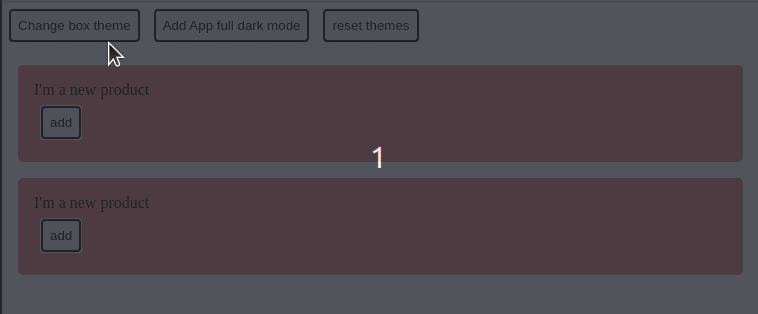

---
{
title: "How to create theme relation between components in Angular",
published: "2021-08-04T07:28:16Z",
edited: "2022-02-17T07:56:52Z",
tags: ["angular", "css", "javascript"],
description: "When we create a component, you can reuse it in some places, and his style should also relate to his...",
originalLink: "https://www.danywalls.com/post?slug=How_theme_child_components_in_Angular_using_host_context&token=2StXtWTte2C0AjxFAfSc9H",
coverImage: "cover-image.png",
socialImage: "social-image.png",
collection: "styling angular apps",
order: 2
}
---

When we create a component, you can reuse it in some places, and his style should also relate to his container or the context.

We use the host-context pseudo-selector to create a relation between components and match styles with the container or another component.

> you can read more https://angular.io/guide/component-styles#host-context

For example,  we have a button component in the main app or the product component. The button needs to adapt the styles for both of them.

If the product or main app components change their colors, it needs to react to them. In short, something like:



Let's build something like this using the:host-context selector.

## The power of :host-context()

The:host-context pseudo-selector help us to create a relation between components, for example, the product component with the my-app component.

```css
//product.component.css
:host-context(my-app.dark) .content {
  background-color: black;
  color: white;
}
```

When the component my-app gets the dark class, the product component applies these styles because the css selector matches.

Also, we can define multiple relations with our components like the following example.

## Multiple relations

We already know how to match one selector for the background, so let’s build multiple selectors with the new rules.

- Set background to white smoke when the `app-product` gets the day class.
- Set background to blue, when `app-product` get the .dark class.
- Set background to pink when the `my-app` component gets the .dark class.

Edit the button.component.css, and add the following lines to affect the `.btn` class selector.

```css
//button.css file.
//Relation with app-product with the day class
:host-context(app-product.day) .btn {
  background-color: whitesmoke;
}

//Relation with app-product with the dark class
:host-context(app-product.dark) .btn {
  background-color: black;
  color: whitesmoke;
}

//relation with my-app with dark class
:host-context(my-app.dark) .btn {
  background-color: pink;
  color: white;
}
```

Perfect! The button component has a relation with the parent and the main app component.

Feel free to play with the demo if you want to see a small real demo and see how child components react to the relations between components.

<iframe src="pfp-code:./host-context-angular-demo?embed=1&file=src/app/button/button.component.css" data-frame-title="Host Context Angular Demo - StackBlitz" sandbox="allow-modals allow-forms allow-popups allow-scripts allow-same-origin"></iframe>

## Done

That's it! Hopefully, give you a bit of help with link style relations between components using the host-context pseudo-selector.

If you enjoyed this post, share it!

Photo by <a href="https://unsplash.com/@anniespratt?utm_source=unsplash&utm_medium=referral&utm_content=creditCopyText">Annie Spratt</a> on <a href="https://unsplash.com/s/photos/parent-with-childs?utm_source=unsplash&utm_medium=referral&utm_content=creditCopyText">Unsplash</a>
