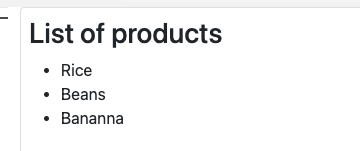

---
{
title: "How to share data between components in Angular",
published: "2022-02-14T07:30:28Z",
edited: "2022-11-04T13:58:39Z",
tags: ["angular", "typescript", "javascript", "webdev"],
description: "When we build components in an application, we maybe need to share or send data from parent to child...",
originalLink: "https://www.danywalls.com/how-to-share-data-between-components-in-angular"
}
---

When we build components in an application, we maybe need to share or send data from parent to child or without a direct connection.

Angular provides different these ways to communicate components:

- Using Input() and Output() decorators.
- Using Viewchild decorator.
- Using Behavior Subject with Rxjs.

We use these ways to share data between two components, show a list of products, and get the selected product name in another component when the user clicks on it.

- The \*list-products.component \*renders the list of products provided from parent to child.
- The \*app.component \* shows the product selected.

## Using Input and Output decorators.

The input decorators allow us to get data from parent components quickly, edit the `list-product.component.ts` using the `@Input()` decorator, and declare the productList property.

```typescript
import { Component, Input, OnInit } from '@angular/core';

export class ProductListComponent implements OnInit {
  @Input() productList = [];
  ngOnInit() {}
}
```

Update the HTML to render the list of products using the `*ngFor` directive.

```html
 <li *ngFor="let product of productList">
    {{ product.name }}
  </li>
```

> Learn more about [\*ngFor directive](https://angular.io/api/common/NgForOf#description).

Second, the *app.component.ts* declares the products variable with the list of products to be shown.

```typescript
export class AppComponent {
  products = [
    { name: 'Rice', id: 1, price: 200 },
    { name: 'Beans', id: 2, price: 300 },
    { name: 'Bananna', id: 3, price: 400 },
  ];
```

Edit the *app.component.html* and use `[productList]` to pass the data to the *list-product component*.

```html
  <app-product-list
    class="card p-2"
    [productList]="products"
  ></app-product-list>
```

> Learn more [Property binding](https://angular.io/guide/property-binding#understanding-the-flow-of-data)



Good, We are using the *Input()* decorator and sending data from parent to child, the next step is to get the selected product from the child component and read it from the parent.

### Getting the selected product from the child component.

Using a combination of `@Output()` decorators and *EventEmmiter*, we can share the information with the parent.

Edit product-list.component and declare`onSelected` property using the `@Ouput` decorator and EventEmitter type.

Create a new method to the `onSelectedProduct` method, and it gets a product using the `onSelected` event emitter to emit the selected value.

> Read more about [event emitter](https://angular.io/api/core/EventEmitter)

```typescript
import { Component, EventEmitter, Input, OnInit, Output } from '@angular/core';

@Component({
  selector: 'app-product-list',
  templateUrl: './product-list.component.html',
  styleUrls: ['./product-list.component.css'],
})
export class ProductListComponent implements OnInit {
  @Input() productList = [];
  @Output() onSelected = new EventEmitter<any>();
  constructor() {}

  ngOnInit() {}

  onSelectedProduct(product) {
    console.log(product);
    this.onSelected.emit(product);
  }
}
```

Edit the *product-list.component.html*, listen to the click event, on it call the *onSelectedProduct* method.

```html
<li *ngFor="let product of productList" (click)="onSelectedProduct(product)">
    {{ product.name }}
  </li>
```

Next, edit the `app.component` and create a new method for handling the event `onSelected` and assign it to internal property `selectedProduct`.

```typescript
import { Component } from '@angular/core';

@Component({
  selector: 'my-app',
  templateUrl: './app.component.html',
  styleUrls: ['./app.component.css'],
})
export class AppComponent {
  selectedProduct: any;
  products = [
    { name: 'Rice', id: 1, price: 200 },
    { name: 'Beans', id: 2, price: 300 },
    { name: 'Bananna', id: 3, price: 400 },
  ];

  onSelectedProduct(product) {
    this.selectedProduct = product;
  }
}
```

Edit the `app.component.html` and subscribe to listen to the `(onSelected)` event and assign the `onSelectedProduct` passing the `$event`.

We show the selected product using a  `*ngIf` for the selectedProduct property.

```html
  <app-product-list
    class="card p-2"
    [productList]="products"
    (onSelected)="onSelectedProduct($event)"
  ></app-product-list>
 <div *ngIf="selectedProduct" class="card">
    <h1>You selected {{ selectedProduct.name }}</h1>
  </div>

```

> Learn more list \[events in angular]\(https://angular.io/guide/event-binding

## Get access using ViewChild

Sometimes we want to access properties and functions from the child component. The *ViewChild* decorator allows us to inject one component into another and access it.

> The injected component won't be ready until the afterViewInit lifecycle starts.

First, create a new property into de `product-list.component.ts` sessionId and set the value as Math.random().

```typescript
export class ProductListComponent implements OnInit {
  sessionId = Math.random();
```

> Read more about [ViewChild](https://angular.io/api/core/ViewChild).

Edit the app.component.ts, declare a new property `sessionId`, using the `ViewChild` decorator, passing the `ProductListComponent`.

```typescript
export class AppComponent implements AfterViewInit {
  @ViewChild(ProductListComponent) productList;
  sessionId: any;
```

Next, implement the *AfterViewInit* lifecycle and assign the `sessionId` from `ProductListComponent` to the app.component sessionId.

```typescript
 ngAfterViewInit() {
    this.sessionId = this.productList.sessionId;
  }
```

> Read more about [AfterViewInit](https://angular.io/api/core/AfterViewInit)

Into the app.component.html show the sessionId

```html
<h1>The session id is {{ sessionId }}</h1>
```

Done!  we got access to the ProductList component properties and attributes.

## Using Service with Behavior Subject.

The before solutions work well. We can deliver our code but slightly lack the direct link between `parent and child`. What happens if we have more than three deep components?

Another good solution is to use a service to share data between components to sync the actual data. Rxjs with `BehaviorSubject` gives us the power to communicate components with extra points.

- Not a problem of updated data (for example, the ViewChild gets the data on the AfterView lifecycle, to keep sync, may use extra stuff, like DetectChanges, etc.).
- The components using the service get the updated data.
- Not relation required like a child or nested components is a problem.

First, create a service `product-service` with property a `product$` field behavior subject to keep the product's value and declare a variable `selectedProduct` as observable from the product behavior subject.

Next, create a new method, `setProduct`, to set the selected product and update the behavior.

```typescript
import { Injectable } from '@angular/core';
import { BehaviorSubject } from 'rxjs';

@Injectable()
export class ProductService {
  private product$ = new BehaviorSubject<any>({});
  selectedProduct$ = this.product$.asObservable();
  constructor() {}

  setProduct(product: any) {
    this.product$.next(product);
  }
}
```

> Read more about [behavior subject](https://www.learnrxjs.io/learn-rxjs/subjects/behaviorsubject)

Next, the component injects the product service into the app, subscribes to the `selectedProduct` observable, and the value from it assigns to the `selectedProduct` field.

```typescript
 constructor(private productService: ProductService) {}

  ngOnInit(): void {
    this.productService.selectedProduct$.subscribe((value) => {
      this.selectedProduct = value;
    });
  }
```

Edit the product-list component, inject the product-service, edit the *onSelected* method, and call the `setProduct` method from product service.

```typescript
  constructor(private productService: ProductService) {}
  
  onSelectedProduct(product) {
    this.productService.setProduct(product);
  }
```


Perfect our components have communication without having dependencies.

## Refactor the product-list

We can refactor our code to communicate the services with more steps.

- Declare behavior subject and methods for product list.
- Subscribe to the product-list to the service to get the list of products.

Edit the *product-service* with two new fields for the *productList* and a new method for sending the list of products.

```typescript
import { Injectable } from '@angular/core';
import { BehaviorSubject } from 'rxjs';

@Injectable()
export class ProductService {
  private product$ = new BehaviorSubject<any>({});
  selectedProduct$ = this.product$.asObservable();
  private productListBus$ = new BehaviorSubject<any>([]);
  productList$ = this.productListBus$.asObservable();
  constructor() {}

  setProduct(product: any) {
    this.product$.next(product);
  }

  setProductList(products: any) {
    this.productListBus$.next(products);
  }
}
```

### The app.component

Inject the product service into the constructor, on the ngOnInit lifecycle, subscribe to the `setProductList` method from the service.

```typescript
import { OnInit, Component, ViewChild, AfterViewInit } from '@angular/core';
import { ProductListComponent } from './product-list/product-list.component';
import { ProductService } from './product-service.service';

@Component({
  selector: 'my-app',
  templateUrl: './app.component.html',
  styleUrls: ['./app.component.css'],
})
export class AppComponent implements OnInit, AfterViewInit {
  @ViewChild(ProductListComponent) productList;
  sessionId: any;
  selectedProduct: any;

  products = [
    { name: 'Rice', id: 1, price: 200 },
    { name: 'Beans', id: 2, price: 300 },
    { name: 'Bananna', id: 3, price: 400 },
  ];
  constructor(private productService: ProductService) {}

  ngOnInit(): void {
    this.productService.selectedProduct$.subscribe((value) => {
      this.selectedProduct = value;
    });
    this.productService.setProductList(this.products);
  }

  ngAfterViewInit(): void {
    this.sessionId = this.productList.sessionId;
  }
}

```

We can remove listen to the (onSelected) event from the HTML.

```html
  <app-product-list class="card p-2"></app-product-list>
```

### ProductList component

Same as `app.component`, inject the product service in the constructor and subscribe to the productList observable on the `ngOnInit` lifecycle assign the productList with the value from subscription.

Finally, remove the Input and output properties from the productlist.component.ts.

```typescript
import { Component, Input, OnInit, Output } from '@angular/core';
import { ProductService } from '../product-service.service';

@Component({
  selector: 'app-product-list',
  templateUrl: './product-list.component.html',
  styleUrls: ['./product-list.component.css'],
})
export class ProductListComponent implements OnInit {
  productList = [];

  sessionId = Math.random();

  constructor(private productService: ProductService) {}
  ngOnInit() {
    this.productService.productList$.subscribe((value) => {
      this.productList = value;
    });
  }
  onSelectedProduct(product) {
    this.productService.setProduct(product);
  }
}
```

Done our components have a clear communication without use Input and Output :)

## Conclusion

In this article, we introduced three ways to communicate components with angular. A component related to one level, like a parent to a child using the input and output decorators, works fine.

Please share the data with a behavior subject service in other scenarios your component expects to use in several places.

If you want to learn more, read the official documentation of angular.

- [Input and Ouput.](https://angular.io/guide/inputs-outputs)
- [Behavior Subject](https://www.learnrxjs.io/learn-rxjs/subjects/behaviorsubject)
- [Services in Angular](https://angular.io/tutorial/toh-pt4)
