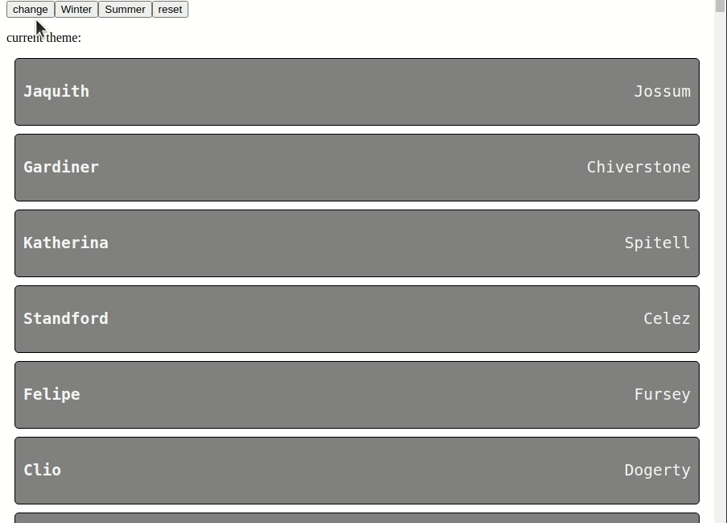
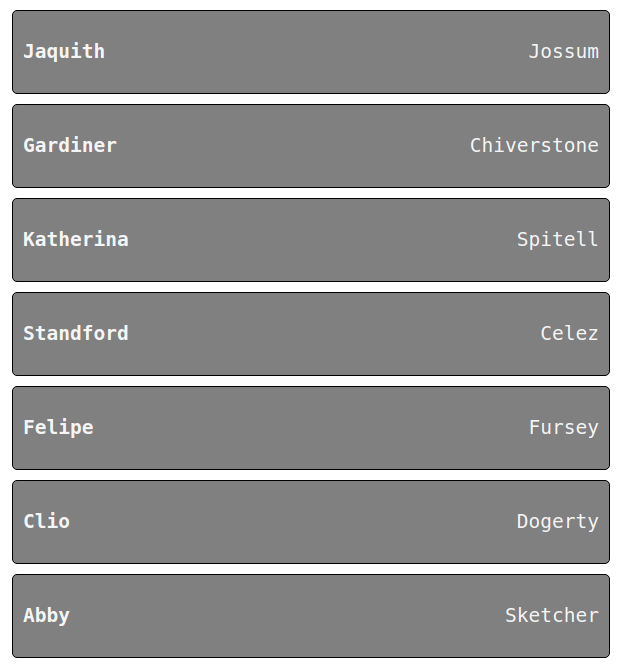

---
{
title: "How to theme components in Angular",
published: "2021-08-02T11:27:02Z",
edited: "2022-02-17T07:53:11Z",
tags: ["angular", "webdev", "javascript", "css"],
description: "When we build components it needs to be flexible, because they can be used in many places or...",
originalLink: "https://www.danywalls.com/post?slug=Theme_angular_components_&token=1yWfsoh2FpKpZ9lgBSNcxr",
coverImage: "cover-image.png",
socialImage: "social-image.png",
collection: "13955",
order: 1
}
---

When we build components it needs to be flexible, because they can be used in many places or contexts, sometimes change layout and colors.

For example, Our customer wants a list of contacts, it needs to show as a card with the picture, name, and details, and list pictures with big borders but gray and white by default without the picture.

Also, be able to add new layouts and colors in the future and apply them easily, in short like this:



## Let start

Use the power of the big 3 **:host() pseudo-class** ,
**Angular** and **CSS custom properties**.


## The layout

We create the **app-contact-component**, and the markup for contacts.

```typescript
ng g c contact
```

Using the **BEM style**, we assign one class to each element class to keep specificity low.

```html
<div class="contact">
  <h1 class="contact__firstname">{{contact.first_name}}</h1>
  <p class="contact__lastname">{{contact.last_name}}</p>
  
</div>
```

Edit the contact sass file with the default styles for the contact component.

```css
.contact {
    background: grey;
    font-family: monospace;
    border: 1px solid black;
    border-radius: 5px;
    margin: 10px;
    display: flex;
    justify-content: space-between;
    align-items: center;
    padding: 10px;
    &__firstname {
        font-size: 1.5em;
        color: whitesmoke;
    }
    &__lastname {
        font-size: 1.5em;
        color: whitesmoke;
    }
    &__avatar {
        display: none;
        border: 1px solid black;
        background-color: lightblue;
    }
}
```

We have the default layout ready and working!!



The default layout is working, but we made some mistakes, the colors it hardcoded, and the layout and colors are in the same file.

## Themes and Colors

Split every case in files, layout, and colors, create the directory theme with these files.

-winter.scss
-winter-colors.scss
-summer.scss
-summer-colors.scss

## The power of :host and CSS custom properties.

The :host pseudo-class helps us to assign one style **only when the component match** or has one specific CSS class.

> read more about :host() https://angular.io/guide/component-styles#host

The CSS Custom properties allow us, stored a value in one like variables of Sass.

> Read more about CSS Custom properties https://developer.mozilla.org/en-US/docs/Web/CSS/Using\_CSS\_custom\_properties

Using it, create the winter-colors using CSS custom properties into the winter-colors.scss

```css
:host(.contact-winter-colors) {
    --background-color: #424b68;
    --primary-color: rgb(220, 59, 226);
    --secondary-color: rgb(80, 245, 65);
    --avatar-background: rgb(48, 109, 78);  
}
```

Create the winter layout using the CSS custom properties to assign the colors and adapt the layout changes for our elements.

```css
:host(.contact-winter) {
    .contact {
        background: var(--background-color);
        font-family: monospace;
        border: 1px solid black;
        border-radius: 5px;
        width: -moz-fit-content;
        min-width: 150px;
        flex-direction: column;
        padding: 10px;
        text-align: center;
        display: table-cell;
        
    &__firstname {
        font-size: 1.5em;
        color: var(--primary-color);
    }
    &__lastname {
        font-size: 1.5em;
        color: var(--secondary-color);
    }
    &__avatar {
        display: block;
        border: 1px solid black;
        border-radius: 50%;
        background-color: var(--avatar-background);
    }
}
}
```

Repeat the same steps for summer.scss and summer-colors.scss

## Import themes and color.

Into the contact.component.scss import our layout and colors themes.

```css
/*layouts*/
@import './themes/summer';
@import './themes/winter';

/*colors themes*/
@import './themes/summer-colors';
@import './themes/winter-colors';
```

> more about import files with Sass https://sass-lang.com/documentation/at-rules/import

The component sass files have the default value and the references to layout and colors by default.

We want to change his colors default colors with the summer or winter colors, using CSS Custom properties' fallback.

> more about fallback values https://developer.mozilla.org/en-US/docs/Web/CSS/Using\_CSS\_custom\_properties#custom\_property\_fallback\_values

So, if the `--background-color` has a value then use it, else it assigns the `grey`.

```
background: var(--background-color, grey);
```

So, the default style is ready to get the values from CSS custom properties or the default.

## ngClass and :host

Set colors and layout dynamic using the Angular ngClass directive to assign the class to the component.

```html
<app-contact [ngClass]="theme" *ngFor="let contact of contacts" [contact]="contact">      
</app-contact>
```

To make it dynamic, we create a theme variable and change it using `changeLayoutColor`, `addColor`, and `reset`

```html
  <div class="actions">
    <button (click)="changeLayoutColor()">change</button>
    <button (click)="addColor('contact-winter-colors')">Winter</button>
    <button (click)="addColor('contact-summer-colors')">Summer</button>
    <button (click)="theme = ''">reset</button>
    <p>
      current theme: {{theme}}
    </p>
  </div>
```

```typescript
 theme = '';
  changeLayoutColor() {
    this.theme = this.theme === 'contact-winter' ? 'contact-summer' : 'contact-winter';
  }
  addColor(color:string) {
    this.theme += ` ${color}`
  }
```

Because the: host pseudo-class applies the styles when the component match with the class.

Feel free to play with the demo https://theme-angular-components.surge.sh/

### Done!!

That's it! Hopefully, that will give you a bit of help on how to set the theme and colorize your components and make it dynamic. If you enjoyed this post, share it!

Photo by <a href="https://unsplash.com/@sigmund?utm_source=unsplash&utm_medium=referral&utm_content=creditCopyText">Sigmund</a> on <a href="https://unsplash.com/s/photos/kid-paint?utm_source=unsplash&utm_medium=referral&utm_content=creditCopyText">Unsplash</a>
