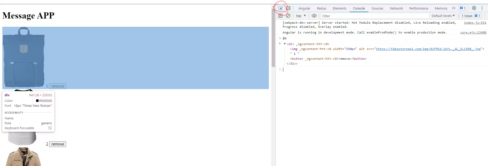
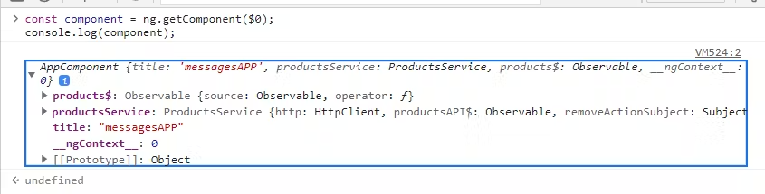
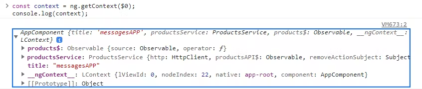
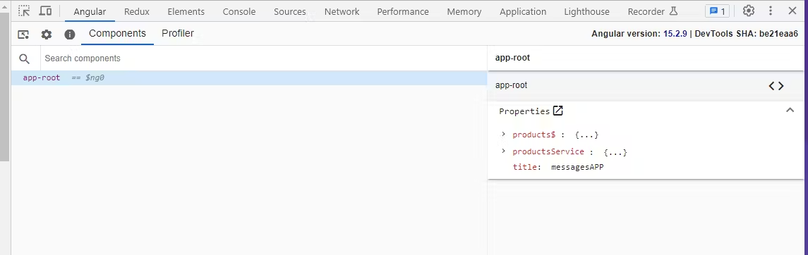
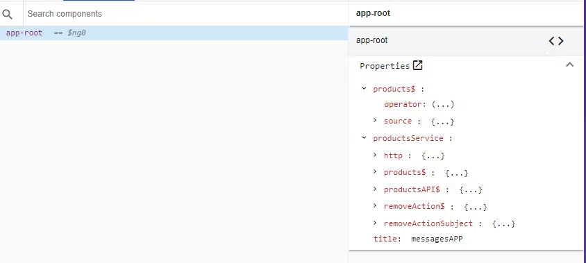
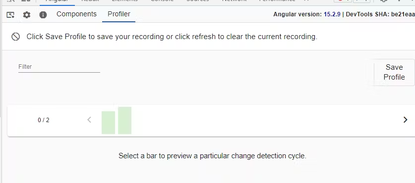
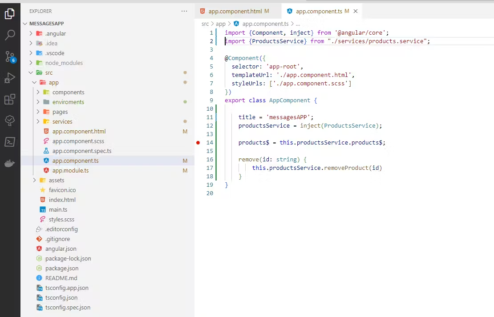
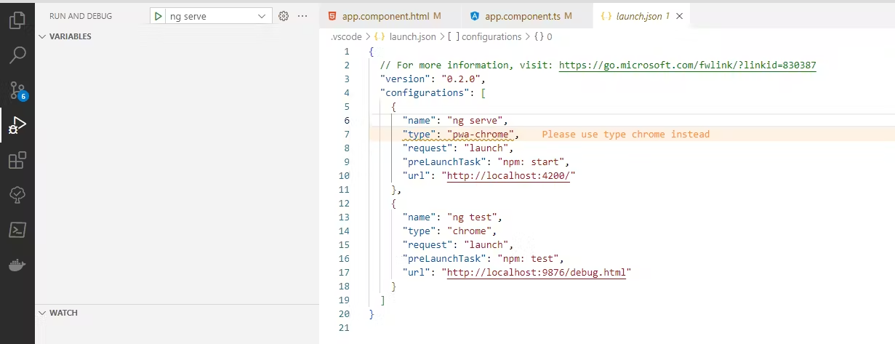
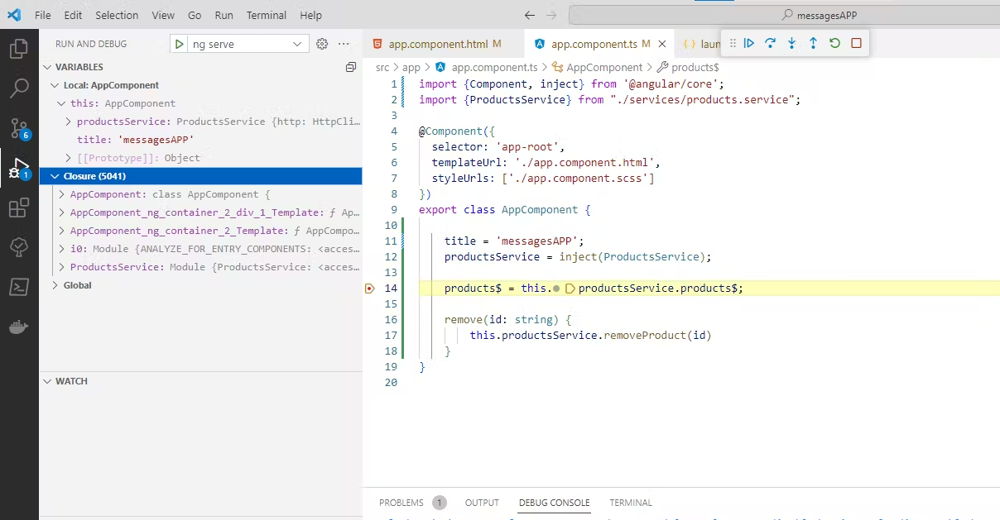
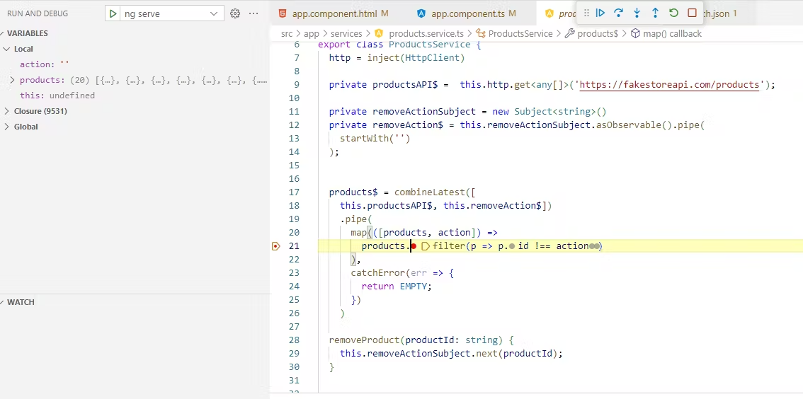

---
{
title: "How To Debug Angular Applications Easy",
published: "2023-06-17T07:50:28Z",
edited: "2023-06-19T06:10:33Z",
tags: ["angular", "javascript", "frontend"],
description: "As developers, we use a lot of our coding time to fix bugs. Debugging helps us find and remove errors...",
originalLink: "https://www.danywalls.com/simple-methods-for-debugging-angular-applications",
coverImg: "cover-image.png",
socialImg: "social-image.png"
}
---

As developers, we use a lot of our coding time to fix bugs. Debugging helps us find and remove errors in software development. But sometimes, finding a bug takes longer than fixing it. That's when we need to learn some ways to debug our apps.

Let's imagine you're an Angular developer working on an interactive web application, trying to pinpoint why a particular component isn't behaving as expected.

Today, we are going to learn some ways to save time debugging our Angular applications using ng.global, Angular DevTools, and VSCode.

## **Selecting a DOM Node**

When debugging, it often becomes necessary to select an element for modification. Rather than navigating node by node or writing a query selector, there are convenient tools at your disposal such as the Chrome Picker Tool or the global shortcut `$0`.

## Accessing DOM Nodes Efficiently

When debugging, you frequently need to select a specific element for inspection or modification. Instead of laboriously navigating through the Document Object Model (DOM) or writing intricate query selectors, you can utilize the Chrome Picker Tool.

Select the element using the picker tool, and it will be stored in the global object $0.



## **Angular** [**ng.global**](http://ng.global)

Angular offers a host of helpful debugging functions in its global `ng` namespace. These functions, available when you run your application in development mode, provide valuable insights into the application's current state.

> Read more about [ngGlobal](https://angular.io/api/core/global)

## Using Ng Debugging Functions

Angular's debugging functions serve to help us play with our component instances, make changes, and more. Here's a brief overview of these functions and how you can utilize them:

### ng.getComponent

Retrieves the component instance associated with a specific DOM element.

```javascript
const component = ng.getComponent($0);
console.log(component);
```



### ng.applyChanges

This function marks a component for check and performs synchronous change detection on the application to which the component belongs.

```javascript
const component = $0;
ng.applyChanges(component);
```

### ng.getContext

Retrieves the context of the embedded view if the element is part of one (like within *ngIf or* ngFor). Otherwise, it retrieves the instance of the component whose view owns the element.

```javascript
const context = ng.getContext($0);
console.log(context);
```



### ng.getDirectiveMetadata

Returns the debug metadata for a particular directive or component instance. It takes an instance of a directive or component and returns the corresponding metadata.

```javascript
const metadata = ng.getDirectiveMetadata($0);
console.log(metadata);
```

Using these debugging functions effectively can expedite issue identification and resolution within your Angular applications, ensuring a smoother user experience and an efficient debugging process.

> I recommend checking out the official Angular documentation to read more ng global <https://angular.io/api/core/global>

## **Angular DevTools: A Powerful Debugging Extension**

Angular DevTools is a browser extension for Chrome and Firefox, designed to enhance Angular applications' debugging and profiling capabilities. It works best with Angular v12 or later, as long as the application is compiled with the optimization configuration option turned off (`{optimization:false}`).

The DevTools extension is under the Angular tab in your browser DevTools with two additional tabs upon opening:

- **Components:** This tab lets you delve into the components and directives of your application, allowing you to preview or tweak their states.

- **Profiler:** This tab enables you to profile your application, assisting you in detecting performance bottlenecks during change detection execution.

Moreover, it show the Angular version and the latest commit hash for the extension.



### **Debugging with Angular DevTools**

Angular DevTools helps you look at your app's layout quickly, showing a tree of components and directives. You can check each part, its details, and information with your mouse or keyboard shortcuts.



You can update property values directly from the properties view and access selected components or directives.

### **Profiling Your Application**

The Profiler tab in Angular DevTools records how Angular detects changes and gives helpful event information. You can look at this data in a clear bar chart, showing each part and its activity during each step.



The Profiler tab helps you see how Angular finds changes and gives useful event details. It shows a simple bar chart with each part's activity at every step. It also has a view like a flame graph, showing each item's place in the display tree and the time used for finding changes.

If you want to learn more, check out the official video from the Google team.

> [Angular DevTool Chrome Extension](https://chrome.google.com/webstore/detail/angular-devtools/ienfalfjdbdpebioblfackkekamfmbnh)

<iframe src="https://www.youtube.com/watch?v=bavWOHZM6zE"></iframe>

## **Debugging with VS Code**

Beyond Angular's native debugging tools, Visual Studio Code (VS Code) also offers robust support for debugging Angular applications. Let's look at how we can harness the power of VS Code to debug our client-side Angular code.

### **Setting a Breakpoint**

To start, let's set a breakpoint in our app.component.ts file. Simply click in the gutter to the left of the line numbers where you want the breakpoint to be set. You'll see a red circle appear; this is your breakpoint.



### **Configuring the Debugger**

Now, it's time to configure the debugger. First, navigate to the Run and Debug view (`Ctrl+Shift+D`), and click on gear button, it create aa `launch.json` debugger configuration file.



In the Select debugger dropdown list, choose `ng-serve`. This action creates a `launch.json` file in a new `.vscode` folder in your project, which includes a configuration to launch your website.

To begin debugging and open a new browser, press F5 or click the green arrow. The breakpoint won't work until you refresh the webpage because the code runs before the debugger connects. After refreshing, the breakpoint should work.



At this point, you can step through the code using (`F10`), inspect variables such as `AppComponent` or `` `ProductService` `` and observe the call stack of your client-side Angular application.



With these features in your toolkit, debugging Angular code in VS Code becomes much more simple and efficient.

## Conclusion

In conclusion, we've explored Angular debugging, delved into Chrome's Angular DevTools extension, and examined Visual Studio Code's debugging features, equipping you with the tools and techniques for a smoother, more efficient coding experience.
