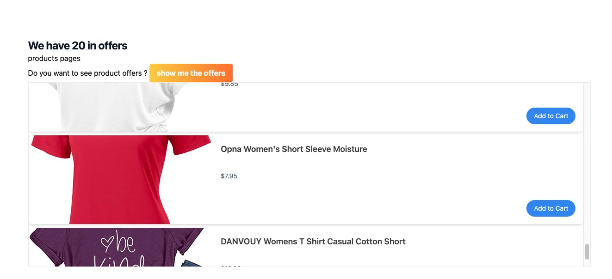
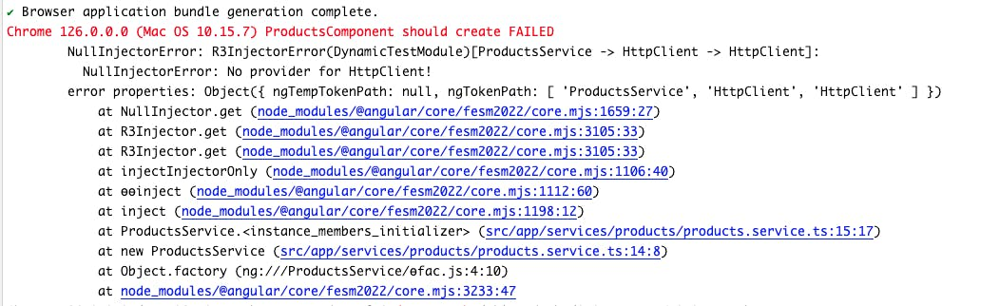
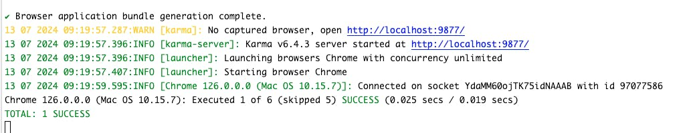

---
{
title: "Testing Components In Angular: NO ERRORS SCHEMA, Stub Components, and NgMocks",
published: "2024-07-13T10:21:30Z",
tags: ["angular"],
description: "When we need to write a test for components, it is not hard. The pain starts when our components...",
originalLink: "https://www.danywalls.com/testing-components-in-angular-noerrorsschema-stub-components-and-ngmocks",
coverImg: "cover-image.png",
socialImg: "social-image.png"
}
---

When we need to write a test for components, it is not hard. The pain starts when our components begin to have dependencies, not only in the constructor or in the TypeScript file. The real challenge comes when we start to add dependencies of other components, and these components have other dependencies like directives, external libraries, or forms.

In that moment is when we really start to invoke the dark forces to help us survive, and you don't know who answers your question, but some solutions come to your mind `NO_ERRORS_SCHEMA` , Stub Component and NgMocks

Every option can help you solve the problem, but do you know the hidden cost? Today we are going to learn how to test components with children and how to handle that situation. As always, the best way to learn is with a scenario.

## Scenario

We have an Angular application working with modules (yes, we have many companies using modules in 2024). It shows a list of products on offer, using two components: `ProductComponent` and `ProductsListComponent`.

The `ProductComponent` uses `ProductsListComponent` to show the list of products and its `kendo-viewlist` inside working but without tests. 🤪



Your goal is to add test coverage to the `ProductsComponent`, but keep in mind its dependencies:

- Use the `products.service` to get the total number of products on offer.

- The `product-list.component` which uses `kendo-listview`.

Sounds not hard to do, so let's run the test.

## Running Tests

We know Angular generates [default tests for our application](https://www.telerik.com/blogs/testing-angular),it takes care of the `ProductsComponent`, so let's open the products-component.ts; it doesn't look complex.

```typescript
import { Component, inject } from '@angular/core';
import { ProductsService } from '../services/products/products.service';

@Component({
  selector: 'app-products',
  templateUrl: './products.component.html',
  styleUrl: './products.component.css',
})
export class ProductsComponent {
  productService = inject(ProductsService);
  total$ = this.productService.totalProductsInOffer;
}
```

In the template, there isn't much. It gets the total products from the service and shows the `ProductListComponent`. Perfect.

```html
<div class="bg-white">
  <div
    class="mx-auto max-w-2xl px-4 py-16 sm:px-6 sm:py-24 lg:max-w-7xl lg:px-8"
  >
    @if (total$ | async; as totalProducts) {
      <h2 class="text-2xl font-bold tracking-tight text-gray-900">
        We have {{ totalProducts }} in offers
      </h2>
    }
    <app-products-list/>
  </div>
</div>
```

The test should be simple, let's open the `products.component.spec.ts` and check if it can create an instance. This should be a task to solve in 2 minutes. Let's run the `ng test`.

```typescript
import { ComponentFixture, TestBed } from '@angular/core/testing';
import { ProductsComponent } from './products.component';

describe('ProductsComponent', () => {
  let component: ProductsComponent;
  let fixture: ComponentFixture<ProductsComponent>;

  beforeEach(async () => {
    await TestBed.configureTestingModule({
      declarations: [ProductsComponent],
    }).compileComponents();

    fixture = TestBed.createComponent(ProductsComponent);
    component = fixture.componentInstance;
    fixture.detectChanges();
  });

  it('should create', () => {
    expect(component).toBeTruthy();
  });
});
```

and... tada!!! 😭 I started to get weird errors:

```plaintext
 NullInjectorError: R3InjectorError(DynamicTestModule)[ProductsService -> HttpClient -> HttpClient]:
```



### Why NullInjectorError ?

Maybe you ask your self  why there's a null injector error when my component is working? I provide my service, but the `ProductsComponent` is now living in the sandbox of `TestBedTestingModule`.

Angular declares the `ProductService` for us, but we are not providing the `HttpClientModule`. Instead, we use the `HttpClientTestingModule` so so let's import it.

```typescript
import { ComponentFixture, TestBed } from '@angular/core/testing';
import { ProductsComponent } from './products.component';
import { HttpClientTestingModule } from '@angular/common/http/testing';

fdescribe('ProductsComponent', () => {
  let component: ProductsComponent;
  let fixture: ComponentFixture<ProductsComponent>;

  beforeEach(async () => {
    await TestBed.configureTestingModule({
      imports: [HttpClientTestingModule],
      declarations: [ProductsComponent],
    }).compileComponents();

    fixture = TestBed.createComponent(ProductsComponent);
    component = fixture.componentInstance;
    fixture.detectChanges();
  });

  it('should create', () => {
    expect(component).toBeTruthy();
  });
});
```

Save the changes, everything should work, let's see 😭

```bash
 Error: NG0304: 'app-products-list' is not a known element (used in the 'ProductsComponent' component template):
        1. If 'app-products-list' is an Angular component, then verify that it is a part of an @NgModule where this component is declared.
        2. If 'app-products-list' is a Web Component then add 'CUSTOM_ELEMENTS_SCHEMA' to the '@NgModule.schemas' of this component to suppress this message.
```

We got another error! Why does the `products-component` complain about `app-products-list`? Well, we are making a reference to it, and Angular wants to resolve it. Or we can try to focus on our test and ignore that point 😈 by using `NO_ERRORS_SCHEMA`.

## NO\_ERRORS\_SCHEMA

😈 We want to finish our task of testing our component, so the great idea is to use `NO_ERRORS_SCHEMA` imported from `@angular/core`. Using `NO_ERRORS_SCHEMA` tells the Angular compiler to ignore unrecognized elements and attributes in your templates and mark them as HTML elements.

```typescript
import { ComponentFixture, TestBed } from '@angular/core/testing';
import { ProductsComponent } from './products.component';
import { HttpClientTestingModule } from '@angular/common/http/testing';
import { NO_ERRORS_SCHEMA } from '@angular/core';

fdescribe('ProductsComponent', () => {
  let component: ProductsComponent;
  let fixture: ComponentFixture<ProductsComponent>;

  beforeEach(async () => {
    await TestBed.configureTestingModule({
      imports: [HttpClientTestingModule],
      declarations: [ProductsComponent],
      schemas: [NO_ERRORS_SCHEMA],
    }).compileComponents();

    fixture = TestBed.createComponent(ProductsComponent);
    component = fixture.componentInstance;
    fixture.detectChanges();
  });

  it('should create', () => {
    expect(component).toBeTruthy();
  });
});
```

Save changes. Great! Everything is green!



### 👀 Why I don't recommend NO\_ERRORS\_SCHEMA

When we use `NO_ERRORS_SCHEMA` in our Angular tests, it hides template errors and reduces test coverage. This can lead to false positives and promotes poor code quality, which is a hidden price to pay in the future.

### 🙉 Importing Child Dependencies

If the problem is because the `ProductsListComponent` is not declared in the `TestBed` sandbox, why not import it? Let's do it.

```typescript
import { ComponentFixture, TestBed } from '@angular/core/testing';
import { ProductsComponent } from './products.component';
import { HttpClientTestingModule } from '@angular/common/http/testing';
import { ProductsListComponent } from '../components/products-list/products-list.component';

fdescribe('ProductsComponent', () => {
  let component: ProductsComponent;
  let fixture: ComponentFixture<ProductsComponent>;

  beforeEach(async () => {
    await TestBed.configureTestingModule({
      imports: [HttpClientTestingModule],
      declarations: [ProductsComponent, ProductsListComponent],
    }).compileComponents();
```

And here we go... adding more and more dependencies.

```bash
Chrome 126.0.0.0 (Mac OS 10.15.7) ProductsComponent should load the product-list FAILED
        Error: NG0304: 'kendo-listview' is not a known element (used in the 'ProductsListComponent' component template):
           1. If 'kendo-listview' is an Angular component, then verify that it is a part of an @NgModule where this component is declared.
              f 'kendo-listview' is a Web Component then add 'CUSTOM_ELEMENTS_SCHEMA' to the '@NgModule.schemas' of this component to suppress this message.
                      error properties: Object({ code: 304 })
```

.. okay, let's fix it by adding the `ListViewModule` from Kendo.

```typescript
import { ProductsComponent } from './products.component';
import { HttpClientTestingModule } from '@angular/common/http/testing';
import { ProductsListComponent } from '../components/products-list/products-list.component';
import { ListViewModule } from '@progress/kendo-angular-listview';

fdescribe('ProductsComponent', () => {
  let component: ProductsComponent;
  let fixture: ComponentFixture<ProductsComponent>;

  beforeEach(async () => {
    await TestBed.configureTestingModule({
      imports: [HttpClientTestingModule, ListViewModule],
      declarations: [ProductsComponent, ProductsListComponent],
    }).compileComponents();
```

hold on a second... are we adding dependencies to the `ProductsComponent` test that aren't related to it? What will happen when the `ProductListComponent` changes and adds a form? Will the `ProductComponent` test then require the `FormsModule`? Our test will break due to a change in the `ProductListComponent`.

Do you think this is a good approach, or are we mixing a unit test with an integration test?

I think we should avoid getting too deep into our test. Our responsibility is to ensure that the products work, retrieve the data, and display the number of offers. The responsibility for Kendo stuff lies with the product list. An alternative is to stop here and mock the `ProductList`.

## Stub The Component

We want to replace the real version of `ProductListComponent`. When we create a stub, it's just a class with the same selector as the original component and shares the API implementation interface. Using a stub, we can query it like a child view, adjust the template for our test, and, of course, avoid requiring all those dependencies.

Create a class with the `@Component` decorator and adjust the template. It's like creating a component. The code looks like this:

```typescript
@Component({
  selector: 'app-products-list',
  template: ` <div>my products</div>`,
})
export class ProductListStub implements ProductsListComponent {
  products: Product[] = [];
}
```

Next, replace the `ProductsListComponent` with our stub in the declaration section. The final code looks like this:

```typescript
import { Component } from '@angular/core';
import { Product } from '../services/products/products.service';

@Component({
  selector: 'app-products-list',
  template: ` <div>my products</div>`,
})
export class ProductListMock implements ProductsListComponent {
  products: Product[] = [];
}

describe('ProductsComponent', () => {
  let component: ProductsComponent;
  let fixture: ComponentFixture<ProductsComponent>;

  beforeEach(async () => {
    await TestBed.configureTestingModule({
      imports: [HttpClientTestingModule],
      declarations: [ProductsComponent, ProductListStub],
    }).compileComponents();

    fixture = TestBed.createComponent(ProductsComponent);
    component = fixture.componentInstance;
    fixture.detectChanges();
  });
```

## 👀 The Hidden Price of Stub

Well, stubbing the components is very nice because it's an easy way to avoid worrying about the child component dependencies. Of course, we have control over the test, but there is a hidden price to pay.

We must declare every component and maintain these stubs. If you are working on a big product, keeping all stubs updated might be an extra effort that your manager doesn't want to pay for. So, let's find another solution using NgMocks.

## Ng Mocks

`ngMocks` is a powerfull library, it help us to simplify the testing and make it easy to ready and reduce the boilerplate, i love work with it.

NgMocks provides utilities and helpers for Angular unit testing extending `TestBed`, `ComponentFixture` making it simple. We reduce a lot of boiler plate using utilities like like `MockBuilder`, `MockRender`,`MockComponent`, `MockDirective`, `MockPipe`, `MockService`, and `AutoMockModule` and more .

> I don't will get deep about every aspect of ngMock, I recommend checkout the website or if want an article about leave a comment

First install the [ng-mocks](https://ng-mocks.sudo.eu/) library:

```bash
npm install ng-mocks --save-dev
```

> If you are using Angular 15+, you dont have `src/test.ts` use this [answer on stackoverflow to restore `src/test.ts`](https://stackoverflow.com/a/75323651/13112018).

Next add the ng-mock config to `src/test.ts`

```typescript
import { getTestBed } from '@angular/core/testing';
import {
  BrowserDynamicTestingModule,
  platformBrowserDynamicTesting,
} from '@angular/platform-browser-dynamic/testing';

import { MockInstance, MockService, ngMocks } from 'ng-mocks';
import { DefaultTitleStrategy, TitleStrategy } from '@angular/router';
import { CommonModule } from '@angular/common';
import { ApplicationModule } from '@angular/core';
import { BrowserModule } from '@angular/platform-browser';

getTestBed().initTestEnvironment(
  BrowserDynamicTestingModule,
  platformBrowserDynamicTesting(),
  {
    errorOnUnknownElements: true,
    errorOnUnknownProperties: true,
  },
);

ngMocks.autoSpy('jasmine');
ngMocks.defaultMock(TitleStrategy, () => MockService(DefaultTitleStrategy));
ngMocks.globalKeep(ApplicationModule, true);
ngMocks.globalKeep(CommonModule, true);
ngMocks.globalKeep(BrowserModule, true);

jasmine.getEnv().addReporter({
  specDone: MockInstance.restore,
  specStarted: MockInstance.remember,
  suiteDone: MockInstance.restore,
  suiteStarted: MockInstance.remember,
});
```

We are going to change our test using two key utilities: `MockBuilder` and `MockRender`.

`MockBuilder` simplifies the setup of Angular testing modules by replacing dependencies, ensuring components under test are isolated for focused testing.

`MockRender` facilitates the instantiation and rendering of Angular components in unit tests, providing access to component instances and DOM elements to verify their behavior and interactions accurately.

Instead of using `TestBed`, I switch to MockBuilder, passing the component to test and the required module, in my case `HttpClientTestingModule`, and finally call `.mock` to specify which component I want to mock, `ProductList`.

> The .mock method supports an array like .mock(\[ProductsListComponent, AnotherComponent, ...]);

The final code looks like:

```typescript
import { ProductsComponent } from './products.component';
import { ProductsListComponent } from '../components/products-list/products-list.component';
import { MockBuilder, MockRender, ngMocks } from 'ng-mocks';
import { HttpClientTestingModule } from '@angular/common/http/testing';

describe('ProductsComponent', () => {
  beforeEach(() =>
    MockBuilder(ProductsComponent)
      .keep(HttpClientTestingModule)
      .mock(ProductsListComponent),
  );

  it('should create', () => {
    const fixture = MockRender(ProductsComponent);
    expect(ngMocks.findInstance(ProductsComponent)).toBeTruthy();
  });
});
```

Save and ta-da! We are ready with just a few lines of code and ready to start testing!

## Recap

We learned about how the testing Angular components becomes complex when dependencies like external libraries, child components are involved. Initially straightforward, but becomes hard when challenges with components relying on multiple dependencies, for example in the template.

When we use `NO_ERRORS_SCHEMA`, it initially masks issues. Creating stub components simplifies testing but adds maintenance overhead. In my opinion, I prefer `NgMocks` because it simplifies my work with utilities like `MockBuilder` and `MockRender` and minimal boilerplate.

I hope this article help

- [Angular Testing Default Tests](https://www.telerik.com/blogs/testing-angular)

- [Ng-Mocks Library](https://ng-mocks.sudo.eu/)
