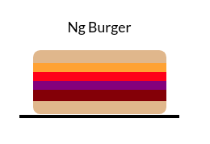
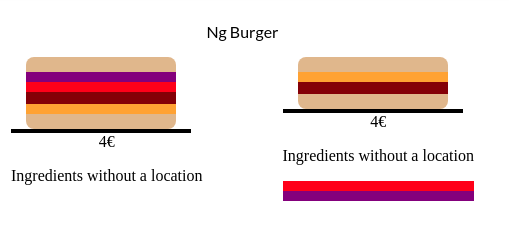

---
{
title: "How to use Angular content projection to prepare a burger",
published: "2021-09-27T15:13:40Z",
edited: "2021-11-03T18:33:11Z",
tags: ["angular", "codenewbie", "javascript"],
description: "One of the easiest things is a burger. The burger has the same base but changes its content, so let's...",
originalLink: "https://dev.to/this-is-angular/use-angular-content-projection-for-prepare-a-burger-46pj",
coverImage: "cover-image.png",
socialImage: "social-image.png"
}
---

One of the easiest things is a burger. The burger has the same base but changes its content, so let's build our burger component.

Today we explain how to use ng content to provide an area flexible and multiple slots.

- Use ng content for content projection.
- Use multiple slots for content projection.

> If you want to play with the [https://burger-angular-content-projection-demo.stackblitz.io](demo)

## Our scenario.

We have a list of ingredients `components` to be use to prepare our `burger component`.

```html
<top-bun></top-bun>
<cheese></cheese>
<bottom-bun></bottom-bun>
<tomato></tomato>
<onion></onion>
<meat></meat>
```

The main idea is to create a burger component and put our ingredients inside, like a regular burger using two excellent angular feature content projection.

## Content Projection and ng-content

Angular allows us to make our components reusable using content projection. It will enable declaring an area to be suitable for changes, inside or a member.

It helps us provide a wrapper, and we define which information or piece is part of the component.

Using the ng-content tag, we tell angular to replace the ng-content area with our elements or component.

To begin, first, create the burger component and use the tag ng-content into the template.

```typescript
import { Component } from '@angular/core';

@Component({
  selector: 'burger',
  templateUrl: './burger.component.html',
})
export class BurgerComponent {}
```

```html
<div class="burger">
  <ng-content></ng-content>
</div>
```

Perfect, step complete, move the ingredients to body of the burger component.

```html
<burger>
  <top-bun></top-bun>
  <cheese></cheese>
  <tomato></tomato>
  <onion></onion>
  <meat></meat>
  <bottom-bun></bottom-bun>
</burger>
```

It works, the burger component allow have child elements  components into it and the burger acts as wrapper.



> Why the meat is not in the middle ?

## Multiple slots

All burgers have meat in the center. We want to be flexible to add components or force without breaking our burger, so the burger component needs to render elements in a specific area.

The ng-content have a optional  property `selector`, get the content related to css selector like class or attributes, so we define the areas.

Update the default burger with the following:

- add top-bun and bottom-bun as default for all burgers.
- 3 ng-contents with the selector top, middle, and bottom
- ng content for the price
- default ng-content for ingredients without location.

```html
<div class="burger">
  <top-bun></top-bun>
  <ng-content select="[top]"></ng-content>
  <ng-content select="[middle]"></ng-content>
  <ng-content select="[bottom]"></ng-content>
  <bottom-bun></bottom-bun>
</div>

<div class="price">
  <ng-content select="[price]"></ng-content>
</div>

<div>
  <p>These ingredients don't have a location</p>
  <ng-content></ng-content>
</div>

```

We have ready our burger component, if some ingredients or piece don't have location it will move to in other div.

The tomato and the onion don't have attribute so, go to the default ng-content.

```html
<!-- Burger with ingredients without location.-->
<burger>
  <tomato></tomato>
  <cheese top></cheese>
  <meat middle></meat>
  <onion></onion>
  <span price>4€</span>
</burger>
```



\##Done!

We have a reusable component with content projection reusable to build new burgers, also force to elements to be located in a specific area and default location.



That's it! Hopefully, give you a bit of help with ng-content and make your components flexible.

If you enjoyed this post, share it!

Photo by <a href="https://unsplash.com/@haseebjkhan?utm_source=unsplash&utm_medium=referral&utm_content=creditCopyText">Haseeb Jamil</a> on <a href="https://unsplash.com/s/photos/burger?utm_source=unsplash&utm_medium=referral&utm_content=creditCopyText">Unsplash</a>
