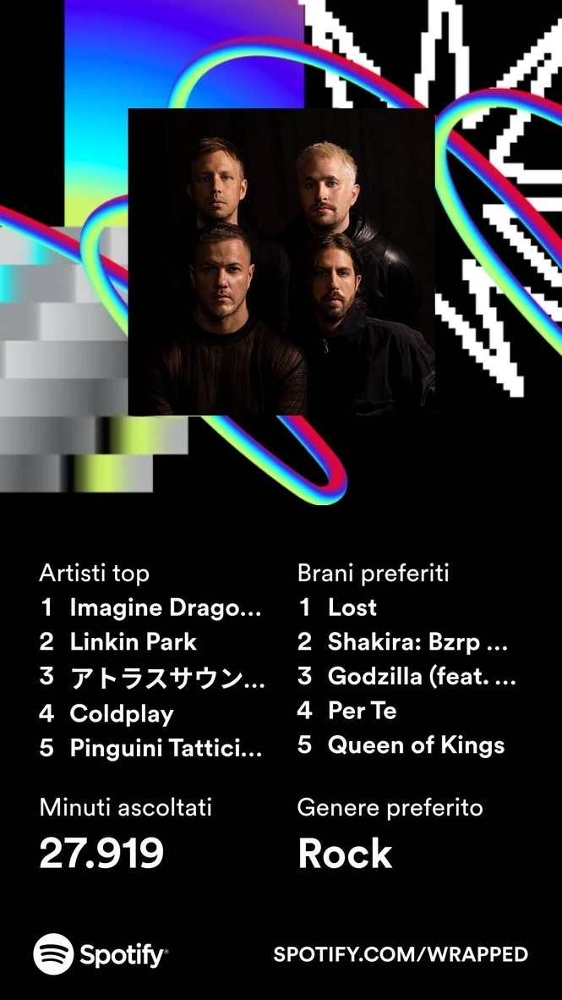

---
{
title: "2023 Retrospective",
published: "2023-12-28T10:18:00Z",
edited: "2023-12-28T14:25:52Z",
tags: ["retrospective", "2024", "2023", "yearinreview"],
description: "Here it is, the end of 2023. What a year it has been. I've been thinking about what I want to do in...",
originalLink: "https://davideimola.dev/blog/2023-retrospective/"
}
---

Here it is, the end of 2023. What a year it has been. I've been thinking about what I want to do in 2024, but before I do that, I want to take a look back at 2023.

I am writing this retrospective for the second year in a row. I think it is a good way to reflect on the year and to think about what I want to do in the next year.

I am going to use more or less the same format as [last year](./2022-retrospective), but I am going to add a few more sections.

- Check-in on 2023 Goals
- Business
- Health
- Friends & Family
- Community, Networking, and Speaking
- Learning
- Hobbies
  - Series and Films
  - Music
  - Games
- Travel
- 2024
- Conclusions

## Check-in on 2023 Goals

I had a few goals for 2023. Let's see how I did. I am going to put a ✅ if I did it, a ❌ if I did not do it, and a 🟡 if I did it, but not as much as I wanted.

For each goal, I am going to write a few words about it.

- ❌ Eat healthier and try to lose some weight 🥒 
  I did not do this. I did not eat healthier, and I did not lose any weight. I tried for a while, but I did not stick with it. I am going to try again in 2024, but for sure I need to go to an expert to help me with this.
- ✅ Stay healthy (you don't say) 👨🏻‍ 
  For sure I can improve this by reducing my weight, but I think I did a good job this year. I did not get sick, and I did not have any injuries.
- 🟡 Read more books 📚 
  I read more books than last year, but I did not read as many as I wanted. I would like to read more in 2024.
- ✅ Improve my Skills (Golang, Kubernetes)👨🏻‍💻 
  This thing is based on my feelings, but I think I improved my skills this year quite a lot. I have not been certified in Kubernetes yet, but I am working on it.
- 🟡 Start learning Rust 🦀  
  I started learning Rust, but I did not do it as much as I wanted. I am going to continue learning it in 2024.
- ✅ Finish the work in the house and move in with Sara 🏡  
  We did it! We finished the work in the house, and we moved in. We are very happy with the result. We still have some things to do, but we are living in the house, and we are very happy.
- ✅ Make a long trip (January is coming… Emirates-Qatar-Oman… 🛳️🤫)  
  I went in a cruise in January in Emirates, and it was amazing. I am going to write a more detailed thing in the travel section.
- ✅ Try to organize something incredible for the community ❤️  
  I organized the [Open Source Day 2023](https://2023.osday.dev/), and it was amazing. I am going to write a more detailed thing in the community section.
- ✅ Have a speech at a conference or meetup  
  Oh yes! I did it!!! I had the pleasure to speak to 5 different conferences. I am going to write a more detailed thing in the speaking section.

At the end, I am happy with what I did. I did not do everything I wanted, but I did a lot of things. I am going to try to do better in 2024.

Of course, my greatest delusion is not losing weight. But, as I already said, I am going to try again in 2024.

## Business

Pretty much the same as last year. I am still working at [RedCarbon](https://www.redcarbon.ai/), and I am still very happy with it.

My role is still the same, but I am doing a lot more things. I am working on a lot of different projects, and I am learning a lot of new things.

My commitment is always at my best, and I am truly happy that is recognized by my colleagues and my boss. In fact, I got a promotion and a bonus this year, and I am very proud of myself.

## Health

As the previous year, I need to focus more on this. I am not eating healthier, and I am not doing so much exercises.

I know that my actual status is not so good, a lot of friends told me that, and I know that I need to change it. I am going to try to do better in 2024.

## Friends & Family

I moved in with Sara (my girlfriend), and we are very happy. We are still working on the house, but we are living in it, and we are very happy. Finally, I can invite my friends to my house, where we can play board games, watch series, and have fun.
I am still in touch with my friends, I'm usually hanging out with them once a week, and I am very happy about it. Also, I made some new friends by organizing the Open Source Day and going to conferences.

In conclusion, I can say that I am pretty satisfied with this part of my life.

## Community, Networking, and Speaking

Here it is, one of the newest additions to the retrospective. I am going to talk about the community, networking, and speaking.
2023 was game-changing for me. I started to be more active in the community, and I started to speak at conferences.

First of all, I have been one of the organizers for the [Open Source Day 2023](https://2023.osday.dev/). It was a great experience, and I am very happy about the outcome. I met a lot of new people, and I learned a lot of new things. I am going to organize it with the SH folks again in [2024](https://2024.osday.dev), and I am going to try to make it even better.

<blockquote class="instagram-media" data-instgrm-captioned data-instgrm-permalink="https://www.instagram.com/p/CqVxKwnoWTB/?utm_source=ig_embed&amp;utm_campaign=loading" data-instgrm-version="14" style=" background:#FFF; border:0; border-radius:3px; box-shadow:0 0 1px 0 rgba(0,0,0,0.5),0 1px 10px 0 rgba(0,0,0,0.15); margin: 1px; max-width:540px; min-width:326px; padding:0; width:99.375%; width:-webkit-calc(100% - 2px); width:calc(100% - 2px);">
 <a href="https://www.instagram.com/p/CqVxKwnoWTB/?utm_source=ig_embed&amp;utm_campaign=loading" style=" background:#FFFFFF; line-height:0; padding:0 0; text-align:center; text-decoration:none; width:100%;" target="_blank"> 
 

 
 

 

 
<svg width="50px" height="50px" viewBox="0 0 60 60" version="1.1" xmlns="https://www.w3.org/2000/svg" xmlns:xlink="https://www.w3.org/1999/xlink"><g stroke="none" stroke-width="1" fill="none" fill-rule="evenodd"><g transform="translate(-511.000000, -20.000000)" fill="#000000"><g><path d="M556.869,30.41 C554.814,30.41 553.148,32.076 553.148,34.131 C553.148,36.186 554.814,37.852 556.869,37.852 C558.924,37.852 560.59,36.186 560.59,34.131 C560.59,32.076 558.924,30.41 556.869,30.41 M541,60.657 C535.114,60.657 530.342,55.887 530.342,50 C530.342,44.114 535.114,39.342 541,39.342 C546.887,39.342 551.658,44.114 551.658,50 C551.658,55.887 546.887,60.657 541,60.657 M541,33.886 C532.1,33.886 524.886,41.1 524.886,50 C524.886,58.899 532.1,66.113 541,66.113 C549.9,66.113 557.115,58.899 557.115,50 C557.115,41.1 549.9,33.886 541,33.886 M565.378,62.101 C565.244,65.022 564.756,66.606 564.346,67.663 C563.803,69.06 563.154,70.057 562.106,71.106 C561.058,72.155 560.06,72.803 558.662,73.347 C557.607,73.757 556.021,74.244 553.102,74.378 C549.944,74.521 548.997,74.552 541,74.552 C533.003,74.552 532.056,74.521 528.898,74.378 C525.979,74.244 524.393,73.757 523.338,73.347 C521.94,72.803 520.942,72.155 519.894,71.106 C518.846,70.057 518.197,69.06 517.654,67.663 C517.244,66.606 516.755,65.022 516.623,62.101 C516.479,58.943 516.448,57.996 516.448,50 C516.448,42.003 516.479,41.056 516.623,37.899 C516.755,34.978 517.244,33.391 517.654,32.338 C518.197,30.938 518.846,29.942 519.894,28.894 C520.942,27.846 521.94,27.196 523.338,26.654 C524.393,26.244 525.979,25.756 528.898,25.623 C532.057,25.479 533.004,25.448 541,25.448 C548.997,25.448 549.943,25.479 553.102,25.623 C556.021,25.756 557.607,26.244 558.662,26.654 C560.06,27.196 561.058,27.846 562.106,28.894 C563.154,29.942 563.803,30.938 564.346,32.338 C564.756,33.391 565.244,34.978 565.378,37.899 C565.522,41.056 565.552,42.003 565.552,50 C565.552,57.996 565.522,58.943 565.378,62.101 M570.82,37.631 C570.674,34.438 570.167,32.258 569.425,30.349 C568.659,28.377 567.633,26.702 565.965,25.035 C564.297,23.368 562.623,22.342 560.652,21.575 C558.743,20.834 556.562,20.326 553.369,20.18 C550.169,20.033 549.148,20 541,20 C532.853,20 531.831,20.033 528.631,20.18 C525.438,20.326 523.257,20.834 521.349,21.575 C519.376,22.342 517.703,23.368 516.035,25.035 C514.368,26.702 513.342,28.377 512.574,30.349 C511.834,32.258 511.326,34.438 511.181,37.631 C511.035,40.831 511,41.851 511,50 C511,58.147 511.035,59.17 511.181,62.369 C511.326,65.562 511.834,67.743 512.574,69.651 C513.342,71.625 514.368,73.296 516.035,74.965 C517.703,76.634 519.376,77.658 521.349,78.425 C523.257,79.167 525.438,79.673 528.631,79.82 C531.831,79.965 532.853,80.001 541,80.001 C549.148,80.001 550.169,79.965 553.369,79.82 C556.562,79.673 558.743,79.167 560.652,78.425 C562.623,77.658 564.297,76.634 565.965,74.965 C567.633,73.296 568.659,71.625 569.425,69.651 C570.167,67.743 570.674,65.562 570.82,62.369 C570.966,59.17 571,58.147 571,50 C571,41.851 570.966,40.831 570.82,37.631"></path></g></g></g></svg>

 
Visualizza questo post su Instagram

 

 

 

 

 

 

 

 

 

 
 

 

</a>
<a href="https://www.instagram.com/p/CqVxKwnoWTB/?utm_source=ig_embed&amp;utm_campaign=loading" style=" color:#c9c8cd; font-family:Arial,sans-serif; font-size:14px; font-style:normal; font-weight:normal; line-height:17px; text-decoration:none;" target="_blank">Un post condiviso da Davide Imola (@davideimola)</a>

</blockquote> 

Second, I had the courage to start proposing talks, and unexpectedly, I got accepted to speak at 4 different conferences. I am going to list them here:

- [DevOps Day](https://www.youtube.com/live/wli1Vv9f_uw?si=LA0T7njnt-MCskMS\&t=11030)
- [Incontro DevOps Italia 2023](https://2023.incontrodevops.it/)
- [DevSecOps Day](https://2023.devsecopsday.it/)
- [GoLab 2023](https://golab.io/past-editions/2023)

This was a great achievement for me. By speaking at these conferences, I met a lot of new people, and I learned a lot of new things. I am going to try to speak at more conferences in 2024.

<blockquote class="instagram-media" data-instgrm-captioned data-instgrm-permalink="https://www.instagram.com/p/CpxsFq2INBr/?utm_source=ig_embed&amp;utm_campaign=loading" data-instgrm-version="14" style=" background:#FFF; border:0; border-radius:3px; box-shadow:0 0 1px 0 rgba(0,0,0,0.5),0 1px 10px 0 rgba(0,0,0,0.15); margin: 1px; max-width:540px; min-width:326px; padding:0; width:99.375%; width:-webkit-calc(100% - 2px); width:calc(100% - 2px);">
 <a href="https://www.instagram.com/p/CpxsFq2INBr/?utm_source=ig_embed&amp;utm_campaign=loading" style=" background:#FFFFFF; line-height:0; padding:0 0; text-align:center; text-decoration:none; width:100%;" target="_blank"> 
 

 
 

 

 
<svg width="50px" height="50px" viewBox="0 0 60 60" version="1.1" xmlns="https://www.w3.org/2000/svg" xmlns:xlink="https://www.w3.org/1999/xlink"><g stroke="none" stroke-width="1" fill="none" fill-rule="evenodd"><g transform="translate(-511.000000, -20.000000)" fill="#000000"><g><path d="M556.869,30.41 C554.814,30.41 553.148,32.076 553.148,34.131 C553.148,36.186 554.814,37.852 556.869,37.852 C558.924,37.852 560.59,36.186 560.59,34.131 C560.59,32.076 558.924,30.41 556.869,30.41 M541,60.657 C535.114,60.657 530.342,55.887 530.342,50 C530.342,44.114 535.114,39.342 541,39.342 C546.887,39.342 551.658,44.114 551.658,50 C551.658,55.887 546.887,60.657 541,60.657 M541,33.886 C532.1,33.886 524.886,41.1 524.886,50 C524.886,58.899 532.1,66.113 541,66.113 C549.9,66.113 557.115,58.899 557.115,50 C557.115,41.1 549.9,33.886 541,33.886 M565.378,62.101 C565.244,65.022 564.756,66.606 564.346,67.663 C563.803,69.06 563.154,70.057 562.106,71.106 C561.058,72.155 560.06,72.803 558.662,73.347 C557.607,73.757 556.021,74.244 553.102,74.378 C549.944,74.521 548.997,74.552 541,74.552 C533.003,74.552 532.056,74.521 528.898,74.378 C525.979,74.244 524.393,73.757 523.338,73.347 C521.94,72.803 520.942,72.155 519.894,71.106 C518.846,70.057 518.197,69.06 517.654,67.663 C517.244,66.606 516.755,65.022 516.623,62.101 C516.479,58.943 516.448,57.996 516.448,50 C516.448,42.003 516.479,41.056 516.623,37.899 C516.755,34.978 517.244,33.391 517.654,32.338 C518.197,30.938 518.846,29.942 519.894,28.894 C520.942,27.846 521.94,27.196 523.338,26.654 C524.393,26.244 525.979,25.756 528.898,25.623 C532.057,25.479 533.004,25.448 541,25.448 C548.997,25.448 549.943,25.479 553.102,25.623 C556.021,25.756 557.607,26.244 558.662,26.654 C560.06,27.196 561.058,27.846 562.106,28.894 C563.154,29.942 563.803,30.938 564.346,32.338 C564.756,33.391 565.244,34.978 565.378,37.899 C565.522,41.056 565.552,42.003 565.552,50 C565.552,57.996 565.522,58.943 565.378,62.101 M570.82,37.631 C570.674,34.438 570.167,32.258 569.425,30.349 C568.659,28.377 567.633,26.702 565.965,25.035 C564.297,23.368 562.623,22.342 560.652,21.575 C558.743,20.834 556.562,20.326 553.369,20.18 C550.169,20.033 549.148,20 541,20 C532.853,20 531.831,20.033 528.631,20.18 C525.438,20.326 523.257,20.834 521.349,21.575 C519.376,22.342 517.703,23.368 516.035,25.035 C514.368,26.702 513.342,28.377 512.574,30.349 C511.834,32.258 511.326,34.438 511.181,37.631 C511.035,40.831 511,41.851 511,50 C511,58.147 511.035,59.17 511.181,62.369 C511.326,65.562 511.834,67.743 512.574,69.651 C513.342,71.625 514.368,73.296 516.035,74.965 C517.703,76.634 519.376,77.658 521.349,78.425 C523.257,79.167 525.438,79.673 528.631,79.82 C531.831,79.965 532.853,80.001 541,80.001 C549.148,80.001 550.169,79.965 553.369,79.82 C556.562,79.673 558.743,79.167 560.652,78.425 C562.623,77.658 564.297,76.634 565.965,74.965 C567.633,73.296 568.659,71.625 569.425,69.651 C570.167,67.743 570.674,65.562 570.82,62.369 C570.966,59.17 571,58.147 571,50 C571,41.851 570.966,40.831 570.82,37.631"></path></g></g></g></svg>

 
Visualizza questo post su Instagram

 

 

 

 

 

 

 

 

 

 
 

 

</a>
<a href="https://www.instagram.com/p/CpxsFq2INBr/?utm_source=ig_embed&amp;utm_campaign=loading" style=" color:#c9c8cd; font-family:Arial,sans-serif; font-size:14px; font-style:normal; font-weight:normal; line-height:17px; text-decoration:none;" target="_blank">Un post condiviso da Davide Imola (@davideimola)</a>

</blockquote> 

Third, I have finally organized a few meetups in my hometown. Probably, this was one of the most beautiful things I did in 2023. The reasons are pretty simple. Verona is not a big city, and it is not easy to find meetups here. I wanted to change this, and I did it! I organized 3 meetups in 2023, thanks to AQuest, and I am going to organize more in 2024.

## Learning

Learning is one of the most important things for me. I am always trying to learn new things, and I am always trying to improve my skills.
This year is no different. I started to learn Rust, and I am going to continue learning it in 2024.

I also started to increase my knowledge about Kubernetes and Go, and finally I can say that I am pretty confident with them. Of course, I still have a lot to learn!

This year I also understand that I'd like to learn more about security, Artificial Intelligence, and mobile development. I am going to try to learn more about these topics in 2024.

## Hobbies

For this year retro, I'd like to give more space to my hobbies. I think it is important to talk about them, and I think it is important to write about them, so people can know me better.
I am going to talk a little more deeply about series and films, music, and games.

### Series and Films

Ok let's start with series and films. Starting from the series, I watched a lot of them, and I am going to list a few of them here, in no particular order like an honorable mention:

- [The Bear](https://www.imdb.com/title/tt14452776): What is this one?! Frustration, anger, stress, and a lot of other feelings. This is a short series, and it is very well done. It is a great cooking serie, but not only that. I am not going to spoil anything, but I can say that it is worth watching it.
- [DAHMER - Monster](https://www.imdb.com/title/tt13207736/): This is a great series. It is about the life of Jeffrey Dahmer, a very famous serial killer. It's not easy to watch it, but it is very well done.
- [The Good Place](https://www.imdb.com/title/tt4955642/): This is a comedy series, and it is very funny. I really enjoyed it.

Now, let's talk about films. I really love going to the cinema, and I really love watching films. I watched a lot of films this year, and I am going to list a few of them here, in no particular order like an honorable mention:

- [Oppenheimer](https://www.imdb.com/title/tt15398776/): Christopher Nolan. I should not say anything else. One of the best biographical films I have ever seen. Through the life of J. Robert Oppenheimer, we can see the story of the atomic bomb. I do love the way the film brings you some very deep thoughts.
- [Barbie](https://www.imdb.com/title/tt1517268/): I went to the cinema with my girlfriend to watch this film, but I did not expect it to be so good. Fun but also deep. I really enjoyed it.
- [Top Gun: Maverick](https://www.imdb.com/title/tt1745960/): I like the first Top Gun, so I watched this sequel. In my opinion, this is better than the first one.
- [The Northman](https://www.imdb.com/title/tt11138512/): I recovered this film this year. For sure, I can say I am a huge fan of the Vikings mythology, and this film does not disappoint me. I really enjoyed it.
- [The Lego Movie](https://www.imdb.com/title/tt1490017/): Another film that I recovered this year. I do love Lego, but I have always thought that this film was for kids. I was wrong. It is a very funny film with a lot of references to other series or films!

### Music

I think one image may be enough to describe my music taste. My Spotify Wrapped 2023:

### Games

From my childhood, I have always loved playing games. From video games to board games, I love them all. Unfortunately, I am not very consistent with them. I play a lot for a few months, and then I stop playing for a few months.
This year, also because of the house renovation, I did not have a lot of time to play, but I played a few games that I really enjoyed.

- [The Legend of Zelda: Tears of the Kingdom](https://zelda.nintendo.com/tears-of-the-kingdom/): Breath of the Wild is one of my favorite games ever, so I was very excited to play this sequel. I pre-ordered it as soon as I could, and I played from the Day One. Unfortunately, I did not have the time to finish it, but I am really enjoining it. If BOTW was good, this one is even better.
- [Hogwarts Legacy](https://www.hogwartslegacy.com/): I am a huge fan of Harry Potter, and I am a huge fan of RPG games. This game is a dream come true for me. I can not explain the feelings I had when I saw for the first time Hogwarts in this game. Probably, is not the best game ever, but I can not be objective with this one. I love it.
- [Munchkin](https://amzn.eu/d/8Ro9N2w): As I said earlier, I also love bord games. I played a few of them this year, but I'd like to mention Munchkin. It is a very fun game to play with friends.
- [Si, Oscuro Signore!](https://it.wikipedia.org/wiki/S%C3%AC,_Oscuro_Signore!): This is an Italian game, and it is very fun to play with friends. This is a very interesting game because you have to create stories and characters. It is like a Dungeons and Dragons, but far more simple. You don't need a game master, and you don't need to create a character. You just need to play as a Goblin or the Dark Overlord.
- [Ka-Blab](https://amzn.eu/d/7NttaGo): This is one of my latest purchases. I got it quite by accident, as I was looking for a simple game to play with a few friends. It is a very simple game, but it is very fun to play.

## Travel

Finally, I can talk about travel. I love traveling, and I love visiting new places. This year I did not travel a lot, but I did a few things.
I had a cruise in January, and it was amazing. I visited a lot of new places!

I visited Dubai and Abu Dhabi in the Emirates. I went to the top of the Burj Khalifa, and it wasn't so amazing, because I suffer from vertigo. 🤦🏻‍
I also visited the Sheikh Zayed Grand Mosque, and it was by far one of the most luxurious places I have ever seen.

<blockquote class="instagram-media" data-instgrm-captioned data-instgrm-permalink="https://www.instagram.com/p/CoCqiiPI__r/?utm_source=ig_embed&amp;utm_campaign=loading" data-instgrm-version="14" style=" background:#FFF; border:0; border-radius:3px; box-shadow:0 0 1px 0 rgba(0,0,0,0.5),0 1px 10px 0 rgba(0,0,0,0.15); margin: 1px; max-width:540px; min-width:326px; padding:0; width:99.375%; width:-webkit-calc(100% - 2px); width:calc(100% - 2px);">
 <a href="https://www.instagram.com/p/CoCqiiPI__r/?utm_source=ig_embed&amp;utm_campaign=loading" style=" background:#FFFFFF; line-height:0; padding:0 0; text-align:center; text-decoration:none; width:100%;" target="_blank"> 
 

 
 

 

 
<svg width="50px" height="50px" viewBox="0 0 60 60" version="1.1" xmlns="https://www.w3.org/2000/svg" xmlns:xlink="https://www.w3.org/1999/xlink"><g stroke="none" stroke-width="1" fill="none" fill-rule="evenodd"><g transform="translate(-511.000000, -20.000000)" fill="#000000"><g><path d="M556.869,30.41 C554.814,30.41 553.148,32.076 553.148,34.131 C553.148,36.186 554.814,37.852 556.869,37.852 C558.924,37.852 560.59,36.186 560.59,34.131 C560.59,32.076 558.924,30.41 556.869,30.41 M541,60.657 C535.114,60.657 530.342,55.887 530.342,50 C530.342,44.114 535.114,39.342 541,39.342 C546.887,39.342 551.658,44.114 551.658,50 C551.658,55.887 546.887,60.657 541,60.657 M541,33.886 C532.1,33.886 524.886,41.1 524.886,50 C524.886,58.899 532.1,66.113 541,66.113 C549.9,66.113 557.115,58.899 557.115,50 C557.115,41.1 549.9,33.886 541,33.886 M565.378,62.101 C565.244,65.022 564.756,66.606 564.346,67.663 C563.803,69.06 563.154,70.057 562.106,71.106 C561.058,72.155 560.06,72.803 558.662,73.347 C557.607,73.757 556.021,74.244 553.102,74.378 C549.944,74.521 548.997,74.552 541,74.552 C533.003,74.552 532.056,74.521 528.898,74.378 C525.979,74.244 524.393,73.757 523.338,73.347 C521.94,72.803 520.942,72.155 519.894,71.106 C518.846,70.057 518.197,69.06 517.654,67.663 C517.244,66.606 516.755,65.022 516.623,62.101 C516.479,58.943 516.448,57.996 516.448,50 C516.448,42.003 516.479,41.056 516.623,37.899 C516.755,34.978 517.244,33.391 517.654,32.338 C518.197,30.938 518.846,29.942 519.894,28.894 C520.942,27.846 521.94,27.196 523.338,26.654 C524.393,26.244 525.979,25.756 528.898,25.623 C532.057,25.479 533.004,25.448 541,25.448 C548.997,25.448 549.943,25.479 553.102,25.623 C556.021,25.756 557.607,26.244 558.662,26.654 C560.06,27.196 561.058,27.846 562.106,28.894 C563.154,29.942 563.803,30.938 564.346,32.338 C564.756,33.391 565.244,34.978 565.378,37.899 C565.522,41.056 565.552,42.003 565.552,50 C565.552,57.996 565.522,58.943 565.378,62.101 M570.82,37.631 C570.674,34.438 570.167,32.258 569.425,30.349 C568.659,28.377 567.633,26.702 565.965,25.035 C564.297,23.368 562.623,22.342 560.652,21.575 C558.743,20.834 556.562,20.326 553.369,20.18 C550.169,20.033 549.148,20 541,20 C532.853,20 531.831,20.033 528.631,20.18 C525.438,20.326 523.257,20.834 521.349,21.575 C519.376,22.342 517.703,23.368 516.035,25.035 C514.368,26.702 513.342,28.377 512.574,30.349 C511.834,32.258 511.326,34.438 511.181,37.631 C511.035,40.831 511,41.851 511,50 C511,58.147 511.035,59.17 511.181,62.369 C511.326,65.562 511.834,67.743 512.574,69.651 C513.342,71.625 514.368,73.296 516.035,74.965 C517.703,76.634 519.376,77.658 521.349,78.425 C523.257,79.167 525.438,79.673 528.631,79.82 C531.831,79.965 532.853,80.001 541,80.001 C549.148,80.001 550.169,79.965 553.369,79.82 C556.562,79.673 558.743,79.167 560.652,78.425 C562.623,77.658 564.297,76.634 565.965,74.965 C567.633,73.296 568.659,71.625 569.425,69.651 C570.167,67.743 570.674,65.562 570.82,62.369 C570.966,59.17 571,58.147 571,50 C571,41.851 570.966,40.831 570.82,37.631"></path></g></g></g></svg>

 
Visualizza questo post su Instagram

 

 

 

 

 

 

 

 

 

 
 

 

</a>
<a href="https://www.instagram.com/p/CoCqiiPI__r/?utm_source=ig_embed&amp;utm_campaign=loading" style=" color:#c9c8cd; font-family:Arial,sans-serif; font-size:14px; font-style:normal; font-weight:normal; line-height:17px; text-decoration:none;" target="_blank">Un post condiviso da Davide Imola (@davideimola)</a>

</blockquote> 

Everything is so big there. Including the malls. They also have a ski slope inside a mall. It is crazy!

In the same cruise, I also visited Doha in Qatar. Qatar was the country that hosted the 2022 FIFA World Cup, so I found a lot of things still related to football. As I understood from the locals, Doha is a very modern city, and it is growing very fast. So I think it is worth visiting it again in a few years.

Last, but not least, I visited Muscat in Oman. Unfortunately, I did not have a lot of time to visit it, but I really enjoyed it. I visited the Sultan Qaboos Grand Mosque, and it was amazing. I also visited the Mutrah Souq, and it was very interesting.

In this year, I also visited a few places in Italy. I visited Trento and Arco in Trentino Alto Adige. I have also been three times in Florence this year, I can say I am starting to know it very well!

Udine, or better, San Daniele del Friuli (for the ham) and Torino, are the other two cities I visited this year. I don't have a lot to say about them, but I would like to mention one thing about Torino. The Egyptian Museum, I had the opportunity to visit it with a guide thanks to my company. It is something out of this world. It gives me the chills just thinking about it. I can not explain the feelings I had when I saw the mummies. I think it is something that everyone should see at least once in their life. Now, I would like to return in Egypt to see the pyramids and the other things I did not have the opportunity to see.

## 2024

I think I have talked enough about 2023. Now, it is time to look forward to 2024. As the last year, I want to set some goals for the next year.
For the next year, I want to focus more on my health and my hobbies. I know, as a developer, it is not easy to find the time to do everything, but I think it is important to find the time to do the things you love.

So, let's start:

- I want to lose weight. I know it is not easy, but I want to try. I want to start going to walk more and try to eat better.
- My girlfriend has gifted me a board game of the Lord of the Rings. I want to organize a good campaign with my friends!
- Start playing at role-playing games again. But this time, I want to do it more consistently.
- I want to organize more and more meetups in Verona!
- I want to learn more about security, Artificial Intelligence, and mobile development.
- I would love to organize a better event for the next Open Source Day!
- Create more content for my blog, YouTube channel, and Twitch channel.

## Conclusions

And that's all. It seems that only yesterday I was writing the 2022 retrospective, and now I am writing the 2023 one. Time flies, and I think it is important to stop and think about what you have done in the last year. I think it is important to think about what you have done, and what you want to do in the next year.

I hope you enjoyed reading this post, and I hope you will have a great 2024!
