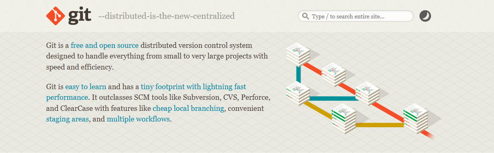
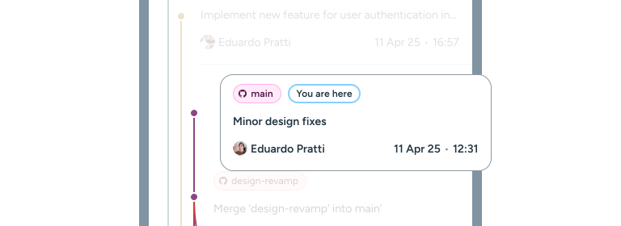
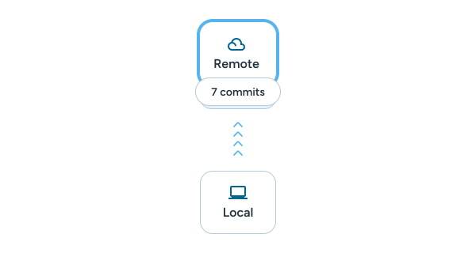
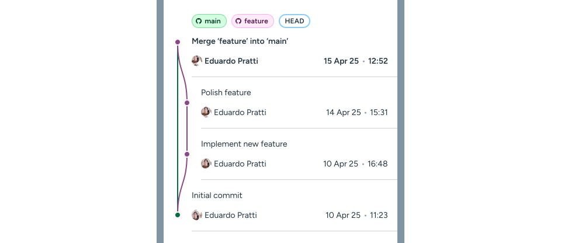
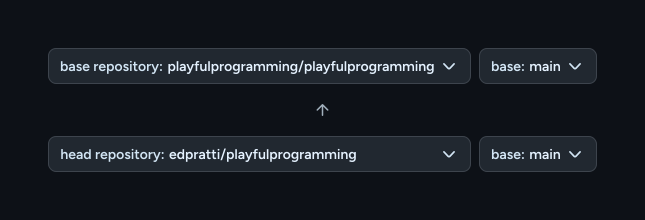

---
{
	title: "Git Basics",
	description: "In our first chapter, we tackle the most common aspects of git and explain how they work in tandem with one another.",
	published: "2025-03-22",
	tags: ["git"],
	license: "cc-by-nc-sa-4",
	order: 1
}
---

**Git is a version control system that is used to build the vast majority of software that we use every day.**

In this first article, we're going to be looking at some of the items you'll be interacting with constantly when working with Git!

While we're about to explain the basic concepts of Git, later chapters will focus on more complex operations, usually applicable when collaborating with other people, and handling multiple concurrent development goals within a single project.

Without further ado, let's get into it.

# How do I install Git?



**[Git can be installed from its official website.](https://git-scm.com/)** Once installed, it will work across your system, through either a command prompt or terminal or through a third-party GUI, tracking file changes inside your repositories.

However, if you're completely new to Git, you may be wondering: ***what's a repository?***

# Repositories

Repositories are folders — local or remote; more on that later — that contain a `.git` folder inside, which contain all the necessary files that allow it to track changes inside of the repository. 

Git will only track changes inside repositories with a valid `.git` folder.

## Locals and remotes


There are two types of repositories — local and remote. A **local** repository is a repository that has not been published online and can only be modified within the machine it is copied onto.

A **remote repository**, on the other hand, is a cloud-hosted repository that can be cloned, downloaded and modified locally; and with the proper permissions, those changes can be pushed onto the original cloud hosted repository.

A GitHub repository, for example, is hosted in the cloud, and thus, can be cloned onto a local folder.

**A local repository can connect to multiple remotes**, and perform all normal operations from multiple sources.


## Creating a repository

**Although user interfaces in Git clients differ**, one can create a repository by navigating to a folder in a terminal and using the following command.

```bash
git init
```

This will generate the necessary `.git` folder, at which point you will have created a **local repository**.


<!-- ::start:filetree -->
- `docs/`
- `src/`
- `tests/`
- **`.git/`** Hidden by default
- `README.md`
<!-- ::end:filetree -->

> This is merely an example; your repository can contain anything.

## Publishing a local repository

We can push a local repository by adding **a remote repository**. In some of our examples, it will be shown as `origin`.

### What's the `origin`?

The `origin` is the default name for a remote repository that is being tracked and synced with your local one. Later on we'll make use of `origin` to create branches, as well as push and pull changes. 

While your remote repository can be named `origin`, it doesn't necessarily *have* to be.

We can add a remote repository with the following commands.

```bash
# Add the remote repository.
# In this example, our remote is called "origin".
git remote add origin https://github.com/username/repo.git
```


```bash
# Renames the branch from 'master' to 'main'
# to follow modern naming standards
git branch -M main

# Pushes our local branch to the remote of the same name
# In this example, our remote is called "origin".
git push -u origin main
```


## Cloning a remote repository

We can easily clone a GitHub repository by copying its repository URL, like so.


With the repository URL in your clipboard, we can use the `git clone` command to copy it into our desired folder.

```bash
git clone https://github.com/playfulprogramming/playfulprogramming.git
```

This will copy over all of the files — including the `.git` folder — into a local instance inside your machine.

> **Cloned repositories are already tied to their remotes:**
> Whereas we had to manually `add origin` to our local repositories before publishing, cloning a repository will also bring its remote with it.
> This means that operations can be done without having to specify a branch or remote URL every time.

Once a file is modified inside this local repository, Git will make note of it, and track the differences between the initial (when the file was first initialized or added) and the latest versions.

---

# Branches

Branches, as the name implies, are self-contained versions of your repository, that act independently of one another. This means that you can develop different aspects of your repository concurrently without any fear of going over someone else's work.

Small repositories may have a `main` branch, a `develop` branch and a `feature` branch for different projects, while larger repositories may have dozens or hundreds of different branches, some intentionally left behind for record-keeping or to mark different stable releases.


## Creating a branch

Creating a branch can be done either in steps — creating and then switching — or in one go.

### Creating, but not switching

```bash
# Replace `brand-new-branch` with your desired branch name.
git branch brand-new-branch
```

And then you can use the command below to switch to it.

```bash
# Replace `brand-new-branch` with your desired branch name.
git checkout brand-new-branch
```

### Creating, and switching to the new branch

```bash
# Replace `brand-new-branch` with your desired branch name.
git checkout -b brand-new-branch
```

> Here, the `checkout` command tells us we want to switch to a specific branch, while the `-b` flag tells git we're creating a new branch to checkout to.

### The `switch` command

In later versions of Git, you can also use the `switch` command instead of `checkout` to create and switch to a new branch.

```bash
# Replace `brand-new-branch` with your desired branch name.
git switch -c brand-new-branch
```

> The `-c` flag is the equivalent of the `-b` flag in the `git checkout` version of command. It just tells Git this will be a new branch and not an existing one.

## Deleting a branch

We can easily delete a branch using the `-d` and `-D` flags in our terminal command.

```bash
# This command deletes a branch if it
# has been merged either upstream or
# to the current checked-out branch.

git branch -d branch-to-delete
```

In this case, if the branch ***has not been merged***, Git will prevent its deletion, with the following output:

```c
error: The branch 'branch-to-delete' is not fully merged.
If you are sure you want to delete it, run 'git branch -D branch-to-delete'.
```

The `-D` flag **force-deletes** a branch, regardless of its merge status. Make sure to only use it in scenarios where the code being deleted is either obsolete or already backed up.

## Publishing a branch

Once we've made the changes we wanted, we can simply push the new branch to `origin`, the default name of our remote repository, with the command:

```bash
git push -u origin brand-new-branch
```

> The `-u` flag, like we've seen with Remotes, ties the new branch with a remote branch. This means that Git will start tracking the remote point for the branch that you are pushing to.
>
> This allows you to use `git pull` and `git push` without specifying the branch name every single time, as long as you're checked out into the one you desire. We'll learn more about them shortly!

## Pruning branches

Now let's say there are branches that are no longer in use; they've been merged or deleted in the remote repository and no longer exist. We can easily delete all of them in bulk using the `--prune` flag in our `git fetch` command.

> [We'll learn more fetching later in this article](#fetch), but it is essentially a command that asks for the current state of the remote repository.

```bash
# This will search for and remove any unused branches in your local repository.
git fetch --prune
```

*And voilà*; all your unused branches should be gone.

---

# Commits

Now that we've learned what repositories and branches are, it's time to make some changes!

Commits are snapshots of changes that were made. They allow us to save important version updates to perform regressions or more granular reviews if necessary.

An example of a commit would be as such:



It contains, by default:

- **An author**
  - This is most commonly taken from the initial config when installing Git, but can be set per repository as well as overriden per commit. It can display your email address as well.
- **A commit message**
  - This is a mandatory part of every commit. You cannot commit without adding a message. If you attempt to commit without a message, you'll be given an interface in which to write a message. If that step fails, the commit will be aborted.
- **A timestamp**
- **A SHA-1 hash**
  - This is usually not shown in GUIs, but the SHA-1 hash is very important, as it is an identifier, unique to every commit. 

> Now that we know how they're displayed, how do we create them?

Before you create a commit, you must `stage` files.

## Staging files

Although Git tracks all changes within a repository, when creating a commit, you are allowed to only specify certain files to be submitted. This is what's called **staging**.

Staging lets Git know to only add specific file changes in the next commit and to ignore all other unaccounted changes. This is important if you're changing other files for testing purposes and these changes are not to be reflected in production.


We can stage files like so:

```bash
git add filename.ext
```

This will stage that specific file for the next commit.

```bash
git add git_ui.svg
git add ClientFrame.jsx
git add Documentation.md
```


Adding a file to staging will save a temporary snapshot of the file changes, meaning that if a staged file is modified after staging, it needs to be staged again in order to update the differences.

To account for this behavior, you may want to only stage elements right before committing.

> This looks very laborious.

It doesn't have to be! The `git add` command is designed for granular control of changes, but most commonly, we can completely skip this step by adding a `.`.

```bash
# Git will stage all file changes
git add .
```

## Unstaging files

We can easily do the reverse and `restore` files from Staging that we no longer want to commit to our repository.

```bash
git restore filename.ext
```

In our case, we would:

```bash
git restore git_ui.svg
git restore ClientFrame.jsx
git restore Documentation.md
```


We're back to our initial setup, simple as that. 

We can, also, ignore files!

## Ignoring files

Inside a repository, you can have a `.gitignore` file, which lets Git know which files to never stage or commit changes from.

This is very important to stop yourself from committing useless log files or updates to dependencies that are not required to make use of the modifications you've made.

Just as with `git add`, the ignore command follows the same syntax.

```bash
git ignore filename.ext
```

**From this point onwards, that specific file will never be added to staging or a commit unless we manually open the `.gitignore` file in a text editor and remove the specific entry.**

We can also ignore whole folders!

```bash
git ignore folder-name/
```

Or ignore a certain file from a certain folder, by specifying both the folder and the filename.

```bash
git ignore folder-name/filename.ext
```

And with that out of the way, we can create a commit!

## Creating a commit

We can perform a commit with the following command:

```bash
git commit -m "Your commit message here"
```

> *How do I push these to a repository?*

We'll learn more about this in the **[Push](#push)** section of this article.

---

Continuously committing changes will save them accordingly in a commit history, or a `git log`. 

# Git Log

A git log is where all your commits live. It's also called a commit history.

In our terminal, we can type:

```bash
git log
```

And our output would be, for example:

```bash
commit 3f1e1b9a3c4d5e6f7g8h9i0j1k2l3m4n5o6p7q8r
Author: John Smith <john.smith@example.com>
Date:   Sat Mar 22 16:47:36 2025 -0300

    Formatting changes

commit 2e4d6c8f0a1b3c5d7e9f0a1b2c3d4e5f6g7h8i9j
Author: John Smith <john.smith@example.com>
Date:   Sat Mar 22 15:12:18 2025 -0300

    Added new article section

commit 1a2b3c4d5e6f7g8h9i0j1k2l3m4n5o6p7q8r9s0t
Author: John Smith <john.smith@example.com>
Date:   Fri Mar 21 09:30:33 2025 -0300

    Initial commit
```

An example of a theoretical commit history UI would be the following:


## Navigating in time

Branches are not the only thing you can `checkout` to; we can also **checkout to commits**, which is how we can navigate through our repository history!

To perform that, we must use `git checkout` as well as the SHA-1 hash that is the unique identifier for that commit.

```bash
git checkout 1a2b3c4d5e6f7g8h9i0j1k2l3m4n5o6p7q8r9s0t

# We will be transported to the "Initial commit"
# from our earlier example.
```

When we checkout to a commit, we're actually moving through time, to whenever that commit was submitted. Our "placement" in time corresponds to the `HEAD`.

Until now, our examples have shown a `You are here` bubble to show where the user is checked out to. But this is actually the `HEAD`.


## HEAD

The `HEAD` tells us where we're currently at on a particular branch. By default, `HEAD` will always go to the latest commit on a branch.

In our previous UI example, we were checked out to `main`, so our `HEAD` is on the last commit of the `main` branch. Sounds simple, right?

**But what happens when we checkout to a commit?** Let's checkout to a previous commit and see what is shown to us.


> Now our `HEAD` is detached. But... what does that mean?

### Detached HEAD

When you checkout to a commit and the `HEAD` detaches, you are taken out of whatever branch you were currently in. In our example, the UI faded all other commits, because in this state, we're no longer connected to any of them.

If we were to stage changes and make commits in this state, our commits would not go onto any branch, and would instead be loose inside the repository, becoming inconsequential.

> *There are uses for detached commits, but they're a more advanced topic which we'll cover in a future chapter.*

***So, what happens if we checkout to the latest commit of branch we were in? Will that re-attach the `HEAD`?***


### It will not.

This is because being checked out to a commit, regardless of which commit, will disconnect you from a branch. 

In order to restore your connection to a branch, you must `git checkout <branch-name>` back to it.

```bash
git checkout main
```


Now you're back to the latest commit, and the `HEAD` is reattached. The rest of the commits, even if they're from other branches, are now restored, because you're within the context of the Git tree.

---

# Blame & diff

When reviewing commits, it's imperative that you are able to compare when and what was changed. That's where `git blame` and `git diff` come in.

To exemplify this, we'll have the following paragraph, and its new version.

```
Practice programming while having fun

Your new place to learn all kinds of programming, from introductory ideas to advanced abstractions.

Our goal is to provide the best resources possible to learn any computer science related topic.
```

```
Practice programming with magically majestic methods

The perfect place to learn all kinds of programming, from introductory ideas to advanced abstractions.
```

## Blame

When you perform a `git blame` on our description text, it would wield something like this:

```bash
git blame tagline.txt
```

**Output:**

```bash
d4e5f6g (Eduardo Pratti    2025-04-05 10:32:45 -0400  1) Practice programming with magically majestic methods
a1b2c3d (Corbin Crutchley  2024-12-15 09:14:10 -0500  2)
d4e5f6g (Eduardo Pratti    2025-04-05 10:32:45 -0400  3) The perfect place to learn all kinds of programming, from introductory ideas to advanced abstractions.
a1b2c3d (Corbin Crutchley  2024-12-15 09:14:10 -0500  4)
a1b2c3d (Corbin Crutchley  2024-12-15 09:14:10 -0500  5) Our goal is to provide the best resources possible to learn any computer science related topic.
```

This tells us a couple of things:

- An ID of a particular line
- The contents of that line
- When the latest change was made
- Who has responsible for the change
- ***It does not, however, tell us what has changed.***

But there's a discrepancy here. **We deleted the last line, but that is not shown in the output.** Why's that?

### The limitations of `git blame`

The `git blame` command **does not do comparisons**. So when a line is deleted, it cannot be read, as `git blame` doesn't look at its history, it simply reads the lines that are currently in the file.

This is why our deleted line was not part of the output, as it doesn't exist, and `git blame` has no idea that it ever existed.

## Diff

The `git diff` command compares two different commits and shows you the difference between its contents.

The output for our changes would be the following:

```bash
- Practice programming while having fun
+ Practice programming with magically majestic methods

- Your new place to learn all kinds of programming, from introductory ideas to advanced abstractions.
+ The perfect place to learn all kinds of programming, from introductory ideas to advanced abstractions.

- Our goal is to provide the best resources possible to learn any computer science related topic.
```

The difference between both files is shown as absolute — if a line is changed, the previous version is shown as deleted (`-`) and the final line is considered new (`+`).

Platforms like GitHub and GitLab perform a `word-diff` comparison, which allows them to highlight exactly what has been changed in edited lines.

```bash
- Practice programming {[-while having fun-]}
+ Practice programming {[+with magically majestic methods+]}
 
- {[-Your new-]} place to learn all kinds of programming, from introductory ideas to advanced abstractions.
+ {[+The perfect+]} place to learn all kinds of programming, from introductory ideas to advanced abstractions.
 
- {[-Our goal is to provide the best resources possible to learn any computer science related topic.-]}
```

And in those platforms, `git blame` and `git diff` are combined to show all the necessary information someone may need when reviewing commit changes.


---

Now that we're aware of the most basic features of Git, it's time to start making operations with them. While all of this is trivial using a GUI client, terminal operations are also easy and accessible to the average user.

This is not an exhaustive list, and in a later chapter of this series, we'll learn about advanced aspects of Git, like merging, merge errors, rebase, and so much more. But let's not worry about that for now!

# Fetch

```bash
# This assumes you already have a link to the remote,
# so there's no need to specify the remote.
git fetch
```


The `git fetch` command simply fetches and displays the latest commits from the remote branch that are ahead of your current local branch.

> **Note:**
> Fetch will display newer commits if they are in the same branch you're currently checked out in. This means that, for example, if you `git fetch` while in `main`, Git will not display newer commits from your `develop` branch.

 It does not execute anything beyond this, making it an ultimately harmless operation.

# Pull

```bash
# This assumes you already have a link to the remote,
# so there's no need to specify the remote.
git pull
```


The command `git pull`, like `git fetch`, will also fetch the latest commits from the respective remote branch. 

However, instead of stopping there, it will instantly initiate a `git merge`, downloading and applying commits onto your local branch if they're missing from it.

***This is a very common action, as it's the command you'll use when you want to update your local branch.***

# Push

```bash
# This assumes you already have a link to the remote,
# so there's no need to specify the remote.
git push
```



Pushing is the way to publish your changes from the local repository back to the remote repository.

`git push` will send all of *your commits* — this is important, as it **will not** include staged files — back to the remote repository.

This will not `git merge` your commits to the remote repository, however.

# Merge

Like the name implies, `git merge` will try to combine all commits safely, assuming they do not conflict with one another.

```bash
git merge feature
```



Merging will create a **merge commit** like shown in the image above. This will pull and push all changes from both branches into one single commit.

## Fast-forward Merging

<!-- TO-DO -->

---

There is also another way of merging branches: Rebase.

# Rebase


Unlike `git merge`, rebasing will not perform a merge commit. Instead, it will simply move all commits from one branch **on top** of another, maintaining only a single branch in the Git history.

> **Future chapters will expand on this!:**
> We'll learn a lot more about merging and rebase in the following chapters of this collection.
> We still have not tackled conflicts and how to resolve them, as well as many other issues you may run into with Git management!

---

When collaborating with others, it's important to make sure you're coding safely; in a way that does not force breaking changes to other concurrent modifications.

After you've committed changes, consider creating a branch — or a fork, if you're authorized to edit the repository directly - before pushing. This isolates your changes so that they can be reviewed using **[Pull Requests](#pull-requests)**.

Pull requests are a safer way to submit changes as they can be reviewed ahead of merging, and prevent potential conflicts.

# Pull requests

PRs - as they're called for short — are the way developers collaborate. Platforms like GitHub and GitLab provide code review functionality in order to streamline the process and make it easier to manage changes.

GitHub will automatically suggest submitting a PR when it detects any of your branches are ahead of the `main` branch.


## Submitting a pull request


From this screen, you can add a title and a description for the Pull Request, explaining what's in it.

Once your pull request is opened, GitHub will display the `blame` and `diff` for each file as one of the tabs for the PR view.


---

But let's say you have a particular codebase that you'd like to modify or contribute to, but you're not authorized to do that directly. Or rather, you'd like to take full control of a repository to do a great amount of modifications to it that wouldn't be allowed otherwise. ***For that, you'd create a fork.***

## Forks

A fork is a copy of a repository that can be modified independently from its original source, but can [pull](#pull) from it whenever they are out of sync.

> **Forks are not a native Git feature:**
> Many platforms such as GitHub and GitLab offer this as a feature as it became a very common and easy way to collaborate.

## Creating a fork

This example uses GitHub, but you'll also find this in other platforms like GitLab.


Once this is selected, you'll have a fork of the original repository under your account. Then, clone the repository as you normally would.

GitHub will automatically track the difference between both repositories and let you know how many commits behind or in front of the original repository you are.


## Creating a PR from a fork

When creating a pull request from a fork, you're able to choose which repository and which branch of which to compare changes with.



> In terms of operations, fork PRs are essentially the exact same as regular PRs, and have the same limitations.

---

# What to expect from the next chapter

Our work is just beginning. In our next chapter we'll learn a lot more about Git, but we'll also expand on what we've learned in this one!

As a baseline, this is what you can expect:

- Git Reset
- Git Revert
- Cherry-picking
- Git Conflicts
- Submodules

<!-- TO-DO -->