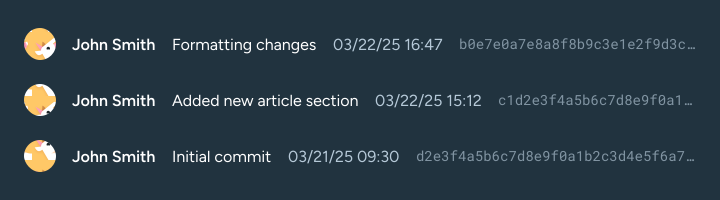

---
{
	title: "Git Basics",
	description: "In our first chapter, we tackle the most common aspects of git and explain how they work in tandem with one another.",
	published: "2025-03-22",
	tags: ["git"],
	license: "cc-by-nc-sa-4",
	order: 1
}
---

**Git is a version control system that is used to build the vast majority of software that we use every day.**

In this first article, we're going to be looking at some of the items you'll be interacting with constantly when working with Git!

While we're about to explain the basic concepts of Git, later chapters will focus on more complex operations, usually applicable when collaborating with other people, and handling multiple concurrent development goals within a single project.

Without further ado, let's get into it.

# How do I install Git?

**[Git can be installed from its official website.](https://git-scm.com/)** Once installed, it will work across your system, through either a command prompt or terminal or through a third-party GUI, tracking file changes inside your repositories.

However, if you're completely new to Git, you may be wondering: ***what's a repository?***

# Repositories

Repositories are folders — local or remote; more on that later — that contain a `.git` folder inside, which contain all the necessary files that allow it to track changes inside of the repository. 

Git will only track changes inside folders with a `.git` folder.

## Creating a repository

**Although implementations in Git clients differ**, one can create a repository by navigating to a folder in a terminal and using the following command.

```bash
git init
```

This will generate the necessary `.git` folder, at which point you will have created a **local repository**.

## Locals and remotes

There are two types of repositories — local and remote. A **local** repository is a repository that has not been published online and can only be modified within the machine it is copied onto.

A **remote repository**, on the other hand, is a cloud-hosted repository that can be cloned, downloaded and modified locally; and with the proper permissions, those changes can be pushed onto the original cloud hosted repository.

A GitHub repository, for example, is hosted in the cloud, and thus, can be cloned onto a local folder.

## Publishing a local repository

We can push a local repository by adding an `origin`, which is what we call a **remote repository**. These will be used interchangeably from here on out!

### Adding an `origin`

The `origin` is the remote repository that is being tracked and synced with your local one. Later on we'll make use of the `origin` command to create branches, as well as push and pull changes. In the vast majority of cases, your remote repository will be named `origin`, but it doesn't necessarily *have* to be.

We can add an origin with the following commands.

```bash
# Add the remote repository.
git remote add origin https://github.com/username/repo.git
```


```bash
# Renames the branch from 'master' to 'main'
# to follow modern naming standards
git branch -M main

# Pushes our local branch to the origin of the same name
git push -u origin main
```


## Cloning a remote repository

We can easily clone a GitHub repository by copying its repository URL, like so.


> A proper repository URL will always end with .git!

With the repository URL in your clipboard, we can use the `git clone` command to copy it into our desired folder.

```bash
git clone https://github.com/playfulprogramming/playfulprogramming.git
```

This will copy over all of the files — including the `.git` folder — into a local instance inside your machine.

> **Cloned repositories are already tied to their remotes:**
> Whereas we had to manually `add origin` to our local repositories before publishing, cloning a repository will also bring its origin with it.
> This means that operations can be done without having to specify a branch or remote URL every time.

Once a file is modified inside this local repository, Git will make note of it, and track the differences between the initial (when the file was first initialized or added) and the latest versions.

---

# Branches

Branches, as the name implies, are self-contained versions of your repository, that act independently of one another. This means that you can develop different aspects of your repository concurrently without any fear of going over someone else's work.

Small repositories may have a `main` branch, a `develop` branch and a `feature` branch for different projects, while larger repositories may have dozens or hundreds of different branches, some intentionally left behind for record-keeping or to mark different stable releases.


## Creating a branch

Creating a branch can be done either in steps — creating and then switching — or in one go.

### Creating, but not switching

```bash
# Replace `brand-new-branch` with your desired branch name.
git branch brand-new-branch
```

And then you can use the command below to switch to it.

```bash
# Replace `brand-new-branch` with your desired branch name.
git checkout brand-new-branch
```

### Creating, and switching to the new branch

```bash
# Replace `brand-new-branch` with your desired branch name.
git checkout -b brand-new-branch
```

> Here, the `checkout` command tells us we want to switch to a specific branch, while the `-b` flag tells git we're creating a new branch to checkout to.

### The `switch` command

In later versions of Git, you can also use the `switch` command instead of `checkout` to create and switch to a new branch.

```bash
# Replace `brand-new-branch` with your desired branch name.
git switch -c brand-new-branch
```

> The `-c` flag is the equivalent of the `-b` flag in the `git checkout` version of command. It just tells Git this will be a new branch and not an existing one.

## Deleting a branch

We can easily delete a branch using the `-d` and `-D` flags in our terminal command.

```bash
# This command deletes a branch if it
# has been merged either upstream or
# to the current checked-out branch.

git branch -d branch-to-delete
```

In this case, if the branch ***has not been merged***, Git will prevent its deletion, with the following output:

```c
error: The branch 'branch-to-delete' is not fully merged.
If you are sure you want to delete it, run 'git branch -D branch-to-delete'.
```

The `-D` flag **force-deletes** a branch, regardless of its merge status. Make sure to only use it in scenarios where the code being deleted is either obsolete or already backed up.

## Publishing a branch

Once we've made the changes we wanted, we can simply push the new branch to `origin`, our remote repository, with the command:

```bash
git push -u origin brand-new-branch
```

> The `-u` flag, like we've seen with Remotes, ties the new branch with a remote branch. This means that Git will start tracking the remote point for the branch that you are pushing to.
>
> This allows you to use `git pull` and `git push` without specifying the branch name every single time, as long as you're checked out into the one you desire. We'll learn more about them shortly!

## Pruning branches

Now let's say there are branches that are no longer in use; they've been merged or deleted in the remote repository and no longer exist. We can easily delete all of them in bulk using the `--prune` flag in our `git fetch` command.

> [We'll learn more fetching later in this article](#fetch), but it is essentially a command that asks for the current state of the remote repository.

```bash
# This will search for and remove any unused branches in your local repository.
git fetch --prune
```

*And voilà*; all your unused branches should be gone.

---

# Commits

Now that we've learned what repositories and branches are, it's time to make some changes!

Commits are snapshots of changes that were made. They allow us to save important version updates to perform regressions or more granular reviews if necessary.

An example of a commit would be as such:


It contains, by default:

- **An author**
  - This is most commonly taken from the initial config when installing Git, but can be set per repository as well as overriden per commit.
- **A timestamp**
- **A commit message**
  - This is a mandatory part of every commit. You cannot commit without adding a message. If you attempt to commit without a message, you'll be given an interface in which to write a message. If that step fails, the commit will be aborted.

> Now that we know how they're displayed, how do we create them?

Before you create a commit, you must `stage` files.

## Staging files

Although Git tracks all changes within a repository, when creating a commit, you are allowed to only specify certain files to be submitted. This is what's called **staging**.

Staging lets Git know to only add specific file changes in the next commit and to ignore all other unaccounted changes. This is important if you're changing other files for testing purposes and these changes are not to be reflected in production.

We can stage files like so:

```bash
git add filename.ext
```

This will stage that specific file for the next commit.

Adding a file to staging will save a temporary snapshot of the file changes, meaning that if a staged file is modified after staging, it needs to be staged again in order to update the differences.

To account for this behavior, you may want to only stage elements right before committing.

> This looks very laborious.

It is! The `git add` command is designed for granular control of changes. Most commonly, we can completely skip this step if the nature of the file changes you're performing are not wide reaching.

We can, also, ignore files!

## Ignoring files

Inside a repository, you can have a `.gitignore` file, which lets Git know which files to never stage or commit changes from.

This is very important to stop yourself from committing useless log files or updates to dependencies that are not required to make use of the modifications you've made.

Just as with `git add`, the ignore command follows the same syntax.

```bash
git ignore filename.ext
```

**From this point onwards, that specific file will never be added to staging or a commit unless we manually open the `.gitignore` file in a text editor and remove the specific entry.**

And with that out of the way, we can create a commit!

## Creating a commit

We can perform a commit with the following command:

```bash
git commit -m "Your commit message here"
```

Continuously committing changes will save them accordingly in a commit history, or a `git log`. An example of a theoretical commit history UI would be the following:



We will learn how to publish these commits in the later sections of this article!

# Navigating through commits

<!-- EXPAND THIS -->

---

Now that we're aware of the most basic features of Git, it's time to start making operations with them. While all of this is trivial using a GUI client, terminal operations are also easy and accessible to the average user.

This is not an exhaustive list, and in a later chapter of this series, we'll learn about advanced aspects of Git, like merging, merge errors, rebase, and so much more. But let's not worry about that for now!

# Fetch

```bash
# This assumes you already have a link to the remote,
# so there's no need to specify the origin.
git fetch
```

The `git fetch` command simply fetches and displays the latest commits from the `origin` branch that are ahead of your current local branch.

> **Note:**
> Fetch will display newer commits if they are in the same branch you're currently checked out in. This means that, for example, if you `git fetch` while in `main`, Git will not display newer commits from your `develop` branch.

 It does not execute anything beyond this, making it an ultimately harmless operation.

# Pull

```bash
# This assumes you already have a link to the remote,
# so there's no need to specify the origin.
git pull
```

The command `git pull`, like `git fetch`, will also fetch the latest commits from the respective `origin` branch. 

However, instead of stopping there, it will instantly initiate a `git merge`, effectively downloading and applying newer commits onto your local branch.

***This is a very common action, as it's the command you'll use when you want to update your local branch.***

# Push

```bash
# This assumes you already have a link to the remote,
# so there's no need to specify the origin.
git push
```

Pushing is the way to publish your changes from the local repository back to the remote repository.

`git push` will send all of *your commits* — this is important, as it **will not** include staged files — back to the remote repository.

If you've been added as a collaborator, or rather, you have `write` permissions on the remote repository, this will update the branch you're pushing to accordingly.

**However, this is unadvised.**

### When not to push

When collaborating with others, it's important to make sure you're coding safely; in a way that does not force breaking changes to other concurrent modifications.

After you've committed changes to your branch - if you're authorized to edit the repository directly or not - you can submit those changes for approval using **Pull Requests**.

Pull requests are a safer way to submit changes as they can be reviewed ahead of merging, and prevent potential conflicts.

# Pull requests

PRs - as they're called, for short — are the way developers collaborate. Platforms like GitHub and GitLab provide code review functionality in order to streamline the process and make it easier to manage changes.

GitHub will automatically suggest submitting a PR when it detects any of your branches are ahead of the `main` branch.

```
ADD GRAPHIC FOR THIS
```

## Submitting a pull request

<!-- TO-DO: ADD TUTORIAL AND EXPLANATION -->

---

But let's say you have a particular codebase that you'd like to modify or contribute to, but you're not authorized to do that directly. Or rather, you'd like to take full control of a repository to do a great amount of modifications to it that wouldn't be allowed otherwise. ***For that, you'd create a fork.***

## Forks

A fork is an independent copy of a repository that can be modified independently from its original source, but can [pull](#pull) from it whenever they are out of sync.

> **Forks are not a native Git feature:**
> Many platforms such as GitHub and GitLab offer this as a feature as it became a very common and easy way to collaborate.

## Creating a fork

This example uses GitHub, but you'll also find this in other platforms like GitLab.


Once this is selected, you'll have a fork of the original repository under your account. Then, clone the repository as you normally would.

GitHub will automatically track the difference between both repositories and let you know how many commits behind or in front of the original repository you are.

```
ADD GRAPHIC FOR THIS
```

## Creating a PR from a fork

<!-- TO-DO: ADD TUTORIAL AND EXPLANATION -->

---