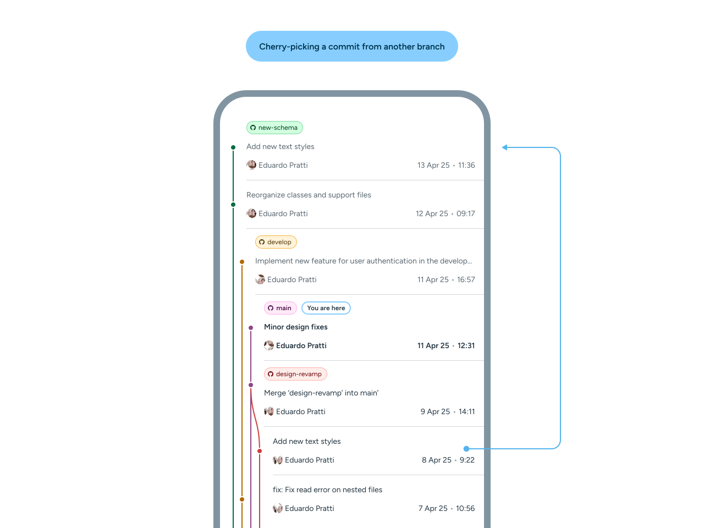
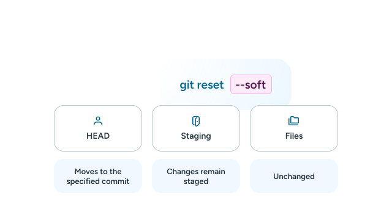
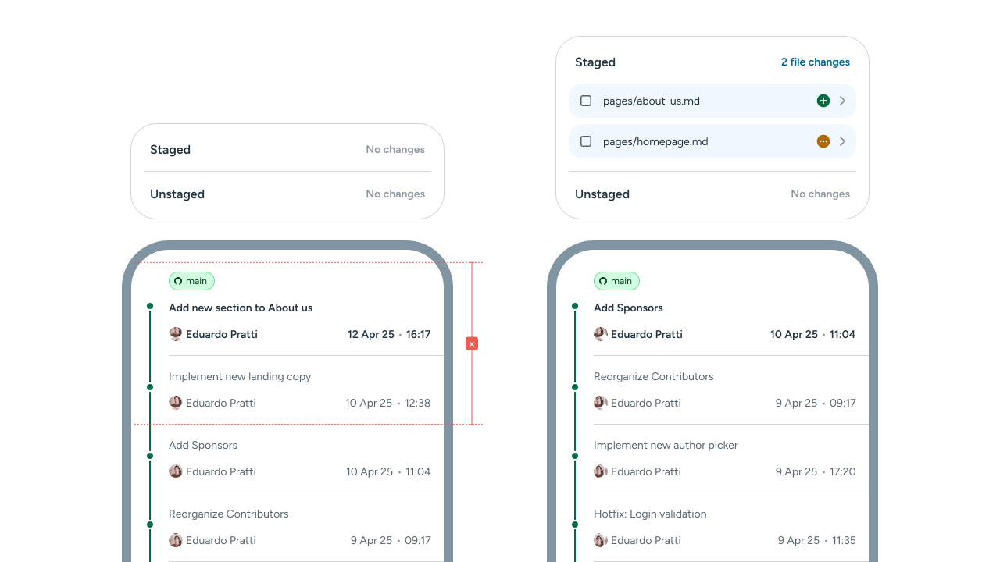
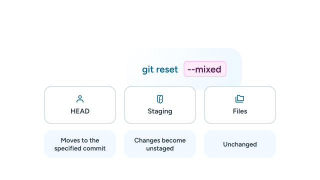
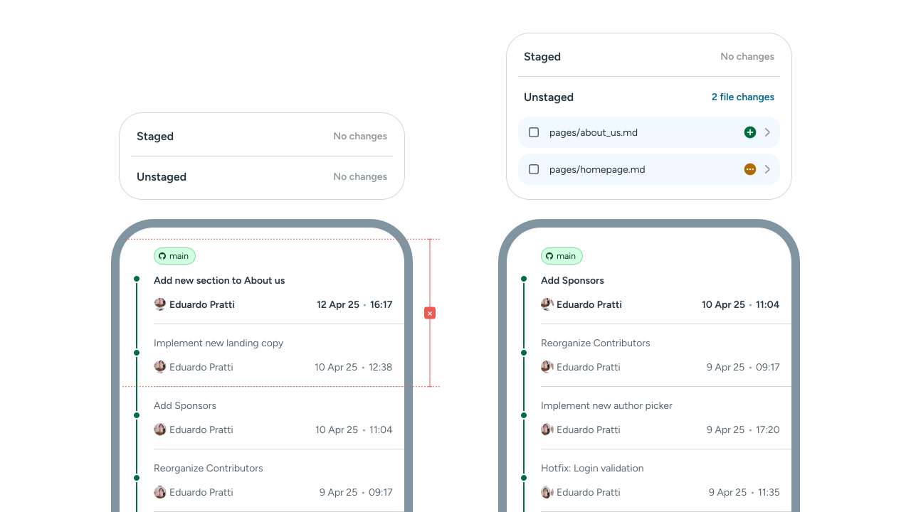
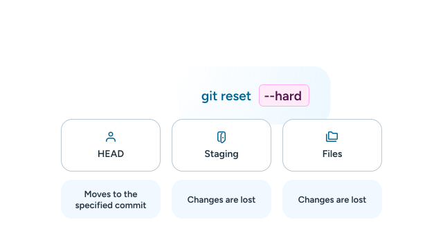
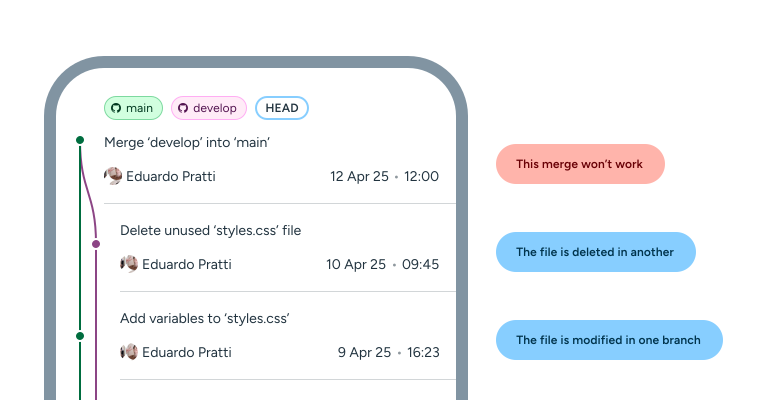
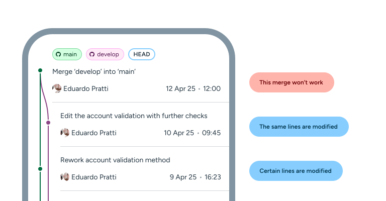
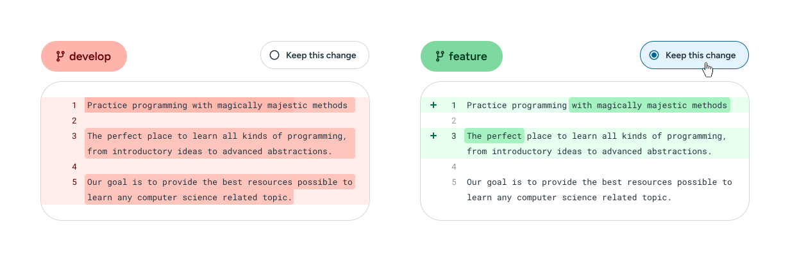

---
{
	title: "Git: Into the Weeds",
	description: "In our second chapter, we expand on the topics we've discussed and talk about the bothersome and tricky portions of Git!",
	published: "2025-05-28",
	tags: ["git"],
	license: "cc-by-nc-sa-4",
	order: 2
}
---

**If you haven't already, please catch up on our previous post!**

We will only summarize when needed for clarification. If you're not familiar with the basics of Git, this article is not for you!

We'll start with one simple operation we haven't seen before: ***Cherry-picking***.

# Cherry-picking

As the name implies, cherry-picking allows you to select a specific commit from a branch, copy it, and then apply it to another.

This is useful if you need a certain change or fix to be applied right away, without having to merge incomplete commits or in-progress feature pushes.

We can perform a cherry-pick with the following command:

```bash
git cherry-pick [hash of the target commit]
```

This command will select the specific commit that matches the hash provided and apply it to the branch that is currently checked out. 

**This will create *another* commit with the same changes as the original — it does not move the commit from its position in history, it only copy pastes its changes under a new hash.**



> **Caution:** 
> Make sure to always be checked out to the correct branch when performing this commit, to avoid applying a commit to the wrong branch.

---

# Git Revert

Git revert is a very self-explanatory process. It simply creates a commit that undoes another. This keeps the branch history intact, as it only adds a revert commit.

The syntax for `git revert` is very similar to the cherry-picking one!

```bash
git revert [hash of the target commit]
```


In this example, the previous commit from the `develop` branch is undone with the latest commit, shown by the `HEAD` position.

---

# Git Reset

Git reset undoes local changes made to a repository. However, Git offers multiple ways of approaching this, depending on your use-case.

To use a Git reset, we use the following command structure:

```bash
git reset [mode] [commit-hash]
```

The `commit-hash` is self-explanatory, as every commit contains its own identifiable hash. The `HEAD` of the repository will be moved to the specified commit, regardless of `[mode]`. 

The `[mode]`, however, refers to the different types of resets a user can perform on their repository. Let's look at them now.

## Soft



A soft reset maintains all changes but undoes a commit. This means that the working directory remains unchanged, but all changes are staged, and ready to be committed again.

> **Within the context of a Git GUI, a soft Git reset would look like this::**



## Mixed (Default)



A mixed reset undoes a commit and also unstages changes, but maintains edits in the working directory. This means you can select which changes you'd like to stage again.

> **Within the context of a Git GUI, a soft Git reset would look like this::**



## Hard



A hard reset, as the name implies, completely nullifies all changes and removes any trace of them from the repository. ***This cannot be undone, so it's incredibly important to be careful about when to use this command.***

> **Within the context of a Git GUI, it would be like going back in time, with none of the changes or files that were created.:**

---

# Git conflicts

There are situations where a partiular change may cause conflicts. This can be triggered in different situations such as:

### Modifying a file that was moved or deleted.



> **This is classified as a `modify/delete` conflict.:**
> To resolve it, you must choose to either re-add the file or confirm its deletion.

### Two branches containing different contents for the same line.



> **This is classified as a `content` conflict.:**
> Git will insert conflict markers ***inside the file*** as opposed to simply showing a conflict.
> ```bash
> <<<<<<< HEAD
> Changes from the current branch
> =======
> Changes from the other branch
> >>>>>>> branch-name
> ```
> The user will then need to manually pick and edit which changes to keep and which to discard.


**There are also other types of conflicts, like the following:**

| Output | Explanation |
| --- | --- |
| `(add/add)` | Different files are added under the same filename in different branches. To resolve this, simply rename one of the files manually and attempt to merge again. |
| `(rename/rename)` | Same file with two different filenames in different branches. To resolve this, rename one of the files manually and attempt to merge again. |
| `(rename/modify)` | The same file is renamed in one branch and modified in another under its old filename. Git will provide two files; the original and a `renamed` file. Either apply the changes to the `renamed` file or delete the original and attempt to merge again. |

### On a Git GUI

On a Git client, this is much simpler. Git GUIs will allow you to select which modification to pick as the resolution for the conflict.



In most Git clients you'll get a side-by-side view and the option to pick which of the versions of the file or files you want to keep. This makes managing conflicts much easier for the user.

---

# Submodules

Submodules are repositories within repositories. They allow you to use existing libraries and dependencies within your projects and can be updated independently.

## How to add a submodule

We can add a submodule with the following syntax:

```bash
git submodule add [repository-url] [path]
```

Now let's try with an example, like a design library:

```bash
git submodule add https://github.com/mui/material-ui.git libs/material-ui
git commit -m "Add MaterialUI as a submodule"
```

> **The repository is then cloned in the specified path.:**

<!-- ::start:filetree -->
- `docs/`
- `libs/`
  - **`material-ui/`**
- `src/`
- `tests/`
- `README.md`
<!-- ::end:filetree -->

Submodule versions are tied to specific commits, and thus are not updated whenever the source repository is. When adding submodules, Git will default to the latest commit of the default branch — usually `master` or `main`.

This allows for greater control and the ability to decide when to update them in order not to break your project.

## Cloning with modules

When you clone a repository that contains submodules, the submodules are not cloned by default. You need to initialize and fetch them explicitly.

We can do so with the following command:

```bash
git clone --recurse-submodules [repository-url]
```

> The `--recurse-submodules` flag ensures that the commands work for any submodules and nested submodules found in the repository.


## Fetch submodules from an existing clone

Without the necessary flag, Git won't automatically initiate the submodule configuration files and those dependencies will fail. For that, we must use the following command:

```bash
git submodule update --init
```

> The `--init` is an obligatory flag, which initializes the submodules.
> We can also add the `--recursive` flag, which ensures that any nested submodules are also fetched properly.

## Updating a submodule

There are different ways of updating submodules. Git allows you to either update all submodules or a single one, depending on your use-case, giving you a greater deal of control. Let's look at how we can achieve that.

### Updating all submodules

To update all modules, we can run the essentially the same command, but we do not need to navigate to the submodule path. By performing it in the root repository, we can update all the submodules.

```bash
git submodule update --remote --merge
```

Don't forget to stage these changes!

```bash
git add .
```

### Updating a specific submodule

If we want to update a single module, we must first navigate to the path of the submodule repository. Let's use our initial example for this command:

```bash
cd libs/material-ui
```

We must then pull the changes:

```bash
git pull origin main
```

And then stage them and commit them.

```bash
git add libs/material-ui
git commit -m "Updating MaterialUI"
```

Submodules can create very complex repository structures, so it's important to understand when they are needed. For most situations, developers have moved on to package managers, which are friendlier to manage than submodules. In fact, the example we've shown today — MaterialUI - is actually available as a package!

> **Introduction to NPM:**
> We have a great article on setting up NPM and Yarn. [**You can read it by clicking here**](/posts/how-to-use-npm). 

---

# What to expect next

In our next chapter, or perhaps chapters, we'll approach more advanced topics, like Git `reflog`, `gc`, `fsck` and the `.git` folder.

#### We'll see you then!