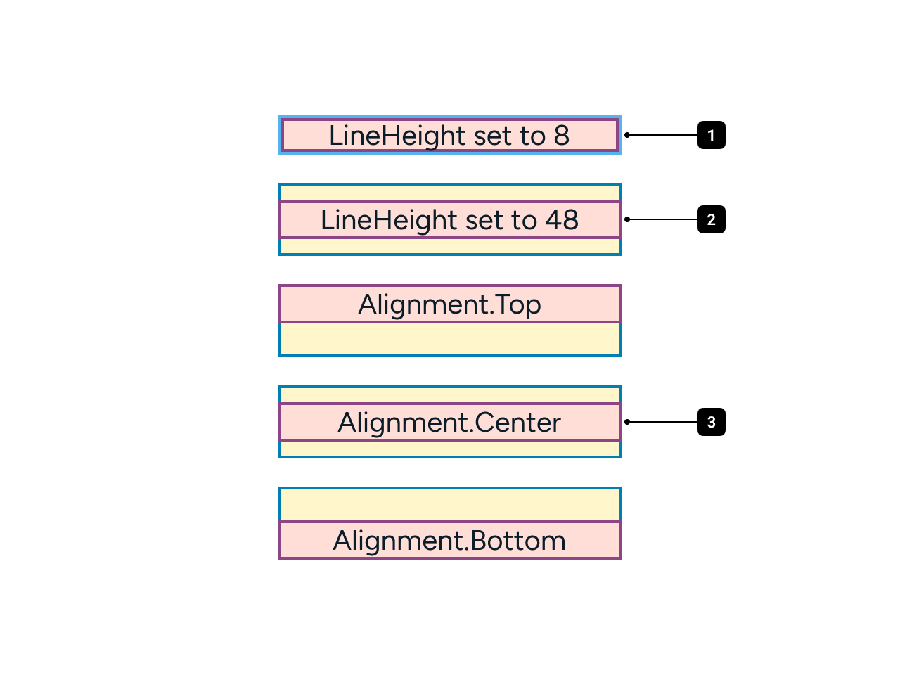
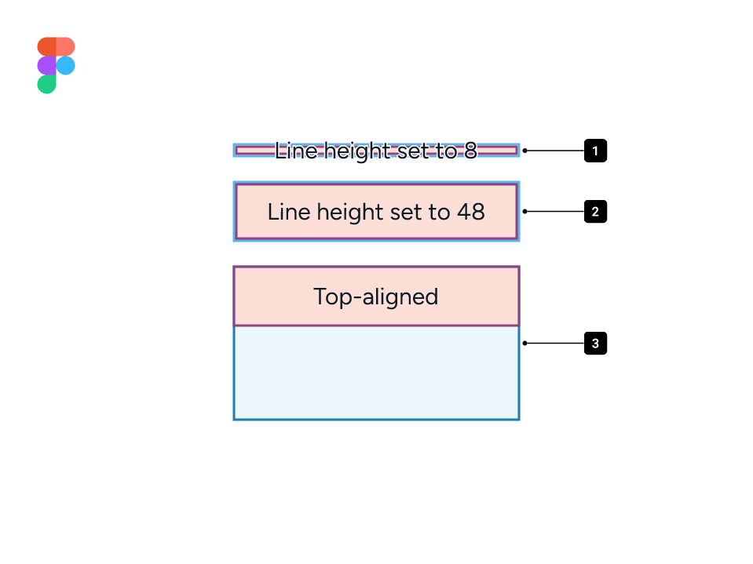
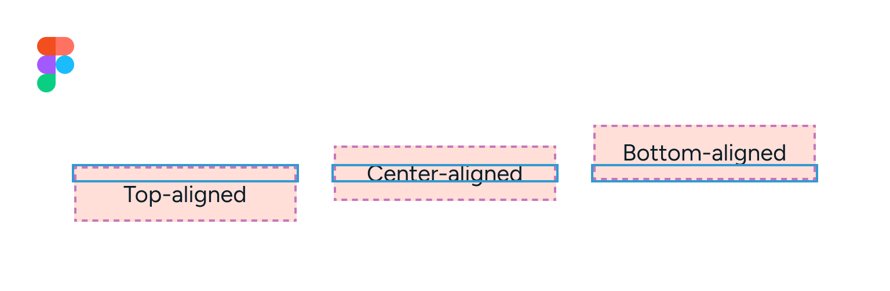
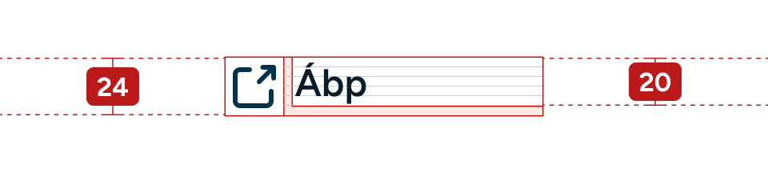
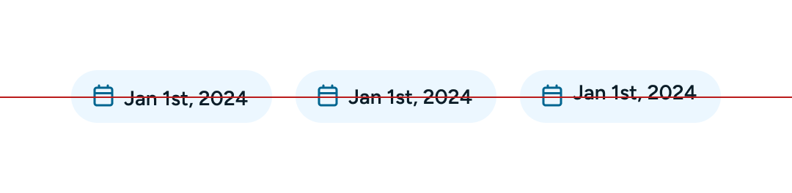
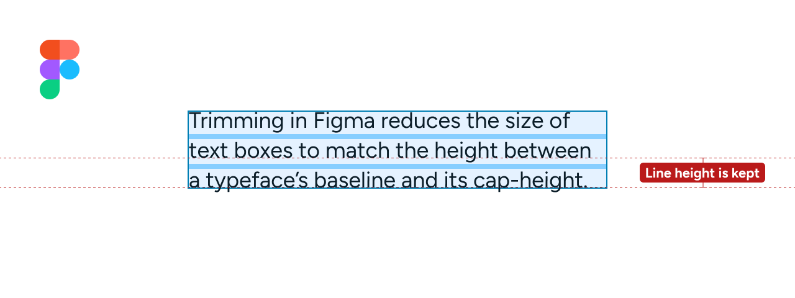
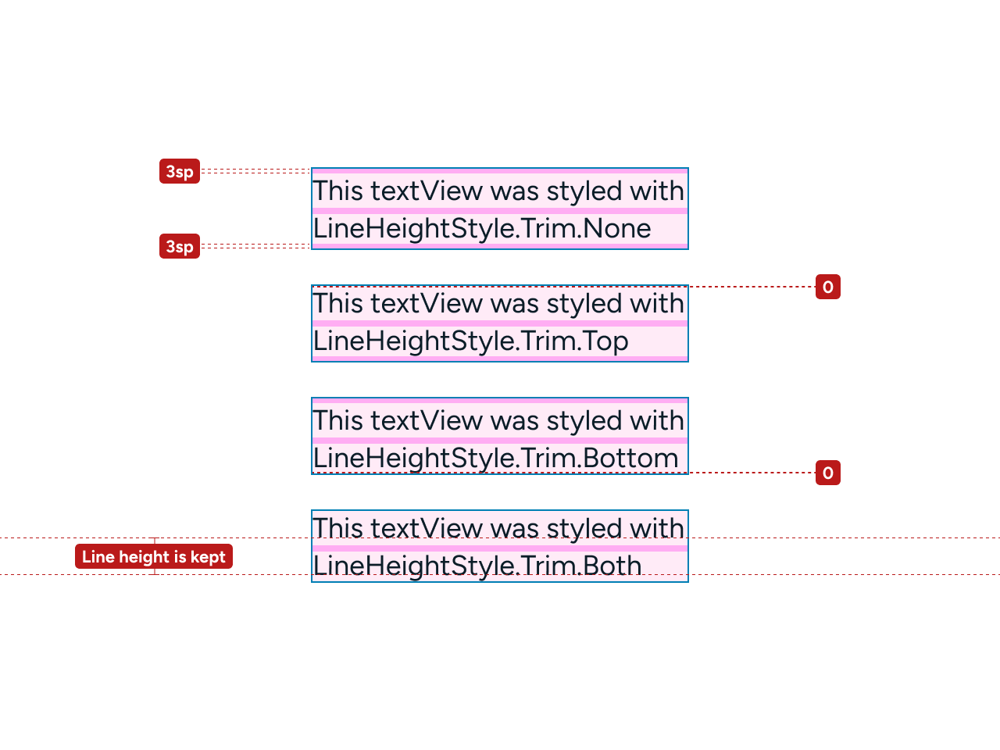

---
{
	title: "Figma to Compose: Line Height & Baseline Grids",
	description: "A detailed guide on how to make text in Jetpack Compose match your mockups, and why baseline grids are not all that they're hyped up to be.",
	published: "2023-11-09T04:45:30.247Z",
	tags: ["android", "design"],
	license: "cc-by-nc-sa-4"
}
---

> **This is an update to an existing article:**
> If you haven't yet, check the original article below.
>
> **[Hard Grids & Baselines: Achieving 1:1 Android Fidelity](/posts/hard-grids-and-baselines-android-design-fidelity)**

For years, the difference between web and native line heights has been a problem for designers. Figma behaves similarly to the web, which ended up being an issue when designing for Android and iOS.

In this article I’ll cover how you can now fix this in Jetpack Compose, and make your Android app `TextViews` match your Figma mockups.

# Preface
For the entirety of this article, I have defined 3 different concepts that will help illustrate the differences between how Figma and Compose draw their text.

- `Text vector bounds:` The minimum height required for the text vector.
- `Line height:` Defines the height of the line. Figma and Compose perform this differently.
- `Text container:` The outer bounds of the text.

---

# How Compose works

We’ll start with Compose, as it contains more features. Compose has a `lineHeight` attribute, and an `alignment` attribute. These function, by default, as follows.

**From this example, we can notice the following:**

1. If the `lineHeight` value is **smaller** than the minimum bounds of the text vector, it is ignored. In the example above, the minimum height for the text is `24sp`.
2. If the `lineHeight` value is **larger** than the minimum bounds of the text, space is added to fill the desired line height.
3. This extra space can be redistributed with the `alignment` attribute. Compose provides `TOP`, `CENTER` and `BOTTOM` alignment options.

---

# How Figma works

Here's how setting a line height to a text box behaves in Figma:

1. The line height in Figma can be smaller than the minimum bounds of the text.
2. **Setting a line height in Figma causes the minimum bounds of the text to change to the desired value.**
3. A manually resized text container in Figma, which lets users change the alignment of the line. Let’s look at it further.

## Alignment in Figma

In Figma, all text boxes are set to `Hug` by default. This means the text container size is determined by the line height, unlike Compose.

**Alignment options have no effect unless the outer container height and the line height differ.** In the example below, we have a text container size that is smaller than the line height.

---

# Baseline grids

I [**previously suggested**](/posts/hard-grids-and-baselines-android-design-fidelity) using `firstBaselineToTopHeight` and `lastBaselineToBottomHeight` to apply baseline grid alignment and build matching Figma components. 

> **I now advise against it.**

Originating in print design, baseline grids were useful to define text spacing for a pleasant vertical rhythm. Designers quickly went on the pursuit of baseline alignment and baseline-relative spacing in UIs.

> In practice, it means a ton of legwork to move, **at best**, 3 pixels. 

But let's say you've done the work, and you've now set up all of your text components and paddings in developer handoffs, and you're good to go. What does that mean for your UI?

## Baseline grid alignment with icons

To illustrate one of the issues with baseline alignment, let's look at an example where a designer would like to place a baseline-aligned `TextView` next to an icon. The icon is set to `24dp` and the text is set to `16sp`, which, when baseline shifted, gives an overall height of `20sp`. In order to center the label with the icon, the text must be top-aligned.

The problem with this is that, whilst the icon is set to `dp`, the `TextView` scales with text size. When scaled, this is the result.

In most cases, developers will account for this by centering the `TextView` within the layout.

This essentially nullifies the baseline alignment that was put in place. Developers ***can*** fix this by setting the icon to scale off the text size.

## Baseline grid alignment in containers

Containers with single-line labels also suffer from visual misalignment when dealing with baselines. Here's a button with all three alignment options; **bottom baseline, line height centering, and top baseline**.

You'll notice that, when dealing with baselines, you may be given situations where it is impossible to maintain alignment while following a baseline grid. These edge cases can be handled individually, but once again, they take significant amount of effort on the part of both designers and developers to fix.

The over-engineering for the sake of `~3px` is simply not worth it. **No platform has baseline grid or baseline spacing APIs**, and everything you interact with on a daily basis has been built without it. Baseline grids in interfaces are a solution looking for a problem.

## Takeaways

Knowing this, here's a summary of what you should keep in mind when deciding whether to use baseline grids.

| Methods  | Cons  | Pros  |
|---|---|---|
| **Baseline grid alignment**  | <li>Requires careful baseline shifting for each text style used.</li><li>In Figma, requires working with text components, whose content is lost when detached, whilst adding layer complexity.</li><li>Does not work well with icons, which are not baseline hinted.</li><li>Limits options due to visual misalignment when working in dense layouts.</li> | <li>Aligns to a 4px grid.</li>  |
| **Line height centering**  | <li>Does not align to a 4px grid.</li> | <li>Easy to match between design and implementation.</li><li>Easily applicable to any text style.</li><li>The ability to use raw text layers instead of components ensures data can be kept.</li><li>Works well with icons and buttons.</li><li>Works well in dense layouts</li>  |

---

# Figma, Compose and trimming

A new behavior is emerging to tackle the baseline alignment needs of designers and it's called **leading trim**! This process is being done in collaboration with Microsoft Design, **[and you can read more about it here](https://medium.com/microsoft-design/leading-trim-the-future-of-digital-typesetting-d082d84b202#:~:text=Leading%2Dtrim%20fixes%20alignment%20issues&text=The%20extra%20space%20reserved%20in%20the%20default%20line%20height%20causes,font%20is%20also%20designed%20differently.)**.

Figma and Compose both have a trimming feature for text, but they are very different.

## Figma's "leading trim"

Figma's `leading trim` option will reduce the outer bounds of the text layer to align with the font's **baseline** and **cap height**. This essentially means designers can leverage this to get precise spacing from a text box's baseline and the start of another. This feature does not affect the line height.

## Compose's `LineHeightStyle.Trim`

Compose's functions differently. As [**we've established earlier**](#How-Compose-works), Compose will not allow a line height to be smaller than the minimum bounds required for the text vector.

### Recap

| Trim feature | Behavior |
|---|---|
| Compose's `LineHeightStyle.Trim` | Will reduce a `TextView` to the minimum required size for the text vectors to fit in. |
| Figma's `Leading trim` | Will force a text box's height to be from the text's baseline to its cap-height, with letters and symbols commonly going outside its boundaries. |

## Should I use it?

The clear answer, at the moment, is a hard "**No.**" This is because not only is the trimming feature inconsistent between Figma and Compose, but the [**web version is still being drafted**](https://www.w3.org/TR/css-inline-3/#propdef-leading-trim), while an iOS trimming feature seems unlikely to happen anytime soon.

---

# Conclusion: How to match Figma in Compose

After learning all about alignment and baselines, let's get down to the easy part — matching your mockups!

Thanks to the Compose APIs shown in this article, translating Figma text styles is by far the easiest part. Here's a quick table

**In order to match Figma in Compose, developers can default to the following values.***

*We're using `16` as a reference point for this example.

| Platform  | Text size | Line height (Fixed) | Line height (Relative) |   Alignment  |
|---|---|---|---|---|
| **Figma**  | `16px` | `24px` | 150% | *Not applicable*  |
| **Jetpack Compose**  | `16sp` | `24sp` | `1.5em` | `Alignment.CENTER`  |

And that is it! Super simple and easy. 🎉

> **Want to get in touch?:**
> If you've got any feedback or questions you'd like to ask, **[feel free to message me on Twitter!](https://twitter.com/edpratti)**
>
