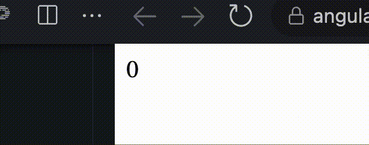
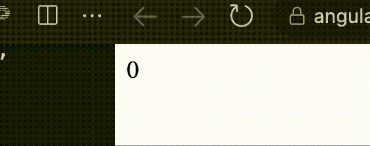

---
{
title: "Async pipe is not pure 🤯",
published: "2023-01-16T15:48:11Z",
edited: "2023-01-16T16:04:34Z",
tags: ["gratitude", "angular"],
description: "Yes, that’s normal! Why? Because of how Angular does change detection under the hood!  To better...",
originalLink: "https://eneajahollari.medium.com/async-pipe-is-not-pure-948f7b24e2d1",
coverImage: "cover-image.png",
socialImage: "social-image.png"
}
---

Yes, that’s normal! Why? Because of how Angular does change detection under the hood!

*To better understand how the [async pipe](https://github.com/angular/angular/blob/main/packages/common/src/pipes/async_pipe.ts) works, let’s create our own from scratch!*

Let’s call it **SubscribePipe** in order for to differ it from the [original one](https://github.com/angular/angular/blob/main/packages/common/src/pipes/async_pipe.ts).

Also, we want our pipe to check this points:

- Work with Observables (we won’t handle Promises in this post)
- No over-subscribing
- Work with OnPush change detection
- No memory leaks

And use it like this, ex:

```ts
@Component({
  selector: 'my-app',
  template: `
    <div *ngIf="show">
      Value: {{ obs$ | subscribe }}
    </div>
  `,
  standalone: true,
  imports: [CommonModule, SubscribePipe],
  // changeDetection: ChangeDetectionStrategy.OnPush // <-- after we handle it we should uncomment this
})
export class AppComponent {
  show = true;

  obs$ = interval(500).pipe(
    tap((x) => {
      if (x === 10) {
        this.show = false;
      }
    })
  );
}
```

## Create a pipe (standalone)

```ts
import { Pipe, PipeTransform } from '@angular/core';

@Pipe({
  name: 'subscribe',
  standalone: true
})
export class SubscribePipe implements PipeTransform {
  transform() {}
}
```

We want our pipe to accept an Observable type, that means we need to handle **Observables**, **Subjects**, **BehaviorSubjects** and **ReplaySubjects**.

Let’s create a **Subscribable** type that includes all of them (that will be a generic type).

```ts
type Subscribable<T> = Observable<T> | Subject<T> | BehaviorSubject<T> | ReplaySubject<T>;
```

Now that we know what our pipe accepts, let’s refactor the pipe to use it! Because we want to infer the type of the subscribable we will convert the pipe class to be generic.

Also, one other thing, we can also pass undefined or null to our pipe.

```ts
export class SubscribePipe<T> implements PipeTransform {
  transform(obs: Subscribable<T> | null | undefined) {}
}
```

## Subscription handling

First we need to check if the observable is not null or undefined, and if it is we just return null;

```ts
transform(obs: Subscribable<T> | null): T | null {
  if (!obs) {
    return null;
  }
}
```

Now, let’s subscribe to the observable and store it’s last value and return it directly.

```ts
latestValue: T | null = null;

transform(obs: Subscribable<T> | null): T | null {
  if (!obs) {
    return null;
  }

  obs.subscribe(value => {
    this.latestValue = value;
  });

  return this.latestValue;
}
```

This won’t work! Why?

Because when change detection runs, the pipe will check the parameters in the transform method and if they haven’t changed, it will return the last value that it had cached before.

*I’ve explained it more deeply in my previous post: [It’s ok to use function calls in Angular templates!](https://dev.to/this-is-angular/its-ok-to-use-function-calls-in-angular-templates-4029) , where I explain how pipes memoization works and how we can do the same thing too when using normal functions.*

This is the moment where we **opt-out** of pipe memoization by using the **pure: false** flag.

```ts
@Pipe({
  name: 'subscribe',
  standalone: true,
  pure: false // <-- It is true by default
})
```

The moment we set the **pure** option to be **false**, we tell Angular that we want to handle the transform method memoization by ourself.

If we run the code we will see something like this:



The reason why it does that is because every time change detection runs, the pipe will subscribe to our observable and let the other subscription in memory, and of course **create a memory leak**!

How can we fix that? By doing a simple equality check!

We will save the current observable reference, and every time the transform method is called, we will check if it’s equal with our current one, and if that’s true, we will just return that latest value.

```ts
private currentObs: Subscribable<T> | null = null;

transform(obs: Subscribable<T> | null): T | null {
  if (!obs) {
    return null;
  }

  if (obs === this.currentObs) { // <-- simple equality check
    return this.latestValue;
  } else {
    this.currentObs = obs; // <-- save current observable to a class field

    obs.subscribe((value) => {
      this.latestValue = value;
    });
  }

  return this.latestValue;
}
```

If we check the app now, we will see that it works fine! But it’s not finished!



Because we still cause a memory leak, because we never unsubscribe from the observable! Let’s do it!

## Unsubscription handling

Just like we stored the **latestValue** and **currentObs**, we will also store the current subscription and assign the observable subscription to it!

```ts
private sub: Subscription | null = null;

transform(obs: Subscribable<T> | null): T | null {
  ...
  this.sub = obs.subscribe((value) => {
    this.latestValue = value;
  });
  ...
}
```

Good! Now we need to unsubscribe on **ngOnDestroy**, but not only there 💡. How so? Because we need to unsubscribe also on cases where we **change the observable reference** to be another observable or **set it to null**.

For example:

```ts
@Component({
  selector: 'my-app',
  template: `
    <div *ngIf="show">{{ obs$ | subscribe }}</div>
  `,
  standalone: true,
  imports: [CommonModule, SubscribePipe],
})
export class AppComponent {
  show = true;

  ngOnInit() {
    setTimeout(() => {
      this.obs$ = of(20000);
    }, 2000);

    setTimeout(() => {
      this.obs$ = null;
    }, 4000);
  }

  obs$ = interval(500).pipe(
    tap((x) => {
      if (x === 10) {
        this.show = false;
      }
    })
  );
}
```

So, we need to dispose the subscription also on these cases! Otherwise, we cause a memory leak!

Let’s create a **dispose()** method that has the unsubscription logic in order to re-use it!

```ts
private dispose() {
  if (this.sub) { // <-- first we check if we have a subscription
    this.sub.unsubscribe(); // <-- unsubscribe from the observable
    this.sub = null; // <-- remove the subscription reference
  }
}
```

Now, let’s use this method!

First, on **ngOnDestroy()** and then in the other cases mentioned above!

```ts
ngOnDestroy() {
  this.dispose();
}
```

```ts
transform(obs: Subscribable<T> | null): T | null {
  if (!obs) {
    this.dispose(); // <-- if we have a current sub and change the obs to be null we need to dispose it
    return null;
  }

  if (obs === this.currentObs) {
    return this.latestValue;
  } else {
    this.dispose(); // <-- before subscribing to a new observable, we need to dispose the existing one

    this.currentObs = obs;

    this.sub = obs.subscribe((value) => {
      this.latestValue = value;
    });
  }

  return this.latestValue;
}
```

If we see the app, it will still work without any issue! And now without memory leaks 🎉 yay!

*Are we done?* Not yet, because our pipe doesn’t work with **OnPush ChangeDetection**!

On, your editor, try to enable the changeDetection OnPush on your component and see the app! It won’t show anything!

But, how can we fix it? Just like any other time when we try to fix change detection issues 😈😄, put a **cdr.markForCheck()** after you update the value and we’re done!

```ts
private cdr = inject(ChangeDetectorRef); // <-- inject CDRef here

transform(obs: Subscribable<T> | null): T | null {
  ...
  this.sub = obs.subscribe((value) => {
    this.latestValue = value;
    this.cdr.markForCheck(); // <-- mark the component as dirty here, after we have updated the latestValue
  });
  ...
}
```

That’s it!

## Code refactoring

Let’s move the subscription handling in a method (and also throw when we get an error), set **cdr**, **currentObs** to null in **ngOnDestroy** (to remove it’s reference and not cause any memory leak) and change the way code is handled in the transform method for better readability.

```ts
private subscribe(obs: Subscribable<T>) {
  this.currentObs = obs;

  this.sub = obs.subscribe({
    next: (res) => {
      this.latestValue = res;
      this.cdr.markForCheck();
    },
    error: (error) => {
      throw error;
    },
  });
}
```

```ts
transform(obs: Subscribable<T> | null): T | null {
  if (!obs) {
    this.dispose();
    return null;
  }

  // here we check if the obs are not the same instead of checking if they are the same
  if (obs !== this.currentObs) {
    this.dispose();
    this.subscribe(obs); // <-- use the method we extracted above
  }

  return this.latestValue;
}
```

```ts
ngOnDestroy() {
  this.dispose();
  this.cdr = null;
  this.currentObs = null;
}
```

## Recap

Find the whole source code [here](https://stackblitz.com/edit/angular-ivy-prasrm?file=src%2Fapp%2Fapp.component.ts).

We have handled almost all the cases that Angular’s async pipe handles except the promises (but also that can be done easily)! And understood why Angular **async pipe is not pure**, and why that is not an issue at all!

I hope you liked this post and learned something from it!

\--

I tweet a lot about Angular (**latest news**, **videos**, **podcasts**, **updates**, **RFCs**, **pull requests** and so much more). If you’re interested about it, give me a follow at [@Enea\_Jahollari](https://twitter.com/Enea_Jahollari). Give me a follow on [Dev.to](https://dev.to/eneajaho) if you liked this article and want to see more like this!

**Thank you for reading!**
