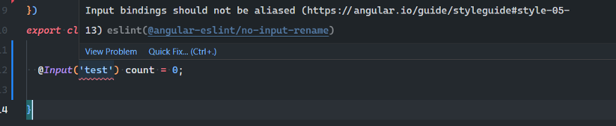
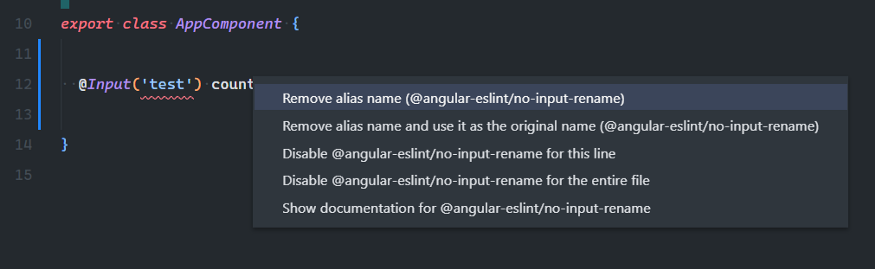
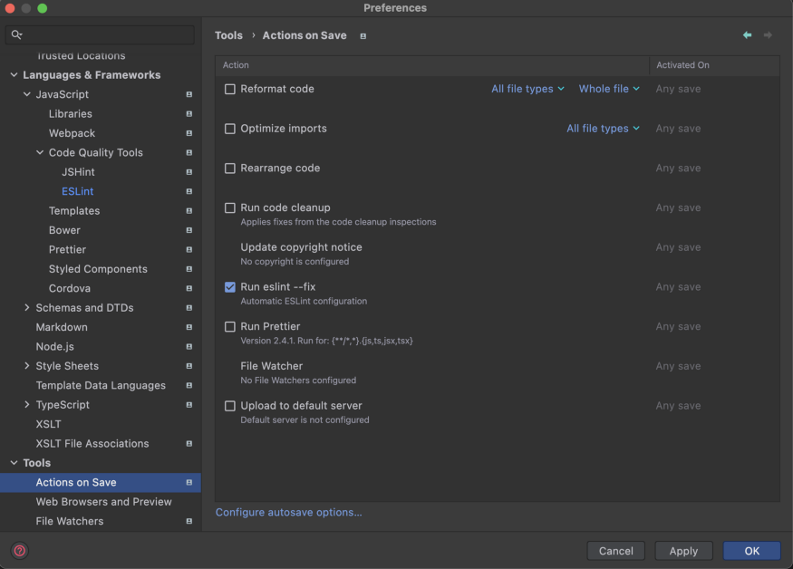

---
{
title: "Configure Prettier and ESLint with Angular",
published: "2022-02-19T19:48:34Z",
edited: "2022-11-10T11:17:08Z",
tags: ["angular", "typescript", "eslint", "prettier"],
description: "Everyone wants to write code in a fast bug-free way without thinking about its style most of the...",
originalLink: "https://itnext.io/configure-prettier-and-eslint-with-angular-e7b4ce979cd8",
coverImg: "cover-image.png",
socialImg: "social-image.png"
}
---

Everyone wants to write code in a fast bug-free way without thinking about its style most of the time. That’s why in this post I will talk about configuring [ESLint ](https://eslint.org/) and [Prettier ](https://prettier.io/) in an [Angular ](https://angular.io/) project.

## How does ESLint help?

By statically analyzing our code, ESLint can find problems and also suggest us fixes for them. And it can do better than that, it can fix our code automatically (who doesn’t want that?).

## Install and configure ESLint

In this section, I will explain how to install ESLint in an Angular project and also configure it to better align with the Angular style guide and community standards.

Open the terminal and install ESLint schematics using this command:

`ng add @angular-eslint/schematics`

*That was it.* Now we have ESLint installed and also configured thanks to `**ng add**` command provided by the [Angular-ESLint](https://github.com/angular-eslint/angular-eslint) team.
Example error and how ESLint helps to fix it:





We can also run this command in terminal:
`ng lint --fix`
to fix all the fixable bugs in the project.

## Install and configure Prettier

Even if we have ESLint watching our code for bugs, we also need a tool to better style and format it. That’s where Prettier comes into play.

Prettier is an **opinionated** code formatter that helps us beautify code in a standardized way every time we save the code.

Open terminal and type:
`npm install prettier --save-dev`
or if you’re using yarn :
`yarn add prettier -D`

Then we need to add **.prettierrc.json** and **.prettierignore** files in our root project directory.

Inside **.prettierignore** it’s better to add whatever we have inside **.gitignore** file.

Then we can run this command inside our project to format it:
`npx prettier --write .`

Inside **.prettierrc.json** we can change the default settings by overriding them.

The settings I use most of the time are this:

```json
{
  "tabWidth": 2,
  "useTabs": false,
  "singleQuote": true,
  "semi": true,
  "bracketSpacing": true,
  "arrowParens": "avoid",
  "trailingComma": "es5",
  "bracketSameLine": true,
  "printWidth": 80
}
```

That’s it about Prettier. But we are not finished.

> There are times where ESLint and Prettier have different opinions about code formatting and style. That’s why we need to tweak this part. [More info here](https://prettier.io/docs/en/integrating-with-linters.html).

## Configure Prettier to be used as an ESLint plugin

For ESLint and Prettier to play well together, we need to run Prettier as an ESLint plugin. This way we can just call `ng lint --fix` and ESLint will fix bugs but also format the code.

Open terminal and type:

```bash
npm install prettier-eslint eslint-config-prettier eslint-plugin-prettier — save-dev
```

or if you're using yarn:

```bash
yarn add prettier-eslint eslint-config-prettier eslint-plugin-prettier -D
```

Now we need to edit the **.eslintrc.json** file to include the prettier plugin.

```json
{
  "root": true,
  "overrides": [
    {
      "files": ["*.ts"],
      "extends": [
        ...
        "plugin:prettier/recommended"
      ],
    },
    // NOTE: WE ARE NOT APPLYING PRETTIER IN THIS OVERRIDE, ONLY @ANGULAR-ESLINT/TEMPLATE
    {
      "files": ["*.html"],
      "extends": ["plugin:@angular-eslint/template/recommended"],
      "rules": {}
    },
    // NOTE: WE ARE NOT APPLYING @ANGULAR-ESLINT/TEMPLATE IN THIS OVERRIDE, ONLY PRETTIER
    {
      "files": ["*.html"],
      "excludedFiles": ["*inline-template-*.component.html"],
      "extends": ["plugin:prettier/recommended"],
      "rules": {
        // NOTE: WE ARE OVERRIDING THE DEFAULT CONFIG TO ALWAYS SET THE PARSER TO ANGULAR (SEE BELOW)
        "prettier/prettier": ["error", { "parser": "angular" }]
      }
    }
  ]
}
```

## VSCode and Webstorm shortucts

That was it. We’re done with the configuration part.

After we edit a file, we want to format it and then save. That’s what we will configure now for both [VS Code](https://code.visualstudio.com/) and [Webstorm](https://www.jetbrains.com/webstorm/).

> First make sure you have ESLint and Prettier plugin installed. WebStorm has support of of the box for both.

For VS Code we need to add this lines to **settings.json**:

```json
{
  "[html]": {
    "editor.defaultFormatter": "esbenp.prettier-vscode",
    "editor.codeActionsOnSave": {
      "source.fixAll.eslint": true
    },
    "editor.formatOnSave": false
  },
  "[typescript]": {
    "editor.defaultFormatter": "dbaeumer.vscode-eslint",
    "editor.codeActionsOnSave": {
      "source.fixAll.eslint": true
    },
    "editor.formatOnSave": false
  },
}
```

For Webstorm:
We need to check: **Run eslint --fix** on **Actions On Save** settings page:


> Here you can find the steps summed up: [Angular ESLint & Prettier Configuration](https://gist.github.com/eneajaho/17bbcf71c44eabf56d404b028572b97b)

## How to automate all these configurations?

As you saw, there are a lot of packages that you should install and configure. And I can tell you confidently that there is a way to manage all these automatically. [NX](https://nx.dev) is the answer.

**What is NX?**
NX is the next generation **build system** with **first-class monorepo support** and powerful integrations.
If we *migrate our Angular app* to an Nx monorepo (there is a [straightforward migration path](https://nx.dev/migration/migration-angular)) we get all those configurations for free out-of-the-box.
But what makes NX special are some crazy features like **computation caching**, **smart rebuilds**, **distributed task execution**, **remote build caching**, **powerful code generators**, **editor plugins**, etc.

\*\*That was it. Thank you for reading! See you on the next one.
\*\*
