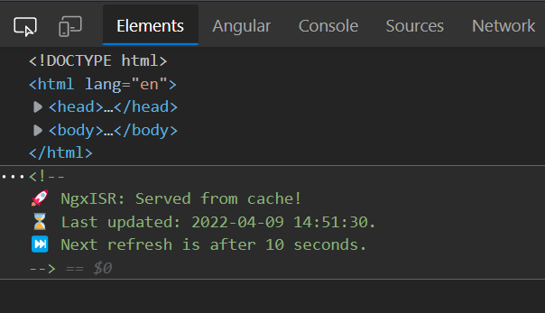

---
{
title: "Incremental Static Regeneration for Angular",
published: "2022-04-09T17:26:21Z",
edited: "2022-11-10T11:34:59Z",
tags: ["angular", "ssr", "ssg", "nextjs"],
description: "If you are reading this, you've probably heard of SSR (Server-side rendering), SSG (Static site...",
originalLink: "https://dev.to/eneajaho/incremental-static-regeneration-for-angular-34co",
coverImage: "cover-image.png",
socialImage: "social-image.png"
}
---

If you are reading this, you've probably heard of **SSR** (Server-side rendering), **SSG** (Static site generation) and **CSR** (Client-side rendering).

A brief overview of them:

- **SSR**: With server-side rendering, every time a page is requested it will be server-rendered (probably make api calls), and then it will be served to the client.

- **SSG**: With static site generation, the rendering of the pages will be done at build time, and when the page is requested the client will be served the generated static file for that route.

- **CSR**: With client-side rendering, the rendering of the page (and the api calls needed for that page) will happen on runtime (on clients device).

## What’s ISR and what problem does it solve?

Let’s take an e-commerce site as an example. This e-commerce site has thousands of clients and thousands of products, and for each product there is a details page.

Because it’s an e-commerce site, it should be server-side rendered (probably using Angular Universal) in order for crawlers to read its content that is needed for SEO.

Now, every time a direct request to that product details page is made, the server will have to make an api call to get the data from the backend, then will render the HTML, and then will serve the page to the client.

This process happens every time a client opens that page.
Now imagine thousands of users opening that product page at the same time. Probably the server will get blown out, and we would need to increase the server resources (also the backend server resources too).

The server will need to do the same work for all the clients, in order to serve them the same page.

## How has SSG helped so far?

With static site generation, we were generating each product details page at build time, doing the fetching data part only once, and serving static files to the users.

And let’s say that this helped a lot with the server resources on runtime because we would only serve static files and that’s all.

This was fine until we needed to change product’s details, and do all the work from the beginning. Build the site, generate all the pages, and deploy again. All this is just to change a product’s price. Imagine changing 100 product prices every 1 hour. How many times would we need to do the building, generating and deploying?

## This is where ISR comes into play!

ISR combines the ideology of SSR and SSG into one.

With ISR, we render the page on the server the first time it is requested, save it in the cache and serve that cached page to all the other users that request that page.

For cache refreshing, we use time intervals or in-demand regeneration.

> ISR is like SSG, but at runtime!

## All good? Let’s do this in Angular!

To get started, first we need an application to have Angular Universal installed and configured.

Then, we install the [ngx-isr](https://www.npmjs.com/package/ngx-isr) package, a library created by me 😁.

**ngx-isr** helps you to manage all the ISR stuff with an easy-to-use and extendable API (inspired by Next.js).

`npm install ngx-isr`

After we install it, we need to do some small configurations.

- Create an ISRHandler instance inside server.ts .

```ts
import { ISRHandler } from 'ngx-isr';

const isr = new ISRHandler({
  indexHtml, // <-- Is the path to the index.html
  invalidateSecretToken: 'MY_TOKEN', // replace with env secret key
  enableLogging: !environment.production
});
```

- Replace Angular default server-side rendering with ISR rendering.

Replace this:

```ts
server.get('*',
  (req, res) => {
    res.render(indexHtml, { req, providers: [{ provide: APP_BASE_HREF, useValue: req.baseUrl }] });
  }
);
```

with this piece of code :

```ts
server.get('*',
  // Serve page if it exists in cache
  async (req, res, next) => await isr.serveFromCache(req, res, next),
  // Server side render the page and add to cache if needed
  async (req, res, next) => await isr.render(req, res, next),
);
```

> Note: ISRHandler provides APP\_BASE\_HREF by default. And if you want to pass providers into the methods of ISRHandler, you will also have to provide the APP\_BASE\_HREF token.

- Add the invalidation URL handler

```ts
server.get(
  "/api/invalidate", 
  async (req, res) => await isr.invalidate(req, res)
);
```

- Add NgxIsrModule in AppServerModule imports

```ts
import { NgxIsrModule } from 'ngx-isr'; // <-- Import module

@NgModule({
  imports: [
    ...
    NgxIsrModule  // <-- Use it in module imports
  ]
})
export class AppServerModule {}
```

> When importing the module, NgxIsrService will be initialized and will start to listen to route changes, only on the server-side, so the browser bundle won't contain any extra code.

**That was it!**

## How to use it?

Add the `revalidate` key in route data and that’s it.

```ts
{
  path: "example",
  component: ExampleComponent,
  data: { revalidate: 5 }
}
```

> NOTE: Routes that don’t have the revalidate key in data won’t be handled by ISR. They will fall back to Angular default server-side rendering pipeline.

To regenerate a page we need to make a get request to /revalidate. Like this:

```
GET /api/invalidate?secret=MY_TOKEN&urlToInvalidate=/example
```

## How it works?

By using the `revalidate` key in route data we define the time interval
that the ISR Handler will use in order to know when to regenerate a specific route.

Options:

- **Don’t specify anything**: The route won’t be cached and will always be server-rendered. (Like SSR)
- **0**: First serve will be server-rendered and all the other ones will be served from cache. (Like SSG).
- **More than 0** (ex: 5): First serve will be server-rendered and the cache will be regenerated every 5 seconds (after the last request).

**Advanced example**

```ts
const routes: Routes = [
  {
    path: "one",
    component: PageOneComponent,
  },
  {
    path: "two",
    component: PageTwoComponent,
    data: { revalidate: 5 },
  },
  {
    path: "three",
    component: PageThreeComponent,
    data: { revalidate: 0 },
  }
];
```

- Path `one`: It won’t be cached and will always be server-rendered before being served to the user.

- Path `two`: The first request will be server-rendered and then will be cached. On the second request, it will be served from the cache that was saved on the first request. The URL will be added to a regeneration queue, in order to re-generate the cache after `5` seconds. On the third request, if the regeneration was finished successfully the user will be served the regenerated page, otherwise, they will be served with the old cached page.

- Path `three`: The first request will be server-rendered and then will be cached. After the first request, all the other ones will be served from the cache. So, the cache will never be refreshed automatically. The only way to refresh the cache is to make a request to /invalidate API route.

## Results

Serve the page: `npm run dev:ssr`.

Open Inspect Element.

And check the `Last updated` time and date change based on the revalidate key that you provided.



**ISR issues?**
Every time we change the source code, we have to do the build and deploy again. ISR helps only when data from the backend changes (and that’s okay).

**That was it! Thanks for reading this long post!**

If you liked it please leave a thumbs up and give a ⭐ to the [Github repository](https://github.com/eneajaho/ngx-isr).
If the library helps you or your business, you can [buy me a coffee](https://www.buymeacoffee.com/eneajahollari) if you want 😊.
