---
{
title: "Introduction to Angular Language Service",
published: "2022-09-16T16:12:28Z",
edited: "2022-11-10T11:35:12Z",
tags: ["angular", "typescript", "codecompletion", "webdev"],
description: "Working with Angular has its gotchas, but what makes it really a joy to start off, is its language...",
originalLink: "https://medium.com/@eneajahollari/introduction-to-angular-language-service-4d3e67901a77",
coverImage: "cover-image.png",
socialImage: "social-image.png"
}
---

Working with Angular has its gotchas, but what makes it really a joy to start off, is its language service.

## What’s a language service?

A language service is a program that you feed your code and it will report you **completions**, **errors**, **hints** and **diagnostics** on a file per file basis, all while making a distinction between syntactic and semantic errors of each file. And that’s what Angular language service does for Angular projects.

## How does it help us?

Angular code files end with **.ts** or **.html**, so the code editor thinks that we’re writing Typescript and Html code, but that’s not totally true. Because, on top of that we are also writing Angular specific syntax like: **components**, **directives**, **property**/**event** **bindings**, etc. And the code editor doesn’t know anything about them.

That’s what the language service does for us, it understands that you’re inside an Angular project and tells the editor what that Angular specific syntax is.

> VS Code uses [Typescript Language Service](https://github.com/typescript-language-server/typescript-language-server) and [HTML Language Service](https://github.com/microsoft/vscode-html-languageservice) to understand the Typescript and Html files too and because they are so widely used they are bundled with VS Code by default.

If we have just installed VS Code and open an Angular component with inline template here’s what we’ll see:

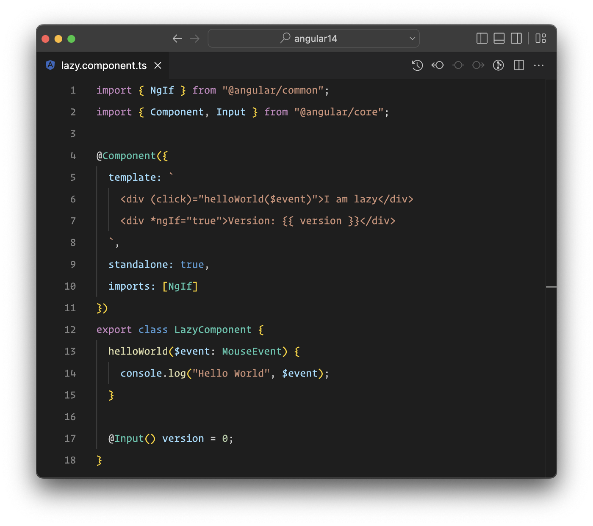

Because the editor thinks that this is a typescript file, it won’t provide code highlight for the template part, and it will be shown just like it was a string, even though the editor has support for HTML (and here we are inside a Typescript file).

So, we won’t get any support for Angular and HTML syntax from it. So, if we hover over the **div** or the **click binding** or the \***ngIf** directive, we won’t get any information.

**The Language Service** tells the editor that we are inside an **Angular** component, and to treat the template field as an Angular template that in fact is HTML with enhanced capabilities (with some gluten over it).

If we install the [Angular Language Service](https://marketplace.visualstudio.com/items?itemName=Angular.ng-template) and open that file again. We will see something better.

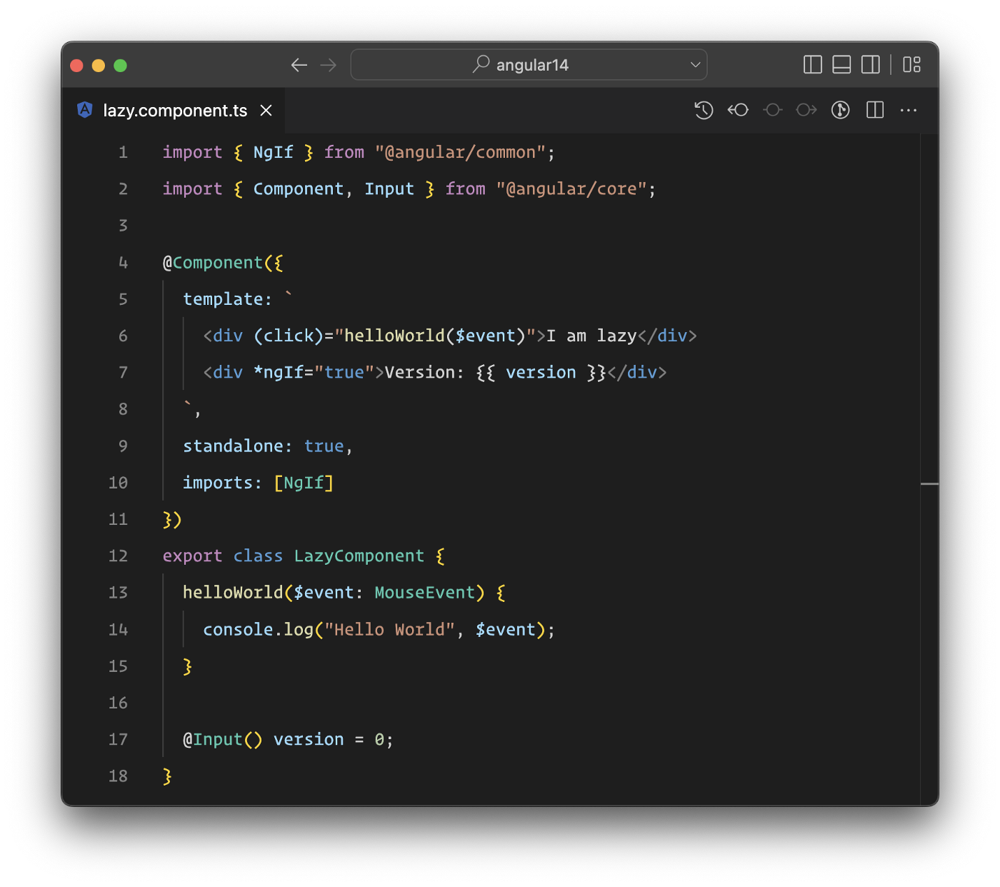

Let’s hover over some of the elements in the template and see what kind of information it provides.

## Event bindings

If we hover over the **click** event we will see that the information is just an **addEventListener** in the **div** element (because that’s what that click binding does).

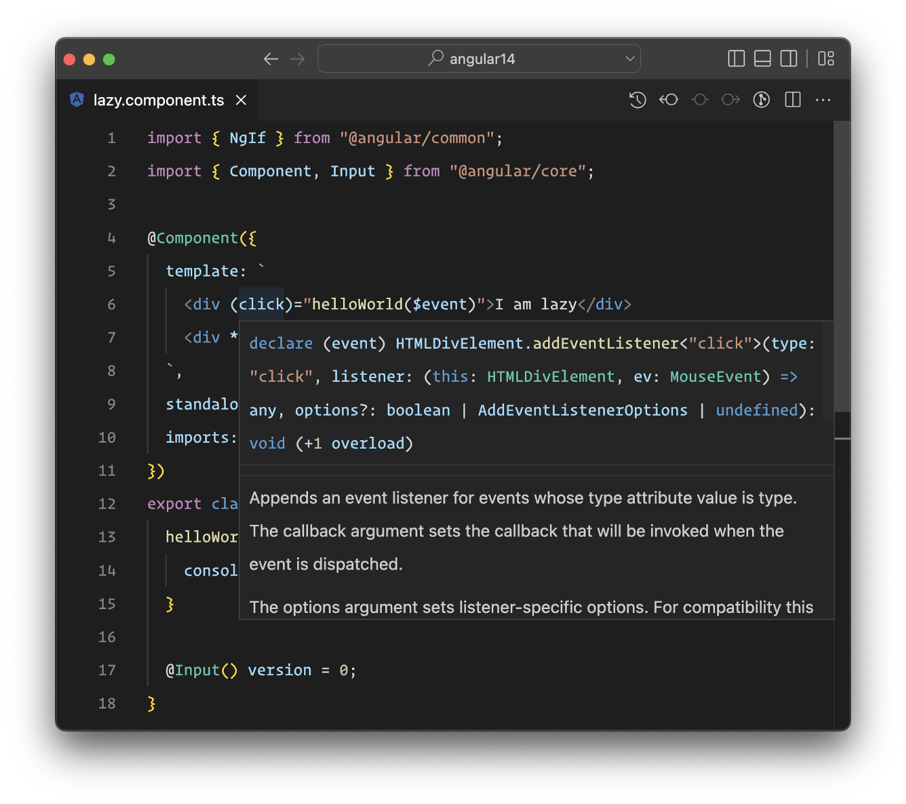

And the type of the **$event** value is of **MouseEvent** because that’s what a **addEventListener** with **click event type** dispatches. So, no magic 🪄!

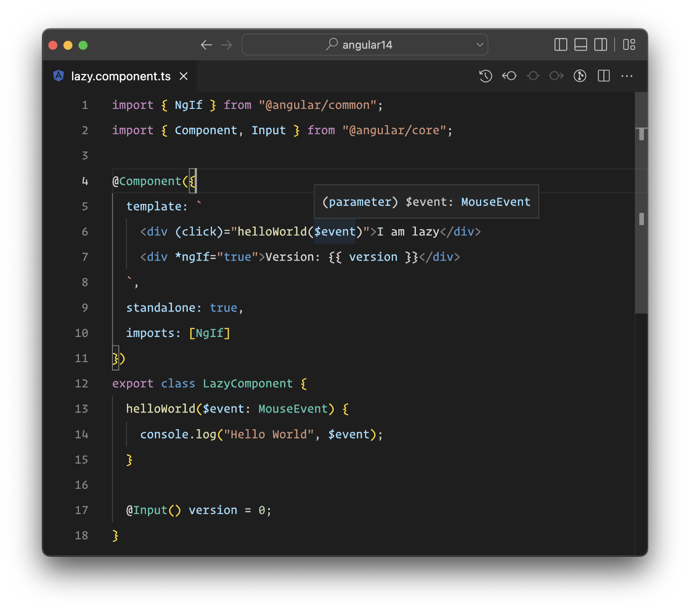

Let’s add a component that has an **Output**, and add it in the template.

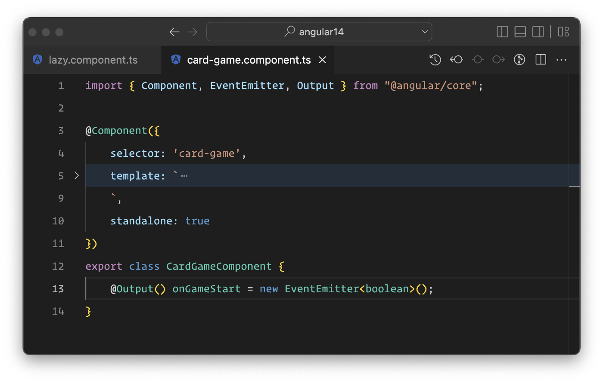

When we hover over the **onGameStart** event we can see that the it’s just an **EventEmitter** that emits a **boolean value**, and that’s right!

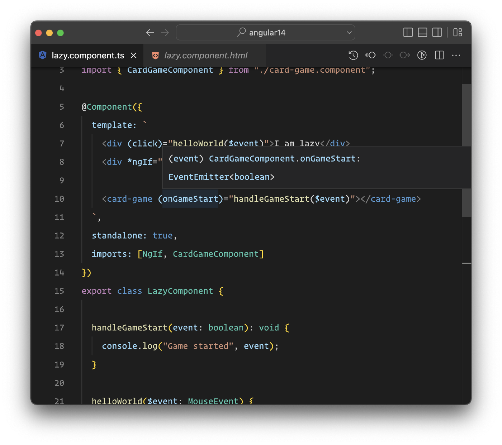

## Interpolation

If we hover over the interpolated **version** variable we can see that the right type will be shown, so version is just a **property** of the **LazyComponent** with **type number**. This also works for complex types.

> The reason why everything shows the correct type is because the Angular templates are strictly typed and the language service just uses the Angular Compiler under the hood to get all this information.

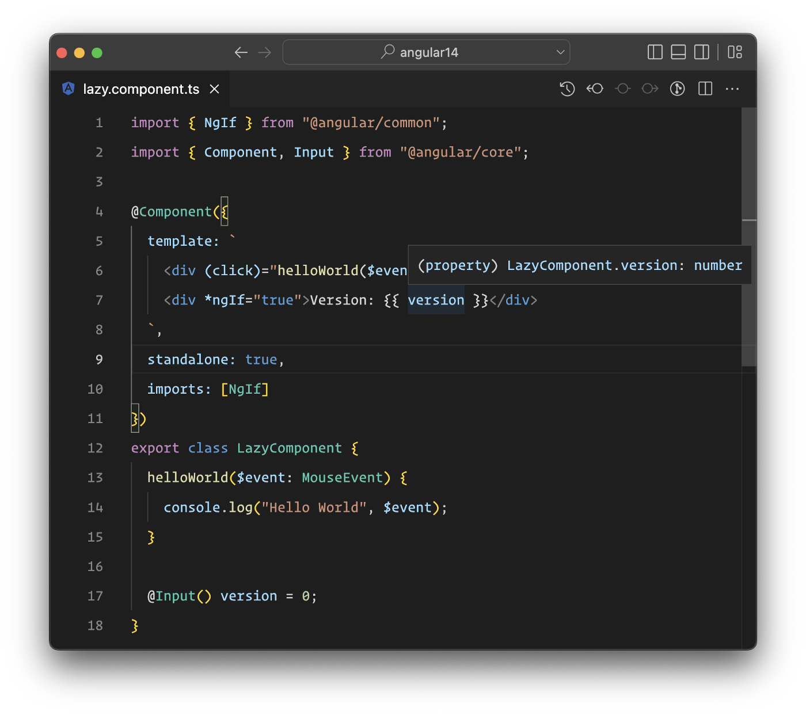

## Data binding

Let’s add an **Input** to the component we created before and pass some data to it from the **LazyComponent**.

The **gameVersion** input is of number type and here we pass a property of number type property. And everything goes fine.

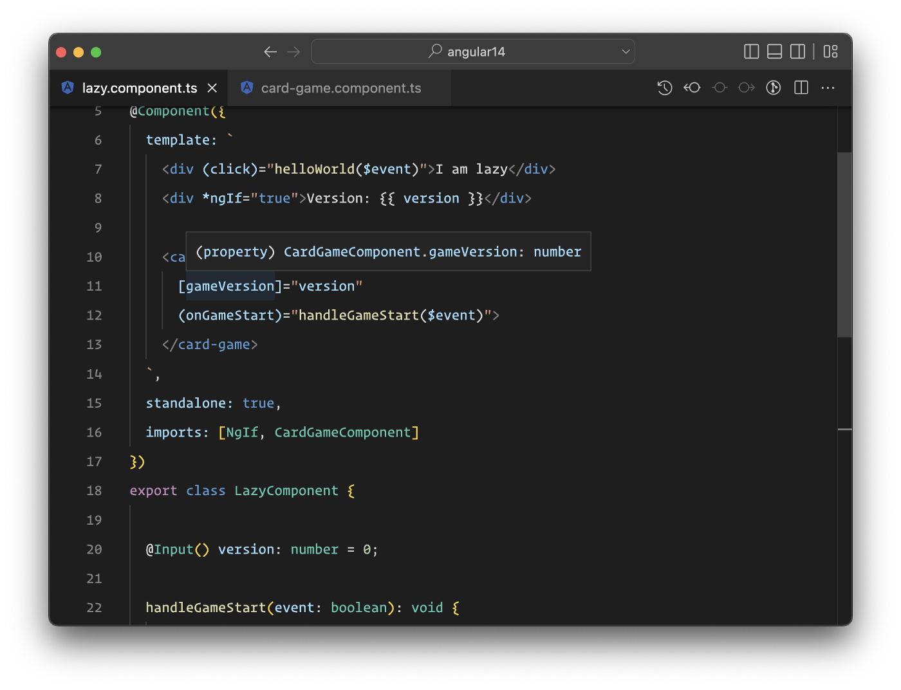

Let’s change the property on LazyComponent to be of string type and see what we get:

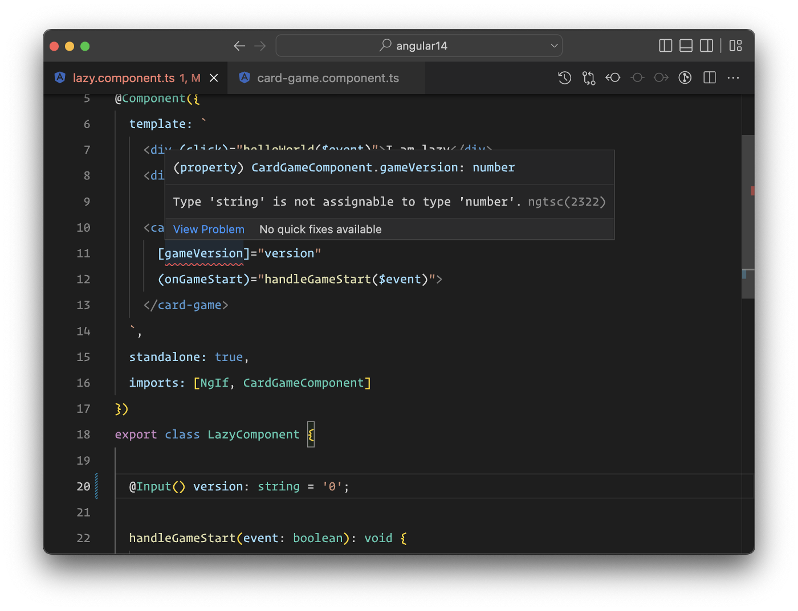

Yes, we’ll get an error that tells us that the property we are passing has a wrong type from the one that the input requires.

## Directives information

In the template we have an \***ngIf** directive. If we hover over it we’ll see the class it comes from and the generic type of it, in this case it’s a boolean. So, we need to pass a boolean expression to the \***ngIf** directive.

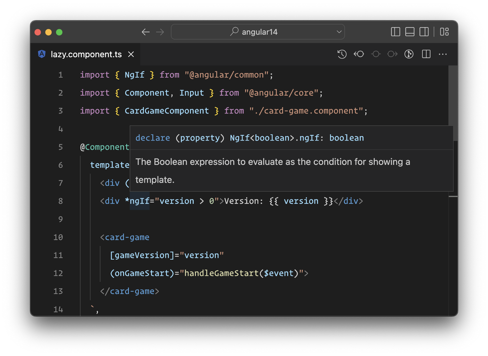

Let’s add an **NgFor** directive and see what information the editor gives us.

Yes, it will show us that the directive class is NgForOf and the generic types of it. Great so far!

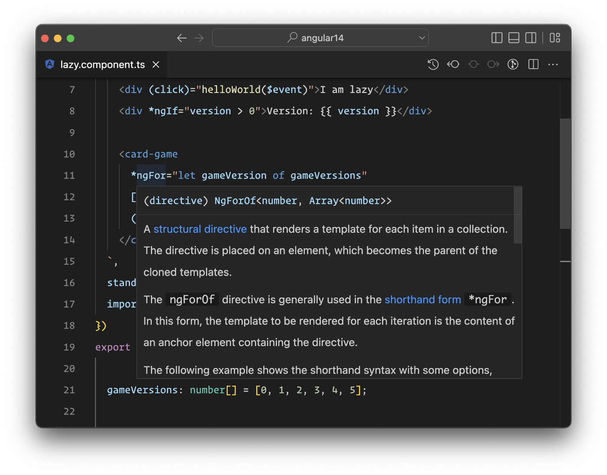

---

These are some of the informations that the language service provides us!

But there’s more, yay 🥳!

## Go to definition

We can **right-click** on every item in the template and click on **Go to definition** and it will send us there! Be it a **component**, **directive**, **input**, **event**, **DOM element** etc.



As we can see it will send us to the correct place, whether  it is inside our components, directives, the ones provided by Angular, or the types of DOM elements, like **lib.dom.ts** etc.

## Go to references

We can also use the **Go to references** option and it will show us every place where we have used the item that we searched for!



## Rename symbol from template

Because everything is **Typescript** in Angular, we can use the **Rename symbol** in the template and all the references of that symbol will be renamed. Be it **inputs**, **outputs**, **class properties** or **methods** etc.



Rename symbol functionality will not work 100% correctly if we do it from the inside class and not from the template, because there’s an [issue in VS Code itself](https://github.com/microsoft/vscode/issues/115354) that is not solved yet!

## Code autocompletion

If we start writing stuff on the template the language service will provide VS Code autocompletion data that we can use, be it inputs, outputs, events, class properties etc.



## Code fixes

In the latest version of the Language Service, we can make use of code fixes. We can create **properties** or **methods** directly from the template, or fix stuff that we may have written in a wrong way.



As we can see it will create the method and also pass the type of the event that we pass to that method, in this case it was **MouseEvent**.

---

**Angular language service** has come a long way! It was re-written from the ground-up because of the Ivy compiler and it was worth it! Because now we have all this good stuff that wasn't possible before.

There is a lot of cool stuff coming too, like importing components, directives, pipes for Standalone components but also for NgModules.

*Till then, go install the language service (if you haven’t yet) and use it to the fullest, it has a lot to give and make your coding easier!*
