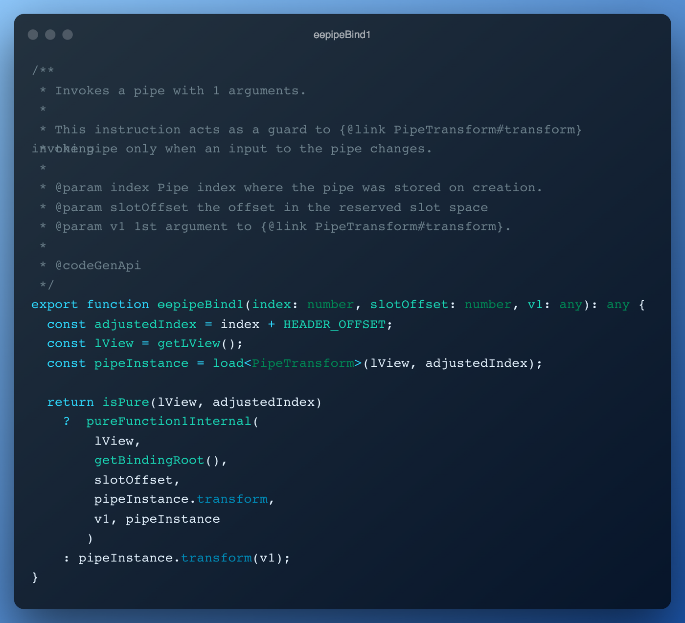
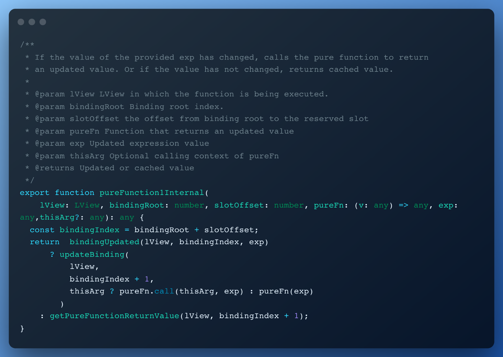
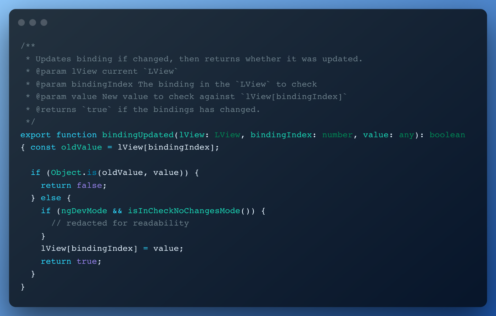
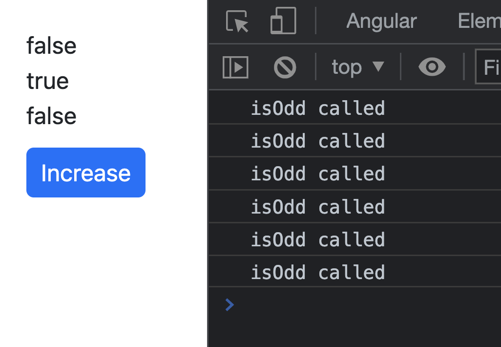
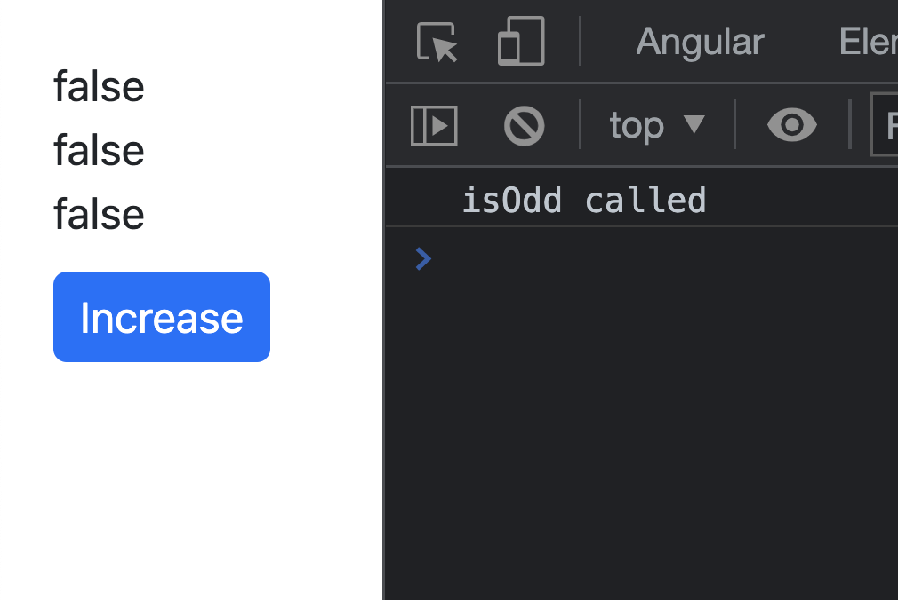

---
{
title: "It’s ok to use function calls in Angular templates!",
published: "2022-09-28T15:39:15Z",
edited: "2022-11-10T11:35:23Z",
tags: ["javascript", "angular", "performance", "typescript"],
description: "“You should never use function calls on Angular templates!” — That’s what you will see all over the...",
originalLink: "https://itnext.io/its-ok-to-use-function-calls-in-angular-templates-ffdd12b0789e",
coverImage: "cover-image.png",
socialImage: "social-image.png"
}
---

“You should never use function calls on Angular templates!” — That’s what you will see all over the internet! And I’m here to prove to you that that’s not always the case!

## The issue

Every time Angular change detection runs (from events, setTimeout, manual or anything else), everything on the template will run again with it, that’s also the case for function calls. Why does Angular do this? Because it needs to check what’s changed on the template in order to update it.

If the function does something heavy, it will impact the performance of the application, because the way Angular updates the view is synchronous, and it will have to wait for the function to finish and then update the view.

## The “Use a pipe” solution

The solution we’ll mostly see is “Use a pipe”. This is recommended because the pipes in Angular templates are more performant. *How so?* Because Angular will re-run the **transform method** of the pipe only if the parameters we pass to it have changed.

**Let’s prove it!**

## Let’s dig in the source code

In the new Angular compiler (Ivy), templates are compiled into instructions. Let’s take an example and see what it generates.

Here’s a component with a simple pipe.



And here’s the cleaned up generated code:



As we can see, in **line 29**, that’s where we see what Angular generates for the template code.

So, there are instructions for **creating a div**, **adding text**, **adding a pipe**, **closing the div**, **creating a button and adding a listener** to it … (Ivy’s cool stuff 🌿). We can also see the **if/else** statement. What it does is, it separates the **view creation** from **view updating**, the first **if** does the view creation and the second one is for the updating part. You can read more on that [here](https://github.com/angular/angular/blob/main/packages/core/src/render3/VIEW_DATA.md).

We are interested for the **line 33 and 43**, because that’s where the pipe does the magic 🪄. In **line 33** it registers the pipe in the template and the binding of the data happens in \*\*line 43 \*\*(in the update phase). We see that it interpolates some text and that text comes from \*\*ɵɵpipeBind1() \*\*function. Let’s see what that function does underneath 🕵️‍♂️.

As we can see, the first three lines get the information for the pipe instance and then we have a return statement. In the return we have a check for **isPure()**, and it just checks if we have set pure field true or false in the pipe decorator.

If we have set the **pure field** to **false** it will directly return the **pipeInstance.transform(v1)** value, meaning Angular won’t do anything special with the pipe but just run the **transform method** again. It would be the same as using a method from the component class.

If the pipe is **pure** (as in our case), it will call the **pureFunction1Internal helper function**\*\* and will pass some fields to it. Let’s see what **pureFunction1Internal** does underneath.

We can see that it checks if the binding is updated in the **bindingUpdated function**, and if that’s true it will **update the binding** otherwise it will **return the value of the pure function** (the current value). Let’s see what check it does underneath 🕵️‍♂️.

So, what it really checks is if the old value is the same as the new value (using **Object.is()**). *You will ask: what value is this?* Nothing else than the parameter that we have passed to the pipe **transform method**.

It means that if none of the parameters of that method has changed, we’re good to go, we can return false and we won’t have to run the function again, we can just use the old value of the binding.

And that’s what we wanted to prove in the first place 🥳.

## What does this mean for us?

It means that we can create a helper function that does the magic Angular does for us, without needing to use a pipe at all 😎.

Here’s the helper function, we’ll explain how it works below.



So, **memo** is a function that accepts a function as parameter and returns a result.

In **line 6** we check if the function parameters have changed, that’s what **hasDifferentArgs function** helps with. It first checks if the length of the args has changed, if yes returns true, and then does an equality check (**just like Angular does with pipes**) of the parameters.

If the parameters have changed we call the function again with the new parameters and save its result, and if not, we return the old value.

## How to use it?

Here’s the example above converted to use the memo function.



Just like that! And yes, we are using a function in the template! And yes, it’s not a problem doing so! 😄

## Is there any catch?

Yes, there is! The memo function will help you in cases when you call it in the template and pass the same value to it, and not use it with different parameters because that will break the “cache” of the memo function.

What do I mean by this? Here’s an example.



Because we are passing different values in different places in the template, the memo function will cache stuff per instance, and not per usage.

In this case, the “**isOdd called**” will show up 6 times every time we click on the button.

So, if we pass the same value in the all the places in the template, it will fire only once.



And here’s the console.

> Pipes caches per function usage while memo util caches per function definition.

## The idea and the inspiration for the blog post?

All thanks to a tweet from [Pawel Kozlowski](https://twitter.com/pkozlowski_os), an Angular team member. I just thought to dig more on the source code and explain it further.



You’re interested in **reactivity**, **signals**, **performance**, **change detection** an other cool stuff like that? Go give [Pawel](https://twitter.com/pkozlowski_os) a follow on Twitter, he is exploring the space and tweeting cool stuff about it!

While you’re on Twitter, give me a follow too at [@Enea\_Jahollari](https://twitter.com/Enea_Jahollari) if want the\*\* latest Angular news\*\*, **videos**, **podcasts**, **updates**, **RFCs**, **pull requests** and so much more. Give me a follow on dev.to if you liked this article and want to see more like this!

**Thank you for reading!**
