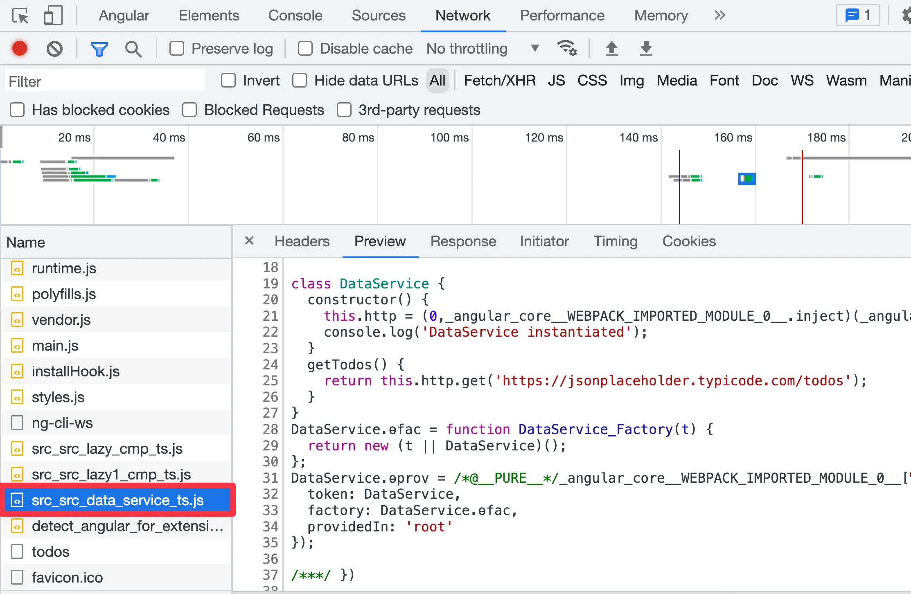
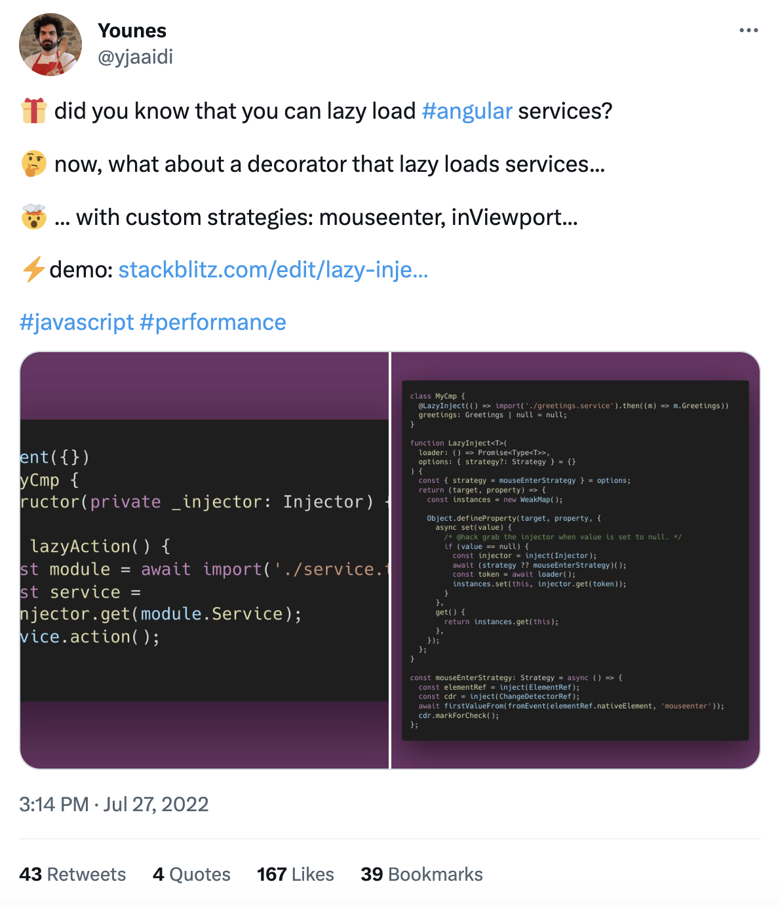

---
{
title: "Lazy loading services in Angular. What?! Yes, we can.",
published: "2023-04-26T07:25:51Z",
tags: ["angular", "javascript", "lazyloading", "webdev"],
description: "We’re used to lazy loading modules or components in Angular. But what about lazy loading services?...",
originalLink: "https://itnext.io/lazy-loading-services-in-angular-what-yes-we-can-cfbaf586d54e",
coverImage: "cover-image.png",
socialImage: "social-image.png"
}
---

We’re used to lazy loading modules or components in Angular. But what about lazy loading services? *Wait, what? Yes, we can.* In this article, we will learn how to lazy load a service in Angular and it’s gotchas.

## What is Lazy Loading?

Lazy loading is a code optimization technique that is also called code splitting. It is used to load the code only when it is needed in order to reduce the initial bundle size but also the load time of the application. In order to lazy load code we use the dynamic import syntax.

For example, we can lazy load a module like this:

```typescript
import("./my-component").then((file) => {
  // do something with the component
});
```

By doing this, we are telling the bundler to create a separate bundle for the module and load it only when the code is executed.

## How to Lazy Load a Service in Angular?

Yes, we will use the dynamic import syntax. But, not only that! Because the services in Angular use the **Injectable decorator**, it means they are injectable and may also depend on other serivices. So, we cannot just lazy load the service and use it directly as a normal class.

What we have to do is to use the dynamic import syntax to lazy load the service and then use the **injector** to get the **service instance**. For example, we can lazy load a service like this:

```typescript
import("./my-service").then((file) => {
  const service = this.injector.get(file.MyService);
  // do something with the service
});
```

This is great, but doesn’t give us a good **DX (developer experience)**. We have to use the injector to get the service instance. So, we can create a **helper function** that will lazy load the service and return the service instance. Here’s a helper function that can help with that.

```typescript
export function lazyLoadService<T>(loader: () => Promise<T>): Promise<T> {
  const injector = inject(Injector);

  return loader().then((serviceClass) => {
    const service = injector.get(serviceClass);
    return service;
  });
}
```

Let’s return an **Observable** instead of a **Promise**, as it’s more **convenient** to use in Angular, and **easier to chain**.

```typescript
export function lazyService<T>(loader: () => Promise<Type<T>>): Observable<T> {
  const injector = inject(Injector);

  return defer(() => {
    return loader().then((service) => injector.get(service));
  });
}
```

The **defer** operator will create an Observable that will execute the loader function only when the Observable is **subscribed** to. So, we can use it like this:

```typescript
lazyService(() => import("./my-service")).subscribe((service) => {
  // do something with the service
});
```

or better yet, we can pipe the service observable:

```typescript
lazyService(() => import("./my-service")).pipe(
  concatMap((service) => {
    // do something with the service
  })
);
```

Let’s see an example of how to use it in a component:

```typescript
const DataServiceImport = () => 
  import('./data.service').then((m) => m.DataService);

@Component({
  template: `
    <ul>
      <li *ngFor="let todo of todos$ | async">
        {{ todo.title }}
      </li>
    </ul>
  `,
  standalone: true,
  imports: [NgFor, AsyncPipe],
})
export class AppComponent {
  private dataService$ = lazyService(DataServiceImport);

  todos$ = this.dataService$.pipe(concatMap((s) => s.getTodos()));
}
```

And now, let’s take a look at the network tab!



Yeah, the service will be in it’s own bundle 🎉!

---

But what if we want to use the service in another component, we have to **lazy load it again**. Otherwise, it will be bundled in **main bundle** (*if used in not lazy loaded component*), or **common bundle** (*if used in another lazy loaded component*), and break the code splitting.

> NOTE: The javascript bundle will be downloaded only once, no matter of how many times we lazy load it, because after the first download, webpack (the bundler) will just reuse the downloaded bundled.

## Different ways to lazy load a service

Take a look at this tweet by [Younes](https://twitter.com/yjaaidi), where he explains different ways to lazy load a service in Angular:

- Tweet 1: https://twitter.com/yjaaidi/status/1552281356608102404

- Tweet 2: https://twitter.com/yjaaidi/status/1552570805715861504




## What’s the usecase for lazy loading a service?

Let’s say we have a service that is used only in one component. And we want to lazy load the component. So, we can lazy load the service as well. And the service will be lazy loaded only when the component is loaded or the service is used.

Another use case is when we have very dynamic applications, meaning that we load components dynamically and maybe based on configs, and these components may use different services or the same services. But because we don’t know which services will be used, we can’t bundle them in the main bundle otherwise it will get big! So, we can lazy load the services and load them only when they are needed.

## Conclusion

> I want to give a shoutout to [@Younes](https://twitter.com/yjaaidi) for his great research on lazy loading services in Angular. He is the one who inspired me to write this article. So, go ahead and follow him on [Twitter](https://twitter.com/yjaaidi).

After Ivy’s rollout, everything in Angular has become easier to work with. Lazy loading services is no exception!

Go ahead and try it out to reduce the main bundle size. And let me know what you think in the comments below.

Play with the feature here: https://stackblitz.com/edit/angular-jb85mb?file=src/main.ts 🎮

Thanks for reading!

---

I tweet a lot about Angular (latest news, videos, podcasts, updates, RFCs, pull requests and so much more). If you’re interested about it, give me a follow at [@Enea\_Jahollari](https://twitter.com/Enea_Jahollari). Give me a follow on [dev.to](https://dev.to/eneajaho) if you liked this article and want to see more like this!
