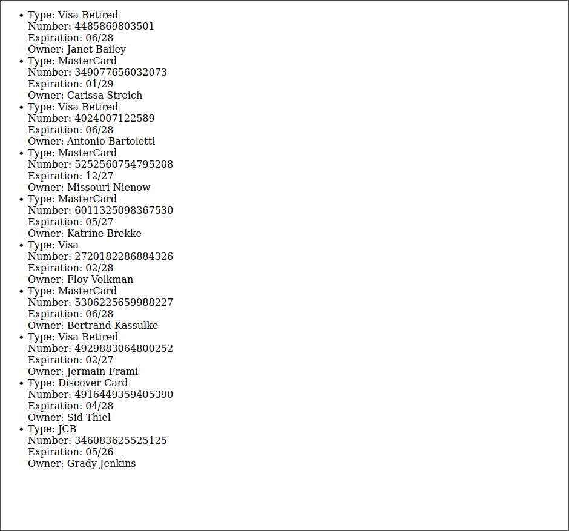

---
{
	title: "Week 6 - Tier 3 Homework",
	description: "aaaa",
	published: '2026-02-11T21:12:03.284Z',
	order: 2,
	noindex: true
}
---

Read through the MDN documentation on [Using the Fetch API](https://developer.mozilla.org/en-US/docs/Web/API/Fetch_API/Using_Fetch).

In the previous homework, we wrote and used a function that returns a promise. `fetch("https://example.com")` is a built-in function that takes a URL, and returns a "promise" of the result of fetching that URL.

Our goal is to create a website that loads some data from a URL and places it on our site.

For this homework, you may start with the following template:

```html
<!DOCTYPE html>
<html lang="en">
	<head>
		<title>My Shopping Cart</title>
	</head>
	<body>
		<ul id="CreditCards"></ul>

		<script>
			const creditCardsEl = document.querySelector("#CreditCards");

			function buildListOfCards(cards) {
				// Use "cards" to create a list of cards in the <ul> element.
			}

			async function fetchCards() {
				// Fetch a list of cards from an API, then call buildListOfCards
			}

			fetchCards();
		</script>
	</body>
</html>
```

## Using JSON data

JSON, or "JavaScript Object Notation", is a format that API endpoints frequently use to communicate data. JSON data looks a lot like JavaScript code (although it has some stricter rules about how it's formatted).

For example, let's look at this URL: [https://fakerapi.it/api/v2/creditCards](https://fakerapi.it/api/v2/creditCards)

```json
{
	"status": "OK",
	"code": 200,
	"locale": "en_US",
	"seed": null,
	"total": 10,
	"data": [
		{
			"type": "Visa",
			"number": "6011901571171993",
			"expiration": "12\/26",
			"owner": "Trystan Parisian"
		},
		{
			"type": "MasterCard",
			"number": "5195699615693770",
			"expiration": "04\/28",
			"owner": "Jules Brown"
		},
		{
			"type": "Visa",
			"number": "6011409701073402",
			"expiration": "01\/28",
			"owner": "Justen Mraz"
		}
	]
}
```

For now, let's just copy and paste this into `fetchCards` to start using it.

```html
<!DOCTYPE html>
<html lang="en">
	<head>
		<title>My Shopping Cart</title>
	</head>
	<body>
		<ul id="CreditCards"></ul>

		<script>
			const creditCardsEl = document.querySelector("#CreditCards");

			function buildListOfCards(cards) {
				// Use "cards" to create a list of cards in the <ul> element.
			}

			async function fetchCards() {
				// Fetch a list of cards from an API, then call buildListOfCards

				const data = {
					"status": "OK",
					"code": 200,
					"locale": "en_US",
					"seed": null,
					"total": 10,
					"data": [
						{
							"type": "Visa",
							"number": "6011901571171993",
							"expiration": "12\/26",
							"owner": "Trystan Parisian"
						},
						{
							"type": "MasterCard",
							"number": "5195699615693770",
							"expiration": "04\/28",
							"owner": "Jules Brown"
						},
						{
							"type": "Visa",
							"number": "6011409701073402",
							"expiration": "01\/28",
							"owner": "Justen Mraz"
						}
					]
				};
				buildListOfCards(data);
			}

			fetchCards();
		</script>
	</body>
</html>
```

Looking at our JSON, we can see that it is an object with a `"data"` property - which contains an array of cards.

We should loop through that array to inspect each element. Let's make our `buildListOfCards` function loop over these items and `console.log` each card, one at a time.

<details>
<summary>Solution</summary>

There are a number of solutions here! You might use a `while` loop, or a `for` loop, or the `.forEach` function. I've provided three solutions below. They all do the same thing!

```js
function buildListOfCards(cards) {
	// Use "cards" to create a list of cards in the <ul> element.

	let index = 0;
	while (index < cards.data.length) {
		const card = cards.data[index];
		console.log(card);
		index++;
	}
}
```

```js
function buildListOfCards(cards) {
	// Use "cards" to create a list of cards in the <ul> element.

	for (const card of cards.data) {
		console.log(card);
	}
}
```

```js
function buildListOfCards(cards) {
	// Use "cards" to create a list of cards in the <ul> element.

	cards.data.forEach((card) => {
		console.log(card);
	});
}
```

Try experimenting a little further before moving on - see if you can log individual properties within the card object! What if you only wanted to log the card numbers?

</details>

## Getting our JSON from `fetch()`

Now, let's try out the `fetch()` API. In your browser console, try running the following snippet:

```js
await fetch("https://fakerapi.it/api/v2/creditCards");
```

You should see the console wait for a few seconds, and then show a "Response" object. It should have a `status: 200` property, which indicates that the fetch request was successful.

We can get JSON from this response by calling the `.json()` function, which also returns a promise!

```js
const response = await fetch("https://fakerapi.it/api/v2/creditCards");
await response.json();
```

If you run the above code, you'll see the JSON from that URL in the console!

Let's connect this to our `buildListOfCards` function and replace the data we pasted in before.

<details>
<summary>Solution</summary>

```html
<!DOCTYPE html>
<html lang="en">
	<head>
		<title>My Shopping Cart</title>
	</head>
	<body>
		<ul id="CreditCards"></ul>

		<script>
			const creditCardsEl = document.querySelector("#CreditCards");

			function buildListOfCards(cards) {
				// Use "cards" to create a list of cards in the <ul> element.

				cards.data.forEach((card) => {
					console.log(card);
				});
			}

			async function fetchCards() {
				// Fetch a list of cards from an API, then call buildListOfCards

				const response = await fetch("https://fakerapi.it/api/v2/creditCards");
				const data = await response.json();
				buildListOfCards(data);
			}

			fetchCards();
		</script>
	</body>
</html>
```

When you look at the console after reloading this page, you should see every card from the API in the logs!

</details>

## Creating elements in the DOM

Finally, now that we can fetch and loop over each card, let's use what we learnt last week to create a `<li>` element for each card.

Each list item should show:
- The card type
- The card number
- The expiration date
- The card owner

<details>
<summary>Solution</summary>

To build our list of elements, you might write something like the following:

```js
function buildListOfCards(cards) {
	// Use "cards" to create a list of cards in the <ul> element.

	cards.data.forEach((card) => {
		const listItemEl = document.createElement("li");

		listItemEl.append("Type: " + card.type);
		listItemEl.append(document.createElement("br"));
		listItemEl.append("Number: " + card.number);
		listItemEl.append(document.createElement("br"));
		listItemEl.append("Expiration: " + card.expiration);
		listItemEl.append(document.createElement("br"));
		listItemEl.append("Owner: " + card.owner);

		creditCardsEl.append(listItemEl);
	});
}
```

If you open your website, you should see a list of cards on the page!

</details>

<details>
<summary>Full Code</summary>

```html
<!DOCTYPE html>
<html lang="en">
	<head>
		<title>My Shopping Cart</title>
	</head>
	<body>
		<ul id="CreditCards"></ul>

		<script>
			const creditCardsEl = document.querySelector("#CreditCards");

			function buildListOfCards(cards) {
				// Use "cards" to create a list of cards in the <ul> element.

				cards.data.forEach((card) => {
					const listItemEl = document.createElement("li");

					listItemEl.append("Type: " + card.type);
					listItemEl.append(document.createElement("br"));
					listItemEl.append("Number: " + card.number);
					listItemEl.append(document.createElement("br"));
					listItemEl.append("Expiration: " + card.expiration);
					listItemEl.append(document.createElement("br"));
					listItemEl.append("Owner: " + card.owner);

					creditCardsEl.append(listItemEl);
				});
			}

			async function fetchCards() {
				// Fetch a list of cards from an API, then call buildListOfCards

				const response = await fetch("https://fakerapi.it/api/v2/creditCards");
				const data = await response.json();
				buildListOfCards(data);
			}

			fetchCards();
		</script>
	</body>
</html>
```

</details>

Once you're done, you should see a page like this:



Congrats!

