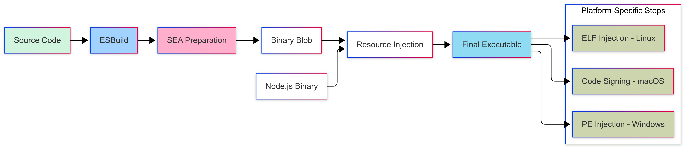
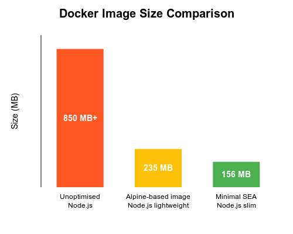
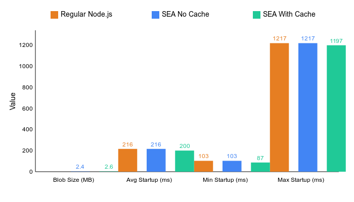
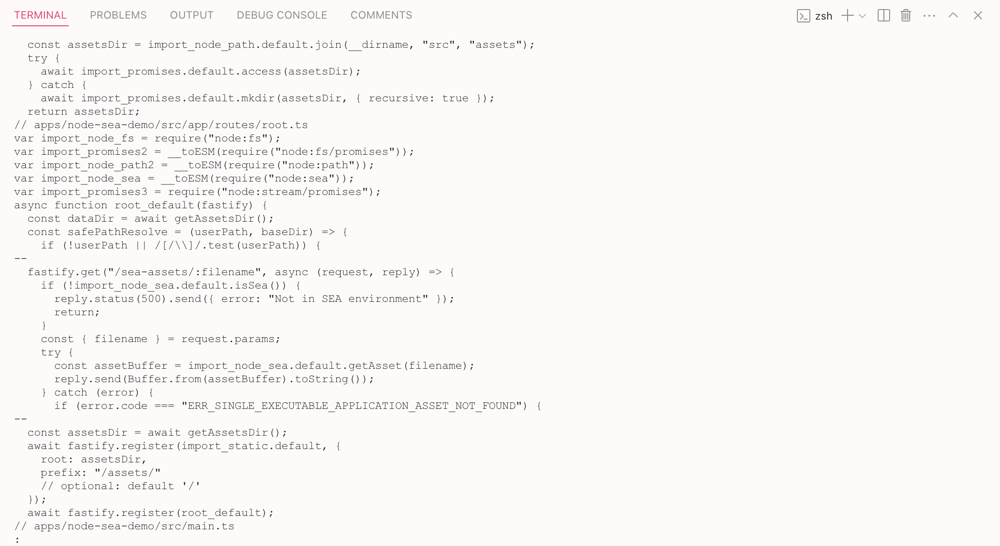

---
{
title: "Building Single Executable Applications with Node.js",
published: "2025-03-17T10:50:00Z",
edited: "2025-09-02T04:58:50Z",
tags: ["node", "tutorial", "devops", "docker"],
description: "Discover how to package your Node.js applications into single executable files, reducing deployment complexity and improving security.",
originalLink: "https://https://dev.to/playfulprogramming/building-single-executable-applications-with-nodejs-16k3",
coverImg: "cover-image.png",
socialImg: "social-image.png"
}
---

> *"Can we upgrade to the latest Node.js version?"*

A few months ago, I did not imagine that this seemingly innocent question from a client would bring me so **deep** into the world of single executable applications, a.k.a. SEA, a.k.a. executable binaries.

Their team had been using [PKG](https://github.com/vercel/pkg) to package Node.js applications into standalone executables, but then they hit a roadblock - PKG has been deprecated. While the community [fork](https://github.com/yao-pkg/pkg) had kept pace with Node.js evolution (even working on Node.js v22), the constant changes to Node.js internals made maintaining these patches challenging. Each new **Node.js version required adapting to internal changes**, creating an ongoing maintenance effort that added complexity to their deployment pipeline.

That's when I remembered hearing about Node.js **Single Executable Applications (SEA)** - a native feature. As someone who's spent years optimizing deployment pipelines and container strategies, I knew I had to explore this promising alternative.

In this article, I'm sharing what I've learned about SEA, a feature that fundamentally shifts how we package and distribute Node.js applications. If you've encountered:

- Delays waiting for packaging tools to support new Node.js versions
- Complex configuration requirements for native modules
- The maintenance burden of keeping dependencies versions and build tools in sync with runtime
- The search for lighter, more portable deployment artifacts

...then you'll find this exploration valuable.

I'll take you through both the technical foundations and practical implementation of SEA, showing how it can simplify your deployment strategy while making your applications more portable and secure.

---

## Table of contents

1. [Two Worlds of Application Distribution](#two-worlds-of-application-distribution)
2. [Technical Foundation](#technical-foundation)
3. [Practical Implementation](#practical-implementation)
4. [Docker Integration](#docker-integration)
5. [Performance Benchmarks](#performance-benchmarks)
6. [The Reality of Code Protection](#the-reality-of-code-protection)
7. [Conclusion](#conclusion)

---

## Two Worlds of Application Distribution {#two-worlds-of-application-distribution}

First, I want to distinguish between each distribution method.

### Traditional Node.js Deployment

The conventional approach to Node.js deployment has several limitations:

- **Fragmented Distribution**: Source files, dependencies, and runtime are all separate pieces
- **Environment Dependencies**: Applications only work when the target environment has the exact right setup
- **Configuration Fragility**: Settings files must be correctly placed and formatted
- **Version Constraints**: The correct Node.js version must be present

This creates a brittle deployment pipeline where one small misconfiguration can cause everything to fail.

### Single Executable Applications Deployment

Single Executable Applications (SEA) represent a fundamental paradigm shift:

- **Complete Self-Containment**: Code, dependencies, assets, and runtime bundled in one binary
- **Environment Independence**: The application carries its environment with it
- **Protected Configuration**: Settings embedded and secured within the executable
- **Deployment Simplicity**: One file to deploy, one file to run

This approach represents a **shift-left** in application delivery—moving deployment concerns from operations teams into the development process. With SEA, developers take ownership of packaging the entire application environment during development rather than leaving it to deployment time.

The result? Applications that are more reliable, more secure, and significantly easier to deploy.

## Technical Foundation {#technical-foundation}

As a longtime Node.js developer, I was curious about how this feature was implemented. Let's peek under the hood!

### The Anatomy of a SEA


A Single Executable Application builds in three distinct stages:

1. **Collection Stage**
2. **Virtual File System Stage**
3. **Binary Integration Stage**

#### Collection Stage

This is where things start getting interesting! The SEA tooling gathers:

- JavaScript application code
- JSON configuration files
- Dependencies from `node_modules`
- Native add-ons
- Static assets

#### Virtual File System Stage

This is where the real magic happens. Instead of just bundling files, SEA creates a miniature in-memory filesystem that:

- Preserves directory structures exactly as they were
- Maintains file permissions
- Keeps symbolic links intact
- Retains original file paths
- Enables fast random access

#### Binary Integration Stage

The final step injects our virtual filesystem into the Node.js binary:

- Preserves execution ability
- Maintains code signing compatibility
- Enables runtime detection
- Supports cross-platform formats (Mach-O, PE, ELF)

## Internals

The conductor behind the SEA orchestra is a small piece of C++ code in the Node.js source.

> **Note** This is the nerdy part, feel free to jump to the [Practical Implementation](#practical-implementation) if you're more interested in hands-on examples.

### SEA Configuration

The [`node_sea.cc`](https://github.com/nodejs/node/blob/main/src/node_sea.cc) evolves around the `SeaResource` structure.

```cpp
class SeaResource {
 public:
  static constexpr uint32_t kMagic = 0x1EA;  // SEA magic number
  static constexpr size_t kHeaderSize = 8;    // Size of header

  SeaFlags flags;
  std::string_view code_path;
  std::string_view main_code_or_snapshot;
  std::optional<std::string_view> code_cache;
  std::unordered_map<std::string_view, std::string_view> assets;
};
```

This structure shows us several critical design decisions:

1. Use of a magic number (0x1EA) to identify the injected program during deserialization
2. Support for both code and snapshots
3. Optional location for code cache (we'll talk about it later)
4. Asset storage in a key-value format

<!-- flags represents our options: kDefault = 0,
kDisableExperimentalSeaWarning = 1 << 0,
kUseSnapshot = 1 << 1,
kUseCodeCache = 1 << 2,
kIncludeAssets = 1 << 3, -->

### SEA Generation Process

The high-level process of the SEA creation is simple:

1. Read the main (bundled) script
2. Generate V8 snapshot if needed (I will talk about snapshot later)
3. Generate code cache if requested (I will talk about cache later)
4. Processes and includes assets
5. Serialize everything into a single Blob

```cpp
ExitCode GenerateSingleExecutableBlob(const SeaConfig& config,
                                     const std::vector<std::string>& args,
                                     const std::vector<std::string>& exec_args) {
  std::string main_script;
  ReadFileSync(&main_script, config.main_path.c_str());

  if (static_cast<bool>(config.flags & SeaFlags::kUseSnapshot)) {
    GenerateSnapshotForSEA(...);
  }

  if (static_cast<bool>(config.flags & SeaFlags::kUseCodeCache)) {
    GenerateCodeCache(config.main_path, main_script);
  }

  std::unordered_map<std::string, std::string> assets;
  BuildAssets(config.assets, &assets);

  SeaSerializer serializer;
  serializer.Write(sea);
}
```

### Resource Injection

SEA uses the postject library to add our VFS as a new section in the binary file format.

Different operating systems use different binary formats. Node.js support the following:

- macOS uses Mach-O
- Windows uses Portable Executable (PE)
- Linux uses ELF (Executable and Linkable Format)

```cpp
std::string_view FindSingleExecutableBlob() {
#ifdef __APPLE__
  postject_options options;
  postject_options_init(&options);
  options.macho_segment_name = "NODE_SEA";
  const char* blob = static_cast<const char*>(
      postject_find_resource("NODE_SEA_BLOB", &size, &options));
#else
  const char* blob = static_cast<const char*>(
      postject_find_resource("NODE_SEA_BLOB", &size, nullptr));
#endif
  return {blob, size};
}
```

### Read-Only Assets

One important security feature is read-only asset access.
The implementation ensures assets remain read-only through careful API design:

1. Assets are stored as immutable string\_views
2. The ArrayBuffer is created with a no-op deleter
3. No API exists for modifying assets once bundled

```cpp
void GetAsset(const FunctionCallbackInfo<Value>& args) {
  // Validate input
  CHECK_EQ(args.Length(), 1);
  CHECK(args[0]->IsString());

  Utf8Value key(args.GetIsolate(), args[0]);
  SeaResource sea_resource = FindSingleExecutableResource();

  auto it = sea_resource.assets.find(*key);
  if (it == sea_resource.assets.end()) {
    return;
  }

  std::unique_ptr<v8::BackingStore> store = ArrayBuffer::NewBackingStore(
      const_cast<char*>(it->second.data()),
      it->second.size(),
      [](void*, size_t, void*) {},  // No-op deleter prevents modifications
      nullptr);

  Local<ArrayBuffer> ab = ArrayBuffer::New(args.GetIsolate(), std::move(store));
  args.GetReturnValue().Set(ab);
}
```

### Load the SEA

The final step is loading the SEA and executing the bundled code:

1. Gets the current V8 context and environment
2. Finds the SEA resource using `FindSingleExecutableResource()`
3. Verifies it's not using a snapshot (`CHECK(!sea.use_snapshot())`)
4. Converts the main code into a V8 value using `ToV8Value`
5. Calls the CJS (CommonJS) run callback with the converted code (from this, you can guess that only CJS is supported!)

```cpp
MaybeLocal<Value> LoadSingleExecutableApplication(
    const StartExecutionCallbackInfo& info) {
  Local<Context> context = Isolate::GetCurrent()->GetCurrentContext();
  Environment* env = Environment::GetCurrent(context);
  SeaResource sea = FindSingleExecutableResource();

  CHECK(!sea.use_snapshot());
  Local<Value> main_script =
      ToV8Value(env->context(), sea.main_code_or_snapshot).ToLocalChecked();
  return info.run_cjs->Call(
      env->context(), Null(env->isolate()), 1, &main_script);
}
```

---

## Practical Implementation {#practical-implementation}


I built a file management service using Fastify to demonstrate SEA capabilities in the real world. The complete source code is available in the [Node-SEA Demo repository](https://github.com/getlarge/node-sea-demo).

> Hopefully, [Liran Tal](https://github.com/lirantal) won't put the shame on me with this example app, no input validation, no rate limit, no auth, at least there's a path traversal check ;)

### Project Structure

The project structure is simple, while representing a typical Node.js HTTP API application:

```typescript
node-sea-demo/
├── src/
│   ├── main.ts                 # Entry point with SEA detection
│   ├── app/
│   │   ├── app.ts             # Fastify setup
│   │   ├── helpers.ts         # Utilities
│   │   └── routes/
│   │       └── root.ts        # API handlers
│   └── assets/                # Static files
├── sea-config.json            # SEA configuration
└── project.json              # Build configuration
```

### Key Implementation Details

The first challenge I encountered was detecting whether we're running in a SEA environment to override the `require` function.

```typescript
import sea from 'node:sea';

if (sea.isSea()) {
  const { createRequire } = require('node:module');
  require = createRequire(__filename);
}

const server = Fastify({
  logger: true,
  trustProxy: true,
});
```

> When running as a SEA, `require.cache` is undefined! The bug is tracked [here](https://github.com/nodejs/node/issues/49163).

Another pain point was managing Fastify plugins within the SEA environment. I found explicit registration works better than auto-loading, to avoid compilation issues:

```typescript
// app.ts
export async function app(fastify: FastifyInstance, opts: AppOptions) {
  await fastify.register(sensible);
  await fastify.register(fastifyMultipart, {
    limits: {
      fileSize: opts.fileSize ?? 1048576 * 10, // 10MB
    },
  });

  const assetsDir = await getAssetsDir();
  await fastify.register(fastifyStatic, {
    root: assetsDir,
    prefix: '/assets/',
  });

  await fastify.register(routes);
}
```

Security was another concern. Since SEA applications might also run with elevated privileges, I implemented strict path safety:

```typescript
// routes/root.ts
const safePathResolve = (userPath: string, baseDir: string): string | null => {
  if (!userPath || /[/\\]/.test(userPath)) {
    return null;
  }
  try {
    const resolvedPath = path.resolve(baseDir, userPath);
    if (!resolvedPath.startsWith(path.resolve(baseDir))) {
      fastify.log.warn({ path: userPath }, 'Path traversal attempt detected');
      return null;
    }
    return resolvedPath;
  } catch (err) {
    fastify.log.error({ err, path: userPath }, 'Path resolution error');
    return null;
  }
};
```

### Build Process



The first step in creating an SEA is properly bundling your JavaScript. I explored several bundlers and found ESBuild offers the best balance of speed and ease of use.

#### Bundling with ESBuild

ESBuild prepares your application for SEA packaging through CLI or build tools.

#### Direct ESBuild Command

```bash
npx esbuild \
    --format=cjs \
    --platform=node \
    --bundle \
    --tsconfig=apps/node-sea-demo/tsconfig.app.json \
    --outdir=dist/apps/node-sea-demo \
    --out-extension:.js=.js \
    --outfile=main.js \
    apps/node-sea-demo/src/main.ts
```

Each flag serves a specific purpose:

- `--format=cjs`: SEA only works with CommonJS (no ESM yet, remember?)
- `--platform=node`: Targets Node.js environment
- `--bundle`: Rolls up all imports into a single file
- `--outfile`: Specifies the output file for the bundled code

#### Nx ESBuild plugin Configuration

If you're using Nx (like I do), you can configure the build in your project's configuration file:

```json
// project.json
{
  "build": {
    "executor": "@nx/esbuild:esbuild",
    "outputs": ["{options.outputPath}"],
    "defaultConfiguration": "production",
    "options": {
      "platform": "node",
      "outputPath": "dist/apps/node-sea-demo",
      "format": ["cjs"],
      "bundle": true,
      "thirdParty": true,
      "main": "apps/node-sea-demo/src/main.ts",
      "tsConfig": "apps/node-sea-demo/tsconfig.app.json",
      "assets": ["apps/node-sea-demo/src/assets/**/*"],
      "generatePackageJson": true,
      "esbuildOptions": {
        "sourcemap": true,
        "outExtension": {
          ".js": ".js"
        }
      }
    }
  }
}
```

### Generating the Executable

After struggling with single executables builder tools like PKG, I was glad to discover Node.js's native SEA support. The configuration is refreshingly simple:

```json
// sea-config.json
{
  "main": "dist/apps/node-sea-demo/main.js",
  "output": "dist/apps/node-sea-demo/demo.blob",
  "disableExperimentalSEAWarning": true,
  "useCodeCache": true,
  "assets": {
    "package.json": "dist/apps/node-sea-demo/package.json"
  }
}
```

The executable generation process varies by platform, if you are using Nx, you can make your life easier by using my [plugin](https://github.com/getlarge/nx-node-sea):

```json
// nx.json
{
  //...
  "plugins": [
    // ...
    {
      "plugin": "@getlarge/nx-node-sea",
      "include": ["apps/**/*"],
      "options": {
        "seaTargetName": "sea-build",
        "buildTarget": "build"
      }
    }
  ]
}
```

.. and then run:

```bash
nx run node-sea-demo:sea-build
```

Otherwise, you can use the following commands for each platform, see the [Node.js SEA documentation](https://nodejs.org/api/single-executable-applications.html#single-executable-applications) for more details:

#### Linux

```bash
# Generate blob
node --experimental-sea-config sea-config.json

# Copy node binary
cp $(command -v node) dist/app/node

# Inject blob
npx postject dist/app/node NODE_SEA_BLOB dist/app/demo.blob \
  --sentinel-fuse NODE_SEA_FUSE_fce680ab2cc467b6e072b8b5df1996b2
```

#### macOS

```bash
# Generate blob
node --experimental-sea-config sea-config.json

# Copy node binary
cp $(command -v node) dist/app/node

# Remove signature
codesign --remove-signature dist/app/node

# Inject blob
npx postject dist/app/node NODE_SEA_BLOB dist/app/demo.blob \
  --sentinel-fuse NODE_SEA_FUSE_fce680ab2cc467b6e072b8b5df1996b2 \
  --macho-segment-name NODE_SEA

# Re-sign binary
codesign --sign - dist/app/node
```

#### Windows

```powershell
# Generate blob
node --experimental-sea-config sea-config.json

# Copy node binary
copy $env:ProgramFiles\nodejs\node.exe .\dist\app\node.exe

# Inject blob
npx postject dist/app/node.exe NODE_SEA_BLOB dist/app/demo.blob ^
  --sentinel-fuse NODE_SEA_FUSE_fce680ab2cc467b6e072b8b5df1996b2
```

> **Note**: You can't just build once and run everywhere:
>
> - Code cache and snapshots are platform-specific
> - Native modules (still) require platform-specific compilation

## Docker Integration {#docker-integration}

As someone who's built countless Docker images for Node.js apps, I couldn't wait to see how SEA could optimize container size.


I experimented with three different approaches:



1. **Full Image (235MB)**

   - Uses complete Node.js runtime
   - Includes OS dependencies
   - Simplest to build and debug

2. **Minimal Image (156MB)**
   - Uses scratch as base
   - Includes only essential OS dependencies
   - Smallest possible footprint

That 156MB image size might not seem impressive compared to Go or Rust applications' Docker image, but it's a dramatic improvement over the typical 800MB+ Node.js image!

### Full image

1. Uses full Node.js runtime - Contains development dependencies (OS)
2. Create dedicated user (always good)
3. Copy ESBuild bundle and change permissions
4. No need to install deps, dependencies are bundled
5. Run the app with node

```dockerfile
FROM docker.io/node:lts-alpine

ENV HOST=0.0.0.0
ENV PORT=3000

WORKDIR /app

RUN addgroup --system node-sea-demo && \
  adduser --system -G node-sea-demo node-sea-demo

COPY dist/apps/node-sea-demo node-sea-demo/
RUN chown -R node-sea-demo:node-sea-demo .

CMD [ "node", "node-sea-demo" ]
```

### Minimal image

1. alpine to start and dependencies to build
2. Install glibc for proper library copying
3. copy bundled code and SEA config
4. Bundle and remove debugging information ( # Strip the binary to remove debug symbols)
5. Uses scratch as a base image,
6. Eliminates unnecessary OS files
7. Include minimal OS dependencies (loader) and copy the Node.js SEA executable
8. Run the standalone executable

```dockerfile
FROM node:lts-alpine AS build

WORKDIR /app

RUN apk add --no-cache build-base python3

RUN wget -q -O /etc/apk/keys/sgerrand.rsa.pub https://alpine-pkgs.sgerrand.com/sgerrand.rsa.pub && \
  wget https://github.com/sgerrand/alpine-pkg-glibc/releases/download/2.35-r1/glibc-2.35-r1.apk && \
  apk add --no-cache glibc-2.35-r1.apk && \
  rm glibc-2.35-r1.apk

COPY dist/apps/node-sea-demo dist/apps/node-sea-demo
COPY apps/node-sea-demo/sea-config.json .

# Create the SEA bundle and verify the file exists and is executable
RUN node --experimental-sea-config sea-config.json && \
  cp $(command -v node) dist/apps/node-sea-demo/node && \
  npx postject dist/apps/node-sea-demo/node NODE_SEA_BLOB dist/apps/node-sea-demo/node-sea-demo.blob --sentinel-fuse NODE_SEA_FUSE_fce680ab2cc467b6e072b8b5df1996b2 && \
  chmod +x dist/apps/node-sea-demo/node && \
  # # Strip the binary to remove debug symbols
  strip dist/apps/node-sea-demo/node

# Create directory structure for dependencies
RUN mkdir -p deps && \
  # Copy all required shared libraries
  ldd dist/apps/node-sea-demo/node | grep "=> /" | awk '{print $3}' | \
  xargs -I '{}' cp -L '{}' deps/ && \
  # Copy additional required files
  cp /lib/ld-linux-*.so.* deps/ && \
  # Create necessary symlinks
  mkdir -p deps/lib64 && \
  cp /lib/ld-linux-*.so.* deps/lib64/


FROM scratch

COPY --from=build /app/deps /lib/
# Ensure lib64 exists and has the loader
COPY --from=build /app/deps/lib64 /lib64/
# Copy the Node.js SEA executable
COPY --from=build /app/dist/apps/node-sea-demo/node /app/node

ENV HOST=0.0.0.0
ENV PORT=3000

EXPOSE ${PORT}
ENTRYPOINT [ "/app/node" ]
```

## Performance Benchmarks {#performance-benchmarks}

Using the `useCodeCache` option offers a dual benefit of better performance and slightly improved code protection.

```json
// sea-config.json
{
  // ...
  "useCodeCache": true // Enable code caching
}
```

I ran some benchmarks to see how the application performs when:

- regular Node.js (no SEA)
- running with code cache enabled
- running without code cache

Here's what I found:



The results surprised me:

- Code cache improved startup time by \~7%
- Blob size increased by only \~7% with code cache enabled
- Cold starts showed significant variance (typical for any Node.js app)
- Hot starts were consistently faster with code cache

### How Code Cache Works

When JavaScript code is executed, V8 (Node.js's JavaScript engine) compiles it to bytecode before execution. This compilation takes time. Code cache stores this pre-compiled bytecode, allowing V8 to skip the compilation step on subsequent runs.

The performance improvement is most noticeable for:

- Application startup time (as shown in our benchmarks)
- Cold starts in serverless environments
- Complex codebase with many dependencies

> For most applications, I'd definitely recommend enabling code cache despite the slight size increase.

## The Reality of Code Protection {#the-reality-of-code-protection}

One question that frequently comes up when discussing SEA is:

> *"Are our source code and proprietary algorithms safe inside the executable?"*


While SEA bundles your code inside the Node.js binary, it's important to understand that **this is not true obfuscation**. Let me demonstrate why.

### Extracting Code from SEA Executables

As said already, a SEA is a Node.js binary with your code injected as a resource section. With the right tools, extracting this section is relatively straightforward.

On macOS, extracting code from a SEA executable is a bit more involved than on Linux due to the Mach-O binary format. Here's a demo:

```bash
# 1. First, examine the Mach-O headers to locate the NODE_SEA segment
otool -l dist/apps/node-sea-demo/node | grep -A 20 NODE_SEA

# 2. Note the offset, size, and address of the NODE_SEA segment
# The output will show something like:
  segname NODE_SEA
   vmaddr 0x0000000104e20000
   vmsize 0x0000000000254000
  fileoff 81739776
 filesize 2432242
  maxprot 0x00000001
 initprot 0x00000001
   nsects 1
    flags 0x0
Section
  sectname __NODE_SEA_BLOB
   segname NODE_SEA
# ...

# 3. Extract the segment using dd, extract from the offset <fileoff> and size <filesize>
dd if=your-sea-app of=extracted.blob bs=1 skip=81739776 count=2432242
```

### Examining the Extracted Content

Once extracted, the blob contains the bundled JavaScript code in a readable format. Let's see what it actually looks like:

```bash
# Look for readable strings
strings extracted.blob | less

# For function declarations
strings extracted.blob | grep -A 10 "function" | less

# Targeting assets
strings extracted.blob | grep -A 10 "assets" | less
```



> Amazing, right?

As you can see, the original source code remains largely intact and readable. This is why relying solely on SEA for code protection is insufficient for truly sensitive intellectual property.

<!--
### V8 Snapshots: The Experimental Option

Node.js SEA also supports an experimental `useSnapshot` option, which is even more powerful than code cache:

```javascript
{
  "useSnapshot": true  // Enable V8 snapshot (experimental)
}
```

A V8 snapshot captures the entire heap state after loading your application but before executing it. This provides:

- Even faster startup times (potentially 30-40% faster than code cache)
- More complete protection against casual inspection
- Less platform portability (snapshots are highly architecture-specific)

However, snapshots still aren't foolproof protection against determined reverse engineering.

### Enhanced Protection with Bytenode

use https://swarm.ptsecurity.com/how-we-bypassed-bytenode-and-decompiled-node-js-bytecode-in-ghidra/ as a reference
https://swarm.ptsecurity.com/decompiling-node-js-in-ghidra/


For stronger protection, combining SEA with Bytenode offers a more robust solution:

```javascript
// compile.js
const bytenode = require('bytenode');

await bytenode.compileFile({
  filename: './dist/app/main.js',
  output: './dist/app/main.jsc',
  compileAsModule: true,
});
```

Bytenode converts your JavaScript to V8 bytecode preemptively, then you can configure SEA to use this bytecode file:

```json
{
  "main": "dist/app/loader.js",
  "output": "dist/app/demo.blob",
  "assets": {
    "main.jsc": "dist/app/main.jsc"
  }
}
```

This provides significantly better protection than SEA alone, though it still isn't impenetrable.

​ -->

### How can we protect our code?

For genuinely sensitive code, I recommend a multi-layered approach:

1. Use SEA with Bytenode for basic protection (be aware it was already [reversed engineered](https://swarm.ptsecurity.com/how-we-bypassed-bytenode-and-decompiled-node-js-bytecode-in-ghidra/))
2. Keep truly sensitive algorithms on a secure server accessed via API
3. Consider legal protections (contracts, terms of service)

> **Remember**: no code shipped to a client's machine can ever be 100% protected against a determined adversary with sufficient resources and time.

---

## Conclusion {#conclusion}

Node.js Single Executable Applications have transformed how I deliver Node.js applications, offering:

- Improved deployment reliability
- Better security through bundling
- Reduced environmental dependencies
- Optimized resource usage

After years of dubious deployment strategy, I can now distribute my Node.js applications as single files that "just work" on the target system.

Want to try it yourself? Here are some next steps:

1. Experiment with the provided example application
2. Evaluate SEA for your specific use cases
3. Implement in your CI/CD pipeline
4. Join the Node.js SEA community and contribute!

If you have questions or want to share your SEA experiences, drop a comment below or reach out to me on [Linkedin](https://www.linkedin.com/in/edouard-maleix/) or [GitHub](https://github.com/getlarge).

<!-- ::user id="getlarge" -->
