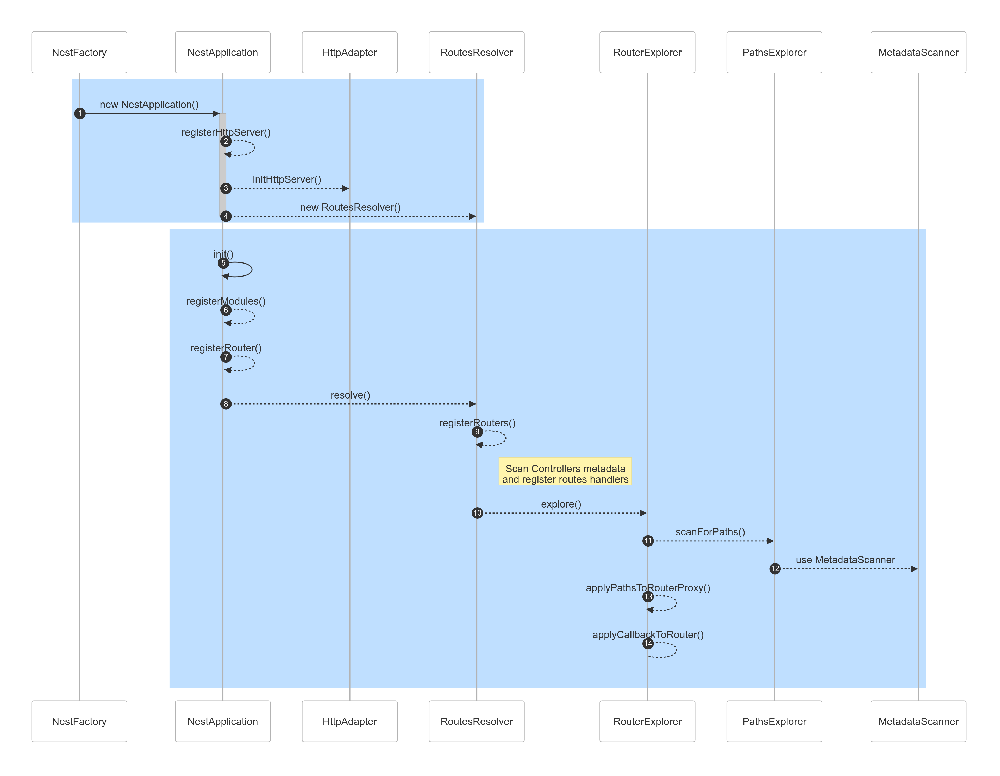
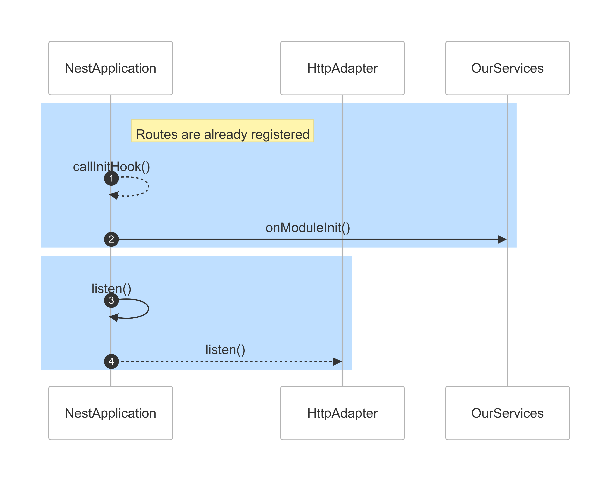
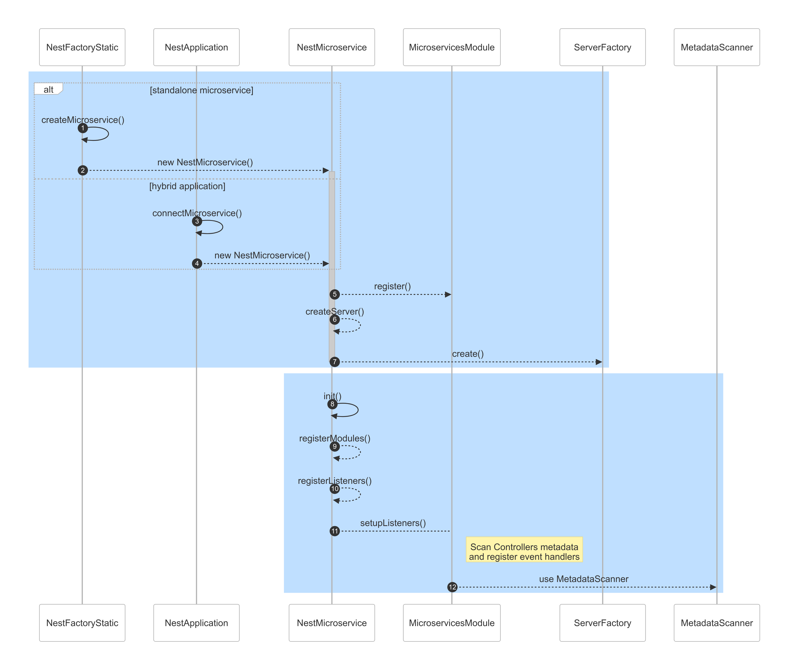
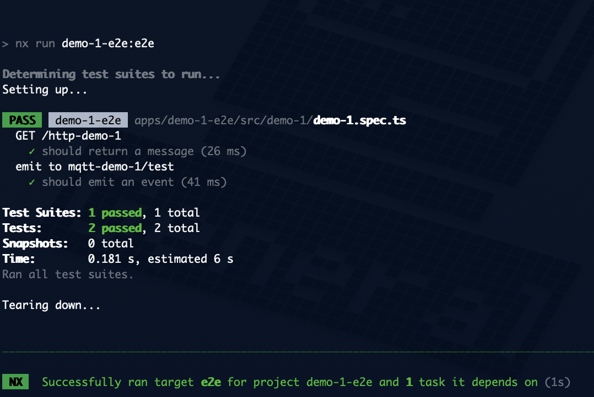

---
{
title: "Dynamic NestJS Listeners: Discover the Power of Lazy Loading",
published: "2024-10-13T11:46:34Z",
edited: "2025-09-02T05:01:37Z",
tags: ["typescript", "nestjs", "tutorial"],
description: "Declare lazy-loaded routes in NestJS and in-depth review of the DiscoveryService",
originalLink: "https://dev.to/this-is-learning/dynamic-nestjs-listeners-discover-the-power-of-lazy-loading-53i2",
coverImg: "cover-image.png",
socialImg: "social-image.png"
}
---

In this post, I will show you how to register HTTP routes and message consumers in NestJS applications **dynamically**.

This demonstration will start by uncovering some NestJS internals, particularly an undocumented feature: the `DiscoveryModule` 🧐.

> *By dynamic routes, I mean routes unknown at the time of development but defined at runtime, late in the boot process.*

If reading bores you, skip the talk and jump directly to the [repository](https://github.com/getlarge/nestjs-dynamic-routes-and-listeners).

## Problem

The declarative approach is **great** but can also bring some **limitations**.
In the routing case, the decorators used to declare HTTP routes and microservices listeners (`@Get`, `@Post`, `@EventPattern`, `@MessagePattern`) require **static** values known during development time and cannot be **late-bound**.

**Examples**:

- `@Get('users')` defines a static route that can only change by modifying the code.
- `@MessagePattern('user.created')` is not adaptable to dynamic topic structures.

## Use cases

| Scenario                                  | Business Impact                                                                                                                             | Description                                                                                                                                                      |
| ----------------------------------------- | ------------------------------------------------------------------------------------------------------------------------------------------- | ---------------------------------------------------------------------------------------------------------------------------------------------------------------- |
| Modular Plugin Architecture               | Allow developers to create modular plugins that can be easily integrated into a core application without modifying the underlying code.     | A web development platform allows users to install plugins that add new features, each with its own set of HTTP routes.                                          |
| White Labeling for E-commerce Platforms   | Enable e-commerce platforms to offer white-labeled application versions to different clients without modifying the underlying codebase.     | A popular e-commerce platform allows its clients (e.g., online retailers) to create custom platform versions with unique routes and listeners.                   |
| Customizable Integration Layers           | Allow customers to customize the integration layer of an application based on their specific business needs without requiring code changes. | A CRM system allows users to integrate it with various external services (e.g., email marketing platforms and sales tools).                                      |
| Feature Flags for Enterprise Applications | Enable enterprise applications to easily toggle certain features on or off based on user roles or organizational policies.                  | A large enterprise application allows administrators to toggle specific features (e.g., access to advanced analytics tools) on or off for different departments. |
| Multi-Tenancy in SaaS Applications        | Allow Software-as-a-Service (SaaS) applications to support multiple tenants with their custom routes and listeners.                         | A SaaS-based customer engagement platform allows clients to create custom application versions with unique routes and listeners.                                 |

## NestJS scanning and registration lifecycle

Word to the wise: to declare dynamic routes and listeners, we must first understand how NestJS inspects modules and scans the metadata to register them.


For both HTTP routes and microservices listeners, NestJS will scan the metadata and register the routes and listeners during the initialization phase when `NestApplication.init` and `NestMicroservice.init` are called.

However, each of them has its own registration process and components:

### HTTP routes





### Microservices listeners




> *When calling `NestApplication.listen` and `NestMicroservice.listen`, the `init` methods will be called if they were not before.*

We have the following options to register dynamic routes and listeners:

1. create custom explorers as providers that **scan the metadata** and replace the placeholders with actual values
2. create custom adapters for HTTP API by implementing the [`HttpServer`](https://github.com/nestjs/nest/blob/master/packages/common/interfaces/http/http-server.interface.ts) interface
3. create custom transport strategies for microservices by extending [`Server`](https://github.com/nestjs/nest/blob/master/packages/microservices/server/server.ts)

**Option 1** is the most straightforward and will be the focus of this article.

## Create a Proof of Concept

The demonstration is a simple NestJS application with a **single HTTP route**, a **single message consumer**, and the following requirements:

1. Enable lazy evaluation of routes or message patterns with custom decorators and metadata explorers
2. Support for both HTTP routes and message consumers
3. Use environment variables to define the route and message pattern prefixes
4. Replace the placeholders pattern before registering the routes and listeners (before [`NestJSApplication.init`](https://github.com/nestjs/nest/blob/v10.4.4/packages/core/nest-application.ts#L179) and [`app.connectMicroservice`](https://github.com/nestjs/nest/blob/v10.4.4/packages/core/nest-application.ts#L221C10-L221C29))

Seems like a good plan, but how can we set up the placeholders and replace them with actual values?


We could use the [reflect-metadata](https://github.com/rbuckton/reflect-metadata) library to store the metadata and then scan it **manually** to replace the placeholders with actual values, but there is a better way.

During my NestJS codebase review, I started following the `MetadataScanner` thread and noticed it was also used by the `DiscoveryModule`. This module provides a powerful tool for **exploring and inspecting the providers, controllers, and modules** in your NestJS application, and it turns out to be the perfect tool for our use case.

> *Funny enough, it has been in the NestJS core for several years but is not used internally. One could think it is part of the public API, but surprisingly, it is still undocumented. Do you also get this treasure hunt feeling? 🏴‍☠️*

Since the approach is very similar for HTTP and microservices listeners, I only explain the registration process of HTTP routes. You can use the same approach to register the microservice listeners, as can be seen in this [internal library](https://github.com/getlarge/nestjs-dynamic-routes-and-listeners/tree/main/libs/custom-message-pattern).

The approch is based on the following steps:

1. Create a custom decorator
2. Create the metadata scanner
3. Declare the dynamic route
4. Import the custom explorers
5. Update ConfigService type and validator (optional)
6. Testing (optional, or not 😏)

### 1. Create a custom decorator

For the HTTP routes, the starting point is the custom decorator: `CustomHttpMethod`, which takes a *method* and a *path* as arguments:

- The *path* is a template string (e.g. ,`$HTTP_ROUTE_PREFIX/:id`) containing placeholders that actual values will replace.
- The *method* is one of the HTTP methods (e.g., **GET**, **POST**, etc).

This decorator is used above the controller methods to define the dynamic routes (e.g., `@CustomHttpMethod({ method: 'GET', path: '$HTTP_ROUTE_PREFIX/:id' })`).

```ts
import { DiscoveryService } from '@nestjs/core';
import type { Method } from 'axios';

export const CustomHttpMethod = DiscoveryService.createDecorator<{
  method: Method;
  path: string;
}>();
```

> You can also find an example using only the Reflect API from `reflect-metadata` library, in the [example repository](https://github.com/getlarge/nestjs-dynamic-routes-and-listeners/blob/main/libs/custom-event-pattern/src/lib/custom-event-pattern.decorator.ts).

### 2. Create the metadata scanner

#### Register the custom explorer

The scanner is exposed as a dynamic NestJS module—`CustomHttpMethodModule`—that can be imported into any module to enable dynamic HTTP routes.

> *Dynamic module enhances reusability and allows for configuration from the outside.*

The module is configurable with:

- a `store`: a map of keys (placeholders) and values (replacements).
- a list of `modules` containing the controllers to scan for the custom decorators.

```ts
export interface ICustomHttpMethodModuleOptions {
  store: Map<string, string>;
  modules: Type<unknown>[];
}
```

1. The module can be created using the `forRoot` and `forRootAsync` methods, which return a `DynamicModule` object containing the module configuration.
2. The module will import the `DiscoveryModule` to enable the scanning of the controllers and methods.
3. It provides and exports the `CustomHttpMethodExplorer` service, which injects the `DiscoveryService` and `MetadataScanner`.

```ts
@Module({})
export class CustomHttpMethodModule {
  static forRoot(
    options: ICustomHttpMethodModuleOptions,
    isGlobal?: boolean
  ): DynamicModule {
    return {
      module: CustomHttpMethodModule,
      imports: [DiscoveryModule],
      providers: [
        { provide: CustomHttpMethodModuleOptions, useValue: options },
        CustomHttpMethodExplorer,
      ],
      exports: [CustomHttpMethodExplorer],
      global: isGlobal,
    };
  }

  static forRootAsync(
    options: CustomHttpMethodModuleAsyncOptions,
    isGlobal?: boolean
  ): DynamicModule {
    return {
      module: CustomHttpMethodModule,
      imports: options.imports
        ? [...options.imports, DiscoveryModule]
        : [DiscoveryModule],
      providers: [
        ...this.createAsyncProviders(options),
        CustomHttpMethodExplorer,
      ],
      exports: [CustomHttpMethodExplorer],
      global: isGlobal,
    };
  }

  private static createAsyncProviders(
    options: CustomHttpMethodModuleAsyncOptions
  ): Provider[] {
    if (options.useFactory) {
      return [
        {
          provide: CustomHttpMethodModuleOptions,
          useFactory: options.useFactory,
          inject: options.inject ?? [],
        },
      ];
    }
    throw new Error('Invalid CustomHttpMethodModuleAsyncOptions');
  }
}
```

#### Iterate over the controllers and methods

The `CustomHttpMethodExplorer` is a provider that will:

1. retrieve the controllers attached to the `modules` provided in the options
2. scan and iterate over each controller's methods
3. search for methods that use the `CustomHttpMethod` decorator
4. substitute the placeholders with actual values from the `store`
5. decorate the method with the NestJS HTTP method decorator (e.g., `@Get`, `@Post`, etc.)

One of the benefits of using the [`DiscoveryService`](https://github.com/nestjs/nest/blob/master/packages/core/discovery/discovery-service.ts) is that it provides methods to explore the metadata of the controllers and methods \[`getProviders`, `getControllers`, `getAllMethodNames` and `getMetadataByDecorator`], without having to use low-level APIs like `Reflect`.

**Bonus**: the `discoveryService.getMetadataByDecorator` infers the type of the metadata.

> *The `CustomHttpMethodExplorer` service is instantiated when the module is imported and will scan the controllers and methods to replace the placeholders with actual values.* > *Alternatively, you can manually trigger the exploration in the `main.ts` file.*

```ts
@Injectable()
export class CustomHttpMethodExplorer {
  readonly logger = new Logger(CustomHttpMethodExplorer.name);
  private readonly methodsMap = new Map(
    Object.entries({
      GET: Get,
      POST: Post,
      PUT: Put,
      DELETE: Delete,
      PATCH: Patch,
      OPTIONS: Options,
      HEAD: Head,
    } as const)
  );

  constructor(
    @Inject(CustomHttpMethodModuleOptions)
    private readonly options: CustomHttpMethodModuleOptions,
    private readonly discoveryService: DiscoveryService,
    private readonly metadataScanner: MetadataScanner
  ) {
    this.process();
  }

  get store(): Map<string, string> {
    return this.options.store;
  }

  get modules(): Type<unknown>[] {
    return this.options.modules;
  }

  private substituteValues(input: string): string {
    return input.replace(
      /\$(\w+)/g,
      (match, p1) => this.store.get(p1) || match
    );
  }

  private getMethodDecorator(
    method: string
  ): (path: string | string[]) => MethodDecorator {
    return this.methodMap.get(method.ToUpperCase()) || Get;
  }

  process() {
    const instances = this.discoveryService.getControllers({
      include: this.modules,
    });
    for (const wrapper of instances) {
      const handlers = this.metadataScanner.getAllMethodNames(
        wrapper.metatype.prototype
      );
      this.logger.log(`${wrapper.name}:`);
      for (const handler of handlers) {
        const metadata = this.discoveryService.getMetadataByDecorator(
          CustomHttpMethod,
          wrapper,
          handler
        );
        if (!metadata) {
          continue;
        }
        const { method, path } = metadata;
        const fulfilledPath = this.substituteValues(path);
        const decorator = this.getMethodDecorator(method);
        decorator(fulfilledPath)(
          wrapper.metatype,
          handler,
          Object.getOwnPropertyDescriptor(
            wrapper.metatype.prototype,
            handler
          ) as PropertyDescriptor
        );
        this.logger.log(`Mapped {${method} ${fulfilledPath}} route`);
      }
    }
  }
}
```

> If you like it more low level, you can also find an example using only Reflect API, in the [example repository](https://github.com/getlarge/nestjs-dynamic-routes-and-listeners/blob/main/libs/custom-event-pattern/src/lib/custom-event-pattern.service.ts)

### 3. Declare the dynamic route

```ts
@Controller()
export class AppController {
  constructor(private readonly appService: AppService) {}

  @CustomHttpMethod({ method: 'GET', path: '$HTTP_METHOD_PREFIX/:id' })
  getData(@Param('id') id: string) {
    return this.appService.getData(id);
  }

  //...
}
```

### 4. Import the custom explorers

In `app.module.ts`, add the custom explorers to the imports array.

```ts
@Module({
  imports: [
    // ...
    CustomHttpMethodModule.forRootAsync({
      inject: [ConfigService],
      useFactory: (
        configService: ConfigService<EnvironmentVariables, true>
      ) => {
        const store = new Map<string, string>();
        store.set(
          'HTTP_METHOD_PREFIX',
          configService.get('HTTP_METHOD_PREFIX')
        );
        return { store, modules: [AppModule] };
      },
    }),
    // ...
  ],
  controllers: [AppController],
  providers: [AppService],
})
export class AppModule {}
```

### 5. Update ConfigService type and validator

To provide a better developer experience, we can use the `class-transformer` and `class-validator` libraries to validate the configuration object and provide default values (any other validation library will do).

```ts
import { Expose } from 'class-transformer';
import { IsInt, IsPositive, IsString, IsUrl, Min } from 'class-validator';

export class EnvironmentVariables {
  //...
  @Expose()
  @IsString()
  HTTP_METHOD_PREFIX = 'http-demo-1';

  //...
}
```

1. The `ConfigModule` is updated to use the `plainToInstance` function from `class-transformer` to transform the configuration object into an instance of the `EnvironmentVariables` class.
2. The `validateSync` function from `class-validator` validates the instance of the `EnvironmentVariables` class.
3. After this validation we can increase the `ConfigService` type safety by including the `EnvironmentVariables` class (e.g., `ConfigService<EnvironmentVariables, true>`).

```ts
@Module({
  imports: [
    ConfigModule.forRoot({
      cache: true,
      isGlobal: true,
      validate: (config) => {
        const validatedConfig = plainToInstance(EnvironmentVariables, config, {
          excludeExtraneousValues: true,
          exposeDefaultValues: true,
        });
        const errors = validateSync(validatedConfig, {
          skipMissingProperties: false,
        });
        if (errors.length > 0) {
          throw new Error(errors.toString());
        }
        return validatedConfig;
      },
    }),
    //...
  ],
  controllers: [AppController],
  providers: [AppService],
})
export class AppModule {}
```

### 6. Testing

The workspace includes [E2E tests](https://github.com/getlarge/nestjs-dynamic-routes-and-listeners/blob/main/apps/demo-1-e2e/src/demo-1/demo-1.spec.ts) that will send:

- HTTP request to the dynamic route
- MQTT message to the dynamic listener

Feel free to run the tests to see the demonstration in action.

```sh
docker compose up -d
npx nx run demo-1:serve
# in another terminal
nx run demo-1-e2e:e2e
```



## Going further

With this knowledge, you can implement the following scenarios:

- Replace the template string with a `printf`-like syntax
- Fetch routes and listeners from a remote service or a database
- Build your explorer modules to create a plugin system
- Create a reusable generic controller to avoid repeating decorators
- [Create groups of controllers/providers](https://dev.to/sfeircode/nestjs-discovery-15kd)
- [Attach decorators to all controllers](https://dev.to/micalevisk/nestjs-tip-how-to-attach-decorators-to-all-controllers-without-at-once-bg7)

## Conclusion

I hope you enjoyed this demonstration and learned something new about NestJS internals.

If you want to show your appreciation, you can find the code in this [repository](https://github.com/getlarge/nestjs-dynamic-routes-and-listeners) and give it a star ⭐️.

<!-- ::user id="getlarge" -->
