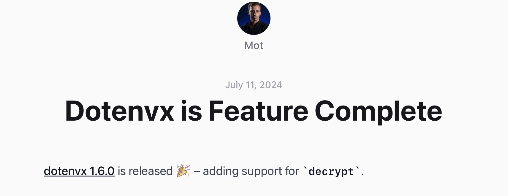

---
{
title: "Exploring DotenvX",
published: "2024-07-27T12:00:37Z",
edited: "2024-07-27T12:01:58Z",
tags: ["tutorial", "env"],
description: "Evaluate DotenvX to manage environment variables",
originalLink: "https://dev.to/this-is-learning/exploring-dotenvx-46ng",
coverImage: "cover-image.png",
socialImage: "social-image.png"
}
---

[DotenvX](https://dotenvx.com) is a library that simplifies managing and sharing environment variables. With features like partial or complete public key encryption and easy grouping by stage name, safely sharing environment variables has never been easier!



## Benefits of DotenvX

- **Automatic Stage Inference**: Infers the stage based on the file extension: each stage (e.g., `test`, `development`, `ci`) has its corresponding file (e.g., `.env.test`, `.env.development`, `.env.ci`).
- **Encryption**: Encrypt your environment variables for secure sharing,
- **Simple to use**: By prefixing your command with `dotenvx run --`, DotenvX will decrypt and inject the environment variables before running the command.
- **Sharing**: Encrypted environment variables can be safely stored and reused across different environments.
- **Traceability**: Since the environment variables are encrypted, you can safely commit them to the repository and track changes over time.

Let's examine how to use `DotenvX` to manage our environment variables. I will use the npm flavor.

## Encrypting Environment Variables

Encrypt the environment variables in the `.env.ci` file:

```sh
npx dotenvx encrypt -f .env.ci
```

The first time you run the `encrypt` command, DotenvX will generate a `.env.keys` file containing the private keys used to encrypt the environment variables; **keep this file secret**, and do not commit it to the repository.

DotenvX stores the encrypted environment variables in the destination file selected (default to `.env`), which you can safely commit.

> **⚠️** Add `.env.keys` to `.gitignore` to prevent it from being committed to the repository.

## Modifying a Single Variable

Encrypting a single variable, `BACKEND_DOCKER_HOST`, in the `.env.ci` file:

```sh
npx dotenvx set BACKEND_DOCKER_HOST "http://api:3000" -f .env.ci
```

## Decrypting Environment Variables

Decrypt the environment variables in the `.env.ci` file and print them to the console:

```sh
npx dotenvx decrypt -f .env.ci --stdout
```

## Loading and Decrypting Environment Variables

Load and decrypt the environment variables from the `.env.ci` file and run a command:

```sh
npx dotenvx run -- <command>
```

## Usage in JavaScript and Typescript

```ts
import dotenvX from 'dotenvx';

function loadEnvironmentVariables<(
  envFilePath: string
): T {
  const oldProcessEnv = structuredClone(process.env);
  const result = dotenvX.config({ path: envFilePath, overload: true });
  process.env = { ...oldProcessEnv };
  if (!result.parsed) {
    throw new Error(`Unable to parse env file ${envFilePath}`);
  }
  return result.parsed;
}
```

> **Note**:
>
> At the time of the writing, variables expansion had two quirks:
>
> 1. When passing our own `processEnv` object to the `config` function some variables will not be expanded
> 2. This means using `process.env`, which might lead to environment variables pollution
> 3. It requires to `overwrite` the `process.env` object
>
> The workaround is to clone the `process.env` object before calling the `config` function and restore it after the call.

## Example Usage

Imagine we want to load environment variables for the `development` stage to configure our Docker Compose services.

You could run the following command:

```sh
export DOTENV_PRIVATE_KEY_DEVELOPMENT=$(cat .env.keys | grep DOTENV_PRIVATE_KEY_DEVELOPMENT | cut -d '=' -f2 | tr -d '"')
npx @dotenvx/dotenvx run -- docker-compose up
```

> **Note**:
>
> - The `DOTENV_PRIVATE_KEY_DEVELOPMENT` environment variable is extracted from the `.env.keys` file.
> - `@dotenvx/dotenvx run` will use the DOTENV\_PRIVATE\_KEY\_DEVELOPMENT, decrypt the environment variables in `.env.development` and inject them into the process.
> - Docker Compose will use the decrypted environment variables to start the services.
