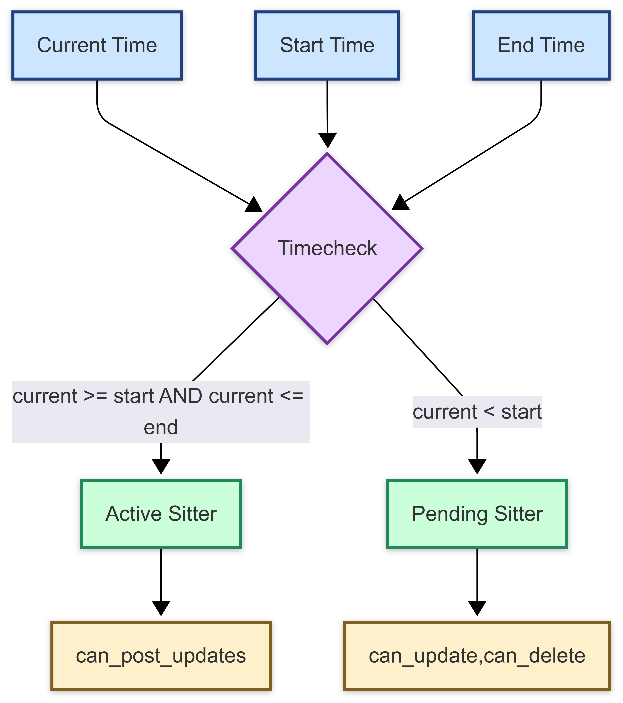
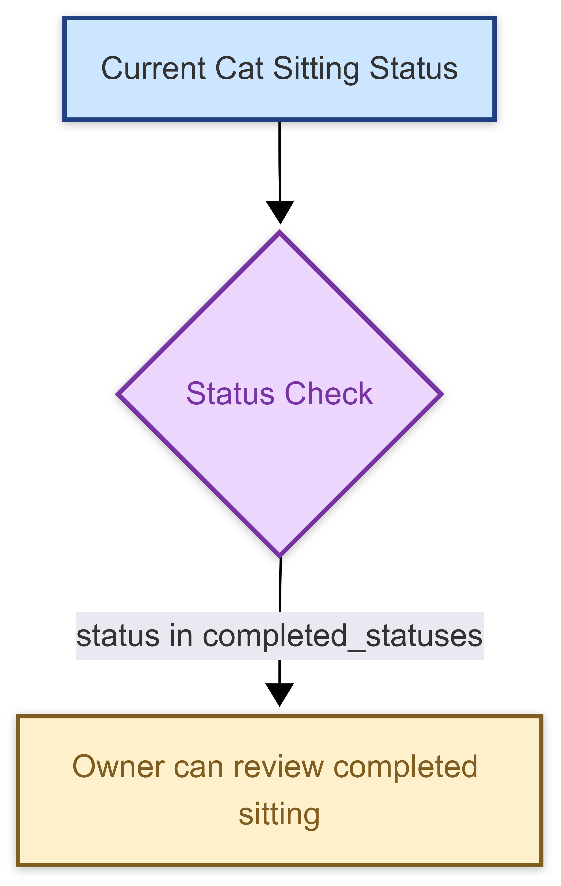
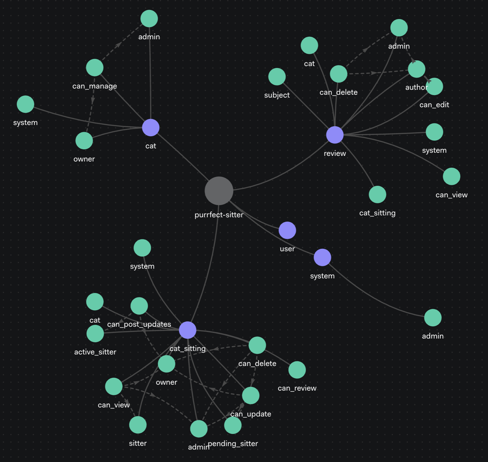

---
{
title: "How to Protect Your API with OpenFGA: From ReBAC Concepts to Practical Usage",
published: "2025-06-15T19:12:59Z",
edited: "2025-06-16T11:56:07Z",
tags: ["tutorial", "openfga", "authorization", "security"],
description: "Learn how to implement complex authorization patterns using OpenFGA and Relation-Based Access Control (ReBAC) through a practical example of a cat sitting app.",
originalLink: "https://dev.to/this-is-learning/how-to-protect-your-api-with-openfga-from-rebac-concepts-to-practical-usage-4n9j",
coverImage: "cover-image.png",
socialImage: "social-image.png"
}
---

Another story, another article. A client asked me recently:

> 🗣️ *Can we add temporary permissions for a group of users assigned to a maintenance task, while it's ongoing?*

It should be simple enough, right? Yes, until I examined the authorization code behind the API and found a **500-line** function checking user roles and groups, time windows, resource ownership, and various business rules. 😶‍🌫️

Unlike **authentication** (who is accessing the system), where we have OIDC, JWT, and other established standards and patterns, **authorization** (what they can do) often forces us into custom implementations.

> 🫷*You might argue that OAuth 2.0 cover authorization, but they focus on third-party access, not complex and dynamic authorization patterns.*

The [OWASP Top 10 API Security Risks](https://owasp.org/API-Security/editions/2023/en/0x11-t10/) lists **Broken Object Level Authorization** as the #1 risk, showing us how common it is to expose sensitive data due to poor authorization checks.
Is it far-fetched to think that the complexity of authorization logic contributes to this risk?

Each new policy adds another **conditional branch**, another **database join**, another **custom role**, another **edge case that breaks** during the next feature request. The authorization flow becomes a spaghetti bowl and even experienced developers hesitate before touching it.

<figure>
  
</figure>

Traditional approaches quickly hit walls:

- **RBAC** works until you need "sometimes" permissions
- **ABAC** offers flexibility but becomes a rule engine nightmare
- **Database queries** slow to a crawl as your permission matrix grows

What if there is a better way? A way that lets you express complex relationships without messy code or performance hits? 🤔

My exploration for a better paradigm started with [**Ory Keto**](https://www.ory.sh/keto):



It introduced me to [Google's Zanzibar paper](https://storage.googleapis.com/gweb-research2023-media/pubtools/5068.pdf) and the concept of **Relation-Based Access Control (ReBAC)**.



This time, I needed more flexibility to introduce **contextual relationships**. That "simple" feature request led me to [**OpenFGA**](https://openfga.dev) — a richer implementation of Zanzibar's principles that extends ReBAC with powerful features like contextual-based conditions, attribute-based access, and a simple query language.

And since you might be familiar with this story, I'll share with you my **learning journey**, starting from the concepts and terminology, through practical examples and considerations, to real-world usage of OpenFGA.

1. ✅ The Authorization Problem
2. 📍 **Why OpenFGA?** ← You are here
3. ⬜ [ReBAC and OpenFGA concepts](#rebac-and-openfga-concepts)
4. ⬜ [OpenFGA in Action](#openfga-in-action)
5. ⬜ [Testing permissions with OpenFGA CLI](#testing-permissions-with-openfga-cli)
6. ⬜ [Adoption Challenges and Strategies](#adoption-challenges-and-strategies)

## Why OpenFGA \[▓░░░░░░░] {#why-openfga}

Before I grab your attention and your brain 🧠 with the ReBAC concepts and how OpenFGA implements them, let me explain why I chose OpenFGA over other solutions.

### It Matches How You Think

#### Expressive Relationships

Cat owners own cats. Sitters sit cats. Admins administrate. The authorization model mirrors reality instead of forcing you into artificial role hierarchies. [Demo](#create-basic-relationships)

<figure>
  
  <figcaption>Direct relations</figcaption>
</figure>

<figure>
  
  <figcaption>Implied relations</figcaption>
</figure>

#### Time Works Automatically

No more "grant permission at 9 AM, revoke at 5 PM" cron jobs. Time-based access happens naturally through conditions.
Grant permissions only when conditions are met—like during scheduled hours.
[Demo](#time-based-conditions)

> 🤝 *Yes! My client is going to love this.*



#### Status Drives Decisions

Your app's workflow probably includes some entities' states (e.g., pending, active, completed). OpenFGA uses these attributes directly for permissions instead of requiring separate access control flags. [Demo](#state-based-conditions)



### Queries, Not Just Checks

Traditional systems answer "Can Alice do X?" OpenFGA also answers "What can Alice do?" and "Who can do X?" This opens opportunities for features like smart dashboards and permission audits.
[Demo](#check-permissions-and-query-relations)

<figure>
  
  <figcaption>Tuple Queries from OpenFGA playground</figcaption>
</figure>

<figure>
  
  <figcaption>Who has the right to feed Romeo?</figcaption>
</figure>

### Scale Like Google

Google's [Zanzibar](https://research.google/pubs/zanzibar-googles-consistent-global-authorization-system/) (which inspired OpenFGA) handles **billions** of authorization checks daily. Your application(s) probably won't hit those numbers, but it's nice to know you won't hit a wall due to a poorly performing authorization system.

> ☝️ *In my [tests](https://github.com/getlarge/purrfect-sitter/blob/main/tools/scripts/benchmark-auth-strategies.ts), OpenFGA performed slightly better than custom database lookups for complex relationships (both based on PostgreSQL).*

### Great Documentation and CLI Tools

I can't deny it, OpenFGA has a steep learning curve, but its [documentation](https://openfga.dev/docs) is complete and well-structured. It covers everything from basic concepts to advanced usage patterns until deployment strategies.

The [CLI tools](https://openfga.dev/docs/cli) make it easy to manage your authorization model and test your policies.

### Business Backing

OpenFGA is open-source and Okta is funding it, this ensures a long-term viability and support. On one side, you can always deploy it on your own infrastructure, and the community is growing rapidly. On the other side, Okta has strong competitors like OSO, Ory Keto or AWS Cedar, so they have a vested interest in making OpenFGA a successful product extending what Auth0 has to offer.

### Deployment Flexibility

OpenFGA can be deployed in various ways, depending on your needs:

- **Self-hosted**: Use [Docker Compose](https://openfga.dev/docs/getting-started/setup-openfga/docker) to get started locally, [Kubernetes](https://artifacthub.io/packages/helm/openfga/openfga) for full control and [Terraform](https://registry.terraform.io/providers/openfga/openfga/latest/docs) to orchestrate your infrastructure.
- **Managed service**: Use Auth0's FGA offering for a hassle-free experience.

### Observability and Debugging

You can configure:

- [OpenTelemetry](https://opentelemetry.io/) for traces collection on the [client](https://openfga.dev/docs/getting-started/configure-telemetry#enabling-telemetry) and the [server](https://openfga.dev/docs/getting-started/setup-openfga/configure-openfga#tracing) side.
- [Prometheus](https://prometheus.io/docs/concepts/data_model/) for metrics collection.

This makes it easier to monitor your authorization system with open standards and integrate with your existing observability stack.

### Simpler Code To Maintain

To illustrate this, I'm using Typescript to check if a user can update a cat sitting arrangement with both approaches: a plain **database lookup** and an **OpenFGA check**.

#### Database Lookup

```ts
async function isSystemAdmin(userId: string): Promise<boolean> {
  const user = await userRepository.findById(userId);
  if (!user) return false;
  return user.role === 'admin';
}

async function checkCatSittingUpdatePermission(
  userId: string,
  sittingId: string
): Promise<boolean> {
  const sitting = await catSittingRepository.findById(sittingId);
  if (!sitting) return false;

  const cat = await catRepository.findById(sitting.catId);
  if (!cat) return false;

  const isOwner = cat.ownerId === userId;
  const isSitter = sitting.sitterId === userId;
  const isAdmin = () => await isSystemAdmin(userId);
  const isPending = () =>
    sitting.status === 'requested' && new Date(sitting.startTime) > new Date();

  return isOwner || (isSitter && isPending()) || isAdmin();
}
```

#### OpenFGA Check

```ts
async function checkCatSittingUpdatePermission(
  userId: string,
  catSittingId: string
): Promise<boolean> {
  const openfgaClient = new OpenFgaApi({
    apiUrl: process.env.OPENFGA_API_URL,
  });

  const request: CheckRequest = {
    tuple_key: {
      user: `user:${userId}`,
      relation: 'can_update',
      object: `cat_sitting:${catSittingId}`,
    },
    context: {
      current_time: new Date().toISOString(),
    },
  };

  const { allowed } = await openfgaClient.check(
    process.env.FGA_STORE_ID,
    request
  );
  return !!allowed;
}
```

Does it need a lot of explanation? The OpenFGA version is objectively cleaner, more maintainable, and scales better as your authorization logic grows.

## ReBAC and OpenFGA concepts \[▓▓▓░░░░] {#rebac-and-openfga-concepts}

I'll walk you through ReBAC using PurrfectSitter ©, a cat sitting app where owners find sitters. Real problems, real solutions.
As trivial as it sounds, this example shows:

- Role-based access control (RBAC) for admins
- Attribute-based access control (status-driven permissions)
- Time-based access control
- Resource ownership and management

### Three Building Blocks

ReBAC builds authorization from three simple pieces:

#### Types: Entities in Your App

```yaml
type user
type system
type cat
type cat_sitting
type review
```

These map to your app's core entities:

- `user`: 👤 People using your app
- `system`: 🏢 Admin access controls
- `cat`: 🐱 Furry clients needing care
- `cat_sitting`: 🏠 A sitting arrangement
- `review`: 📝 Post-sitting feedback

Each **type** will declare relationships with other types - in the **type definition**.

> ℹ️ *In Ory Keto, these are called **namespaces**.*

#### Objects: Instances of Types

In OpenFGA, an **object** is an instance of a type. For example:

- `user:bob`: A specific user named Bob
- `cat:romeo`: A specific cat named Romeo
- `system:development`: The development environment
- `cat_sitting:1`: The first cat sitting arrangement
- `review:1`: The first review

Objects are the concrete entities your users interact with.

#### Users: The Actors

A **user** is an entity that is related to objects in your system. In our app, users can be:

- People (like Bob)
- Systems (like the PurrfectSitter development environment)
- Cats (like Romeo)

> ℹ️ *In Ory Keto, these are called **subjects**. I believe subject is less ambiguous than user, but OpenFGA uses user, so we will too.*

#### Relations: How Things Connect

A **relation** defines how users interact with objects. For example:

- `user:bob owner cat:romeo`: Bob is the owner of Romeo
- `user:anne sitter cat_sitting:1`: Anne is the sitter for the first cat sitting arrangement

Each **relation** (e.g., `admin`) evaluation logic is defined in the **relation definition** (e.g., `[user]`).

```yaml
type system
  relations
    define admin: [user]

type cat
  relations
    define owner: [user]
    define admin: admin from system
    define can_manage: owner or admin
    define system: [system]

type cat_sitting
  relations
    define active_sitter: [cat_sitting#sitter with is_active_timeslot]
    define can_post_updates: owner or active_sitter
    define can_review: [cat#owner with is_cat_sitting_completed]
    define cat: [cat]
    define owner: owner from cat
    define sitter: [user]
```

> ‼️ *For the sake of this example, we will assume that cats are owned by humans. We all know that, in reality, cats own us, not the other way around.*

OpenFGA computes relationships in several ways:

- **Direct**:
  - `system.admin` — A *user* can be an **admin** of the *system*
  - `cat.owner` — A *user* can be a *cat* **owner**
  - `cat.system` — A *system* can be assigned to a *cat*
  - `cat_sitting.sitter` — A *user* can be a **sitter** for a *cat\_sitting*
- **Implied**:
  - `cat.admin: admin from system` — An **admin** is a *user* from the *system*
  - `cat_sitting.owner: owner from cat` — The *cat\_sitting* **owner** is the *cat* **owner**
- **Union**:
  - `cat.can_manage` — either the *cat* **owner** or an *admin* from the *system* can manage the *cat*
  - `cat_sitting.can_post_updates` — either the *cat\_sitting* **owner** or an *active\_sitter* can post updates
- **Conditional**:
  - `cat_sitting.active_sitter` — Conditional relation between *user* and *cat\_sitting* based on the outcome of the `is_active_timeslot` condition
  - `cat_sitting.can_review` — Conditional relation between *user* and *cat\_sitting* based on the outcome of the `is_cat_sitting_completed` condition

There are even more ways to express relationships, such as **exclusion**, **intersection** and **nesting**, you can find the complete **configuration language** reference in the [OpenFGA documentation](https://openfga.dev/docs/configuration-language).

### The Complete Authorization Model

The ensemble of **types** and **relations** definitions forms the **authorization model**.
Here, the PurrfectSitter's authorization model in OpenFGA's configuration language (**D**omain-**S**pecific **L**anguage for the purist), defines how **users** interact with **cats**, **cat sittings**, and **reviews**.

```yaml
model
  schema 1.1

type user

type system
  relations
    define admin: [user]

type cat
  relations
    define admin: admin from system
    define can_manage: owner or admin
    define owner: [user]
    define system: [system]

type cat_sitting
  relations
    define admin: admin from system
    define active_sitter: [cat_sitting#sitter with is_active_timeslot]
    define pending_sitter: [cat_sitting#sitter with is_pending_timeslot]
    define can_post_updates: owner or active_sitter
    define can_delete: admin or owner or pending_sitter
    define can_view: admin or owner or sitter
    define can_update: admin or owner or pending_sitter
    define can_review: [cat#owner with is_cat_sitting_completed]
    define cat: [cat]
    define owner: owner from cat
    define sitter: [user]
    define system: [system]

type review
  relations
    define admin: admin from system
    define author: owner from cat_sitting
    define can_delete: admin or author
    define can_edit: admin or author
    define can_view: [user, user:*]
    define cat: cat from cat_sitting
    define cat_sitting: [cat_sitting]
    define subject: sitter from cat_sitting
    define system: [system]

condition is_active_timeslot(current_time: timestamp, end_time: timestamp, start_time: timestamp) {
  current_time >= start_time && current_time <= end_time
}

condition is_pending_timeslot(current_time: timestamp, start_time: timestamp) {
  current_time < start_time
}

condition is_cat_sitting_completed(cat_sitting_attributes: map<string>, completed_statuses: list<string>) {
  cat_sitting_attributes["status"] in completed_statuses
}
```

Notice how readable, yet compact, this is — no complex SQL joins or nested conditions. The model captures business logic naturally.

<!-- TODO: mention the JSON equivalent -->


## ✅ Checkpoint: Can You Answer These?

Before moving on, make sure you can answer:

1. What's the difference between a user and an object?
2. How do relations differ from roles?
3. When would you use indirect relationships?

<details>
<summary><b>Answers</b></summary>

1. **User vs Object**: A user is an entity (like a person), while an object is an instance of a type (like a specific cat or cat sitting arrangement). Users interact with objects through relations.
2. **Relations vs Roles**: Relations define how entities connect (like "owner of cat"), while roles are broader categories (like "admin" or "sitter") that can have multiple relations.
3. **Indirect Relationships**: Use these when you want to derive permissions from other relationships, like "can a sitter post updates if they are also the owner?" This allows for more flexible and dynamic permission checks.

</details>

## OpenFGA in Action \[▓▓▓░░░░] {#openfga-in-action}

Let's test our model with real scenarios. I use the OpenFGA CLI to initialize the authorization model, create relation tuples, check the permissions and run some querie but you can use any [other client SDK](https://openfga.dev/docs/getting-started/install-sdk).

---


Save some time, create a GitHub codespace


It will provide you a ready-to-use environment with all dependencies installed and external services running, so you can focus on running the examples in this article.

---

### Setup OpenFGA

#### 1. Creating a Store and a Model {#creating-a-store-and-a-model}

First, create a store:



Then create the authorization model in the new store:



> ⚠️ *If you are using Codespaces, specify the API path with*
>
> - *the flag `--api-url http://openfga:8080`*
> - *the environment variable `FGA_API_URL=http://openfga:8080`*

<!-- ```bash
fga store create --name purrfect-sitter --api-url http://openfga:8080
fga store get --store-id 01JWY85XG3C6A102SBY34D10YF
export FGA_STORE_ID=01JWY85XG3C6A102SBY34D10YF
```

```bash
fga model write --model-file purrfect-sitter-model.fga --store-id ${FGA_STORE_ID} --api-url http://openfga:8080
export FGA_MODEL_ID=purrfect-sitter-model.fga
``` -->

#### 2. Creating Basic Relationships {#create-basic-relationships}

Bob owns Romeo, Anne sits for him. Simple.



<!-- ```bash
# Bob owns Romeo (the cat)
fga tuple write user:bob owner cat:romeo

# Anne sits for Romeo (arrangement #1)
fga tuple write cat:romeo cat cat_sitting:1
fga tuple write user:anne sitter cat_sitting:1

# Can Bob manage Romeo's profile?
fga query check user:bob can_manage cat:romeo
# Yes (true)

# Can Anne manage someone else's cat?
fga query check user:anne can_manage cat:romeo
# No (false)
``` -->

#### 3. Admin Powers {#create-admins}

Jenny becomes a system admin who can manage any cat — traditional RBAC within ReBAC.



<!-- ```bash
# Make Jenny a system admin
fga tuple write user:jenny admin system:development

# Add Romeo to the system
fga tuple write system:development system cat:romeo

# Can Jenny manage Romeo's profile?
fga query check user:jenny can_manage cat:romeo
# Yes (true)
``` -->

#### 4. Time Magic {#time-based-conditions}

Anne's permissions activate and deactivate automatically based on time. No cron jobs, no cleanup code — the authorization system handles it.



<!-- ```bash
# Make Anne active only during a specific time window
fga tuple write cat_sitting:1#sitter active_sitter cat_sitting:1 --condition-name is_active_timeslot \
--condition-context '{"start_time":"2023-01-01T00:00:00Z","end_time":"2023-01-02T00:00:00Z"}'

# Is Anne the sitter?
fga query check user:anne sitter cat_sitting:1
# Yes (true)

# Is Anne currently active (during her scheduled time)?
fga query check user:anne active_sitter cat_sitting:1 --context='{"current_time":"2023-01-01T00:09:50Z"}'
# Yes (true)

# Can Anne post updates during her active time?
fga query check user:anne can_post_updates cat_sitting:1 --context='{"current_time":"2023-01-01T12:00:00Z"}'
# Yes (true)

# Is Anne active after her scheduled time?
fga query check user:anne active_sitter cat_sitting:1 --context='{"current_time":"2023-01-03T00:09:50Z"}'
# No (false)

# Find all arrangements where Anne is active
fga query list-objects user:anne active_sitter cat_sitting --context='{"current_time":"2023-01-01T00:09:50Z"}'
# ["cat_sitting:1"]

# Find all arrangements where Bob is owner
fga query list-objects user:bob owner cat_sitting
# ["cat_sitting:1"]
``` -->

#### 5. Status-Driven Access {#state-based-conditions}

Reviews only make sense after sitting ends. OpenFGA enforces this business rule automatically, ABAC style.



<!-- ```bash
# Set up review permission based on status
fga tuple write cat:romeo#owner can_review cat_sitting:1 --condition-name is_cat_sitting_completed \
--condition-context '{"completed_statuses":["completed"]}'

# Can Bob review while sitting is pending?
fga query check user:bob can_review cat_sitting:1 --context='{"cat_sitting_attributes":{"status": "pending"}}'
# No (false)

# Can Bob review when sitting is completed?
fga query check user:bob can_review cat_sitting:1 --context='{"cat_sitting_attributes":{"status": "completed"}}'
# Yes (true)
``` -->

#### 6. Creating and Checking Review Permissions {#check-permissions-and-query-relations}

Create a review and check who can edit or delete it. OpenFGA's query language shines here, allowing you to check permissions and also list objects a user can interact with.



<!-- ```bash
# Create review
fga tuple write cat_sitting:1 cat_sitting review:1

# Add review to system
fga tuple write system:development system review:1

# Can Bob (cat owner) edit the review?
fga query check user:bob can_edit review:1
# Yes (true)

# Can Jenny (admin) delete the review?
fga query check user:jenny can_delete review:1
# Yes (true)

# Can Anne (sitter) delete the review?
fga query check user:anne can_delete review:1
# No (false)

# List all reviews Bob authored
fga query list-objects user:bob author review
# ["review:1"]
``` -->

#### 7. Making the Review Public {#making-an-object-public}

Control visibility using wildcards.



<!-- ```bash
# Make review public
fga tuple write 'user:*' can_view review:1

# Is the review visible to Edouard?
fga query check user:edouard can_view review:1
# Yes (true)
``` -->

### Explore Relationships with OpenFGA Playground

You can visualize the relations graph and run queries in the [OpenFGA's Playground](https://openfga.dev/docs/getting-started/setup-openfga/playground).
I find it a great way to discover and understand relationships in your model and test queries interactively.



> 💡 *If you are using Codespaces, just open `http://localhost:8082/playground` in your browser.*

## Testing permissions with OpenFGA CLI \[▓▓▓▓░░░] {#testing-permissions-with-openfga-cli}

Another one of OpenFGA's strengths, is its built-in testing capabilities. The CLI provides a declarative way to test authorization models without writing application code.

<!-- ##### Who Can Do What - Permission Example

 -->

### Declarative Testing with YAML

Define tests in YAML and run with a single command:

```bash
fga model test --tests store.fga.yml
```

...and forget about all the commands above 🙂. The `store.fga.yml` file contains everything you need to create the model and tuples, and run the tests before writing application code!


Let's look at the `store.fga.yml` file that tests our PurrfectSitter model:

#### The authorization model

This is the model we defined earlier, but in YAML format for the OpenFGA CLI:

```yaml
model: |
  model
    schema 1.1

  # Our full model definition goes here...
```

> ℹ️ *The [model](#the-complete-authorization-model) section is the same as the one we defined earlier, but in YAML format for the OpenFGA CLI.*

#### The tuples

This section defines the relationships (tuples) in our model. Each tuple represents a relationship between a user and an object, along with the relation type.

```yaml
model:
  # ...
tuples:
  - user: user:jenny
    relation: admin
    object: system:development

  - user: user:bob
    relation: owner
    object: cat:romeo

  - user: system:development
    relation: system
    object: cat:romeo

  - user: cat:romeo
    relation: cat
    object: cat_sitting:1

  - user: user:anne
    relation: sitter
    object: cat_sitting:1

  - user: cat_sitting:1#sitter
    relation: active_sitter
    object: cat_sitting:1
    condition:
      name: is_active_timeslot
      context:
        start_time: '2023-01-01T00:00:00Z'
        end_time: '2023-01-02T00:00:00Z'

  - user: cat:romeo#owner
    relation: can_review
    object: cat_sitting:1
    condition:
      name: is_cat_sitting_completed
      context:
        completed_statuses: ['completed']

  - user: system:development
    relation: system
    object: review:1

  - user: cat_sitting:1
    relation: cat_sitting
    object: review:1

  - user: user:*
    relation: can_view
    object: review:1
```

#### The tests

This section defines the tests that will be run against the model and tuples. Each test checks specific permissions or relationships.

The example demonstrates several test types:

1. **Basic permission checks**: Simple assertions about relationships
2. **Contextual checks**: Testing time-based permissions
3. **Attribute-based checks**: Testing permissions depending on object attributes
4. **List objects**: Finding objects a user has relationships with
5. **List users**: Finding users with relationships to an object

```yaml
model:
  # ...
tuples:
  # ...
tests:
  - name: Test basic relations
    check:
      - user: user:anne
        object: cat_sitting:1
        assertions:
          sitter: true

      - user: user:bob
        object: cat_sitting:1
        assertions:
          owner: true

  - name: Test role access
    check:
      - user: user:jenny
        object: cat:romeo
        assertions:
          can_manage: true

      - user: user:bob
        object: cat:romeo
        assertions:
          can_manage: true

      - user: user:anne
        object: cat:romeo
        assertions:
          can_manage: false

  - name: Test temporal access
    check:
      - user: user:anne
        object: cat_sitting:1
        context:
          current_time: '2023-01-01T00:10:00Z'
        assertions:
          active_sitter: true

      - user: user:anne
        object: cat_sitting:1
        context:
          current_time: '2023-01-04T00:00:00Z'
        assertions:
          active_sitter: false

  - name: Test attribute access
    check:
      - user: user:bob
        object: cat_sitting:1
        context:
          cat_sitting_attributes:
            status: 'completed'
        assertions:
          can_review: true

      - user: user:bob
        object: cat_sitting:1
        context:
          cat_sitting_attributes:
            status: 'in_progress'
        assertions:
          can_review: false

  - name: Test the cat sitting that anne is sitting
    list_objects:
      - user: user:anne
        type: cat_sitting
        context:
          current_time: '2023-01-01T00:00:01Z'
        assertions:
          active_sitter:
            - cat_sitting:1
          sitter:
            - cat_sitting:1

  - name: Test the review that bob can edit
    list_objects:
      - user: user:bob
        type: review
        assertions:
          can_edit:
            - review:1

  - name: Test that reviews are public
    list_users:
      - object: review:1
        user_filter:
          - type: user
        assertions:
          can_view:
            users:
              - user:*
```

> 👋 *You can find `store.fga.yml` in the [demo repository](https://github.com/getlarge/purrfect-sitter/blob/main/store.fga.yml).*



### Testing During Adoption

These testing capabilities help when adopting OpenFGA:

- Validate models against business rules
- Verify permissions match the old system during migration
- Compare results with your existing system in shadow mode
- Prevent regressions with CI pipeline tests

Including tests in your workflow reduces authorization errors and builds confidence in your implementation.

## ✅ Checkpoint II: Can You Answer These?

Have you read carefully the previous sections? If so, you should be able to answer:

1. Can you list objects a user has relationships with?
2. Can you list users with relationships to an object?
3. Can you make an object public to all users?

<details>
<summary><b>Answers</b></summary>

1. **List Objects**: Yes, you can use the [list-objects](https://openfga.dev/docs/getting-started/perform-list-objects) command to find objects a user has relationships with, like finding all cat sittings where a user is an active sitter.

2. **List Users**: Yes, if you have a relationship that connects users to objects, you can use the [list-users](https://openfga.dev/docs/getting-started/perform-list-users) command to find users with relationships to an object, like finding all users who can view a specific review.

3. **Public Objects**: Make an object public by adding a relation that allows all users to access it, like granting `user:*` permission on the object as I showed you in [this example](#making-an-object-public)

</details>

## Adoption Challenges and Strategies \[▓▓▓▓▓▓░] {#adoption-challenges-and-strategies}

As good as this tool is, adopting OpenFGA in existing systems presents challenges.

### Mental Model Shift

ReBAC requires a paradigm shift for developers:

- **Mental model adjustment**: Developers familiar with RBAC or ABAC need time to think in relationships.
- **Training investment**: Workshops and examples help teams translate existing rules into relationship models.

### Data Synchronization

This is probably the most challenging aspect of adopting OpenFGA, especially if you have an existing database with complex permissions.

- **Dual writes**: Applications must write to both their database and OpenFGA.
- **Synchronization strategies**:
  - Event-driven synchronization through message queues
  - Centralized hooks for database operations
  - Transactional outbox pattern for consistency
  - Background jobs for existing data

Read this excellent article 👇 about dual writes in distributed systems. It will surely help you understand strategies for synchronizing data between your applications' DB and OpenFGA.

<!-- ::start:link-preview -->
[Handling the Dual-Write Problem in Distributed Systems](https://auth0.com/blog/handling-the-dual-write-problem-in-distributed-systems/)
<!-- ::end:link-preview -->

### Progressive Adoption

It's going to be hard (and unwise) to convince your team to rewrite the entire authorization logic in OpenFGA, big-bang refactoring style. Instead, consider a **progressive adoption** strategy:

#### 1. Start with Coarse-Grained Permissions

Begin with your existing structure:

- Replicate your current RBAC model
- Add organization-level permissions
- Gradually introduce finer-grained controls

#### 2. Shadow Mode Implementation

Before switching fully:

- Run existing authorization alongside OpenFGA
- Compare results to identify discrepancies
- Build confidence before making the switch

#### 3. Use Contextual Tuples for Hybrid Implementations

Reduce synchronization burden:

- Send data as contextual tuples initially
- Gradually move to persistent relationship tuples
- Use contextual tuples for frequently changing data

> ℹ️ *Read more about this technique in the [OpenFGA documentation](https://openfga.dev/docs/best-practices/adoption-patterns#provide-request-level-data).*

### Managing Organizational Adoption

For large organizations:

- Start with a single application where OpenFGA delivers immediate value
- Use modular models for independent team control
- Leverage access control for team-specific credentials

## Your Next Move \[▓▓▓▓▓▓▓] {#your-next-move}

Complex policies doesn't have to mean complex code. OpenFGA's ReBAC model simplifies permissions into relationships, making your authorization logic more maintainable and scalable.

Ready to get started? Here's your roadmap:

1. Read in details the [PurrfectSitter's authorization model](https://github.com/getlarge/purrfect-sitter/blob/main/purrfect-sitter-model.fga)
2. Draw inspiration from the [Purrfect Sitter Fastify API](https://github.com/getlarge/purrfect-sitter/blob/main/apps/purrfect-sitter/src/main.ts)
3. Adapt it to your domain
4. Watch complex permission logic become simple relationship definitions.
5. Get in touch with me for some deep-dive into performance characteristics, monitoring, and production deployment patterns 😉
6. If you want to show your appreciation, give those repositories a ⭐️ on GitHub. 👇





Your future self will thank you for choosing relationships over nested IF statements.

<!-- ::user id="getlarge" -->

---

## References

- [OpenFGA Documentation](https://openfga.dev/docs)
- [OpenFGA GitHub Repository](https://github.com/openfga/openfga)
- [Zanzibar Academy](https://zanzibar.academy)
- [Google's Zanzibar Paper](https://storage.googleapis.com/gweb-research2023-media/pubtools/5068.pdf)
- [Ory Keto Documentation](https://www.ory.sh/keto/docs/)
- [OpenFGA production best practices](https://openfga.dev/docs/best-practices/running-in-production)
