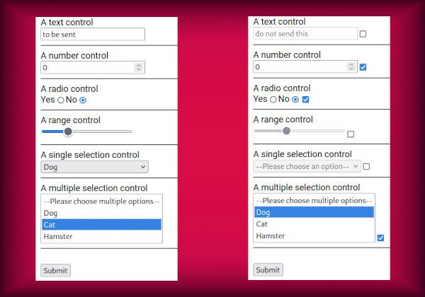
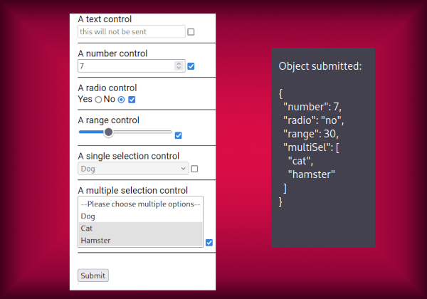

---
{
title: "Angular forms: checkbox disabling controls",
published: "2023-01-09T10:24:47Z",
tags: ["angular", "typescript", "webdev", "javascript"],
description: "How to write a directive to add it.            And why you shouldn't.   If as a coder you...",
originalLink: "https://dev.to/playfulprogramming-angular/angular-forms-checkbox-disabling-controls-29np",
coverImg: "cover-image.png",
socialImg: "social-image.png",
collection: "Generic directive disabling form controls",
order: 1
}
---

\##How to write a directive to add it.
And why you shouldn't.
----------------------

If as a coder you never found yourself having wasted an unjustifiable amount of time trying to automatize a procedure, just to realize that rewriting it for the couple of times it was actually needed took 1/1000 of resources...
**YOU'RE A LIAR!!!**

Be honest: everyone, at least at the beginnings, fell for that trap called *premature optimization*, [the root of all evil](https://en.wikiquote.org/wiki/Donald_Knuth) perfectly summarized in this over-used xkcd strip:

(I know, this is just a "nuance" of many kinds of premature optimization issue, but that's the one we're gonna talk about).

What we'll be showing in this article is an example of those situations: a mildly frequent necessity involving fairly amount of modifications to DOM tree. Something that in real usecase scenarios styled with tools already complex enough on their own, will leave you with the feeling that huge pile of trade-offs and workarounds is not worth the effort.
So, we'll use the pretense of implementing a directive adding a checkbox element to any of our form controls letting users capable of disabling them, to explore some Angular tools aiming at manipulating the project a bit over basic framework use.

---

## Useless harness

In this first article we'll use as example a pure HTML form, with plain controls without any styling, separated by native `<hr>` tags (we're not even using a list).
This is something you'll never encounter in everyday coding (unless you're among the lucky ones forced to work on an early '90s codebase), but will let us focus on the generic technic to be issued for our goal.

On the left there's our plain form, and on the right what we wanna achieve just applying a directive to every control in our template (we could design our directive to be applied on the form itself and issuing its logic for every child control, but let's keep it even simpler).


Here we got its template

```html
<form [formGroup]="plainForm" (ngSubmit)="showSubmitObject()">
    <label>A text control</label><br>
    <input formControlName="text" selectablePlain><hr>
    <label>A number control</label><br>
    <input formControlName="number" type="number" selectablePlain><hr>
    <label>A radio control</label><br>
    <div>
        <label for="yes">Yes</label>
        <input formControlName="radio" type="radio" value="yes" id="yes">
        <label for="no">No</label>
        <input formControlName="radio" type="radio" value="no" id="no" selectablePlain>
    </div><hr>
    <label>A range control</label><br>
    <input formControlName="range" type="range" selectablePlain><hr>
    <label>A single selection control</label><br>
    <select formControlName="singleSel" selectablePlain>
        <option value="">--Please choose an option--</option>
        <option value="dog">Dog</option>
        <option value="cat">Cat</option>
        <option value="hamster">Hamster</option>
    </select><hr>
    <label>A multiple selection control</label><br>
    <select formControlName="multiSel" multiple selectablePlain>
        <option value="">--Please choose multiple options--</option>
        <option value="dog">Dog</option>
        <option value="cat">Cat</option>
        <option value="hamster">Hamster</option>
    </select><hr>
    <br>
    <button>Submit</button>
</form>
```

You can notice every control has been applied not only with the usual `formControlName` directive binding it to relative `FormControl` in code, but with a `selectablePlain` too: the selector for our directive that's gonna be.
Nothing else peculiar, I used most common types of control: text, number, radio, range, select and multi-select.
And here's its binding code

```ts
export class PlainControlsComponent {

  plainForm = new FormGroup({
    text: new FormControl(''),
    number: new FormControl(0),
    radio: new FormControl('no'),
    range: new FormControl(0),
    singleSel: new FormControl(''),
    multiSel: new FormControl([]),
  });
}
```

## Visualize our goals

We can separate the expected functionalities of our directive in two tasks:

- **DOM manipulation**: it should add an `<input type="checkbox">` node just beside every template's controls elements
- **model alteration**: *formControls* have to be enabled/disabled by user interaction with our checkboxes

While the latter is quite straightforward, because it's basically how every JS/TS framework's form interaction package is supposed to be used, the first one could present more than one issue to be implemented, even if in our purposely limited specific test case all the tricky aspects will be kept aside.

## Show the code

### Decorator definition and constructor injection:

```ts
@Directive({
  selector: '[selectablePlain]',
  standalone: true,
})
export class SelectablePlainDirective {

  constructor(
      private renderer: Renderer2,
      private hostEl: ElementRef,
      private ctrl: NgControl
  )
```

We set our selector to be used in template as `selectablePlain`, and in particular I declared this directive as `standalone`, new trend in Angular world (nothing would have changed declaring it in *@NgModule* like it was mandatory until Angular v14).
Then we inject some dependencies capable of executing our logic:

- [**Renderer2**](https://angular.io/api/core/Renderer2): an Angular abstraction on top of WebAPI's [Document](https://developer.mozilla.org/en-US/docs/Web/API/Document) and [Node](https://developer.mozilla.org/en-US/docs/Web/API/Node) interfaces, providing some safe methods to programmatically manipulate DOM elements at low level.
- [**ElementRef**](https://angular.io/api/core/ElementRef): injecting this class in a directive, we get access to an hosting element reference. In practice, we'll get in code an object wrapping DOM element to which directive is applied (`<input>`s or `<select>`s in our case)
- [**NgControl**](https://angular.io/api/forms/NgControl): this class is common ancestor to `NgModel`, `FormControlDirective` and `FormControlName`, meaning that injecting it in place of any specific subclasses makes our directive more versatile and not dependent on the specific `Form` implementation the user chose for his template (having we bound every control with a `formControlName` directive, we would have obtained the same result injecting `FormControlName` class).

### Constructor body

```ts
this.checkBox = this.renderer.createElement('input');
this.renderer.setAttribute(this.checkBox, 'type', 'checkbox');
```

Inside constructor body we use our *Renderer2* instance to create the element to be added: we can see its *createElement* method accepting just the name of the tag to be generated.
After that, we leverage its *setAttribute* method to assign the `type="checkbox"` to this `<input>` element just created as per our needs.

```ts
this.renderer.insertBefore(
    this.renderer.parentNode(this.hostEl.nativeElement),
    this.checkBox,
    this.renderer.nextSibling(this.hostEl.nativeElement)
);
```

What looks like such a convoluted call, it's just a fill-in for a missing *insertAfter* method.
Leveraging our injected *ElementRef*, we retrieve our hosting element stored into its `nativeElement` property, and pass it to a couple of calls used as arguments of *insertBefore*.
This method is supposed to insert a new node as **previous sibling** of a target one, and expects three arguments:

- parent of the target node
- new node to be inserted
- target node before which inserting new one

The trick is in the last one: we pass as target node **the next sibling** of our hosting element, leading renderer to actually put the new element between our hosting one and its next sibling (if any).

```ts
this.renderer.listen(
    this.checkBox,
    'change', 
    () => this.ctrl.disabled ? this.ctrl.control?.enable() : this.ctrl.control?.disable()
);
```

In the end, we attach a listener to our checkbox' `change` event, responsible of doing what is our real objective: if control is already disabled, a click on the checkbox should call enabling method, otherwise disable that.

### ngOnInit for late setup

As [this open ticket](https://github.com/angular/angular/issues/35330) demonstrates, `NgControl.control` gets populated only after *OnChange* lifecycle, so every *NgControl* property related to runtime control values is undefined in constructor.
That's why we need to put part of our logic inside *ngOnInit* lifecycle callback.

```ts
if (this.ctrl.control?.enabled) 
  this.renderer.setProperty(this.checkBox, 'checked', true);
```

Here we're setting the initial checkbox state: we don't wanna see a checkbox associated to a control initially disabled appearing as checked, nor vice-versa.
So we check the initial status of our control, and set our checkbox' `checked` property accordingly.

```ts
this.ctrl.statusChanges?.pipe(
  tap((status: string) => status === "DISABLED" 
        ? this.renderer.setProperty(this.checkBox, 'checked', false)
        : this.renderer.setProperty(this.checkBox, 'checked', true)
  )
).subscribe()
```

Last thing missing is the guarantee that every programmatically change in control status will be reflected in related checkbox status: if some piece of TS code at some point disables our control, it would be misleading seeing its bound checkbox showing a flag as if it was still enabled.
To avoid this, we subscribe to `NgControl.statusChanges` observable, unchecking our checkbox everytime it emits a `"DISABLED"` value, and doing the opposite for everything else it should produce (`"PENDING" | "VALID" | "INVALID"`).
Why we cannot rely on this for initial value too?
Because being it a *status*Changes** emitter, it will not emit control's initial value.
But we are working in Angular after all, so we surely are confident with RxJs operators and know that [startWith](https://rxjs.dev/api/operators/startWith) can do the trick here, so we fuse the last two snippets in a single one:

```ts
this.ctrl.statusChanges?.pipe(
  startWith(this.ctrl.control?.status),
  tap((status: string) => status === "DISABLED" 
        ? this.renderer.setProperty(this.checkBox, 'checked', false)
        : this.renderer.setProperty(this.checkBox, 'checked', true)
  )
).subscribe()
```

Now we can verify our controls are correctly disabled:



---

## Conclusions

Final result is satisfying, but we need to keep in mind our testcase was tailored for the sake of the example.
If model interaction can be bent to work as expected most of the times, the same can't be said for DOM manipulation, where an initial template just a bit less smooth than the unrealistic one we used in this post can lead to totally different outputs.
Real cases turn the creation of a general-purpose directive into an extremely time-wasting exercise, with little to no advantage compared to manually adding needed checkboxes anywhere we need them, maybe enriching them with a pure model-oriented custom directive, specific for the case.
We'll get a taste of the issue in the next article, where we will try to replicate this task with an Angular Material styled form.
