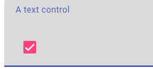
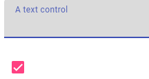
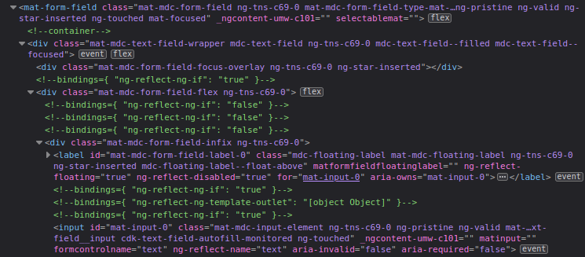
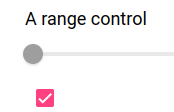
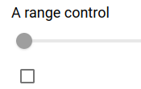

---
{
title: "Material forms: mat-checkbox disabling controls",
published: "2023-01-12T10:55:51Z",
edited: "2023-01-15T12:27:14Z",
tags: ["hackathon", "discuss", "community", "angular"],
description: "In previous article we analyzed a generic workflow for the creation of a directive capable of adding...",
originalLink: "https://dev.to/this-is-angular/material-forms-mat-checkbox-disabling-controls-2jc6",
coverImage: "cover-image.png",
socialImage: "social-image.png",
collection: "21325",
order: 1
}
---

In previous article we analyzed a generic workflow for the creation of a directive capable of adding a native checkbox element to a basic form in pure good-old HTML.
Now we'll try to replicate the idea on a more realistic usecase involving some common [Angular Material Components](https://material.angular.io/components/categories) often used in forms composition.
Here pitfalls and tradeoffs will be more evident and will probably make you questioning once more if a global directive of this kind is a convenient solution.

---

## Recap our goals

After reading first article of the series, it should be clear which features our checkbox should provide:

- reflect initial enabling status of bound control
  at start
- switch that status on click
- listen to any control status changing issued programmatically and modify its own state accordingly

This time we will setup a more realistic harness, a common structure for a really simple form:

- a `flex-direction: column` flexbox container to vertically host our controls one-per-line
- material elements wrapping our native controls
  - we will notice how Material makes extensive use of content projection, often flooding DOM tree beyond any expectation
  - we will consider to leverage some nice properties these wrapping components expose
- to be consistent with Material Design, our plain HTML `<input type="checkbox">` will be replaced by its glorified Material version [mat-checkbox](https://material.angular.io/components/checkbox/overview)

Our Angular Material reference version will be the new one (15.x) based on [Material Design Components for Web (MDC)](https://github.com/material-components/material-components-web).
Its API shouldn't be too different than previous versions, though.

This second version of our directive will get the selector: `selectableMat`, while we'll recycle the old model:

```ts
plainForm = new FormGroup({
    text: new FormControl(''),
    number: new FormControl(0),
    radio: new FormControl('no'),
    range: new FormControl(0),
    singleSel: new FormControl(''),
    multiSel: new FormControl([]),
  });
```

and here its template:

```html
<div class="container" [formGroup]="plainForm">
    <mat-form-field selectableMat>
        <mat-label>A text control</mat-label>
        <input matInput formControlName="text" >
    </mat-form-field>
    <mat-form-field selectableMat>
        <mat-label>A number control</mat-label>
        <input matInput formControlName="number" type="number" >
    </mat-form-field>
    <label>A radio control</label>
    <mat-radio-group formControlName="radio" selectableMat>
        <mat-radio-button value="yes">Yes</mat-radio-button>
        <mat-radio-button value="no">No</mat-radio-button>
    </mat-radio-group>
    <label>A range control</label><br>
    <mat-slider selectableMat>
        <input formControlName="range" matSliderThumb >
    </mat-slider>
    <mat-form-field selectableMat>
        <mat-label>A single selection control</mat-label>
        <mat-select formControlName="singleSel" >
            <mat-option value="">--Please choose an option--</mat-option>
            <mat-option value="dog">Dog</mat-option>
            <mat-option value="cat">Cat</mat-option>
            <mat-option value="hamster">Hamster</mat-option>
        </mat-select>
    </mat-form-field>
    <mat-form-field selectableMat>
        <mat-label>A multiple selection control</mat-label>
        <mat-select formControlName="multiSel" multiple >
            <mat-option value="">--Please choose multiple options--</mat-option>
            <mat-option value="dog">Dog</mat-option>
            <mat-option value="cat">Cat</mat-option>
            <mat-option value="hamster">Hamster</mat-option>
        </mat-select>
    </mat-form-field>
    <button (click)="showSubmitObject()">Submit</button>
</div>
```

Don't worry, we're gonna examine every control one by one.

## Replacing plain checkbox with fancy `mat-checkbox`: nice, but...

We already said that, being in a Material environment, we want to replace our plain old browser-styled checkbox with a *posh* `MatCheckbox` component.
Sounds good, but there's a problem: `mat-checkbox` is not a registered element, thus our *Renderer2* cannot call *WEBApi's Document* interface to create it.
We got to dynamically generate it as a component in the Angular way.
This means that our directive will have to get a reference of its host element's *ViewContainer*, and append inside it the newly generated checkbox *View*.
It's way easier than it sounds, and we can see it in action in the early lines of our directive:

```ts
disablingCheckbox: ComponentRef<MatCheckbox>;
constructor(
    private vcr: ViewContainerRef,
    ...
) {
  this.disablingCheckbox = this.vcr.createComponent(MatCheckbox) 
  ...
```

We declare a property typed as a *ComponentRef* generated by a *factory* of *MatCheckbox* components to have access to its properties later, inject in constructor the *ViewContainerRef* of the element to which the directive has been applied, and then create an instance of the component through `ViewContainerRef.createComponent`, without passing any *index* argument, so that the method will append it as *ViewContainer*'s last child.

Here we got to stop a second and do some considerations: since we need to access the host's *ViewContainerRef*, we got to carefully ponder over the element on which applying our directive selector, because it will condition not only the tokens we can access without querying, but the *View* after which the `MatCheckbox` will be rendered, too.
Let's try to explain with an example, involving a mat-form-field:
If we were applying our directive to the inner `<input>`

```html
<mat-form-field>
    <mat-label>A text control</mat-label>
    <input matInput formControlName="text" selectableMat>
</mat-form-field>
```

we would have been able to inject `NgControl` directly in constructor, but our `<mat-checkbox>` would have been rendered as last child of `<mat-form-field>`, inheriting its styling and state.
`<mat-form-field>` wrap its children inside a `flex-direction: column` flexbox container, so our checkbox will be placed **below** its last child.
Imagine if we had chosen an horizontal layout, using `flex-direction: row` for our main container: we would have expected to get our checkbox rendered **beside** the form field


instead, being it child of the view that's inside `<mat-form-field>`, it's actually part of the element and positioned below every other children of it



And that's not even the worst problem: as a children of the very same element it's in charge to disable, when unchecked it will inherit the `disabled` state from its parent, starting a chain with unpredictable consequences (the better, letting the binding *form-field & checkbox* in an inconsistent state).

That's why we prefer to apply our directive directly on the wrapper element,

```html
<mat-form-field selectableMat>
    <mat-label>A text control</mat-label>
    <input matInput formControlName="text">
</mat-form-field>
```

this way our checkbox will be placed inside that element's *ViewContainer*, and not inside element itself, following the layout we defined for its container, and not receiving any state or event from the control it's commanding.
For our vertical layout this will be the result:



Our requirement could easily be a vertical layout but with the checkbox placed **beside** related control.
Unfortunately there's not a clean way to instruct a directive to do that, and the best solution would be forcing the user to put every single material control wrapper element inside a parent one, on which applying our directive to style that per our needs.
This would defeat the basic idea of a general purpose directive acting on DOM structure: at that point I'm more in favor of one limiting its functionalities to the model, to be applied to a checkbox placed and styled by the user manually in template

## How it should be: `<mat-form-field>`

For most common elements available in a form, `select`s and text-like `input`s, both *native* both in *Material* variants,  Angular Material allows the use of the wrapper [mat-form-field](https://material.angular.io/components/form-field/overview).
We will not spend time explaining all the structural and styling modifications it applies to wrapped control, but will focus on some property it exposes, and that *apparently* could be of interest for the functionalities of our directive.
Anyway, to understand the complexity of the DOM manipulation Material applies, look at how this basic template

```html
<mat-form-field>
    <mat-label>A text control</mat-label>
    <input matInput formControlName="text">
```

flourishes in this branch after rendering



Back to the API it exposes, most important class is `MatFormFieldControl`, provided by all supported control elements: for native `<input>` and `<textarea>` through the application of `matInput` directive, and automatically by `<mat-select>` and `<mat-chip-list>`.
Among its properties one in particular catches our interest: `disabled`.
It could serve our project, if only looking at its code we wouldn't realize that

- it's a readonly property: thus it's supposed to be accessed just to check status of the control, and not as a setter
- it's a plain `boolean`, not a reactive property like an `Observable<boolean>`, so it cannot be listen to on its own to get live status of the control

One looking more promising is

```ts
ngControl: NgControl | AbstractControlDirective | null
```

We're familiar with `NgControl`, we used it in our plain HTML example, and it offers all we need.
Its union type is due to `MatFormFieldControl` being assignable to controls that can be nullable, and to `FormGroup` and `FormaArray` too, that extend `AbstractControlDirective` through their common ancestor `ControlContainer`, but not its subclass `NgControl`.
That's actually not a big problem, considering properties interesting for our usecase are part of the parent class.
Anyway, typings could be a little annoying, considering that `MatFormFieldControl` is obviously generic, so we should specify its type at injection time other than managing union type of returned value.
So: save ourself a bit of type-narrowing confusion, and access our `NgControl` the old way, simply querying for it in our projected content:

```ts
@ContentChild(NgControl) ctrl!: NgControl;
```

Nothing different than what `MatFormField` does [in its code](https://github.com/angular/components/blob/main/src/material/form-field/form-field.ts#L168), so even the lifecycle access constraint will be identical.

Having retrieved it as `@ContentChild` we got to put our logic inside `ngAfterContentInit()`, where it will result defined

```ts
ngAfterContentInit() {
          
  this.disablingCheckbox.instance.change.subscribe(
    v => v.checked ? this.ctrl.control?.enable() : this.ctrl.control?.disable()
  );
...
```

We leverage `@Output() change: EventEmitter<E>` from `MatCheckbox` class to react to user interactions with our checkbox and, through the `control` property of the `NgControl` we queried, set the status of `FormControl` accordingly.

Now, the other way of the binding:

```ts
this.ctrl.control?.statusChanges?.pipe(
  startWith(this.ctrl.control?.disabled ? 'DISABLED' : ''),
  tap((status: string) => status === 'DISABLED' 
        ? this.disablingCheckbox.setInput('checked', false)
        : this.disablingCheckbox.setInput('checked', true)
  )
).subscribe()
```

Remembering from last articles that `NgControl.statusChanges` does **not emit for control initial status**, we pipe our observation to the usual `startWith` emitting a string relatable to the real initial status of the control.
After that, for every emission we'll call `ComponentRef.setInput`, [introduced in Angular 14.1](https://angular.io/api/core/ComponentRef#setInput), on our *MatCheckbox* instance, that will take care of managing change detection cycles for us, while keeping checkbox state consonant with control status.

## Outside `<mat-form-field>` things start to branch

`<mat-form-field>` is designed to host a limited amount of controls element types as we already explained, so for `type="radio"` and `type="range"` in our example we need to setup something different.

[MatRadioGroup](https://material.angular.io/components/radio/api) looks like *Material* component appointed to manage radio type selectors.

```html
<mat-radio-group formControlName="radio" selectableMat>
    <mat-radio-button value="yes">Yes</mat-radio-button>
    <mat-radio-button value="no">No</mat-radio-button>
</mat-radio-group>
```

First difference we notice is that in this case `formControlName` is applied to the top-most element together with our directive.
`MatRadioGroup` class is the one providing `NG_VALUE_ACCESSOR`, and that actually makes its use a bit more sound than pure HTML example, where the same `formControlName` binding was applied to every `<input type="radio">`
This leads to the need of some changes in our approach, because with this configuration `NgControl` cannot be queried as content, being it directly provided by the host we're targeting.

We could pass an optional `NgControl` typed argument  in constructor, or as I prefer for readability:

```ts
@ContentChild(NgControl) 
ctrl!: NgControl;
_radioCtrl?: NgControl;
constructor(
    private vcr: ViewContainerRef,
    private el: ElementRef,
) {
  
  if (this.el.nativeElement.nodeName === 'MAT-RADIO-GROUP') {
    this._radioCtrl = inject(NgControl);
  }
  ...
```

We defined a new optional property `_radioCtrl` typed as `NgControl`, and inside constructor body we use `inject()` function [introduced in Angular 14](https://angular.io/api/core/inject), to assign hosting View's `NgControl` instance to it, only after having checked `nodeName` property of hosting element retrieved by `ElementRef` will match the one for `MatRadioGroup`.

```ts
ngAfterContentInit() {

  if (this.el.nativeElement.nodeName === 'MAT-RADIO-GROUP') {
    this.ctrl = this._radioCtrl!;
  }
  ...
```

Since we wanna keep a common logic no matter which type of control is exposing its `NgControl`, we got to be sure to assign our freshly created `_radioCtrl` to generic `ctrl` property.
But we cannot do this directly in constructor, otherwise it would be overwrote by `@ContentChild` initialization, resulting in `undefined` for `MatRadioGroup` components (remember: for this type of control, `formControlName` directive is applied to hosting component directly, not to its projected `<mat-radio-button>`s).
So we put this logic in `ngAfterContentInit()`, and
like we've done for its injection, we do this only after having checked hosting element nodeName.

## The sore point: `<mat-slider>`

Last typology of input left to manage is our `type="range"`.
In general, this type of control doesn't get too much cheers when it shows up in a form.
Styling is far from trivial, even for enterprise-level framework like Bootstrap or Material.
But I got to say: Angular Material reaches a whole new level of entanglement with its [mat-slider](https://material.angular.io/components/slider/overview)!

Maybe for the strange nature of range control itself, or for the choice to enrich its functionality adding an optional second thumb to let the user select an interval of values... its implementation is really something.
Theoretically it should be quite a smooth operation:

```html
<mat-slider selectableMat>
    <input formControlName="range" matSliderThumb>
</mat-slider>
```

We apply our directive to wrapping element, planning to access `NgControl` through `@ContentChild` like we did for `MatFormField`.
But we didn't reckon with `matSliderThumb`!
This directive has to be applied to the inner `<input>` element (that internally gets assigned `type="range"`), because it registers as *ControlValueAccessor*, giving form capabilities to its parent `MatSlider`.

Yet its behaviour seems to interfere with normal change detection recognition of the input it's bound to.
For what we've seen, our directive current implementation should deal flawlessy with this new control, because it has a structure comparable with the one of `MatFormField`, but if we try to assign an initial `disabled` status to our range control

```ts
...
range: new FormControl({value: 0, disabled:true}),
...
```

or to add a button triggering a programmatically call to its `FormControl.disable()` method

```html
<button (click)="disableRange()">Disable</button>
```

```ts
disableRange() {
  this.plainForm.controls.range.disable();
}
```

we'll notice that our dedicated checkbox' state doesn't follow control status change.



Look at the inconsistency between disabled control but flagged checkbox.

In its *setter* role it works correctly: a first click will uncheck the box without toggling control status, and following ones will act as they're supposed to do.
This means that the problem resides in its *listening* role

```ts
this.ctrl.control?.statusChanges?.pipe(
  startWith(this.ctrl.control?.disabled ? 'DISABLED' : ''),
  tap((status: string) => status === 'DISABLED' 
        ? this.disablingCheckbox.setInput('checked', false)
        : this.disablingCheckbox.setInput('checked', true)
  )
).subscribe()
```

Debugging at runtime we can see that, unlike what happens with `MatFormField`, even inside `ngAfterContentInit()` the property `ctrl.control`, that reflects the runtime status of underlying `AbstractControl` for `NgControl`, is still not initialized as one would expect, returning `undefined` and missing the subscription on `statusChanges` event emitter.

The evidence we're facing a timing issue is presented by this ugly hack, where just for testing we register our subscription inside MacroTask by `setTimeout`

```ts
setTimeout(() => this.ctrl.control?.statusChanges?.pipe(
  startWith(this.ctrl.control?.disabled ? 'DISABLED' : ''),
  tap((status: string) => status === 'DISABLED' 
        ? this.disablingCheckbox.setInput('checked', false)
        : this.disablingCheckbox.setInput('checked', true)
  )
).subscribe())
```

As we can see, control's disabled status, be it set as initial value or asynchronously, is reflected by checkbox state



At the moment I didn't find any elegant solution to overcome the issue, so whoever should know better is welcome in comments as usual. :smiley:

---

## Conclusions

The goal of this short series is to make people aware of difficulties they can encounter while trying to "generalize" a task that looked repetitive at the limit of copy/pasting.
I think it's now clear that the more advanced the underlying framework for styling and model/view binding, the more challenging the task become.
My suggestion is to always "abstract" something when this **actually** represents itself a fair amount of times, and not when **we think** it's something that will come again often.
Maybe there will be another short episode of this series due to my interest in Bootstrap, but in any case, thanks for reading 'til down here.
