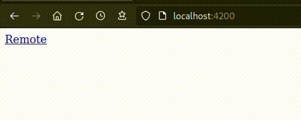
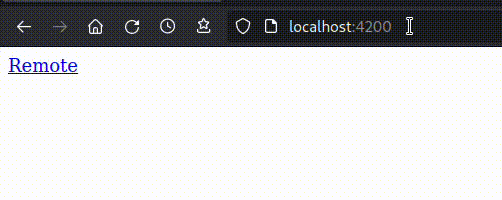
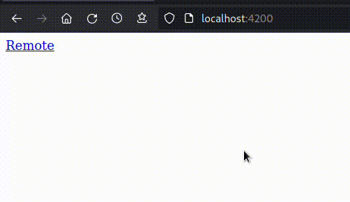
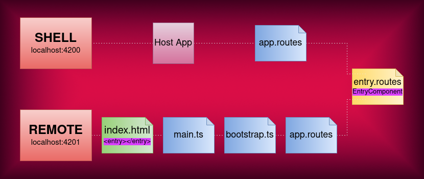
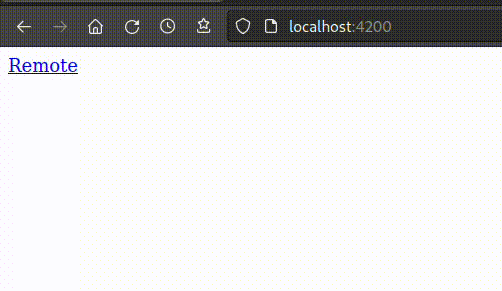

---
{
title: "Nx Module Federation bad Angular routing",
published: "2023-01-22T12:37:33Z",
edited: "2023-01-23T18:19:00Z",
tags: ["angular", "nx", "typescript", "webpack"],
description: "While puzzling around with Nx' Webpack Module Federation support, I stumbled upon an issue that...",
originalLink: "https://dev.to/this-is-angular/nx-module-federation-bad-angular-routing-1ac9",
coverImage: "cover-image.png",
socialImage: "social-image.png"
}
---

While puzzling around with Nx' Webpack Module Federation support, I stumbled upon an issue that strangely looks like none cared about before.
I'm talking about duplication of remote component in presence of a `<router-outlet>` in its template, when served as independent app.
Its poor traction could be due to the fact the bug shows up only using an Angular Standalone Components setup, at least for remotes.

---

## The issue

I will take for granted the creation of a Module Federated Angular app [under Nx](https://nx.dev/recipes/module-federation/dynamic-module-federation-with-angular).
After scaffolding, we should have an `host` app acting as **shell** of our multi-module project, and at least one `remote` app.
Both of them are Micro-Frontends, meaning they are capable of running on their own, even the remote one.
That comes clear issuing `nx serve host_project_name`, where they will be served independently, giving you the chance to look at their behaviour both when remote is accessed as child route of the host, both when it's booted as standalone app.

To make thing barely functional, our host app consists of a single dumb component with two lines template:

```ts
@Component({
  selector: 'testapp-root',
  template: `
             <a routerLink="remote_app">Remote</a>
             <router-outlet></router-outlet>
            `,
})
export class RemoteEntryComponent {}
```

Just an anchor linking to the remote, and a `router-outlet` under which the child will be rendered.

Similarly, the remote will be just a visual aid to show our issue

```ts
@Component({
  selector: 'testapp-remote1-entry',
  template: `
              <div style="background-color: blue; height: 100px; width: 100px; margin: 5px"></div>
            `
})
export class RemoteEntryComponent {}
```

Here we got merely a square div coloured in blue.

That's it.
Let's look at what gets served, then.
For our `host` app we'll get just the link, that once clicked will route to the remote, that will appear right under it (and under `host`'s `<router-outlet>`)



If we browse to the standalone remote served app, by default reachable at *host\_port*+1, thus on `http://localhost:4201` for a classic setup, we'll see our remote content, the blue square, immediately rendered and no host's anchor element, as expected.



So, where's the problem?
The issue we're talking about arises if we add a `<router-outlet>` element to our *remote*.
This is quite a common situation: many times our microfrontend will have its own internal routing, with child paths and obviously a `router-outlet` under which rendering them.
This is our modified remote

```ts
@Component({
  selector: 'testapp-remote1-entry',
  template: `
              <div style="background-color: blue; height: 100px; width: 100px; margin: 5px"></div>
              <router-outlet>
            `
})
export class RemoteEntryComponent {}
```

In this short GIF we can see how it still works flawlessy when rendered as child of our `host` app, while acting really strangely when browsing to its standalone serving:



Our remote is rendered twice!

---

## The reason

To understand the reason behind this wrong behaviour, we got to dive a little deep into tech used by **Nx** plugins to manage **Webpack Module Federation** for Angular apps.
For the `host` app there's nothing too fancy: it gets served as standalone, and if needed is able to load external modules through a little twist of normal routing:

```ts
{
  path: 'remote_app',
  loadChildren: () =>
    loadRemoteModule('rem1', './Routes').then((m) => m.remoteRoutes),
}
```

See how as callback of Angular Router's `loadChildren`, instead of classic `import(path/to/lazy_loaded.module)` we got a call to **Nx** provided  `loadRemoteModule('remote_module_name', './exposed_routes_path')`.

Inside our remote's `module-federation.config.js` there's the mapping for arguments passed to that call:

```ts
module.exports = {
  name: 'rem1',
  exposes: {
    './Routes': 'apps/rem1/src/app/remote-entry/entry.routes.ts',
  },
};
```

So: the `host`'s Router will look inside `remote`'s `entry.route.ts` to know which child routes it could render.
This is default generated `entry.route.ts`

```ts
export const remoteRoutes: Route[] = [
  { path: '', component: RemoteEntryComponent },
];
```

As we could imagine, there's just a root path `''` pointing to default `remote`'s root component, commonly referred as *entry component*.
This is nice for a situation where our `remote` is treated as accessory module of a main app.
All its structure is just a lazy-loaded branch inside `host` routing tree.

Things drastically change when our `remote` has to be served as an independent app.
Without a "parent" app already up and running, it needs to be bootstrapped as any other Angular application.
The flow **Nx** relies on starts with the usual serving of an `index.html` built upon a template like this:

```html
<!DOCTYPE html>
<html lang="en">
  <head>...</head>
  <body>
    <testapp-remote1-entry></testapp-remote1-entry>
  </body>
</html>
```

In place of **Angular-cli** generated `<app-root></app-root>` selector assigned to `AppComponent`, `body` has been populated with our custom remote entry component's selector.
The code then sources `main.ts` as always, that delegates to `bootstrap.ts` file.
Here takes place the actual application bootstrapping, that for an [Angular Standalone Components setup](https://angular.io/guide/standalone-components) (concept unrelated to *standalone* serving of our remote, don't get confused) could be enough something like:

```ts
bootstrapApplication(RemoteEntryComponent)
```

**Nx** remotes generator takes one step further providing to our Router eventual inner routes defined for this remote:

```ts
...
import { appRoutes } from './app/app.routes';

bootstrapApplication(RemoteEntryComponent, {
  providers: [
    importProvidersFrom(
      RouterModule.forRoot(appRoutes, { initialNavigation: 'enabledBlocking' })
    ),
  ],
});
```

This `./app/app.routes` simply lazy loads the same `entry.routes` file exposed to our `host` app.

```ts
export const appRoutes: Route[] = [
  {
    path: '',
    loadChildren: () =>
      import('./remote-entry/entry.routes').then((m) => m.remoteRoutes),
  },
];
```

And here comes the problem!
We've already seen that file provides a route to root path `''` rendering the root component of our remote.
But in our remote independent serving that component is already rendered due to its reference inside remote's `index.html` template.
This graph should be explanatory enough:



As the purple highlighted labels emphasize, the path to rendering of the entry component for independent remote serving encounters **two different** locations asking for it.
That entry component is actually both **declared** both **routed**.



> Because **Nx** remotes generator for classic ng-modular setup doesn't need to declare the entry component inside `index.html`.
> It declares a separate root component (`AppComponent`) hosting a `<router-outlet>` and imports `RouterModule` inside root module (`AppModule`).
> This way the same route referring to entry component will be correctly rendered just once both for *Shell* setup than for independent remote serving.

---

## My solution

The problem can be probably solved in many ways, since every sane solution involves a partial rewriting of **Nx** generators for *remotes* built upon *Angular standalone components*.

Mi idea is to distinguish the purpose of `remote`'s `app.routes` and `entry.routes`.
At the moment the former simply lazyloads the second, leading to an identical initial routing flow for both serving contexts.
Instead I thought of turning `app.routes` into the real route provider for `remote`, and leaving `entry.routes` just as a "plugin" invoked only in *Shell* serving context, keeping needed root path pointing to entry component, and importing `app.routes` to use defined routes as its children.

To do this, first we modify `app.routes`, removing its `entry.routes` lazy load, and adding our `remote` children routes to its array.
To keep `entry.routes` inside our compilation unit we move its `import` outside of routes definition, so it will be still compiled and exposed by our federation configuration, but ignored by our router during independent serving:

```ts
/* commented-out original default entry.routes import 
export const appRoutes: Route[] = [
  {
    path: '',
    loadChildren: () =>
      import('./remote-entry/entry.routes').then((m) => m.remoteRoutes),
  },
]; */

import('./remote-entry/entry.routes')

export const appRoutes: Route[] = [
  { path: 'first_child_route', component: FirstChildRouteComponent },
  { path: 'second_child_route', component: SecondChildRouteComponent },
  { path: 'third_child_route', component: ThirdChildRouteComponent }, 
]
```

Now we can edit `entry.routes`, enriching its only route with an array of children, simply importing the one defined in `app.routes`

```ts
import { appRoutes } from '../app.routes';
import { RemoteEntryComponent } from './entry.component';

export const remoteRoutes: Route[] = [
  { 
    path: '',
    component: RemoteEntryComponent,
    children: appRoutes
  }
];
```

In the end we can appreciate the result of our efforts, looking at our blue square rendered a single time for any serving methodology:



---

## Conclusions

I think **Nx** support for Angular standalone components federation is still a bit "unripe".
I found a couple oddities in its implementation I'll spend some words about in a future article, maybe.
It does a great job though, raising the coder from writing a lot of boilerplate and, considering I'm not exactly an expert in this field, there's the chance some of the things looking like "flaws" to me, were real solutions for cornercases or common use scenarios I didn't think of.
For the very same reason, the one I presented as a "solution" could be sub-optimal if not even wrong for other situations.
I didn't test it extensively, that's why as usual you're highly encouraged to leave a comment if anything doesn't sound right.

Anyway, I opened a ticket for this specific bug, and issued a PR with my suggested solution:

<!-- ::start:link-preview -->
[Duplicate entry component rendering for standalone ng component served as independent frontend](https://github.com/nrwl/nx/issues/14551)
<!-- ::end:link-preview -->

Cheers.
