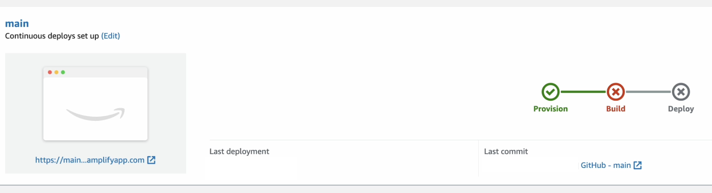
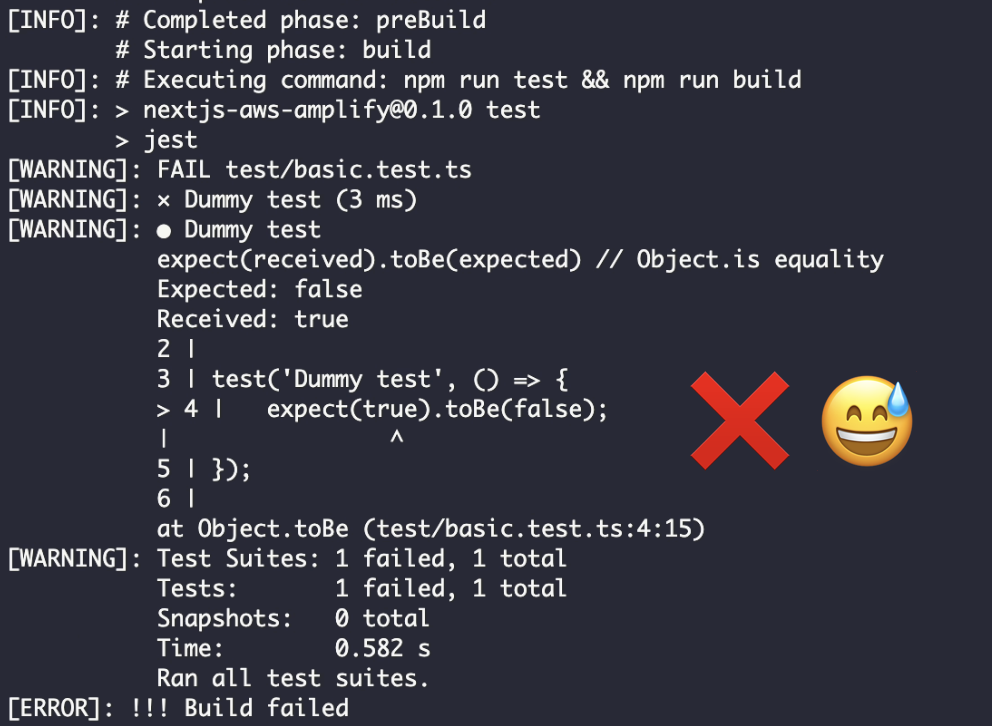
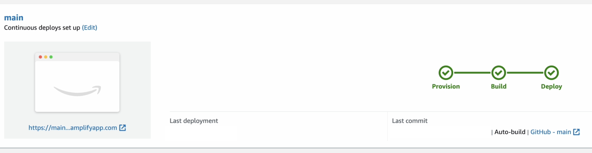
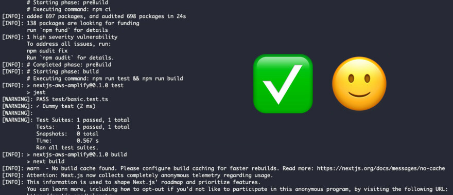

---
{
title: "AWS Amplify: Let's add some unit tests into our pipeline",
published: "2023-01-06T13:18:11Z",
tags: ["aws", "cloud", "testing", "webdev"],
description: "In the previous article, we saw how to set up a pipeline with AWS Amplify, but as long as things are...",
originalLink: "https://dev.to/this-is-learning/aws-amplify-lets-add-some-unit-tests-into-our-pipeline-5f7l",
coverImage: "cover-image.png",
socialImage: "social-image.png",
collection: "CI/CD pipelines with AWS Amplify",
order: 2
}
---

In the previous article, we saw how to set up a pipeline with AWS Amplify, but as long as things are simple everything works.
Let's complicate the pipeline, we will see how it is possible to customise the build phase by adding tests.

---

ℹ️ The goal is to run unit tests with [Jest](https://jestjs.io/) in the AWS Amplify pipeline.

---

## AWS Documentation

> You can edit an app's build settings in the Amplify console by choosing App settings, Build settings. The build settings are applied to all the branches in your app, except for the branches that have an amplify.yml file saved in the repository.

Reading the AWS documentation, we can find how to add the test steps in the deployment process and it seems easy.<br>

In the *amplify.yml* file is possible to add the tests section 🎉

e.g *amplify.yml* with test phases

```yml
version: 1
frontend:
  phases:
    [...]
test:
  phases:
    preTest:
      commands:
        - *enter command*
    test:
      commands:
        - *enter command*
    postTest:
      commands:
        - *enter command*
  artifacts:
    files:
        - location
        - location
    configFilePath: *location*
    baseDirectory: *location*
```

...but if we read in the detail, however, there is a small annotation 🥲

> You can run end-to-end (E2E) tests in the test phase of your Amplify app to catch regressions before pushing code to production. The test phase can be configured in the build specification YML.
> 👉 Currently, you can run only the Cypress testing framework during a build. 👈

[AWS docs](https://docs.aws.amazon.com/amplify/latest/userguide/running-tests.html)

But the goal was to run unit tests and so my reaction was…


## Workaround

I searched a lot for a possible solution and through various tests, I found a way to get to my goal.
Here is the solution: before running the build let's run the test script, this is a simple and effective way. 🚀

```yml
version: 1
frontend:
  phases:
    preBuild:
      commands:
        - npm ci
    build:
      commands:
        - npm run test && npm run build
  artifacts:
    [...]
  cache:
    paths:
      - node_modules/**/*
```

## Final result

I simulated both the situation with passing tests and failing tests.

### Test failed





### Test passed





## Final thought

🎉 I'd say the build configuration is pretty straightforward, good job AWS Amplify team 😄

You can [follow me on Twitter](https://twitter.com/giorgio_boa), where I'm posting or retweeting interesting things.

I hope you enjoyed this article, don't forget to give ❤️.
Bye 👋


