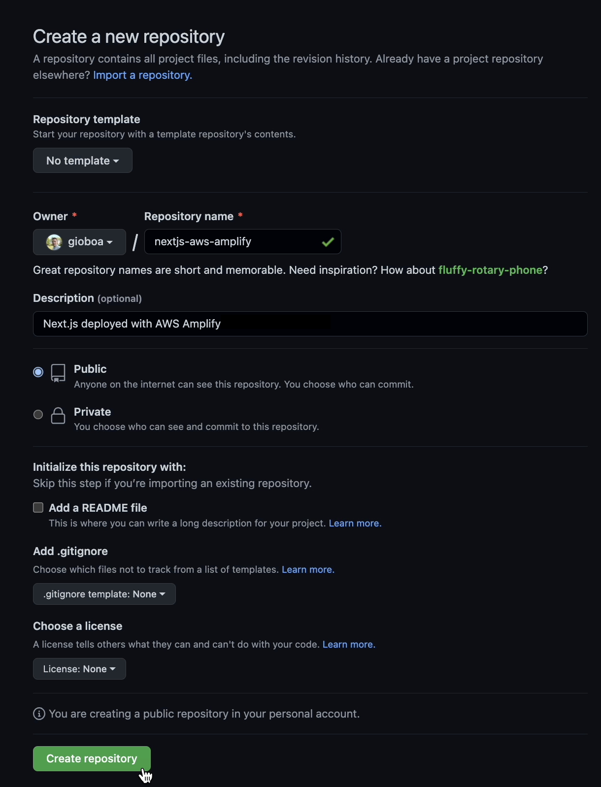
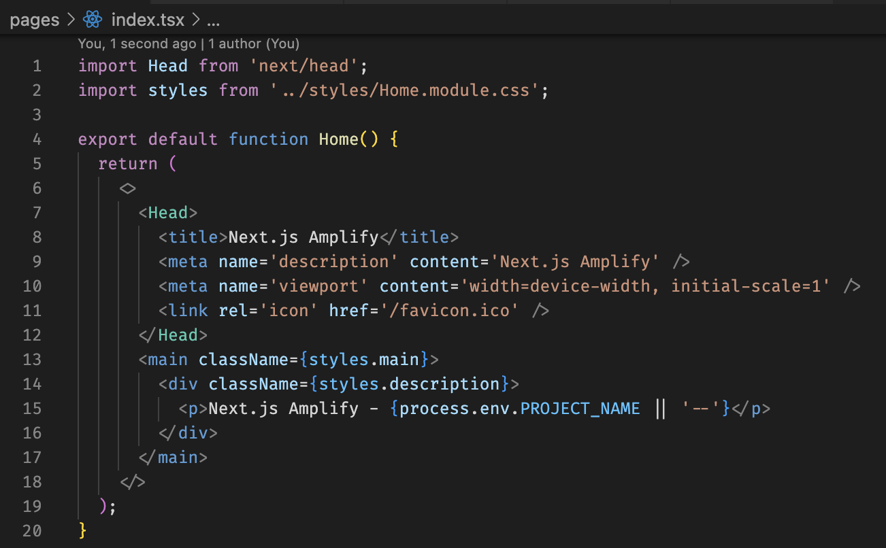

---
{
title: "CI/CD pipelines with AWS Amplify",
published: "2022-12-30T09:54:59Z",
edited: "2023-01-05T08:13:01Z",
tags: [],
description: "The company I work for is an AWS partner and it is natural that many of the applications we build are...",
originalLink: "https://https://dev.to/playfulprogramming/cicd-pipelines-with-aws-amplify-5a1b",
coverImg: "cover-image.png",
socialImg: "social-image.png",
collection: "CI/CD pipelines with AWS Amplify",
order: 1
}
---

The company I work for is an AWS partner and it is natural that many of the applications we build are based on the services offered by Amazon.

We're migrating our CI/CD pipelines to AWS Amplify and I will show you how we can achieve great results with just a few clicks.

---

The example is based on a [Next.js](https://nextjs.org/) application hosted on GitHub.<br>

<br>

To initialize the application we can use the command:
`npx create-next-app@latest --typescript`<br>
Once the starter is created, we edit the file
`pages/index.tsx`
replacing the boilerplate with this code:<br>

<br>

An environment variable is used here. We have to configure it in the Next.js configuration file
`next.config.js`

````json
const nextConfig = {
  [...]
  env: { PROJECT_NAME: process.env.PROJECT_NAME, },
}
module.exports = nextConfig
````

We can test the app locally by creating a `.env.local` file to set the environment variable<br>

<br>

After we sync the project with remote GitHub, we're ready to move on to the deployment part.

## AWS Amplify

Once logged into the AWS console, let's search for the Amplify service.<br>

<br>

### Configuration

Click on _Host web app_<br>

<br>

here we can connect our GitHub account and select the project we just created<br>

<br>

<br>

Click on _Next_, here we can configure the build and we can set our environment variable<br>

<br>

<br>

### Build & Deploy

🚀 The build and the deployment will be performed automatically<br>

<br>

### Final result


---

This is the first article on AWS Amplify, if you find the topic interesting give ❤️ and I will write more about it. Bye 👋

You can [follow me on Twitter](https://twitter.com/giorgio_boa), where I'm posting or retweeting interesting articles.

<!-- ::user id="gioboa" -->
