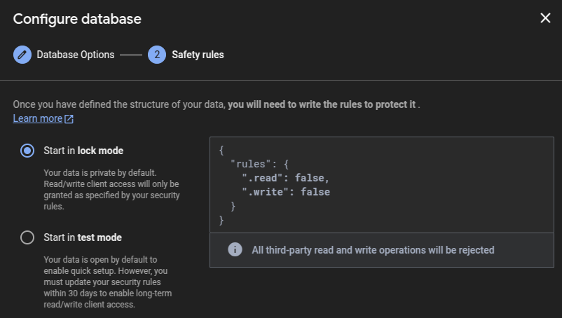
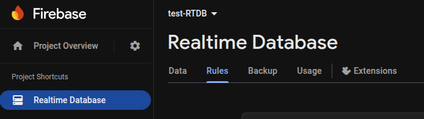

---
{
title: "Exploring Firebase Database Security Rules",
published: "2025-03-26T10:44:55Z",
edited: "2025-03-26T10:52:28Z",
tags: ["firebase", "database", "programming", "security"],
description: "Firebase Realtime Database offers incredible power and ease-of-use for building collaborative,...",
originalLink: "https://dev.to/this-is-learning/exploring-firebase-database-security-rules-1kmk",
coverImage: "cover-image.png",
socialImage: "social-image.png"
}
---

Firebase Realtime Database offers incredible power and ease-of-use for building collaborative, real-time applications.
However, its public-facing nature means security is not just an option—it's a fundamental requirement.

> Misconfigured security rules can leave your data vulnerable to unauthorized access, modification, or deletion.

## Security Rules

Security Rules are server-side configurations that define who can access your database data, how they can access it (read/write), how your data should be structured, and which fields should be indexed for querying. They are written in a JavaScript-like expression language within a JSON structure.

> These rules are the primary mechanism for protecting your data in Firebase Realtime Database.

Since Firebase apps often involve more client-side logic and direct database access from the client, robust server-enforced rules are essential. Without proper rules, anyone guessing your project ID could potentially read, modify, or delete your entire database.

> By default, new databases start in "locked mode" (`.read: false, .write: false`) or "test mode" (allowing access for a limited time) to prevent accidental exposure.



Every single read and write operation attempted against your RTDB is evaluated against your security rules before any data access occurs. These rules live and are enforced on Firebase servers, ensuring that even a compromised or malicious client cannot bypass them. If the rules `allow the operation` for the specific path requested, `the operation proceeds`. If not, it's `rejected`, and the client receives a `"permission denied" error`.

## Manage rules

You can view and edit your rules directly in the Firebase Console.
Go to your Firebase project and navigate to "Realtime Database" in the left-hand menu. Select the "Rules" tab.



## Security Rules Syntax

Security rules are defined within a single JSON object, where the `keys represent paths in your database`, and the values are rule definitions for those paths.

```json
{
  "rules": {
    // Rules go here, matching your database structure
    "users": {
      // Rules for the /users path
    },
    "posts": {
      // Rules for the /posts path
    }
  }
}
```

## Security Rule Types

The following keys define behavior at a specific path:

### .read

A boolean expression (evaluating to `true` or `false`). If `true`, read operations (like `get`, `onValue`) are allowed at this path and potentially deeper paths.

### .write

A boolean expression. If `true`, write operations (like `set`, `update`, `remove`) are allowed at this path and potentially deeper paths.

### .validate

A boolean expression used to enforce data structure and format before a write occurs. It uses the `newData` variable to inspect the data being written.

> A write must pass validation at the specific path being written and all parent paths that have .validate rules.

### .indexOn ( crucial for performance )

You can specify which child keys should be indexed to optimize querying (`orderByChild`, `orderByValue`), the value is a string or an array of strings.

## Built-in Variables

Rules provide predefined variables to make context-aware decisions:

`auth` contains information about the authenticated user making the request (or `null` if unauthenticated). Includes `auth.uid` and `auth.token` (payload of the user's Firebase Auth ID token, including custom claims).

`root` is the rule data snapshot representing the root of your database before the attempted operation. Used to access data anywhere in the database. Use with caution, as cross-path reads can impact performance.

`data` is the rule data snapshot representing the data at the current path before the attempted operation. Used for validation based on existing state.

`newData` is the rule data snapshot representing the data at the current path as it would exist after the attempted write operation. Used primarily in `.write` and `.validate` rules to check the incoming data.

`now` is the current server timestamp in milliseconds since the Unix epoch. Useful for setting creation/modification timestamps and validation.

`$variable` is a wildcard variables capture path segments dynamically. (e.g., in `users/$userId`, `$userId` captures the specific user ID).

## Basic Conditions

Let's start with a basic configuration.

```json
{
  "rules": {
    "public_data": {
      ".read": true,  // Anyone can read
      ".write": false // No one can write
    },  
    "admin_only_data": {
      ".read": "auth != null && root.child('admins').child(auth.uid).exists()", // Only admins can read
      ".write": "auth != null && root.child('admins').child(auth.uid).exists()" // Only admins can write
      // auth != null
      // This part of the rule ensures that the user attempting the read or write operation is actually 
      // logged in to your Firebase application.

      // root.child('admins').child(auth.uid).exists()
      // This part checks if the currently logged-in user's UID is listed as a key directly under the 
      // /admins node in your database. This is a common pattern for managing a list of administrator users.
    },
    "admins": {
      // '.exists()' only checks for the key's presence.
      "admin_user_uid": {},
      "another_admin_uid": {}
    }
  }
}
```

## The Cascade Effect

`.read` and `.write` rules cascade downwards. If a rule grants access at a higher level in the database path, it *cannot* be revoked by a more restrictive rule at a deeper level for that same operation type (`.read` or `.write`).

```json
{
  "rules": {
    "users": {
      ".read": true, // Grants read access to ALL data under /users
      "$userId": {
        "private_info": {
          // This rule is IGNORED for reads because the parent granted read access
          ".read": false
        }
      }
    }
  }
}
```

Because `.read: true` is set at `/users`, all data under `/users`, including `/users/$userId/private_info`, becomes readable by anyone, regardless of the deeper rule.

> This is a critical concept and a common source of security flaws. Always apply the principle of least privilege: grant access as deep in the structure as possible.

## Identifying Users

The most common pattern is restricting access based on the user's unique ID (`auth.uid`). This is essential for user-owned data.

```json
{
  "rules": {
    "users": {
      // Use a wildcard to match any user ID
      "$userId": {
        // Only the user whose UID matches the path segment can read/write
        ".read": "auth != null && auth.uid === $userId",
        ".write": "auth != null && auth.uid === $userId"
        // Note: You might want broader read access, e.g., allow any authenticated user to read profiles
        // ".read": "auth != null",
        // ".write": "auth != null && auth.uid === $userId"
      }
    }
  }
}
```

## Leveraging Authentication Provider Data

The `auth.token` object contains the decoded Firebase ID token payload. This includes standard claims (like `email`, `email_verified`) and any custom claims you've set.

> Custom claims are powerful for implementing role-based access control (RBAC).

```json
{
  // Example using a custom claim 'isAdmin'
  "rules": {
    "admin_reports": {
      ".read": "auth != null && auth.token.isAdmin === true",
      ".write": "auth != null && auth.token.isAdmin === true"
    },
    "user_settings": {
      "$userId": {
        // User can write their settings, admin can also write
        ".write": "auth != null && (auth.uid === $userId || auth.token.isAdmin === true)"
      }
    }
  }
}
```

## Accessing Existing Data

The `data` variable refers to the data at the current rule path before the operation. It's useful for conditional writes or validation based on the current state.

```json
{
  "rules": {
    "items": {
      "$itemId": {
        // Allow update only if the item is not locked
        ".write": "auth != null && data.child('isLocked').val() !== true"
      }
    }
  }
}
```

## Using Wildcards (`$variable`) for Dynamic Paths

Wildcard variables, prefixed with `$`, capture dynamic segments of a path. These captured values can then be used within rule expressions.

```json
{
  "rules": {
    "posts": {
      "$postId": { // $postId captures the unique ID of the post
        ".read": "auth != null", // Authenticated users can read any post
        // Allow write only if the post's authorId matches the authenticated user's UID
        ".write": "auth != null && (newData.child('authorId').val() === auth.uid || data.child('authorId').val() === auth.uid)",
        // Ensure authorId exists and matches user on creation, and cannot be changed on update
        ".validate": "newData.hasChildren(['title', 'content', 'authorId']) && newData.child('title').isString() && newData.child('title').val().length > 5 && newData.child('authorId').val() === auth.uid && (!data.exists() || newData.child('authorId').val() === data.child('authorId').val())"
      }
    }
  }
}
```

## Accessing Data Elsewhere

The `root` variable allows you to read data from anywhere in the database as it exists before the operation. This is powerful but use it judiciously, as it can impact performance and complexity. It's often used for checking roles or related data.

```json
{
  "rules": {
    // Assume roles are stored at /user_roles/$userId/role
    "sensitive_data": {
      "$dataId": {
        ".read": "auth != null && root.child('user_roles').child(auth.uid).child('role').val() === 'admin'",
        ".write": "auth != null && root.child('user_roles').child(auth.uid).child('role').val() === 'admin'"
      }
    }
  }
}
```

## Improve Query Performance

When you run a query like orderByChild, Firebase can use indexes to quickly find the matching items without downloading the entire list. This dramatically improves query performance.

```json
{
  "rules": {
    "items": {
      ".read": true,
      ".write": true,
      // Define an index on the 'category' child key for all children under 'items'.
      // This optimizes queries that filter or order by 'category'.
      ".indexOn": "category"
    }
  }
}
```

Remember to index the fields you frequently use for filtering (equalTo, startAt, endAt) or sorting (orderByChild). You can also specify multiple fields to index using an array:
.indexOn: \["category", "name"].

## Test Firebase Rules With Simulator

The Firebase Console provides a "Rules Playground" (accessible from the Rules tab). It allows you to simulate read, write, or delete operations.

The simulator will tell you if the operation was allowed or denied based on your currently edited (but not yet published) rules and show which rule lines were evaluated. It's great for quick checks and understanding rule evaluation flow.

## Best Practices for Writing Secure and Maintainable Rules

Start Secure and begin with locked-down rules (`.read: false, .write: false`) and grant access incrementally as needed.

Grant only the minimum necessary permissions at the deepest possible path in your data structure.

Leverage Firebase Authentication (`auth` variable) extensively. Avoid rules that allow writes without authentication (`auth == null`) unless strictly necessary for a specific public feature.

Use `.validate` rules rigorously to enforce data types, formats, required fields, ranges, and consistency. Don't trust client-side validation alone.

Separate public and private user data. Ensure only authorized users (usually the owner or admins) can access sensitive fields.

Use `.indexOn` to ensure your queries remain performant as your dataset grows. Define indexes early.

Add comments (`//` for single line, though not officially supported everywhere, often works in editors; consider structuring rules clearly).

---

Firebase Realtime Database security rules provide a powerful, server-enforced mechanism for controlling data access and structure. From basic read/write permissions based on authentication (auth) to complex conditional logic using existing (data) and incoming (newData) data, rules offer granular control. Understanding concepts like the cascade effect, utilizing wildcards ($variable), enforcing structure with .validate, and optimizing queries with .indexOn are key skills. By embracing best practices and leveraging the testing tools available, developers can confidently build secure, scalable, and performant applications on Firebase.

---

You can [follow me on GitHub](https://github.com/gioboa), where I'm creating cool projects.

I hope you enjoyed this article, don't forget to give ❤️.
Bye 👋

<!-- ::user id="gioboa" -->
