---
{
title: "Fastify on Azure Web App is super straightforward",
published: "2022-12-17T13:16:52Z",
edited: "2022-12-20T08:15:31Z",
tags: ["azure", "vscode", "node", "fastify"],
description: "Today I'll show you step by step how easy it is to deploy a Fastify server on Azure Function.       ...",
originalLink: "https://dev.to/this-is-learning/fastify-on-azure-web-app-is-super-straightforward-1de3",
coverImg: "cover-image.png",
socialImg: "social-image.png"
}
---

Today I'll show you step by step how easy it is to deploy a Fastify server on Azure Function.

## Steps to create a Fastify server

#### Project folder creation

```typescript
mkdir azure-fastify && cd azure-fastify
```

#### Initialize npm

```typescript
npm init -y
```

#### Install fastify

```typescript
npm i fastify
```

#### package.json

You should find this file inside your project, it was created by npm

```json
{
  "name": "azure-fastify",
  "version": "1.0.0",
  "description": "",
  "main": "index.js",
  "type": "module",
  "scripts": {
    "start": "node index.js"
  },
  "keywords": [],
  "author": "",
  "license": "ISC",
  "dependencies": {
    "fastify": "^4.10.2"
  }
}
```

I added the script to launch the Fastify server *"start": "node index.js"* and *"type": "module"*

#### index.js

Let's create our code for the Fastify server

```javascript
import Fastify from 'fastify';
const fastify = Fastify({
  logger: true,
});

fastify.get('/', async (request, reply) => {
  return { randomNumber: Math.random() };
});

const start = async () => {
  try {
    const port = process.env.port || 8080;
    await fastify.listen({ port, host: '0.0.0.0' }, () =>
      console.log('SERVER LISTENING AT PORT : ' + port)
    );
  } catch (err) {
    fastify.log.error(err);
    process.exit(1);
  }
};

start();
```

Here we are creating our Fastify server which responds to the port specified in the environment variables or as an alternative to 8080.
It exposes a JSON with a random number inside.

#### Local Run

Through the *npm run start* command we can test our server locally.
Here is the local result:

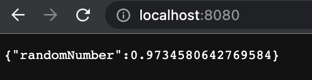<br>

## Steps to deploy on Azure

#### Install Azure App Service extension

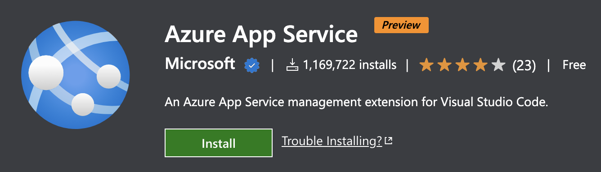<br>

Once the extension is installed we will have this new icon in VSCode<br>

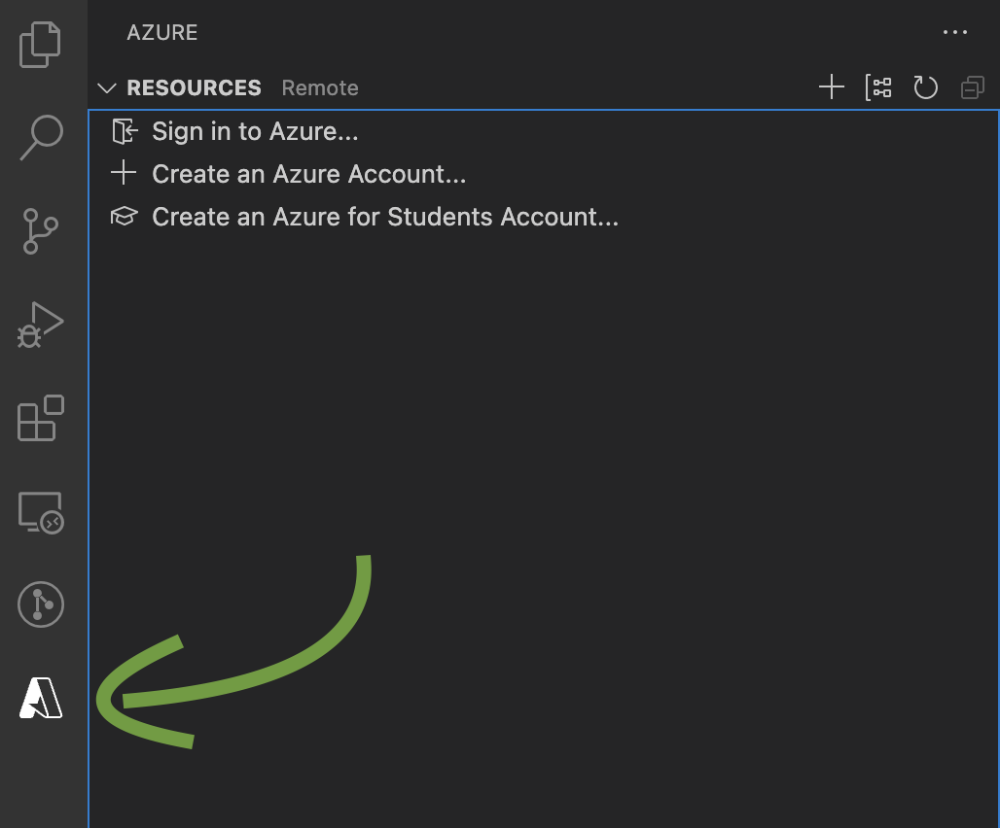<br>

#### Login into Azure

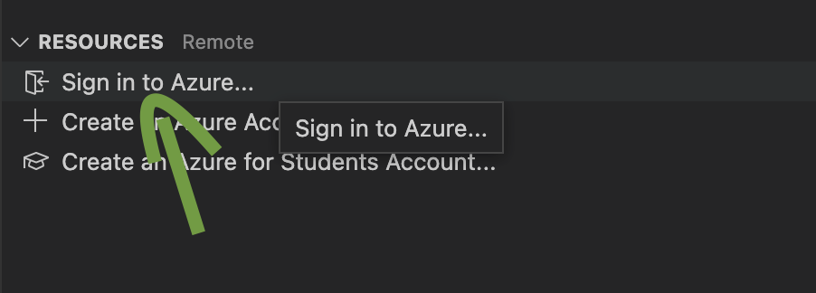<br>

By pressing on the login button, we are taken to the browser to log in with our Azure account.

> You need to have an Azure account, free plan works well for this example.

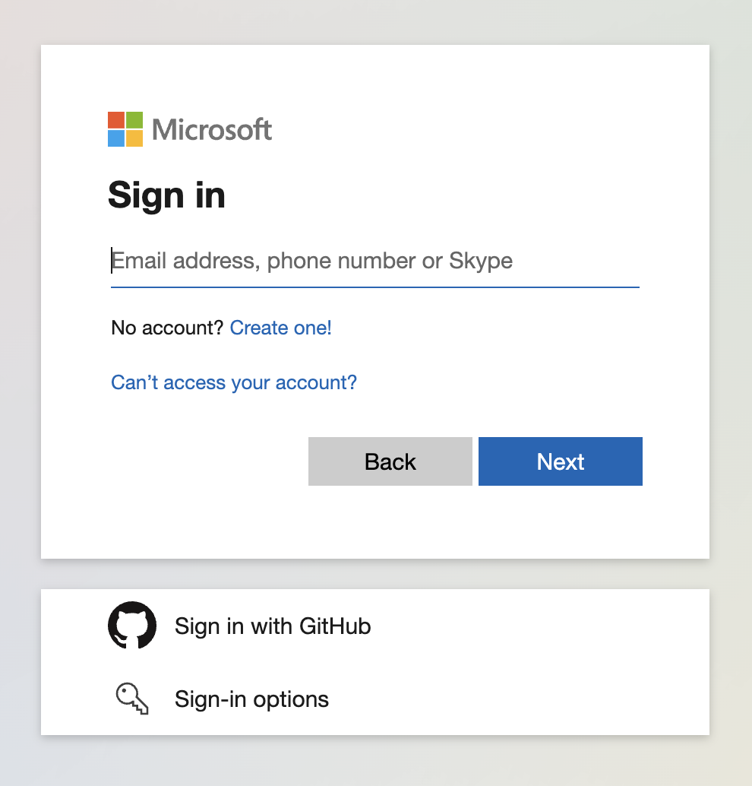<br>

Once logged in you can go back to VSCode

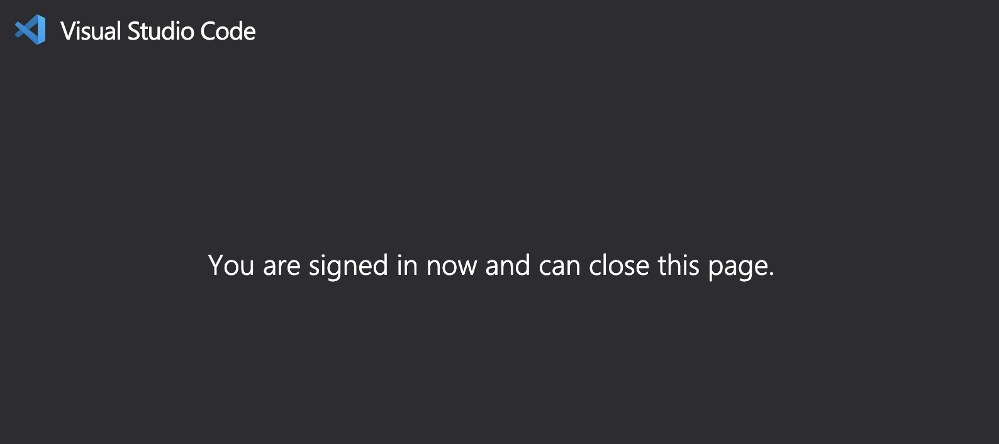<br>

#### Creation of a new Web App

We use the following command to create our application on Azure

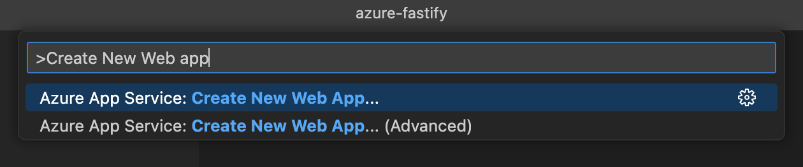<br>

We need to enter the name of our application

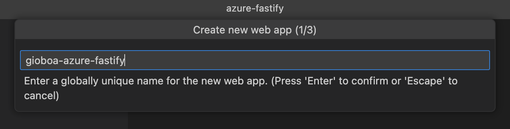<br>

We need to select Node 18 LTS

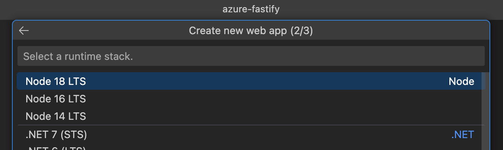<br>

Let's select Free pricing

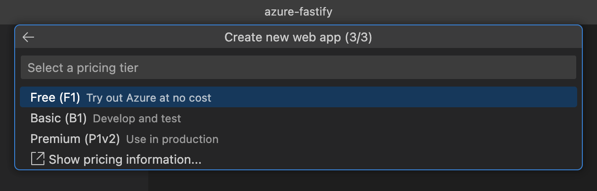<br>

The application will be created automatically

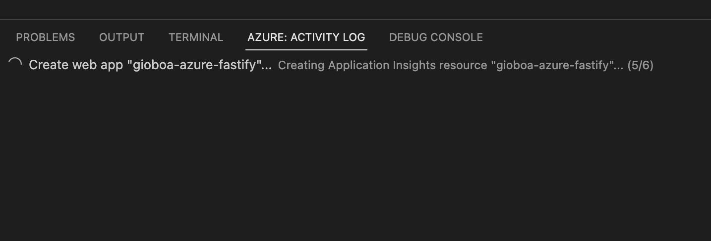<br>

Once the application has been created, press the **Deploy** button

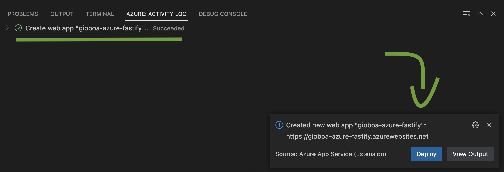<br>

Let's select the project folder

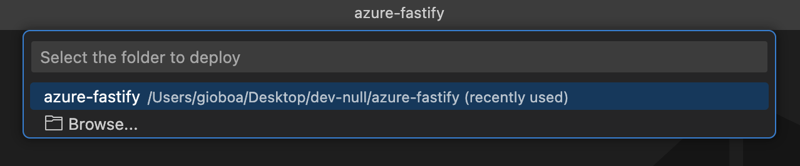<br>

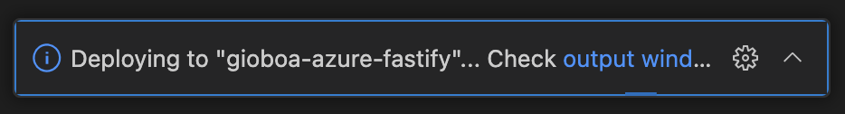<br>

After the deployment let's see our app on Azure

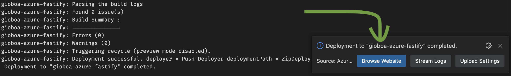<br>

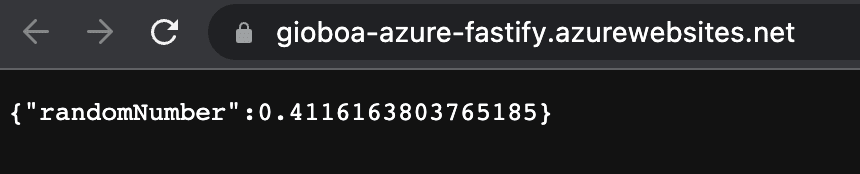<br>

---

🎉 Wow! We deployed together how to create a server locally with Fastify and we deployed it via Azure 👏

You can [follow me on Twitter](https://twitter.com/giorgio_boa), where I'm posting or retweeting interesting articles.

I hope you enjoyed this article, don't forget to give ❤️.
Bye 👋

<!-- ::user id="gioboa" -->
