---
{
title: "Feature Flags with Azure and Angular",
published: "2022-11-10T12:39:27Z",
edited: "2022-12-20T08:17:14Z",
tags: ["azure", "angular", "webdev", "programming"],
description: "Recently I'm developing an Angular application, but with the increasing complexity and pressing...",
originalLink: "https://dev.to/this-is-learning/feature-flags-with-azure-and-angular-22jd",
coverImg: "cover-image.png",
socialImg: "social-image.png"
}
---

Recently I'm developing an Angular application, but with the increasing complexity and pressing releases, the need to perform rapid deploys is huge.

#### Here some problems:

- deploy functionalities but some of them are not completely finished
- test a feature only for certain number of users

#### But how can I solve this pain?

---

## Azure App Configuration

I could create a service that exposes the configurations, but the maintenance and development costs of this service would perhaps become too high for what I need.
To minimise costs I decided to rely on \[Azure] (https://azure.microsoft.com/) because we can use its [App Configuration](https://azure.microsoft.com/en-us/products/app-configuration/) service.
We are going to explore the Feature manager section.

## Feature manager

#### Create Resource

First thing first, you need to have an Azure account, free plan works good for this example,
then you have to create the App Configuration resource.

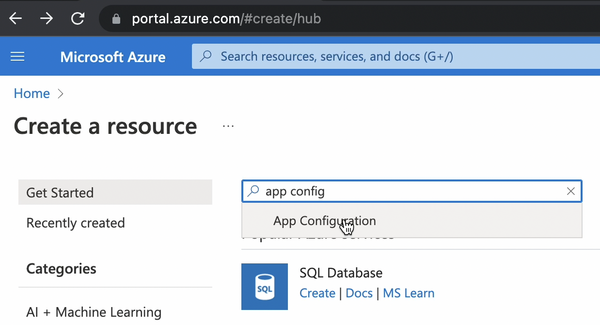

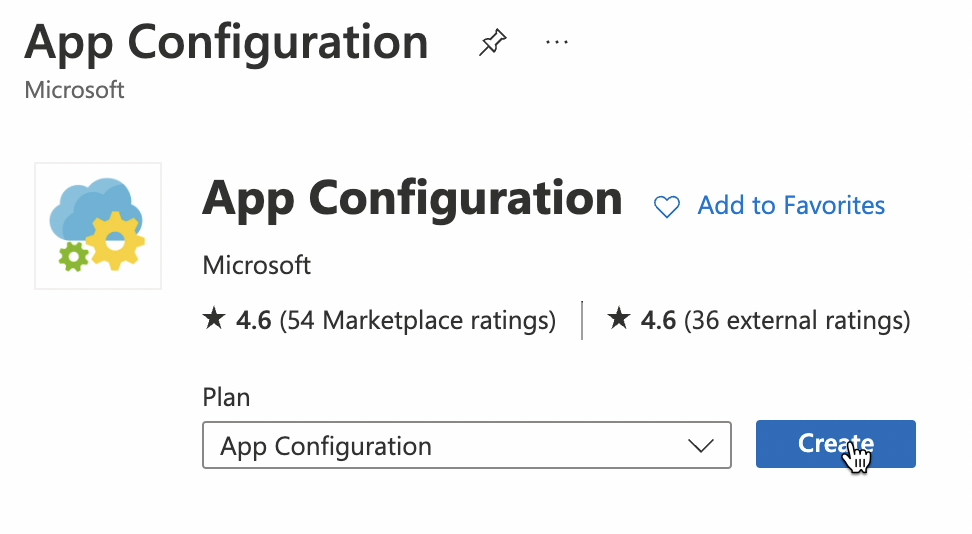

You need to specify:

- Resource group
- Resource name

You can set *Pricing tier* => Free

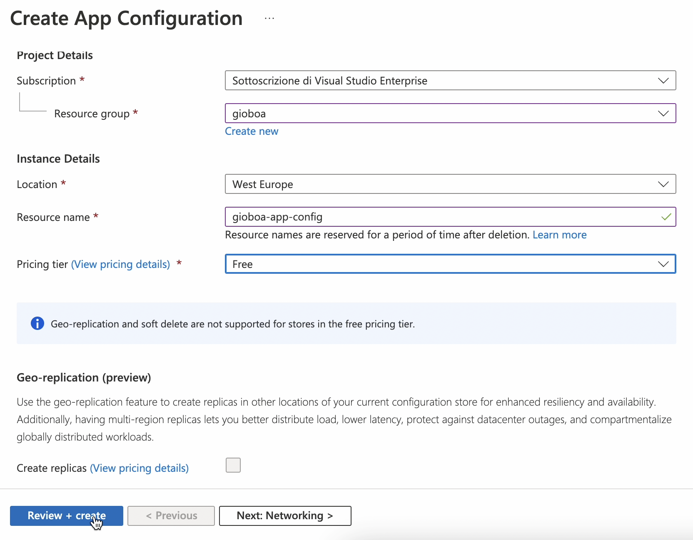

#### Feature flag creation

In the Feature Manager you can define your feature flags

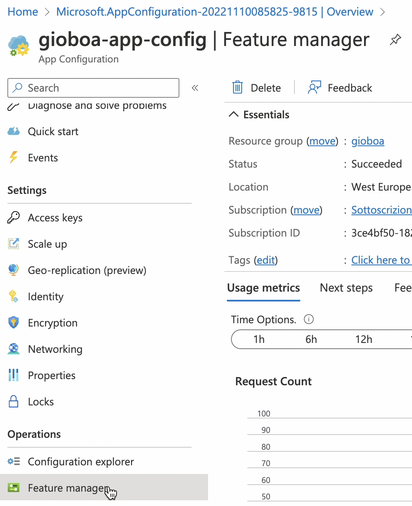

👉 You can use *Create* to create a new feature flag

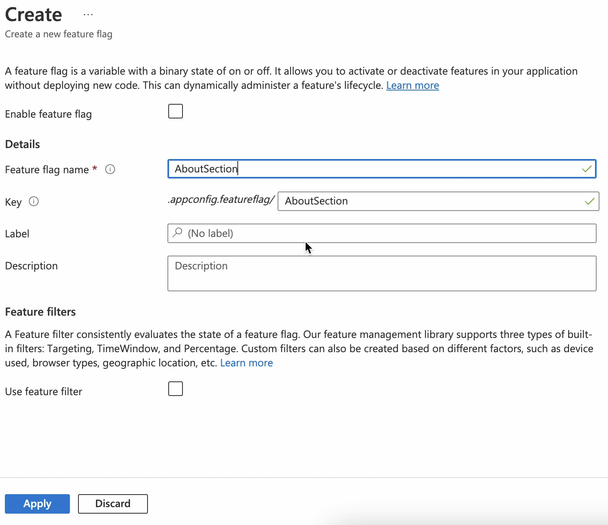

You can also define different types of filter

- Targeting
  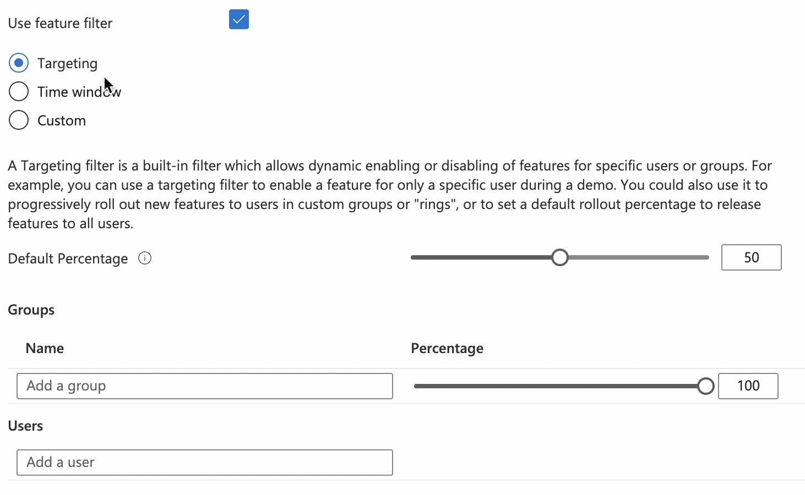

- Time window
  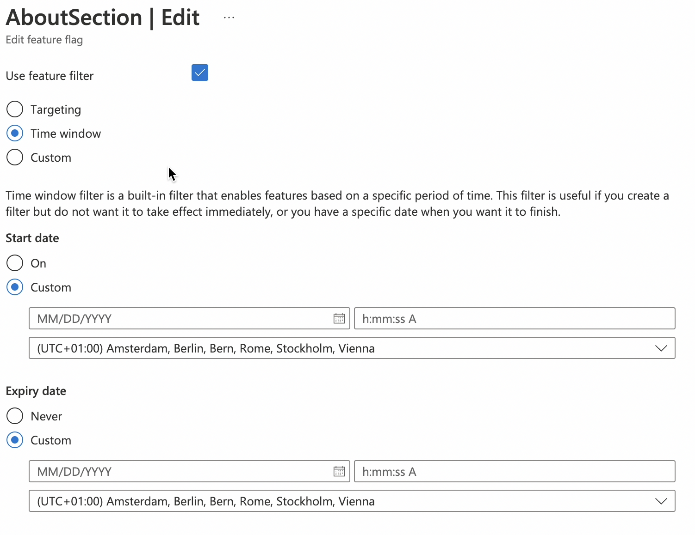

- Custom filter
  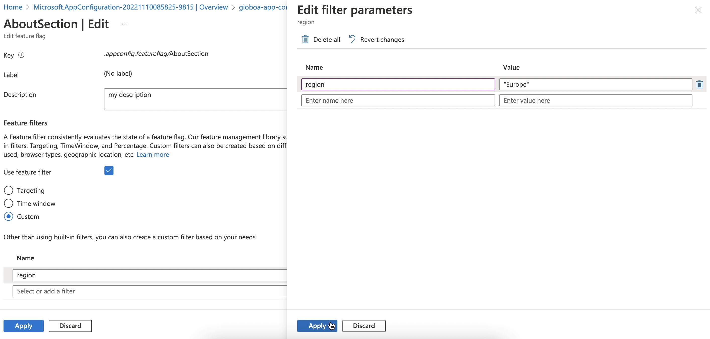

#### Flag created

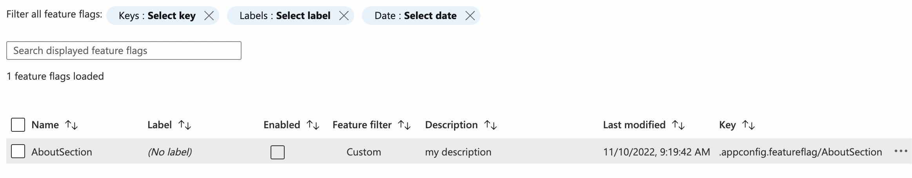

## Access Keys

Connection String is needed to retrieve the configuration from your client

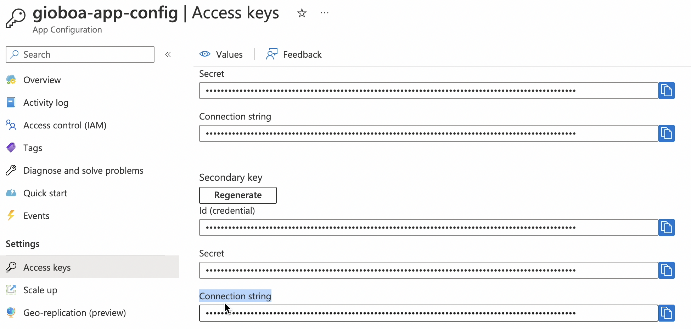

That's all from the Azure Side

## Angular

To connect Angular with Azure App Configuration you need to add two packages into your Angular app.
You can install them with npm.

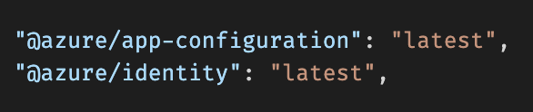

Then in your Angular component you can read and use the configuration like this:

#### app.component.html

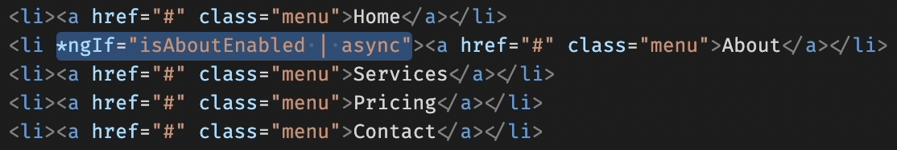

### app.component.ts

This env variable -> *AZURE\_APP\_CONFIG\_CONNECTION\_STRING* contains the Azure connection string.
In the key property you need to pass the feature flag unique key.

That's all folks 🚀

## Result

#### Disabled

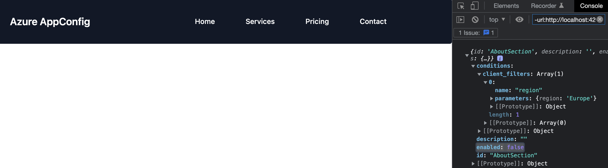

#### Enabled

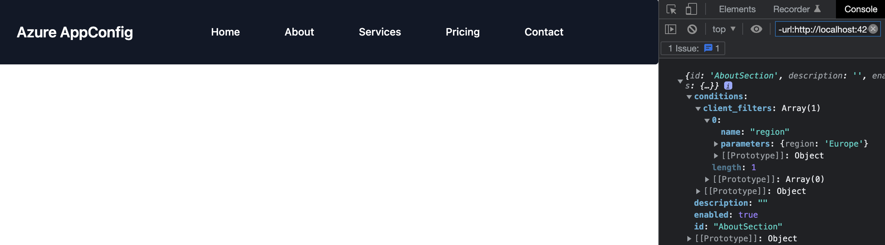

🎉 As you can see it's super easy to implement this functionality and I'm so happy about it. 😄

---

You can [follow me on Twitter](https://twitter.com/giorgio_boa), where I'm posting or retweeting interesting articles.

I hope you enjoyed this article, don't forget to give ❤️.
Bye 👋

<!-- ::user id="gioboa" -->
