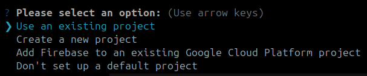
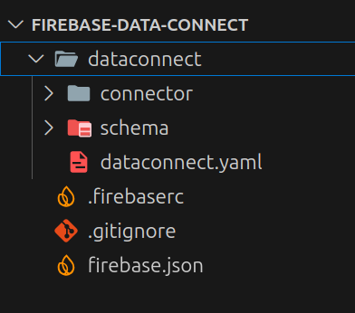
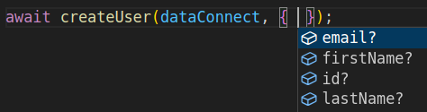

---
{
title: "Firebase Data Connect: Rapid Development and Granular Control with GraphQL",
published: "2025-06-27T09:32:34Z",
tags: ["firebase", "graphql", "webdev", "programming"],
description: "Firebase Data Connect is simplifying the interaction between your applications and your databases. It...",
originalLink: "https://dev.to/this-is-learning/firebase-data-connect-rapid-development-and-granular-control-with-graphql-32g5",
coverImg: "cover-image.png",
socialImg: "social-image.png"
}
---

Firebase Data Connect is simplifying the interaction between your applications and your databases. It presents a GraphQL interface directly on top of [Cloud SQL](https://cloud.google.com/sql), promising rapid development, enhanced security, and a streamlined data management experience.

It's crucial to understand its underlying concepts, benefits, limitations, and potential tradeoffs before fully committing to it.

## Services, Schemas, and Connectors

At the heart of Firebase Data Connect lies a conceptual framework built around three key components: Services, Schemas, and Connectors.

> Grasping the role of each is fundamental to understanding the architecture and capabilities of the platform.

### Services

Think of a Service as an API endpoint, akin to a microservice architecture. You can have multiple services within a single Firebase project, each potentially catering to different domains or stakeholders.
For instance, you might have a dedicated service for authentication, another for managing product data, and yet another for handling blog posts. These services act as independent units, providing a logical separation of concerns and allowing for greater flexibility in your application design.

### Schemas

Each Service is associated with a single Schema. The Schema acts as the blueprint for your data, defining the structure of your data models, the relationships between them, and the allowed operations that can be performed.
This is where the GraphQL aspect of Data Connect truly shines. You define your data models using GraphQL's schema definition language, specifying the types, fields, and relationships within your data.

### Connectors

Connectors provide a layer of fine-grained control over who can do what with your data. Think of them as application-specific access control lists. Each Connector defines a set of GraphQL queries and mutations that a specific application or user role is authorized to perform against the Schema.
This allows you to create granular permissions, ensuring that only authorized clients can access and modify specific parts of your data.

## Getting started

Ensure you have Node.js and npm (Node Package Manager) installed on your machine and install the Firebase Command Line Interface (CLI) globally using npm.

```bash
npm install -g firebase-tools
```

Authenticate with your Firebase account using the CLI.

```bash
firebase login
```

Navigate to your project directory and initialize Firebase.

```bash
firebase init
```

This command launches a guided setup process, allowing you to configure various Firebase features.
Select "Data Connect: Set up a Firebase Data Connect service" option, this will prompt you to associate your project with an existing Firebase project or create a new one. Choose the appropriate option and proceed.



Now you have few different files on you folder:



> Here I created for you a basic setup to start immediately with the service.

FILE: dataconnect/schema/schema.gql

```
type User @table(key: "id") {
  id: String!
  firstName: String!
  lastName: String
  email: String!
}
```

FILE: dataconnect/connector/connector.yaml

```
connectorId: "default-connector"
authMode: "PUBLIC" 
generate:
  javascriptSdk:
    # Create a custom package name for your generated SDK
    package: "@dataconnectdemo/sdk"
    # Tells Data Connect where to store the generated SDK code, this should be in the same
    # directory as your app code
    outputDir: "../../dataconnectdemo-generated"
```

FILE: dataconnect/connector/mutations.gql

```
mutation CreateUser($id: String, $firstName: String, $lastName: String, $email: String) @auth(level: PUBLIC) {
  user_insert(data: {
    id: $id,
    firstName: $firstName
    lastName: $lastName
    email: $email
  })
}
```

FILE: dataconnect/connector/queries.gql

```
query ListUsers @auth(level: PUBLIC) {
  users { id, firstName, lastName, email }
}

query GetUserById($id: String) @auth(level: PUBLIC) {
  users(where: { id: { eq: $id } }) {
    id, firstName, lastName, email
  }
}
```

## Generate the SDK and start the local emulator

Now you can run `firebase dataconnect:sdk:generate` to generate the SDK and create a smooth experience for your clients.

With `firebase init emulators` and `firebase emulators:start` you can start the emulator locally.

Now you can use it straight away like this.

FILE: `data-connect-client/package.json`

```
{
  "name": "data-connect-client",
  "dependencies": {
    "firebase": "^11.9.1",
    "@dataconnectdemo/sdk": "../dataconnectdemo-generated"
  }
}
```

> You should install the npm dependencies before run the code below.

FILE: `data-connect-client/index.ts`

```
import { initializeApp } from 'firebase/app';
import { connectorConfig, createUser, listUsers } from '@dataconnectdemo/sdk';
import {
	connectDataConnectEmulator,
	getDataConnect,
} from 'firebase/data-connect';

const firebaseConfig = {
	apiKey: 'XXXXXXX',
	authDomain: 'XXXXXXX',
	projectId: 'XXXXXXX',
	storageBucket: 'XXXXXXX',
	messagingSenderId: 'XXXXXXX',
	appId: 'XXXXXXX',
};

const app = initializeApp(firebaseConfig);

const dataConnect = getDataConnect(app, connectorConfig);
connectDataConnectEmulator(dataConnect, 'localhost', 9399);

await createUser(dataConnect, {
  id: '123', email: 'xxxx', firstName: 'xxxx', lastName: 'xxxx',
});
```

You can run the client with this simple command `npx tsx index.ts` and you will insert a new User in your database.

> TypeScript is helping with intellisense too so this is so great



---

Firebase Data Connect offers a compelling vision for simplifying database interactions through a GraphQL interface, empowering developers with rapid prototyping, granular security controls, and streamlined data management.

Now it's your turn, you can start playing with it, everything is up and running.

---

You can [follow me on GitHub](https://github.com/gioboa), where I'm creating cool projects.

I hope you enjoyed this article, don't forget to give ❤️.
Bye 👋

<!-- ::user id="gioboa" -->
