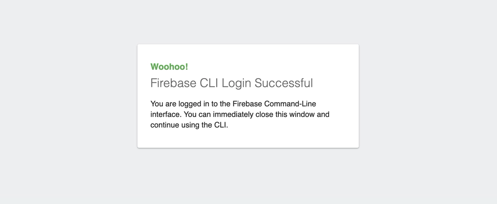
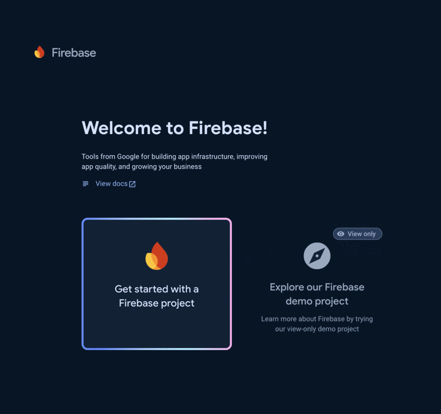
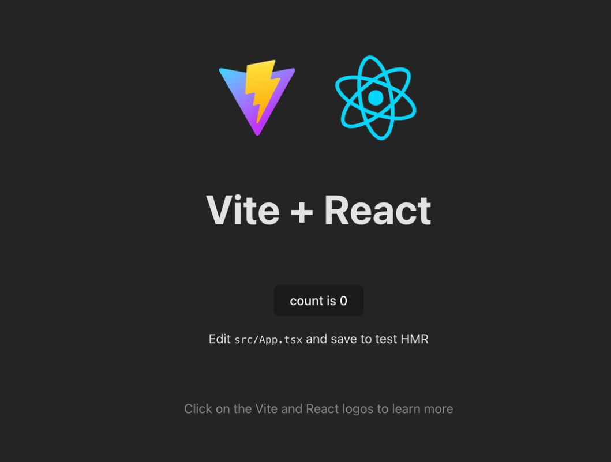

---
{
title: "Firebase: deploy a React application with Firebase Hosting",
published: "2025-02-14T08:15:30Z",
edited: "2025-02-21T09:23:43Z",
tags: ["firebase", "google", "react", "frontend"],
description: "Create the React application   Once upon a time you had to struggle with a thousand...",
originalLink: "https://dev.to/this-is-learning/firebase-deploy-a-react-application-with-firebase-hosting-560j",
coverImage: "cover-image.png",
socialImage: "social-image.png"
}
---

## Create the React application

Once upon a time you had to struggle with a thousand configurations and setups to create a React application, but now you can do everything with a few simple commands. One of **the easiest ways** to create a React project is by using [Vite](https://vitejs.dev/).

[Vite](https://vitejs.dev/) is a **modern build tool** created by Evan You, the same developer behind Vue.js.
It is designed to provide a **faster and leaner development experience** for modern web projects.
You can use Vite to create front-end projects in seconds: [React](https://react.dev/), [Svelte](https://svelte.dev/), [Lit](https://lit.dev/), [Qwik](https://qwik.dev/) and many others modern frameworks are supported.

> You need to install [NodeJS](https://nodejs.org/) to use Vite.

```bash
npm create vite@latest
```

- Assign a project name, i.e. `my-app`
- Select React -> TypeScript
- Go to the `my-app` folder and run `npm install` (alias: `npm i`)
- Build your application with `npm run build` to verify it

## What is Google Firebase hosting?

Firebase hosting is a **fully managed hosting service** from Google. It offers the ability to **publish** your web applications **quickly and securely**. An aspect not to be overlooked is the fact that it is **free** for the basic plan and offers secure deployment with **HTTPS by default**.

**Requirements:** You need to have a Google account to use the service.

## Firebase CLI

You can use the following command to install the Firebase CLI, it's called `firebase-tools`

```bash
npm install -g firebase-tools
```

Once the installation is finished you must execute this command to **authenticate**.

```bash
firebase login
```



once logged in you can create your project within the [Firebase console](https://console.firebase.google.com)



and then, once the project is **successfully created**, you can run this command in your terminal

```bash
firebase init hosting
```

You will have to answer **a series of questions** as you can see in the snippet below.

```bash
=== Project Setup

First, let's associate this project directory with a Firebase project.

? Please select an option: Use an existing project  👈
? Select a default Firebase project for this directory: learn-by-doing-react-app (learn-by-doing-react-app) 👈
i  Using project learn-by-doing-react-app (learn-by-doing-react-app) 👈

=== Hosting Setup

Your public directory is the folder (relative to your project directory) that
will contain Hosting assets to be uploaded with firebase deploy. If you
have a build process for your assets, use your build's output directory.

? What do you want to use as your public directory? dist  👈
? Configure as a single-page app (rewrite all urls to /index.html)? Yes  👈
? Set up automatic builds and deploys with GitHub? No  👈
? File dist/index.html already exists. Overwrite? No  👈

i  Writing configuration info to firebase.json...
i  Writing project information to .firebaserc...

✔  Firebase initialization complete!
```

## Deploy your application 🚀

Once the `firebase init hosting` process is finished you can create the following **script** in your **package.json**:

```json
"scripts": {
  [...]
  "deploy": "npm run build && firebase deploy",
},
```

Now, by executing the `deploy` command, you can **deploy your application**.
You will be shown the **public address** where your application is present as you can see in the snippet below.

```bash
=== Deploying to 'learn-by-doing-react-app'...

i  deploying hosting
i  hosting[learn-by-doing-react-app]: beginning deploy...
i  hosting[learn-by-doing-react-app]: found 5 files in dist
✔  hosting[learn-by-doing-react-app]: file upload complete
i  hosting[learn-by-doing-react-app]: finalizing version...
✔  hosting[learn-by-doing-react-app]: version finalized
i  hosting[learn-by-doing-react-app]: releasing new version...
✔  hosting[learn-by-doing-react-app]: release complete

✔  Deploy complete!

Project Console: https://console.firebase.google.com/project/learn-by-doing-react-app/overview
Hosting URL: https://learn-by-doing-react-app.web.app
```

Here is the result 👏



## Conclusion

This article showcased a streamlined workflow for **building and deploying React applications**, leveraging the power of **modern tools** like Vite and Firebase Hosting.
By following **these simple steps**, you can drastically **reduce the complexities** associated with setting up your development environment and **deploying your application**.
Vite's lightning-fast development server and efficient build process ensure a smooth and **enjoyable coding experience**, while Firebase Hosting provides a **robust and secure platform** for publishing your applications globally. With Firebase's **free tier**, developers can easily **get started and scale their projects** as needed.
Here you can find the [official Firebase Hosting documentation](https://firebase.google.com/docs/hosting).

---

Happy coding! 🎉 Need help? Ask away in the comments!
