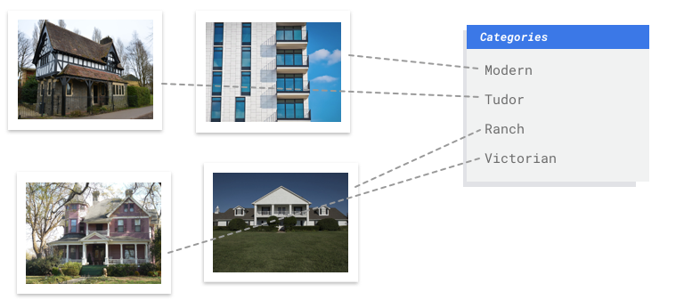

---
{
title: "Firebase ML: AI-Powered Apps Made Easy",
published: "2025-06-13T13:21:16Z",
tags: ["machinelearning", "firebase", "mobile", "programming"],
description: "How many times have you needed to translate your application, but didn't know where to start?  One of...",
originalLink: "https://dev.to/this-is-learning/firebase-ml-ai-powered-apps-made-easy-3ne3",
coverImage: "cover-image.png",
socialImage: "social-image.png"
}
---

How many times have you needed to translate your application, but didn't know where to start?

One of the easiest ways to get started these days is to use [Firebase](https://firebase.google.com/). By leveraging Firebase ML's cloud-based translation API, your app can automatically translate product descriptions, reviews, and customer support interactions into the user's preferred language.

Building upon the foundation of accessible machine learning, Firebase ML represents a significant leap in simplifying the integration of AI-powered features into mobile applications.
Firebase ML achieves this by offering a multi-faceted approach encompassing cloud-based APIs, on-device models, and streamlined model creation processes.

## One package, many use cases

The core strength of Firebase ML lies in its ability to bridge the gap between complex machine learning algorithms and practical application development. The cloud-based APIs, powered by Google's robust machine learning infrastructure, are a prime example. Features like text recognition (OCR), image labeling, object detection, and translation are delivered through straightforward APIs.

Developers can send image or text data to the cloud, and Firebase ML returns results, enabling them to build features like **intelligent search**, automated content moderation, or **real-time language translation** within their apps.

This significantly reduces the development burden, eliminating the need for deep expertise in machine learning modeling. Furthermore, these APIs are constantly evolving, benefiting from continuous improvements and refinements to the underlying models.

## Embed your ML model for critical scenarios

In scenarios requiring offline functionality, minimal latency, or enhanced privacy, on-device machine learning becomes crucial. Firebase ML addresses this with its support for deploying TensorFlow Lite models directly to the app.

> This allows developers to embed pre-trained models or custom-trained models within their app's code, enabling real-time predictions without an internet connection, all processed directly on the user's device.

## Custom machine learning models

[Vertex AI](https://cloud.google.com/vertex-ai/docs/beginner/beginners-guide), integrated within the Firebase console, empowers developers to train custom image classification models using their own datasets. Imagine building an app that **identifies different types of houses** based on user-submitted photos, or an e-commerce application that automatically **categorizes product images**.

It makes this possible by providing a user-friendly interface for uploading data, training models, and evaluating their performance. It handles the complexities of model architecture selection, hyperparameter tuning, and optimization, allowing developers to focus on the data that matters most.

> The resulting model can then be deployed on-device via [TensorFlow Lite](https://www.tensorflow.org/), extending the app's intelligence even further.

---

Firebase ML is more than just a collection of machine learning APIs; it's a comprehensive platform that empowers developers to infuse their apps with intelligence by providing accessible cloud-based APIs, robust on-device model support, and a streamlined model creation process.

---

You can [follow me on GitHub](https://github.com/gioboa), where I'm creating cool projects.

I hope you enjoyed this article, don't forget to give ❤️.
Bye 👋

<!-- ::user id="gioboa" -->
