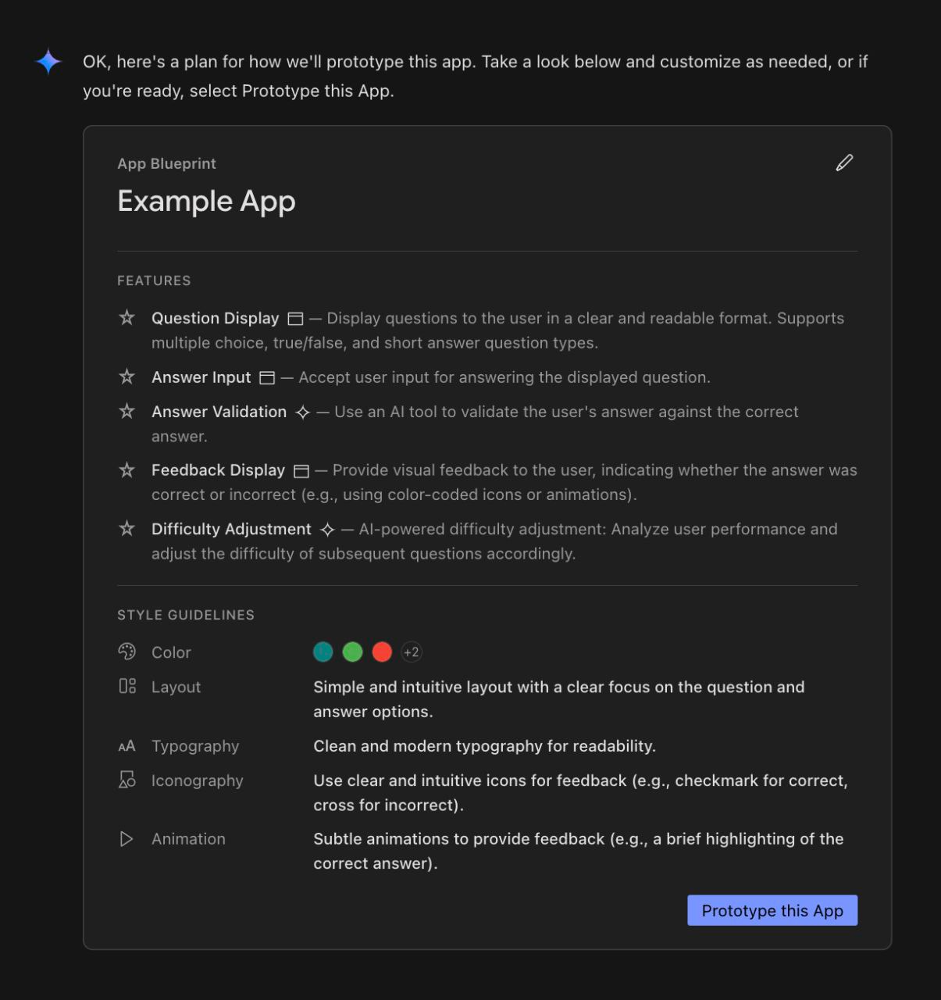
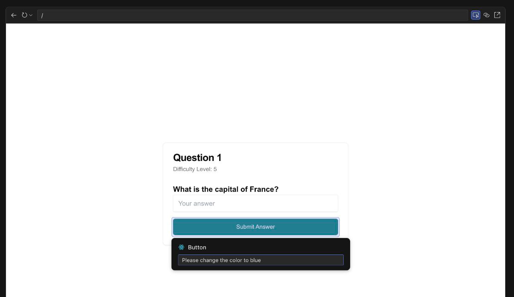
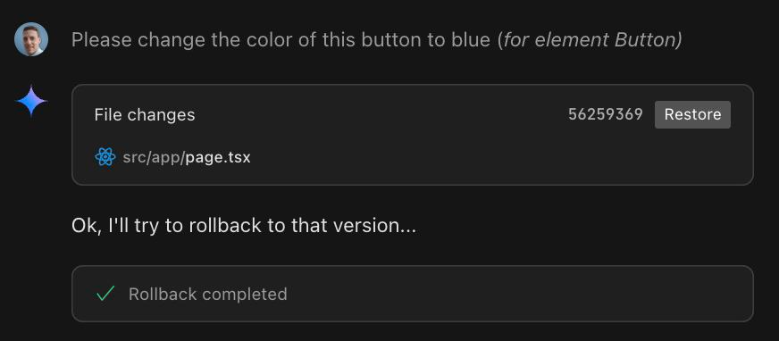
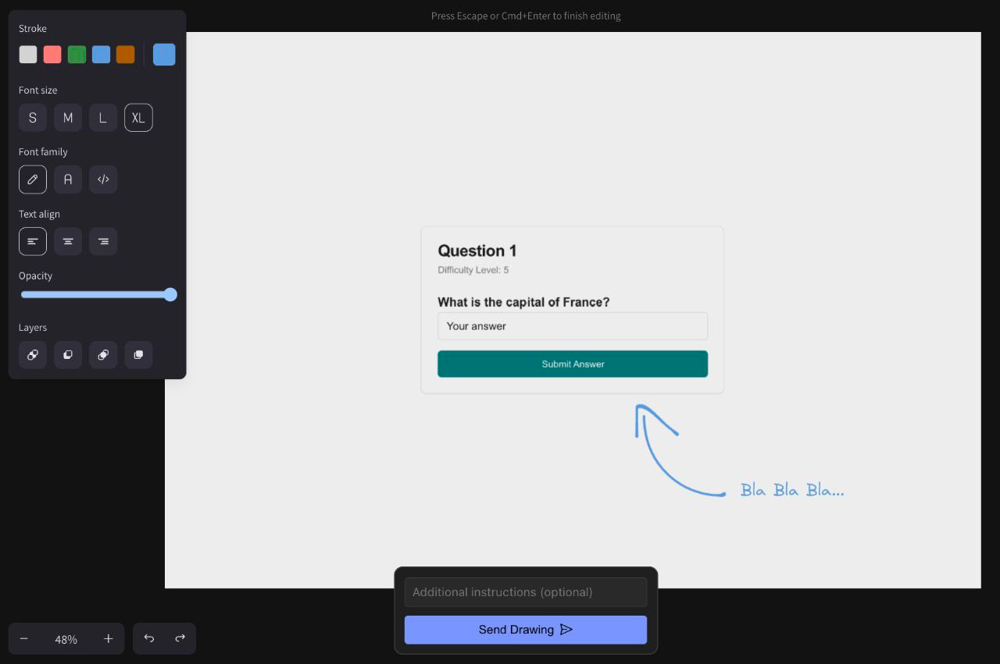
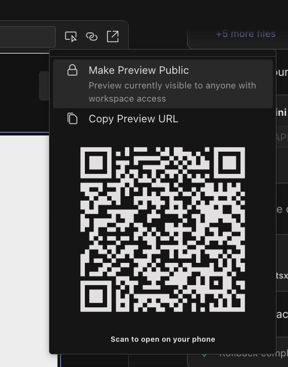
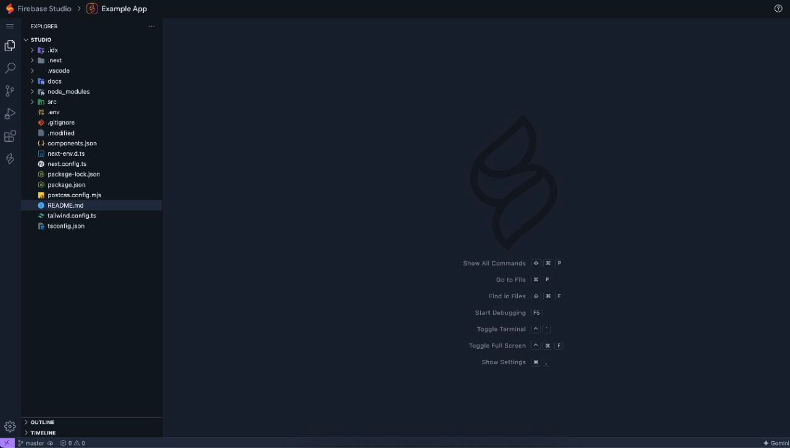

---
{
title: "Firebase Studio: 6 tips only senior engineers know",
published: "2025-04-16T15:25:33Z",
edited: "2025-04-16T15:27:00Z",
tags: ["firebase", "ai", "programming", "productivity"],
description: "Firebase, Google's comprehensive platform for building mobile and web applications, has continually...",
originalLink: "https://https://dev.to/playfulprogramming/firebase-studio-6-tips-only-senior-engineers-know-2c1k",
coverImg: "cover-image.png",
socialImg: "social-image.png"
}
---

Firebase, Google's comprehensive platform for building mobile and web applications, has continually evolved to meet the demands of modern developers. The recent introduction of Firebase Studio, leveraging the power of Google Cloud's Gemini models, marks a significant leap forward, promising to democratize AI-powered app development and streamline the entire creation process.

> [Firebase Studio](https://firebase.studio/) is more than just a development platform; it's a direct competitor to agent-driven development companies like [Bolt](https://bolt.new/), [Cursor](https://www.cursor.com/) and [Lovable](https://lovable.dev/), with a significant advantage: its tight integration with the robust Firebase ecosystem.

## Firebase Studio Development Environment

Firebase Studio is a comprehensive suite of tools and services designed to simplify the creation of full-stack, AI-powered applications.

> It offers a unified platform for designing, building, testing, deploying, and managing applications, all within the familiar Firebase ecosystem.

And this is a key advantage - the seamless integration with Firebase authentication, database tools, and constantly evolving AI features gives Firebase Studio a unique edge.

## Key components of Firebase Studio

- Integrated Development Environment (IDE): A web-based IDE that provides a streamlined coding experience, with features like code completion, syntax highlighting, and debugging tools.

- Hosting: Scalable and reliable hosting infrastructure for deploying and serving your application to users worldwide.

- Access to Gemini Models: Firebase Studio provides direct access to a range of Gemini models, allowing developers to choose the model that best suits their specific needs.

- AI-Powered Code Generation: Firebase Studio can leverage Gemini models to generate code snippets, accelerating the development process and reducing the risk of errors.

- AI-Driven Content Creation: Gemini models can be used to generate content for your application, such as product descriptions, marketing copy, and even entire blog posts.

- Automated Deployment: Deploying your application is simplified through automated deployment pipelines, ensuring a smooth and reliable release process.

## 6 Amazing Features You Don't Want to Miss!

To truly master Firebase Studio and build apps like a pro, here are six amazing features:

### 1 - App Blueprint, The Master Plan

Firebase Studio kicks things off with a brilliant feature called the *App Blueprint*. Before generating the entire application, it presents a detailed plan outlining the core components it's about to create. This allows you to review and ensure the AI is headed in the right direction.
You can request an update to the color scheme, specifying the primary color and ensuring the application is built for dark mode.  The AI then updates the style guide, showcasing the colors for different task difficulties.

## 2 - Point, Click, and Edit!

Once the initial application is generated, the *Select Editor* feature allows you to precisely target and modify specific components.  Simply click the "Select" button, then click the component you want to edit. You can then provide feedback to the AI, such as instructing it to change the color of all buttons to the primary blue. This makes it incredibly easy to fine-tune the application's appearance and behavior.

## 3 - Rollback, The Undo Button for Vibe Coding

[Vibe coding](https://en.wikipedia.org/wiki/Vibe_coding) can sometimes lead to unexpected results. The *Rollback* feature is a lifesaver in such situations. If you make a change you don't like or that breaks the application, you can easily restore it to its previous state with a single click. This provides a safety net, allowing you to experiment and explore without fear of irreversible damage.

## 4 - Visual Feedback

The *Annotate* button transforms Firebase Studio into a collaborative canvas. It brings up a drawing framework, similar to Excalidraw, allowing you to draw directly on the application interface and provide visual feedback. This is extremely useful for communicating design ideas or highlighting areas that need improvement.

## 5 - Phone Preview: See Your App on Mobile

Ensure your application looks great on mobile devices with the *Phone Preview* feature. Click the link button, scan the QR code with your phone, and you'll see a live preview of the website on your mobile device in real-time. This allows you to quickly assess the responsiveness and usability of your application on different screen sizes.

## 6 - Code Editor with AI Assistant

Now it's time to dive into the code. Switching to the code editor view spins up a web view of your app alongside the Gemini coder window. This provides a powerful all-in-one environment where you can access the website, interact with the AI, and code manually – all at the same time.

## The Future of Firebase Studio

Firebase Studio is still in its early stages, but its potential is immense. It represents a paradigm shift in app development, empowering developers of all skill levels to harness the power of AI and build innovative applications that were previously out of reach. By providing a simplified, integrated environment and leveraging the power of Google Cloud's Gemini models, Firebase Studio democratizes AI-powered app development and opens up a world of possibilities for creating engaging, personalized, and intelligent user experiences.

---

You can [follow me on GitHub](https://github.com/gioboa), where I'm creating cool projects.

I hope you enjoyed this article, don't forget to give ❤️.
Bye 👋

<!-- ::user id="gioboa" -->
