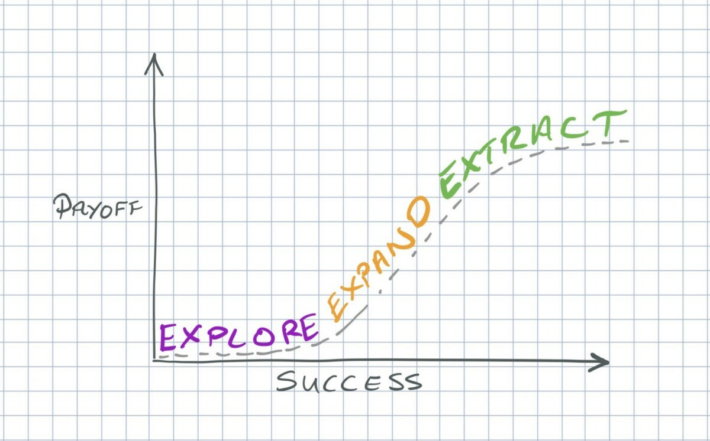

---
{
title: "In which phase is your software?",
published: "2022-10-28T16:18:26Z",
edited: "2022-12-20T08:17:56Z",
tags: ["webdev", "programming", "productivity", "testing"],
description: "I recently gave a talk on testing and I focused the speech on the life cycle of a successful...",
originalLink: "https://dev.to/this-is-learning/in-which-phase-is-your-software-5253",
coverImage: "cover-image.png",
socialImage: "social-image.png"
}
---

I recently gave a talk on testing and I focused the speech on the life cycle of a successful software.

> The participants talked to me and pointed out that they had never paid attention to this particular aspect and the talk enriched them a lot.

So here I would like to inspire other readers through this article.

---

## Kent Beck's 3X model

To describe the life cycle of a software, I took Kent Back's [3X Model](https://medium.com/@kentbeck_7670/fast-slow-in-3x-explore-expand-extract-6d4c94a7539) as inspiration to focus on how we invest our time in the testing phase.

Here is Kent Beck's chart

Let's analyse the 3 phases in the graph.

#### Explore

At this stage our software is being born, we have our business idea but we are still waiting for the market to prove us right.

e.g we are at the pub and we have a brilliant idea: Why don't we make a social media to share images?

At this stage, even before writing the code, it is necessary validate the idea and look for any competitors with the same business idea. At this stage it is not worth investing in manual or manual tests because our test is the market.

#### Expand

At this stage, however, your business is scaling and the main activities are to remove bottlenecks and create new features to remain attractive.
The effort here is between seeking market feedback, manual and automatic testing.

#### Extract

Here, on the other hand, we are masters of the market and it will be difficult for us to have more market than the current one. The activities will be aimed at optimising profits and reducing costs. This results in more automatic tests to reduce effort.

## Triathlon metaphor

Triathlon lends itself well to comparison with what we have explained. This discipline consists of three phases: swimming, cycling, running.
If we use the bike during the swimming phase we will certainly have problems. 😅
And even in the life of a software, if we invest our effort in the wrong way, we will run into problems.

---

And do you know at what stage your project is?

You can [follow me on Twitter](https://twitter.com/giorgio_boa), where I'm posting or retweeting interesting articles.

I hope you enjoyed this article, don't forget to give ❤️.
Bye 👋



*Special thanks to [Strazz](https://twitter.com/thestrazz86), he inspired me with his book: [Decision-making for Software Development Teams](https://leanpub.com/decision-making-for-software-development-teams/)*
