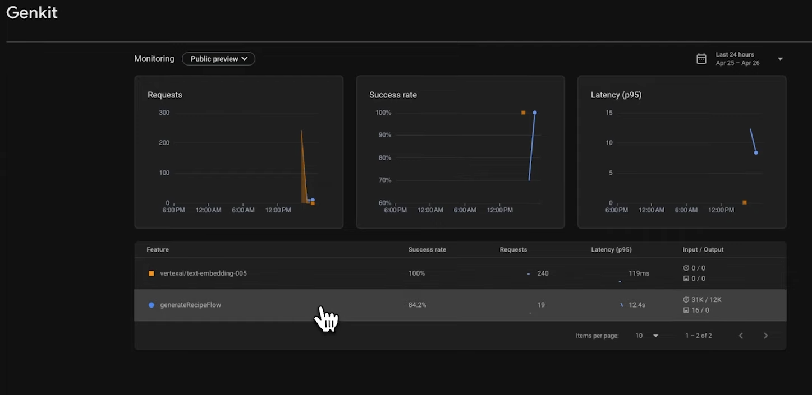

---
{
title: "Monitoring Firebase Genkit to Ensuring Performance and Reliability",
published: "2025-06-06T09:32:37Z",
tags: ["firebase", "ai", "programming", "googlecloud"],
description: "As we increasingly integrate Large Language Models (LLMs) into our applications, understanding and...",
originalLink: "https://dev.to/this-is-learning/monitoring-firebase-genkit-to-ensuring-performance-and-reliability-5hfb",
coverImg: "cover-image.png",
socialImg: "social-image.png"
}
---

As we increasingly integrate Large Language Models (LLMs) into our applications, understanding and monitoring the performance and behavior of features built with these models becomes paramount.

LLMs introduce a layer of non-deterministic complexity that requires robust monitoring to ensure reliability, performance, and a consistently positive user experience.

[Genkit](https://genkit.dev/), a framework for building LLM-powered applications, provides a powerful way to structure and manage these AI features, but effectively monitoring Genkit flows in production is critical for success.

## Traditional approach

The traditional approach to software monitoring focuses on deterministic code, where inputs directly correlate to outputs. However, LLMs introduce a probabilistic element.

While prompts can be carefully crafted, the generated responses can vary significantly, potentially leading to unexpected behavior or degraded performance.

> Manual testing alone is insufficient to capture the nuances and edge cases that emerge in real-world usage scenarios.

## AI-Specific Monitoring

AI-specific monitoring helps bridge this gap by providing insights into:

- **Performance Bottlenecks**: Identifying which steps within a Genkit flow contribute most to latency.
- **Model Behavior**: Understanding how the LLM responds to various inputs and identifying potential biases or inconsistencies.
- **User Experience**: Assessing whether the generated outputs are meeting user expectations and providing value.
- **Cost Management**: Tracking token usage and optimizing prompts to minimize expenditure.
- **Stability and Reliability**: Detecting and addressing errors, unexpected outputs, and potential vulnerabilities.

## Key Metrics for Genkit Flow Monitoring

Effective monitoring requires tracking a range of metrics that provide a holistic view of Genkit flow performance.

Some key metrics include:

- **Latency**: The time it takes for a Genkit flow to complete from start to finish. High latency can indicate performance bottlenecks or issues with the underlying LLM.
- **Error Rate**: The percentage of Genkit flow executions that result in an error. Monitoring error rates helps identify potential bugs or issues with the flow's logic.
- **Token Usage**: The number of tokens consumed by the LLM during a Genkit flow execution. This is a crucial metric for cost management and optimizing prompt design.
- **Success Rate**: The percentage of Genkit flow executions that complete successfully and provide a useful result to the user.
- **Prompt Latency**: The time spent within each individual LLM call (i.e. `genAI.generate(...)` calls) in the flow. This helps pinpoint the LLM portion of overall latency.
- **Cost per Flow Execution**: This metric can be helpful for tying back cost to the end user so that you can understand if it is still economically viable.

## Monitoring

You can add custom logic within your flows to track specific events or variables. This provides valuable context for debugging and analyzing flow behavior, but it requires a lot of effort and you will have more code to maintain for a non-trivial functionality.

> If you miscalculate the cost of execution in your custom code, you will suffer a huge loss.

## Firebase Genkit Monitoring

Genkit offers a dedicated AI Monitoring dashboard that provides a high-level overview of Genkit flow health, including token usage, core stability metrics, and flow-level insights. This dashboard allows you to drill down into individual flow executions, inspect traces, and analyze intermediate inputs and outputs.

[Here is the getting-started](https://genkit.dev/docs/observability/getting-started/) to add it to your flows.

> The setup is really simple, just call a specific library method and enable permissions inside your Google Cloud dashboard. Behind the scenes, resources will be created to collect the data to monitor and you will have a complete tool to avoid unpleasant surprises.

---

Monitoring is crucial aspect for ensuring the performance, reliability, and user satisfaction of AI-powered applications.
By tracking key metrics, leveraging appropriate tools and techniques, and implementing best practices, you can gain valuable insights into the behavior of their Genkit flows and proactively address potential issues.

---

You can [follow me on GitHub](https://github.com/gioboa), where I'm creating cool projects.

I hope you enjoyed this article, don't forget to give ❤️.
Bye 👋

<!-- ::user id="gioboa" -->
