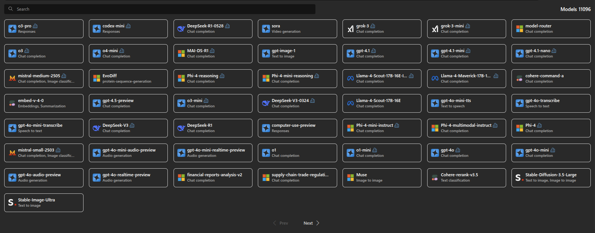
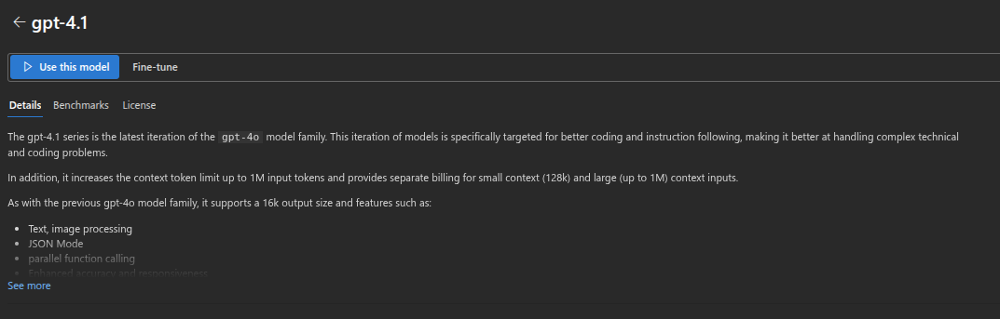
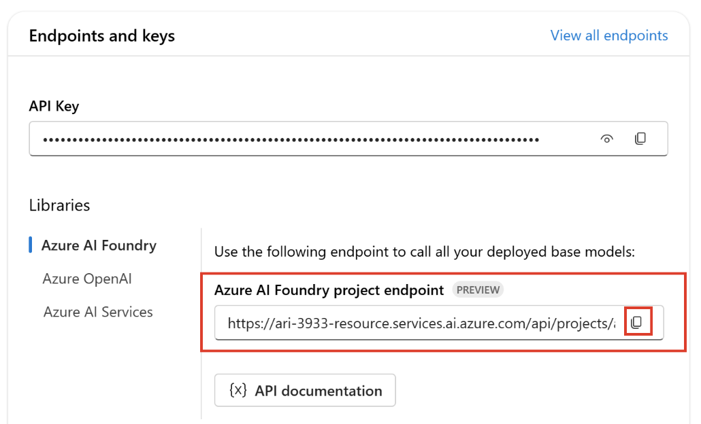

---
{
title: "Power Your Innovation: LLM Model Selection within Azure's Ecosystem",
published: "2025-07-23T07:44:57Z",
edited: "2025-07-23T08:19:34Z",
tags: ["azure", "cloud", "ai", "programming"],
description: "The rise of Large Language Models (LLMs) has opened unprecedented possibilities for businesses, from...",
originalLink: "https://dev.to/this-is-learning/power-your-innovation-llm-model-selection-within-azures-ecosystem-ain",
coverImage: "cover-image.png",
socialImage: "social-image.png"
}
---

The rise of Large Language Models (LLMs) has opened unprecedented possibilities for businesses, from automating customer service to generating creative content. However, deploying and managing these complex models presents significant challenges, particularly for organisations lacking extensive AI infrastructure and expertise.

[Azure Foundry](https://ai.azure.com/), a comprehensive platform designed to empower enterprises to harness the power of LLMs with enterprise-grade security, scalability, and cost optimisation.

This article will delve into the core benefits of leveraging Azure Foundry for your LLM initiatives, showcasing how it simplifies deployment, maximises performance, and unlocks the full potential of AI for your business.

## Security and Compliance

> Security is paramount in today's digital landscape, especially when dealing with **sensitive data**.

Azure Foundry addresses this concern head-on by leveraging Azure's robust security infrastructure. **Private Endpoints** creating a secure and private connection between your Azure virtual network and the LLM service. This eliminates the need for public IP addresses, significantly reducing the attack surface and ensuring that only authorised traffic from within your network can access the LLM.

> This is particularly crucial when processing sensitive internal data. For instance, healthcare organisations can confidently deploy LLMs for clinical decision support or patient communication, knowing they are compliant with all the regulations.

## Scaling LLMs

Azure provides a scalable infrastructure that allows you to effortlessly adapt to evolving needs.

An e-commerce company, for instance, can automatically scale up its LLM-powered product recommendation engine during peak shopping seasons like Black Friday, ensuring a smooth and responsive experience for its customers.

## Cutting-Edge AI Capabilities

Azure Foundry provides access to a growing catalog of pre-trained LLMs, including models from Microsoft, OpenAI, and other partners. The platform also allows for customisation and fine-tuning of pre-trained LLMs on your own data, improving their performance on specific tasks.



## Example

### Step 1: Azure AI Foundry portal

> Prerequisites: An Azure subscription. If you don't have an Azure subscription, create a free account before you begin.

Sign in to the [Azure AI Foundry portal](https://ai.azure.com/?cid=learnDocs). On the home page, search and then select the model. eg. gpt-4.1


On the model details page, select Use this model.
Fill in a name to use for your project and select Create.



Once your resources are created, you can copy your `API key` and `Project endpoint` variables.



### Step 2: TypeScript code

You can install everything with a few simple commands.

```
mkdir my-azure-ai-demo
cd my-azure-ai-demo
npm init -y
npm install openai
```

FILE: index.ts

```
import { AzureOpenAI } from 'openai';

const client = new AzureOpenAI({
  endpoint: "Your env variable here",
  apiKey: "Your env variable here",
  deployment: 'Your deployment here',
  apiVersion: '2024-04-01-preview',
});

(async () => {
  const response = await client.chat.completions.create({
    messages: [
      { role: 'system', content: "You are a geography expert." },
      { role: 'user', content: "How many states are there in the USA?" },
    ],
    max_completion_tokens: 800,
    temperature: 1,
    top_p: 1,
    frequency_penalty: 0,
    presence_penalty: 0,
    model: 'Your model here eg. gpt-4.1',
  });

  console.log(response.choices[0].message.content)
})()
```

You can literally copy this code and run it with the command below, you'll already have something working to start from.

```
npx tsx index.ts
```

Well done :rocket:!

---

In conclusion, Azure Foundry emerges as a transformative platform, empowering businesses to unlock the full potential of AI. By providing enterprise-grade security, scalability, and access to cutting-edge AI capabilities, it simplifies the deployment and management of LLMs. Azure Foundry accelerates innovation, streamlines operations, and drives sustainable growth in an increasingly competitive landscape.

---

You can [follow me on GitHub](https://github.com/gioboa), where I'm creating cool projects.

I hope you enjoyed this article, don't forget to give ❤️.
Until next time 👋


