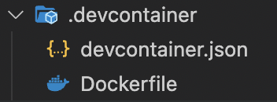
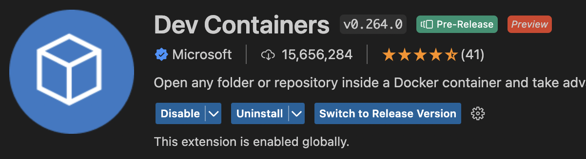
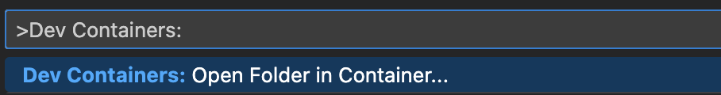
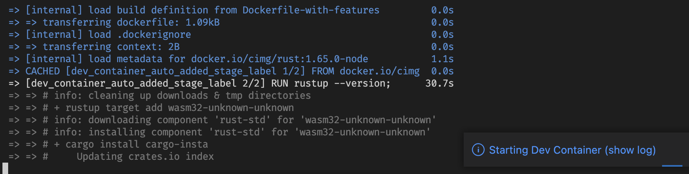

---
{
title: "Tidy up your machine with Visual Studio Code Dev Containers",
published: "2022-11-26T19:35:50Z",
edited: "2022-12-20T08:12:33Z",
tags: ["discuss"],
description: "I recently discovered the Visual Studio Code - Dev Containers feature and I thought to share with you...",
originalLink: "https://dev.to/this-is-learning/tidy-up-your-machine-with-visual-studio-code-dev-containers-256n",
coverImg: "cover-image.png",
socialImg: "social-image.png"
}
---

I recently discovered the Visual Studio Code - Dev Containers feature and I thought to share with you it because in my opinion, it's so cool.

---

I'm collaborating on an open source project in Rust and as soon as I approached the repo I thought:
"No, I don't want to install all the dependencies and mess up my environment with a thousand things..."

### Developer Experience

Fortunately, the project maintainers were smart enough to configure the project to be able to contribute without much fuss.

### Visual Studio Code Dev Containers

>

The Visual Studio Code Dev Containers extension lets you use a Docker container as a full-featured development environment. It allows you to open any folder or repository inside a container and take advantage of Visual Studio Code's full feature set.

### Configuration



#### devcontainer.json

describes how VS Code should start the container and what to do after it connects.

```json
// For format details, see https://aka.ms/devcontainer.json
{
  "name": "My devcontainer",
  "hostRequirements": {
    "cpus": 4
  },
  // Add the IDs of extensions you want installed when the container is created.
  "extensions": [
    [...],
    [...],
  ],
  "build": {
    "dockerfile": "Dockerfile"
  },
  "waitFor": "onCreateCommand",
  "updateContentCommand": "corepack prepare & pnpm install",
  "forwardPorts": [3300, 9229],
  "customizations": {
    "codespaces": {
      "openFiles": ["CONTRIBUTING.md"]
    }
  },
  "portsAttributes": {
    "3300": {
      "label": "Serve",
      "onAutoForward": "openPreview"
    }
  }
}
```

#### Dockerfile

We can use a Dockerfile that defines the contents of the container.

```yaml
FROM cimg/rust:1.65.0-node

RUN rustup --version; \
    cargo --version; \
    rustc --version; \
    rustup update; \
    rustup target add wasm32-unknown-unknown; \
    cargo install cargo-insta; \
    rustup component add clippy; \
    corepack enable --install-directory ~/bin
```

### Docker

Obviously, you need to have Docker up and running on your machine.

### VsCode Extension





To spin up the container and work inside it, you need to install the [Dev Containers](https://marketplace.visualstudio.com/items?itemName=ms-vscode-remote.remote-containers) extension and then you can run
`Dev Containers: Open Folder in Container` command.

### Ready to go



So far so good, after the startup, you're ready to develop inside the docker container with a fully configured environment.

---

You can [follow me on Twitter](https://twitter.com/giorgio_boa), where I'm posting or retweeting interesting articles.

I hope you enjoyed this article, don't forget to give ❤️.
Bye 👋

<!-- ::user id="gioboa" -->
