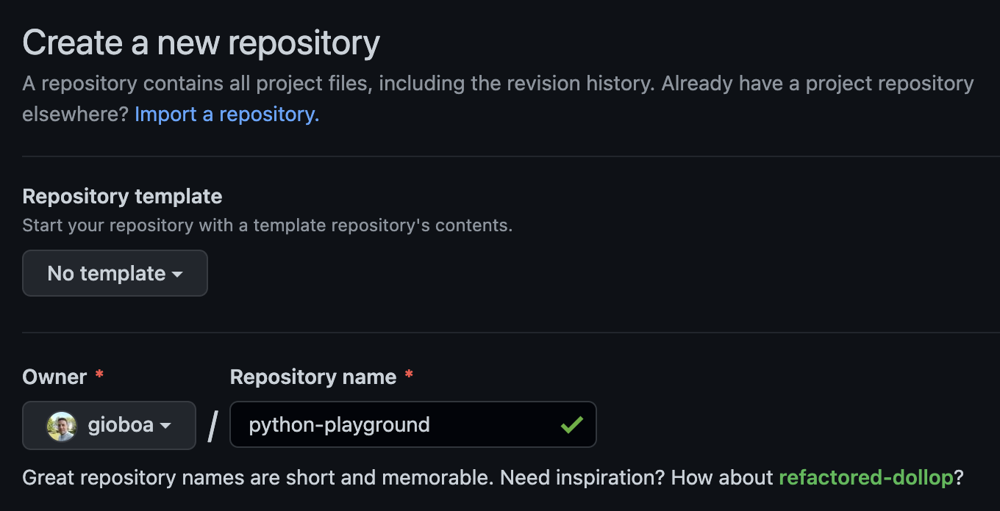
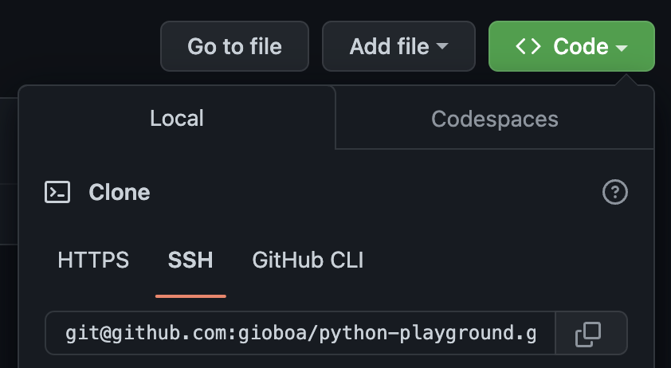
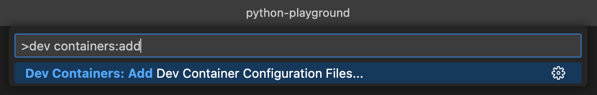
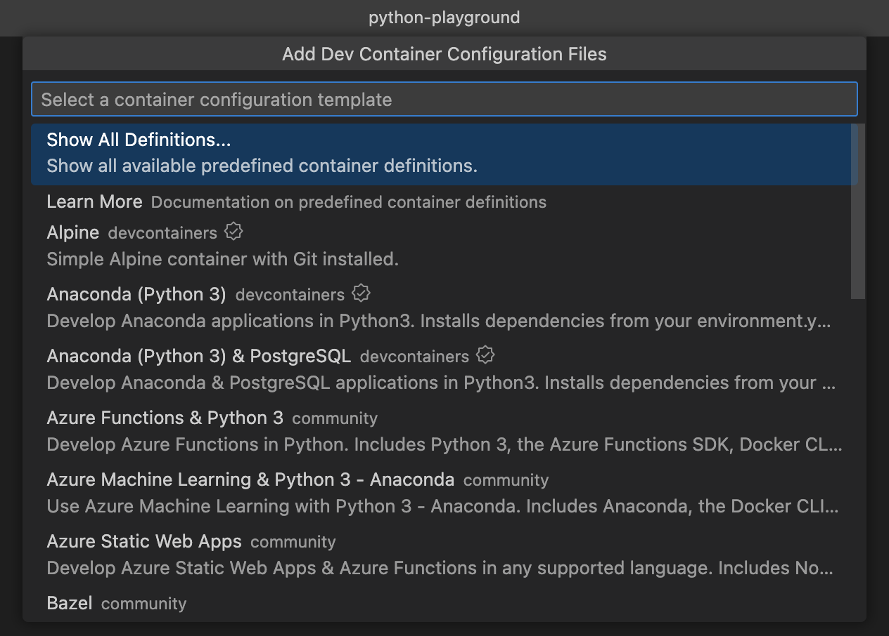
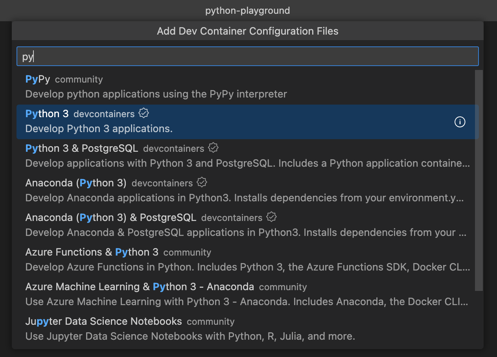
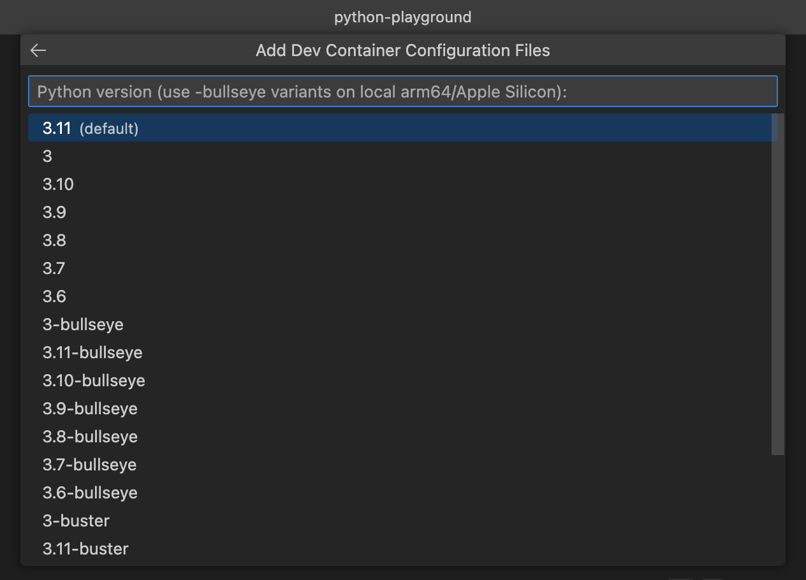
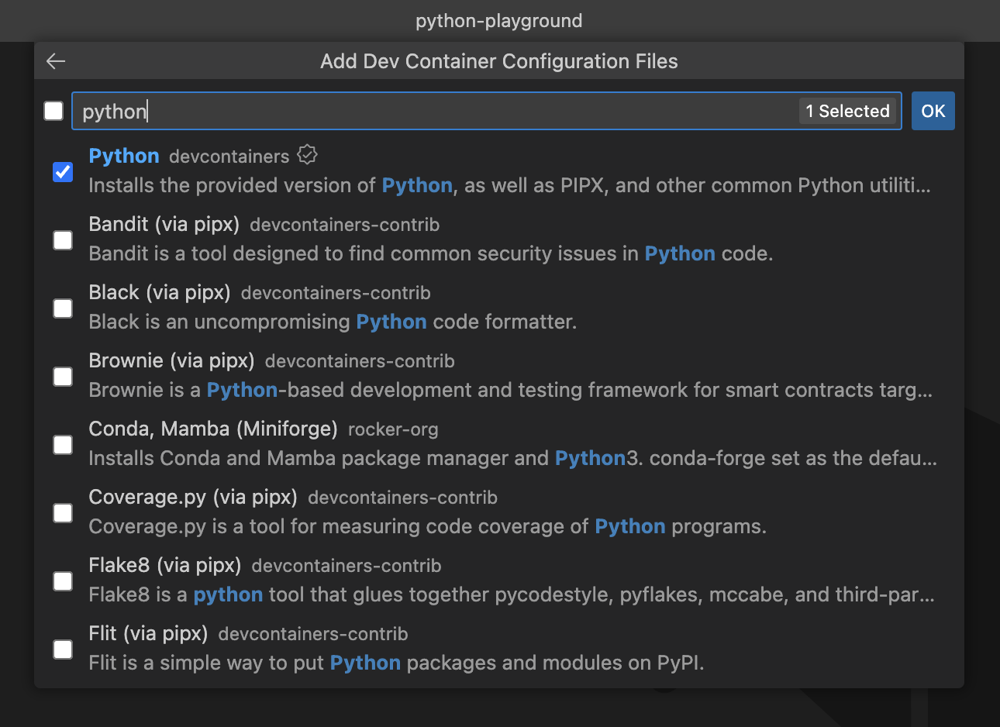

---
{
title: "VSCode & GitHub Codespaces for my Python playground",
published: "2022-12-10T19:33:34Z",
edited: "2022-12-20T08:15:58Z",
tags: ["programming", "beginners", "cpp"],
description: "Today I did some experiments with Python, I decided to do this activity with GitHub Codespaces...",
originalLink: "https://dev.to/this-is-learning/vscode-github-codespaces-for-my-python-playground-9ih",
coverImage: "cover-image.png",
socialImage: "social-image.png"
}
---

Today I did some experiments with Python, I decided to do this activity with GitHub Codespaces without installing Python on my machine.

## Steps

### GitHub repository

I started by creating my repository on GitHub and I named it **python-playground**.<br>



### Clone repository

I cloned the local repository by typing the command:
`git clone git@github.com:gioboa/python-playground.git`
in the terminal.
I took the URL of the repository from GitHub, you can find it by pressing the Code button. <br>

<br>

### VSCode: Add Dev Container

Once the repository was cloned locally, via VSCode, I used the command:

#### Dev Containers: Add Dev Container Configuration Files...<br>

<br>

> To use this command you have to install the [Dev Containers extension](https://marketplace.visualstudio.com/items?itemName=ms-vscode-remote.remote-containers) and you need to have [Docker](https://www.docker.com/) up and running in your local machine.

### Run locally

With this approach (docker installed locally) you can use VSCode Dev Container feature as I described in this article 😊
[Tidy up your machine with Visual Studio Code Dev Containers](https://dev.to/this-is-learning/tidy-up-your-machine-with-visual-studio-code-dev-containers-256n)

#### Then I selected "Show All definitions"<br>

<br>

#### I selected "Python 3"<br>

<br>

#### Then I selected version 3.11<br>

<br>

#### In this step I selected the Dev Container Features<br>

<br>

VSCode will create for you this configuration file `.devcontainer/devcontainer.json`<br>

````json
// For format details, see https://aka.ms/devcontainer.json. For config options, see the
// README at: https://github.com/devcontainers/templates/tree/main/src/python
{
	"name": "Python 3",
	"image": "mcr.microsoft.com/devcontainers/python:0-3.11",
	"features": {
		"ghcr.io/devcontainers/features/python:1": {}
	}
	// Features to add to the dev container. More info: https://containers.dev/features.
	// "features": {},
	// Use 'forwardPorts' to make a list of ports inside the container available locally.
	// "forwardPorts": [],
	// Use 'postCreateCommand' to run commands after the container is created.
	// "postCreateCommand": "pip3 install --user -r requirements.txt",
	// Configure tool-specific properties.
	// "customizations": {},
	// Uncomment to connect as root instead. More info: https://aka.ms/dev-containers-non-root.
	// "remoteUser": "root"
}
````

### First Python code

I created a simple _app.py_ file to test if the solution works.<br>

<br>

### Push to GitHub

I pushed the local changes to GitHub via the 
_git push origin main_ command.<br>

<br>

### GitHub Codespaces

After sending the local changes to GitHub, I created a new GitHub Codespaces through this section.<br>

<br>

A new URL has opened with this screen 🚀<br>

<br>

<br>

After the setup, which took a few minutes, I got a new instance of VSCode where I was finally able to use Python.<br>

<br>

<br>

> As you can see _python app.py_ command works like a charm. 👍

And that's all... The process may seem complicated but it is very fast and intuitive.

### Manage Codespaces

Inside GitHub we can manage our Codespaces: delete them, rename them and much more.<br>

<br>

<br>

<br>

## GitHub Codespaces pricing<br>

<br>

Here you can read the [documentation](https://docs.github.com/en/billing/managing-billing-for-github-codespaces/about-billing-for-github-codespaces#github-codespaces-pricing) which explains in detail the costs of the service.

---

🎉 As you can see it's super easy to use this functionality and I'm so happy about it. 😄

You can [follow me on Twitter](https://twitter.com/giorgio_boa), where I'm posting or retweeting interesting articles.

I hope you enjoyed this article, don't forget to give ❤️.
Bye 👋

<!-- ::user id="gioboa" -->
