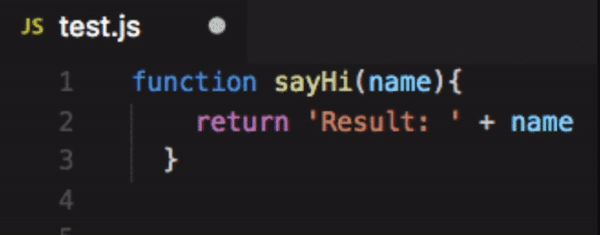
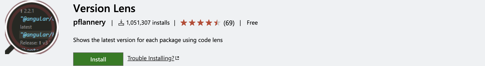
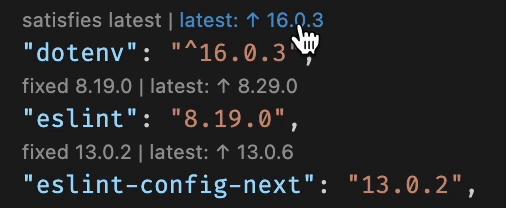
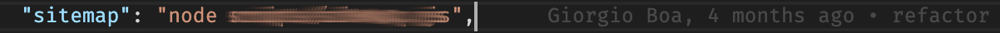

---
{
title: "VSCode: my 5 vital extensions to be productive",
published: "2022-12-03T15:55:13Z",
edited: "2022-12-20T08:16:13Z",
tags: ["vscode", "productivity", "webdev", "javascript"],
description: "Hi 👋 today I want to share with you 5 extensions that are vital in my daily job.   I don't like too...",
originalLink: "https://dev.to/this-is-learning/vscode-my-5-vital-extensions-to-be-productive-11db",
coverImage: "cover-image.png",
socialImage: "social-image.png"
}
---

Hi 👋 today I want to share with you 5 extensions that are vital in my daily job.

> I don't like too complex configurations, I like the idea of ​​being able to be productive in any environment and with the standard configuration, but for these 5 VSCode extensions, I made an exception.

### [Import cost](https://marketplace.visualstudio.com/items?itemName=wix.vscode-import-cost)

#### In action

Thanks to this plugin I can immediately see how much an import costs me and keep my bundle size under control.

### [Prettier](https://marketplace.visualstudio.com/items?itemName=esbenp.prettier-vscode)

#### In action

Prettier is a code formatter that enforces a uniform style, if you have multiple people working on a single project, this is definitely a must have.

### [Peacock](https://marketplace.visualstudio.com/items?itemName=johnpapa.vscode-peacock)

#### In action

Peacock lets you change the color of your Visual Studio Code environment. You can set a different color for each project to quickly identify which application you're working on.

### [Version Lens](https://marketplace.visualstudio.com/items?itemName=pflannery.vscode-versionlens)

#### In action

This extension displays information by reading package.json and allows you to update dependencies.

### [GitLens](https://marketplace.visualstudio.com/items?itemName=eamodio.gitlens)

I find this extension very useful and *line blame annotation* feature is really useful in my daily job.

😂 Fun fact:
It happens that I'm looking for a piece of code to fix and I see that I'm the author of the problem 😅 😂

---

I am very curious about your favorite extensions, you can make my day with yours. 🚀

You can [follow me on Twitter](https://twitter.com/giorgio_boa), where I'm posting or retweeting interesting articles.

I hope you enjoyed this article, don't forget to give ❤️.
Bye 👋


