---
{
title: "Who is the GOAT? 🔮 Vercel Edge Config stores my answer",
published: "2022-12-23T10:28:10Z",
tags: ["vercel", "qwik", "webdev", "deploy"],
description: "A few weeks ago Vercel released Edge Config, a new feature available to everyone so I tried it...",
originalLink: "https://https://dev.to/playfulprogramming/who-is-the-goat-vercel-edge-config-stores-my-answer-5c6m",
coverImg: "cover-image.png",
socialImg: "social-image.png"
}
---

A few weeks ago Vercel released [Edge Config](https://vercel.com/blog/edge-config-ultra-low-latency-data-at-the-edge), a new feature available to everyone so I tried it because I'm curious.

---

I developed an app with [Qwik](https://qwik.builder.io/) the new framework that has been catching my attention for months.

## Getting started

To spin up a Qwik application you can use the Qwik CLI.
You can type `npm create qwik@latest` in your terminal and the CLI will guide you through an interactive menu to set the project name and select one of the starters.
Then, from the Qwik project folder, you can easily add a Vercel integration with this command: `npm run qwik add`

You can choose from many integrations, but for this article, we will use the Vercel one.

```
🦋  Add Integration 

? What integration would you like to add? › (use ↓↑ arrows, hit enter)
    Adaptor: Cloudflare Pages
    Adaptor: Netlify Edge
❯   Adaptor: Vercel Edge
    Adaptor: Nodejs Express Server
    Adaptor: Static site (.html files)
    Framework: React
    Integration: Playwright (E2E Test)
    Integration: Styled-Vanilla-Extract (styling)
    Integration: Tailwind (styling)
    Integration: Partytown (3rd-party scripts)
```

The next step illustrates the integration:

```
👻  Ready?  Add vercel-edge to your app?

🐬 Modify
   - package.json

👻  Ready?  Add vercel-edge to your app?

🐬 Modify
   - README.md
   - .gitignore
   - package.json

🌟 Create
   - vercel.json
   - src/entry.vercel-edge.tsx
   - adaptors/vercel-edge/vite.config.ts

💾 Install npm dependency:
   - vercel ^28.4.17

✔ Ready to apply the vercel-edge updates to your app? › Yes looks good, finish update!

✔ Updating app and installing dependencies...
🦄  Success!  Added vercel-edge to your app

📚 Relevant docs:
   https://qwik.builder.io/qwikcity/adaptors/vercel-edge/
   https://vercel.com/docs/concepts/functions/edge-functions
   https://vercel.com/docs

💬 Questions? Start the conversation at:
   https://qwik.builder.io/chat
   https://twitter.com/QwikDev
```

## Qwik code

#### Server-side code

I exposed a GET endpoint */api/give-me-the-goat* to create a communication server to server. I installed the npm library *@vercel/edge-config*  then I created the Edge Config client with the *VITE\_EDGE\_CONFIG* env variable as a param and finally I retrieved the value for the key GOAT.

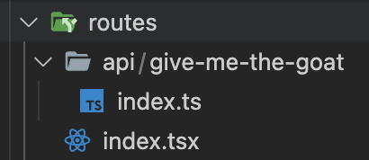

```typescript
import type { RequestHandler } from '@builder.io/qwik-city';
import { createClient } from '@vercel/edge-config';

export const edgeConfigClient = createClient(import.meta.env.VITE_EDGE_CONFIG);

export const onGet: RequestHandler<{ name: string }> = async () => {
  const name = await edgeConfigClient.get('GOAT');
  return { name };
};
```

#### Client-side code

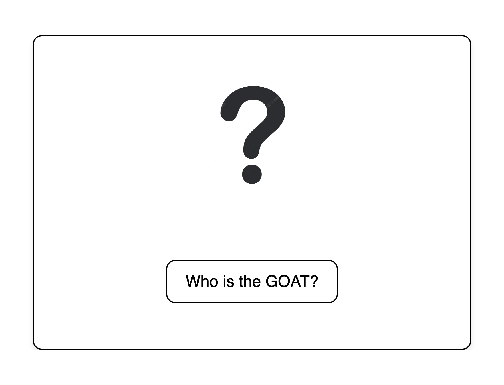

```typescript
import { $, component$, useSignal } from '@builder.io/qwik';

export default component$(() => {
  const state = useSignal('');
  const onClick = $(async () => {
    const name = await fetch('/api/give-me-the-goat');
    state.value = (await name.json()).name;
  });

  return (
    <div class='...'>
      [...]
      {state.value} <- Messi or Ronaldo 😆
      [...]
      <div class='...'>
        <button onClick$={onClick} class='...0'>
          Who is the GOAT?
	</button>
      </div>
    </div>
  );
});
```

Every time we press the button our API will be invoked. It will read data from Vercel and our UI will change.

> We can modify the configuration in the Vercel dashboard or we can invoke a PATCH to a special URL (you can find an example [here](https://github.com/vercel/examples/blob/0952aedcdf43c3e20bd6dc62679ff8c8ee86312d/edge-functions/feature-flag-apple-store/lib/feature-flags.ts)) to change the key value configuration programmatically.

## GitHub

I host my project on GitHub but you can use also other [git providers](https://vercel.com/docs/concepts/git)


You can configure the project

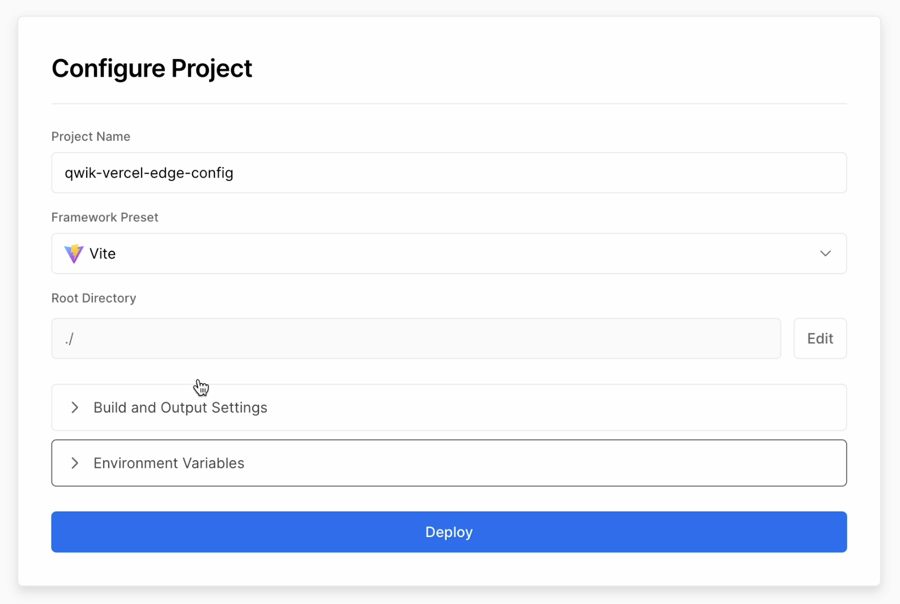

and then you are ready to rock! 🎸

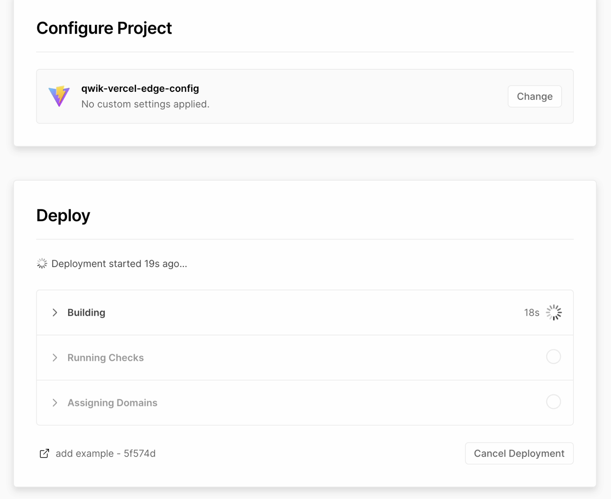

### Vercel Edge Config

In the Vercel dashboard you can create an Edge Config

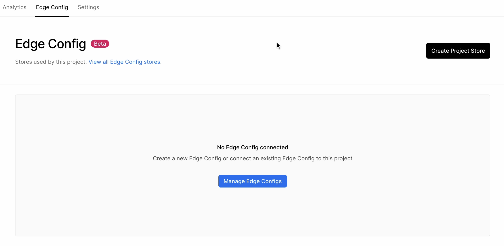

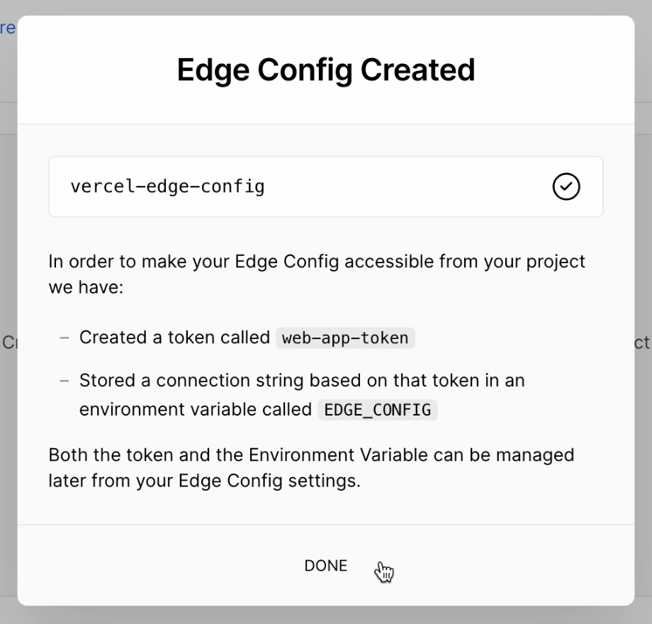

Then you can define the key/value configs

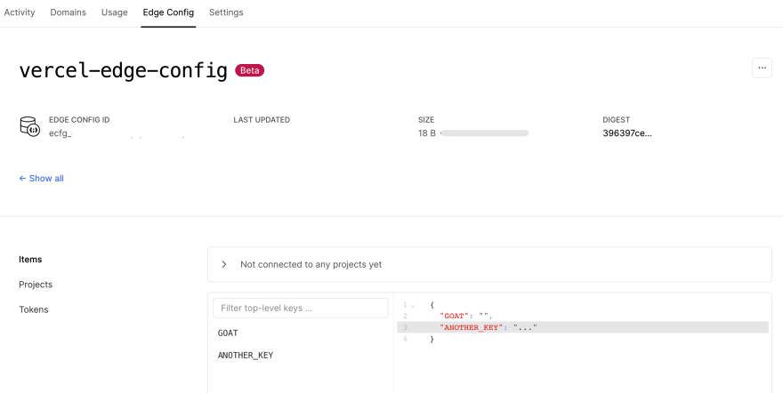

Inside the token section, you can copy the connection string needed to communicate with the service Edge Config

### Vercel env variables

You need to define *VITE\_EDGE\_CONFIG* env variable to allow communication with Vercel Services

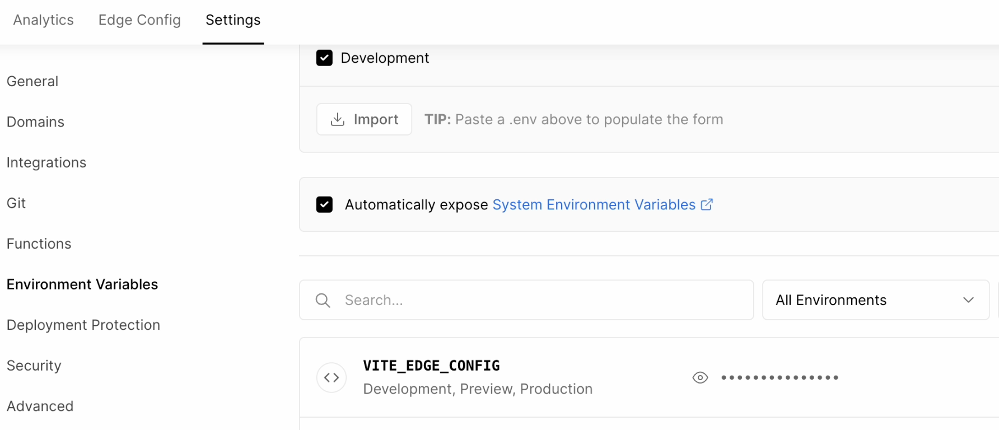

And that's all! Now we are ready to see who is the GOAT!

## App in action

As mentioned before, every time I click on the button, the application is reading the configuration from Vercel and as you can see I can change my frontend application at runtime.

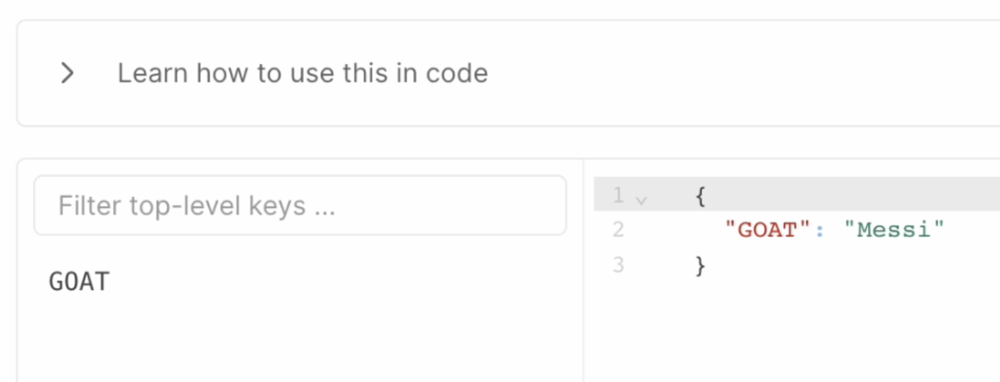

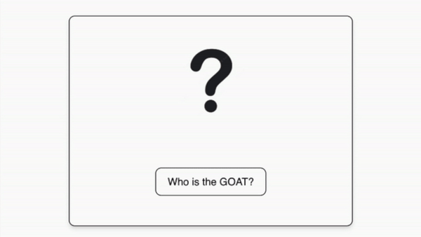

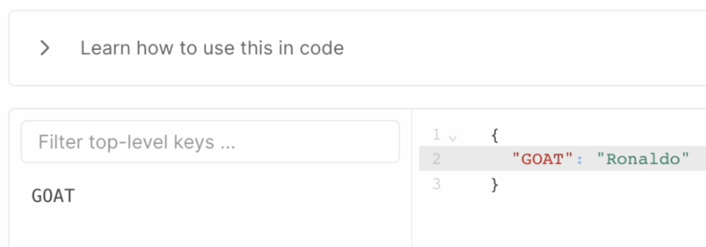

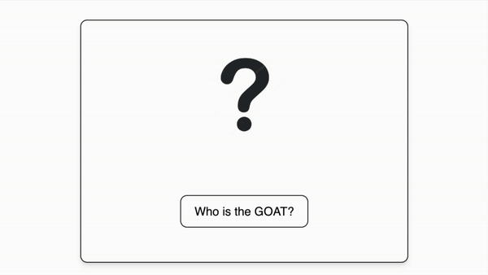

---

🎉 This is a trivial use case but I think is a good example to show how our frontend application can change with an external configuration.
For example, let's think we want to show a certain section of our application (e.g. Order History), through this approach we can show/hide it easily. 😄

You can [follow me on Twitter](https://twitter.com/giorgio_boa), where I'm posting or retweeting interesting articles.

I hope you enjoyed this article, don't forget to give ❤️.
Bye 👋

<!-- ::user id="gioboa" -->
