---
{
title: "Angular 19 - Streamlining Data Retrieval with Experimental Resource and rxResource APIs",
published: "2024-11-06T04:41:29Z",
edited: "2024-11-10T11:16:05Z",
tags: ["webdev", "angular", "javascript", "programming"],
description: "Angular 19 introduces two exciting experimental APIs, resource and rxResource, designed to simplify...",
originalLink: "https://dev.to/this-is-angular/angular-19-streamlining-data-retrieval-with-resource-and-rxresource-apis-3lb2",
coverImg: "cover-image.png",
socialImg: "social-image.png"
}
---

Angular 19 introduces two exciting experimental APIs, `resource` and `rxResource`, designed to simplify asynchronous data retrieval and management. This article explores these APIs, diving into their functionalities and showcasing how they enhance developer experience (DX) for crafting reactive and efficient Angular applications. All API endpoints used in the article are from [JSON Placeholder](https://jsonplaceholder.typicode.com/).

## Born from a Vision: Asynchronous Data Loading with `Signals`

The idea behind these APIs originated from a pull request by [Alex Rickabaugh](https://github.com/angular/angular/pull/58255). The core concept lies in utilizing Signals to manage the asynchronous loading of resources. While `resource` utilizes Promises, `rxResource` leverages Observables, catering to different developer preferences. Both APIs provide a `WritableResource` object, allowing you to update resource data locally.

A resource offers several signals to keep you informed about its state:

- **Value**: Provides the current data of the resource, representing the result of a query.
- **Status**: Reflects the resource's current state. Here's a breakdown of the various status types:

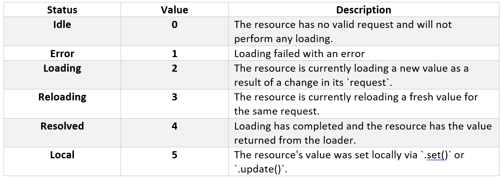

- Error: Provides details on errors encountered during data retrieval.

## Creating a Resource

Instantiating a resource is simple:

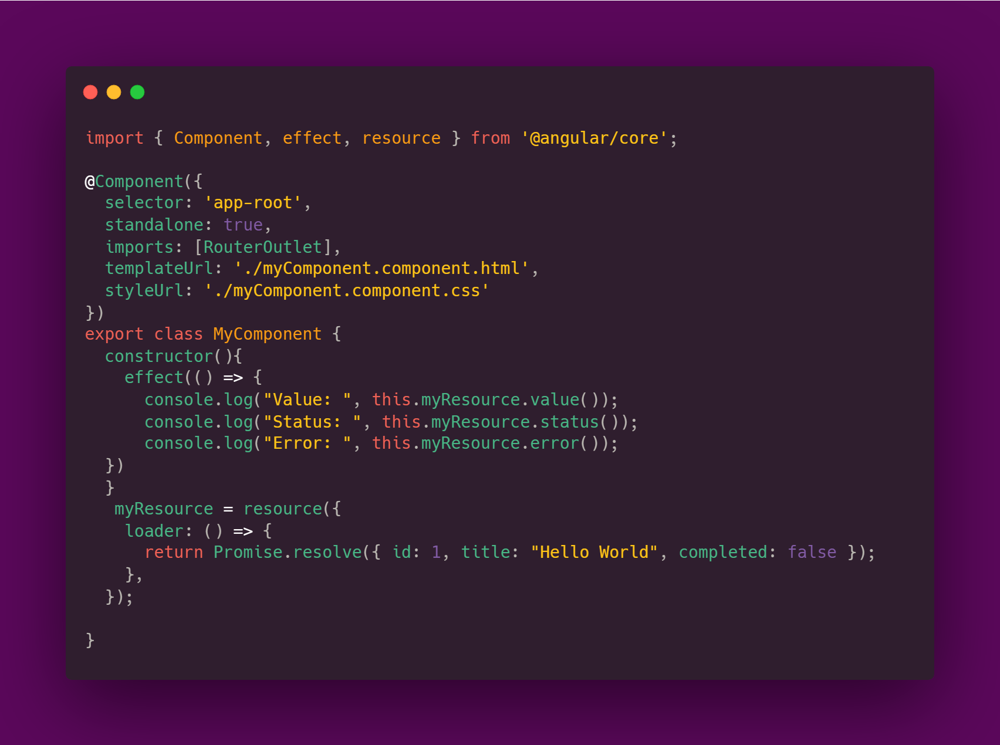

This will result the following output. Notice how initially the status is "Loading" (2) and eventually it becomes "Resolved" (4).

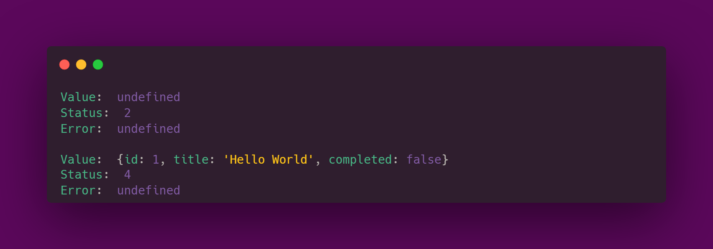

## Updating Resource Data Locally

To update a resource's data locally, leverage the `update()` method of the `value` signal. See the following template and component for reference:

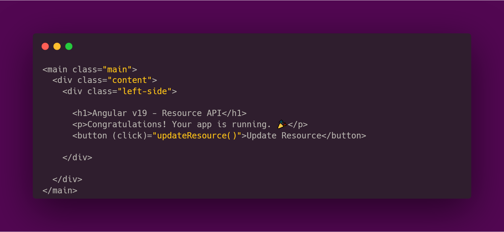

The `updateResource()` function will update the value of resource locally with a different string.

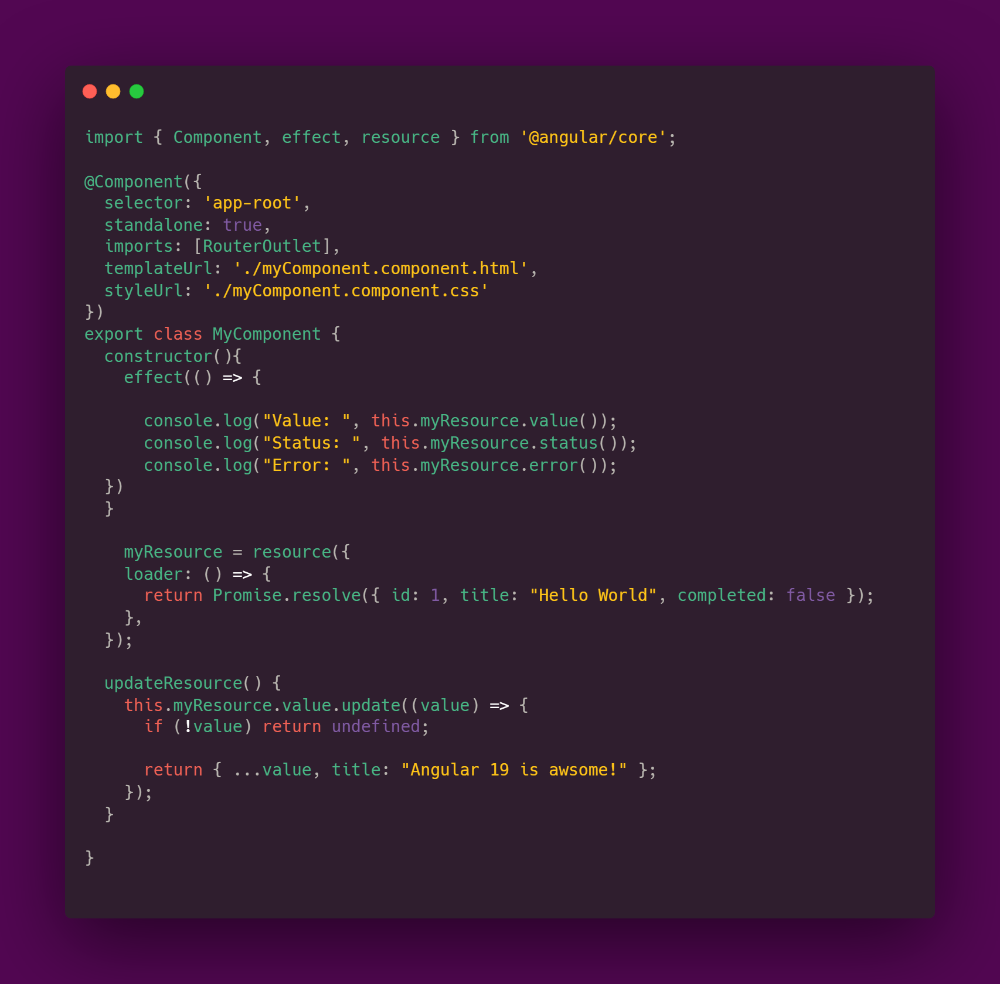

This will produce the following output. Notice the status being "Local" (5) as it's value has been updated locally.

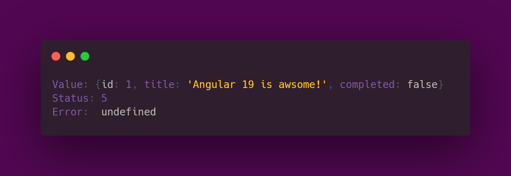

## Refreshing a Resource

Let's create a Refresh button in our template and refresh a resource when the user clicks it.

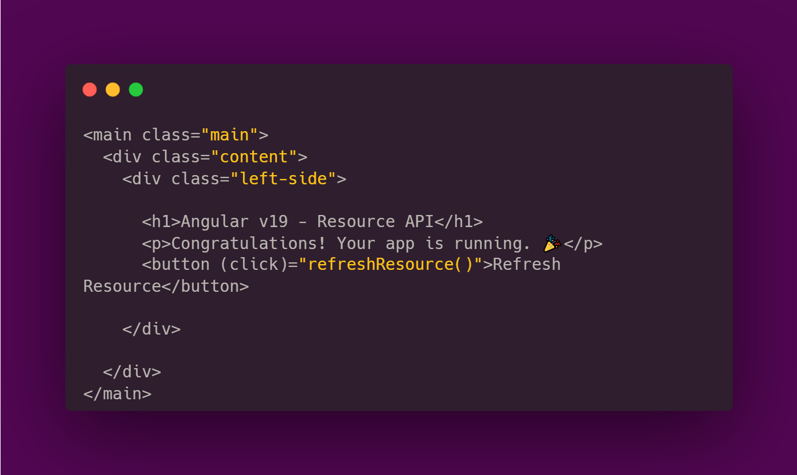

The `reload` function in the code below triggers the `resource` loader to execute again. If user clicks Refresh button multiple times, the loader will be triggered only once until the previous request is finished. It is similar to `exhaustMap` in `Rxjs`.

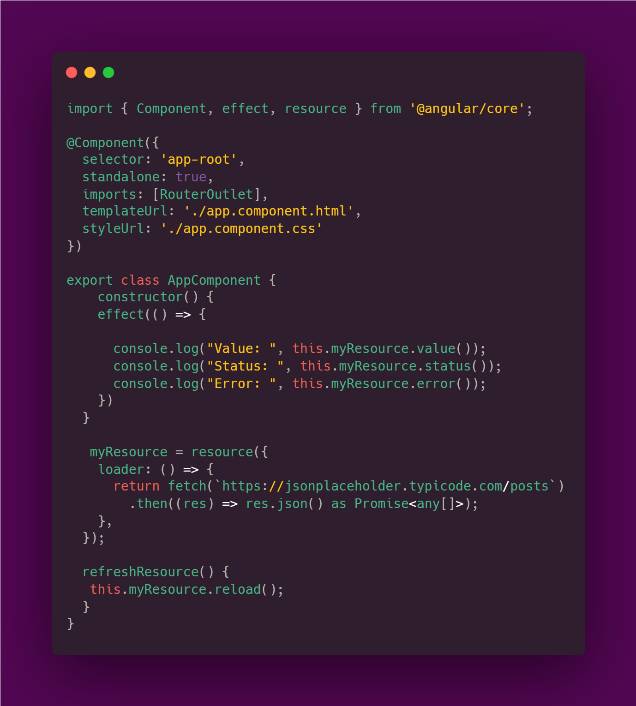

Notice the status transitioning from "Reloading" (3) to "Resolved" (4) in the output below.

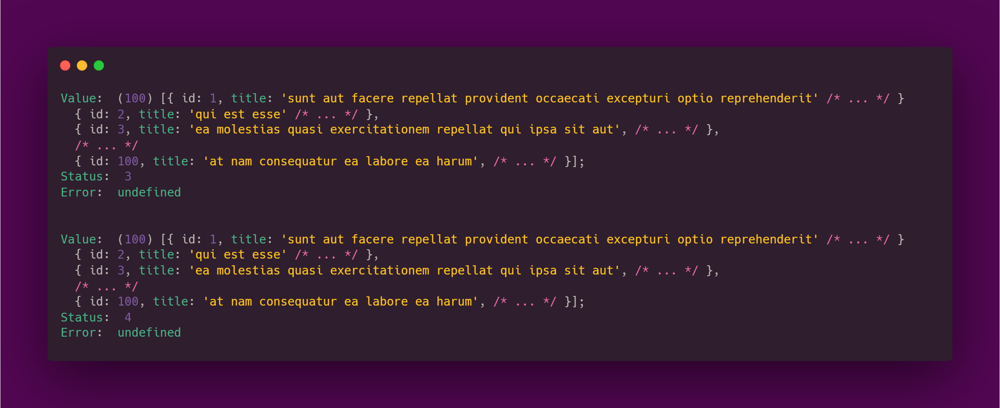

## Data Based on Signals: Dynamic Resource Loading

Suppose you want to fetch posts based on an `postId` signal. You can achieve this by passing the signal as a request parameter to your endpoint:

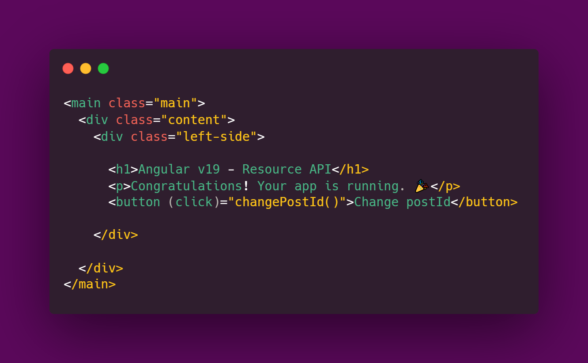

By passing the signal `postId` as a request parameter, you can achieve dynamic data retrieval based on the `postId` value. Here's an example:

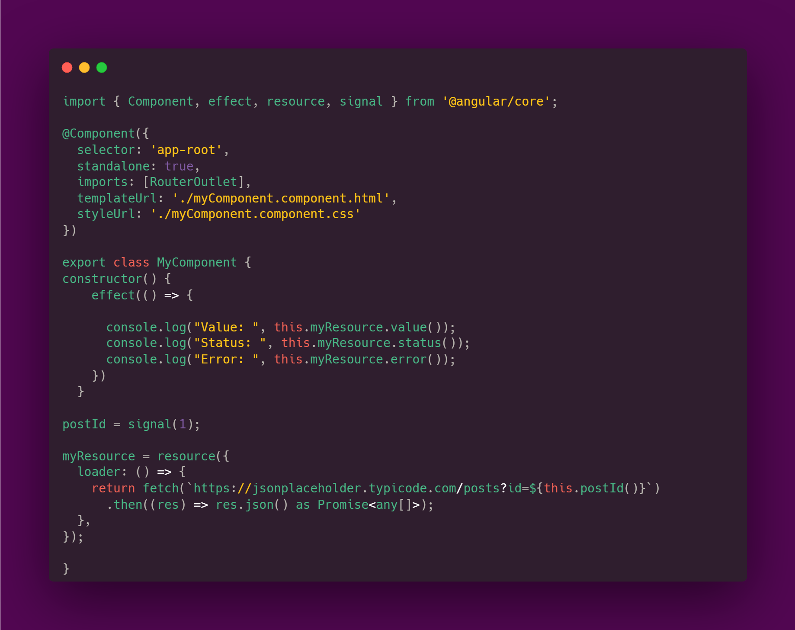

This will result in the following output:

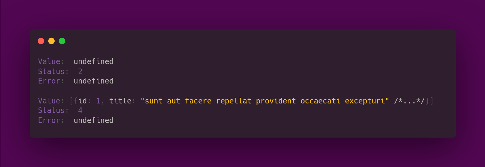

While this approach works for initial data fetching, it lacks reactivity. **Loaders in Angular's resource API are inherently untracked.** This means that if a signal like `postId` changes after the initial resource creation, the loader won't automatically re-execute.

To overcome this limitation and ensure reactive behavior, we need to explicitly bind the signal to the resource's `request` parameter. This establishes a dependency between the `resource` and the `signal`, ensuring that the loader is triggered whenever the signal's value changes.

Let's create a button to update the signal `postId` to a random number.

Now, in the component, we add a method to update the signal postId to a random number. We also bind `postId` to the `request` parameter of our resource to ensure reactivity.

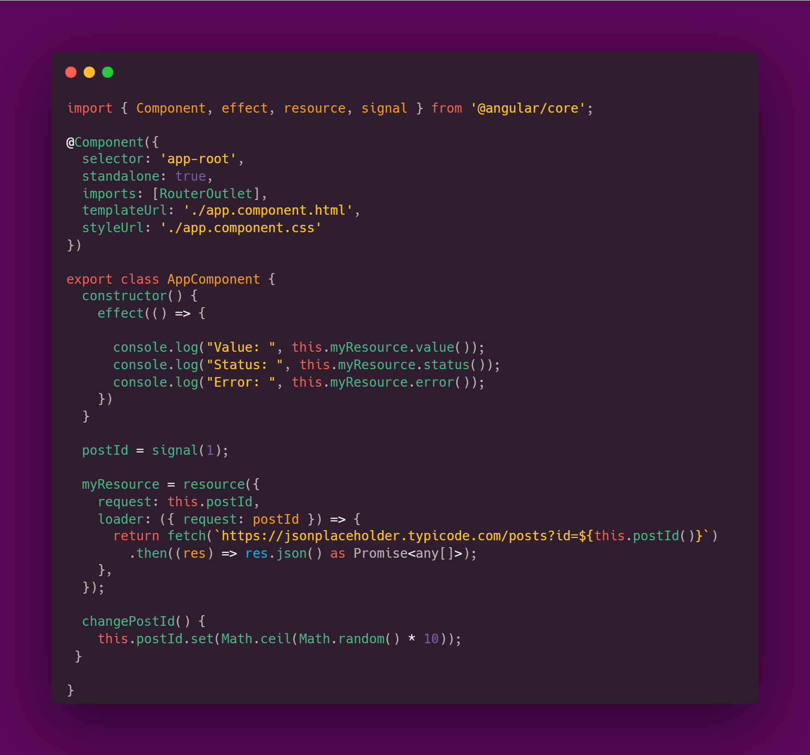

## Handling Local Data Changes During Active Requests

When a local data change occurs while a resource is fetching data from a remote source, a potential race condition arises. To mitigate this, we can leverage the abortSignal() function to gracefully handle concurrent requests.

By providing an AbortSignal object to the resource's loader function, we can cancel ongoing requests if the signal is aborted. This is particularly useful when a new request is triggered before the previous one completes.

Here's a breakdown of the process:

- **Local Data Change:** A user modifies data locally, triggering a new request.
- **Abort Signal:** An AbortSignal is created and passed to the resource's loader.
- **Request Cancellation:** If the previous request is still in progress, it's canceled using the AbortSignal.
- **New Request Initiation:** The loader is invoked with the updated postId and the new AbortSignal.
- **Data Fetching and Update:** The new request proceeds, and the resource's value is updated with the fetched data.

Here's an example which will fetch data based on new value of signal and cancel the previous request in progress in case of multiple triggers.

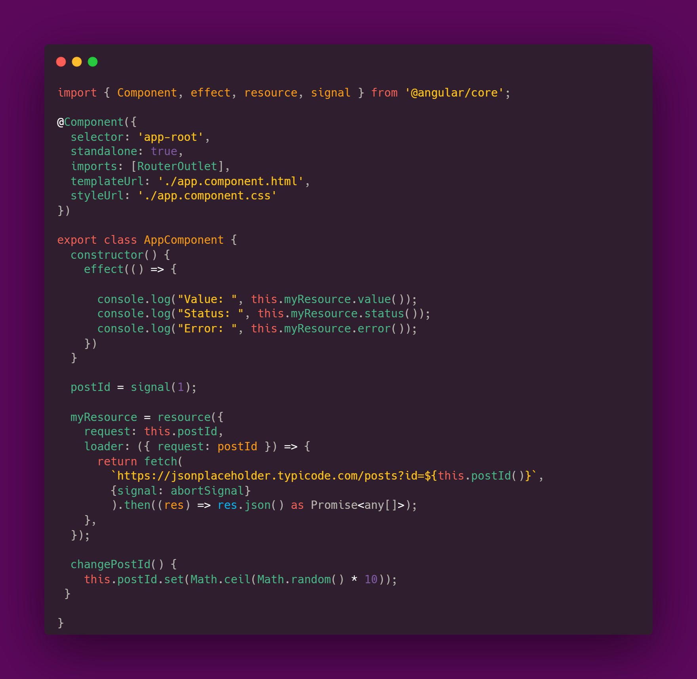

## Multiple Signal Dependencies: Reactive Resource Loading

A resource can be made reactive to changes in multiple signals, allowing for complex data fetching scenarios. By binding multiple signals to the resource's request parameter, the loader will be triggered whenever any of the dependent signals change.

Here's an example demonstrating this behavior where both `postId` and `userId` are being set by a random number and the resource is made reactive to changes in both the signals:

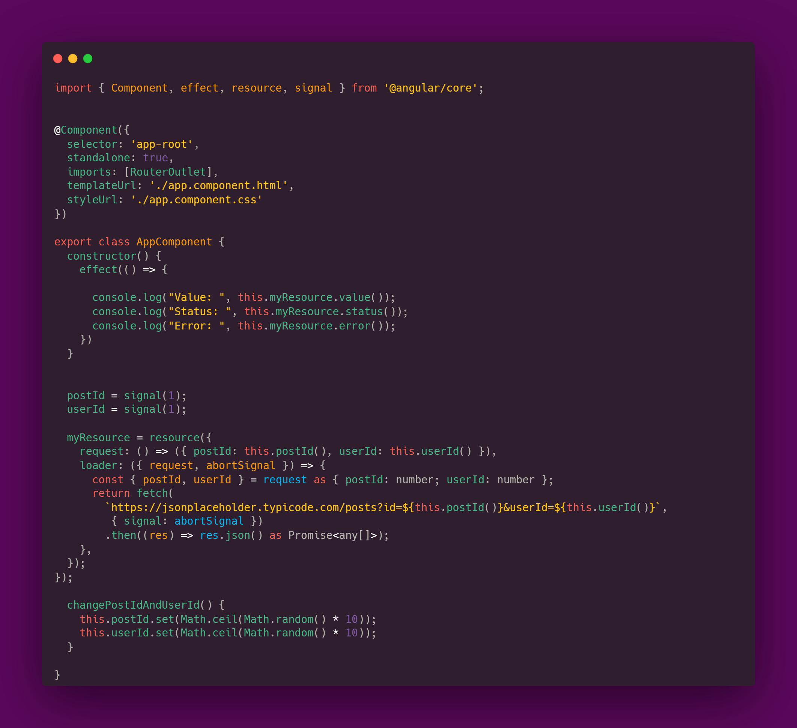

In the above example, the loader will be re-executed whenever either the `userId` or `postId` signal changes. This ensures that the resource always reflects the latest data based on the current values of its dependent signals.

## Code Reusability with Resource Functions

To enhance code maintainability and promote a modular approach, consider creating reusable resource functions. These functions encapsulate the logic for creating resources with specific configurations, making them easily shareable across your application.

Here's an example of a reusable resource function:

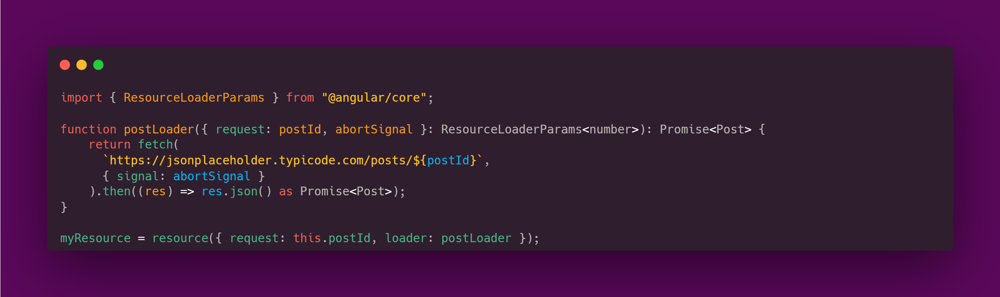

In the example above, `myResource` can be used across different areas of your application, ensuring clean code and reusability.

## RxResource: Leveraging Observables for Reactive Data Fetching

When working with Observables in your Angular application, the rxResource API provides a powerful mechanism for managing asynchronous data operations. Similar to the resource API, rxResource allows you to define resources that fetch data and emit it as an Observable.

## Key Differences from resource:

- **Observable-Based:** `rxResource` leverages `Observables` to provide a stream of data, enabling more flexible and reactive data handling.
- **No abortSignal:** Since `Observables` can be easily unsubscribed, there's no need for an explicit `abortSignal` to cancel requests.
- **First-Value-Only:** The current implementation of rxResource only considers the first emitted value from the Observable. Subsequent emissions are ignored.
- **Writable Resources:** Like resource, `rxResource` allows you to `update` the local state of a resource using `Observables`.

Here's an example of a resource created using rxResource:

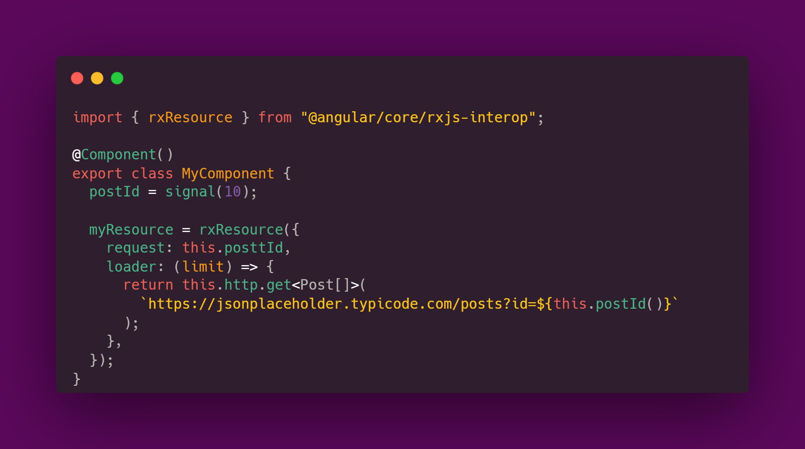

In this example, the loader will emit the posts as an `Observable`. You can subscribe to this Observable to react to data changes and perform necessary actions.

## Conclusion

Angular's resource and rxResource APIs represent a significant step forward in simplifying asynchronous data operations. These APIs offer a declarative and concise approach to fetching and managing data, enhancing developer productivity and application performance.

While still in developer preview, these APIs hold the promise of revolutionizing the way Angular developers handle data retrieval. By leveraging Signals and Observables, these APIs provide a flexible and efficient mechanism for managing data flow and reactivity in Angular applications.

Github PR: https://github.com/angular/angular/pull/58255
Code repository: https://github.com/Ingila185/angular-resource-demo
Stackblitz Playground: https://stackblitz.com/edit/stackblitz-starters-hamcfa?file=src%2Fmain.ts

Credits to Enea Jahollari for writing such a detailed [article](https://push-based.io/article/everything-you-need-to-know-about-the-resource-api) about resource and rxResource on Push Based.
