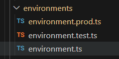

---
{
title: "Building and Serving Angular Applications Across Environments with environment.ts (Angular 15+)",
published: "2024-09-03T11:17:45Z",
edited: "2024-09-03T15:47:35Z",
tags: ["javascript", "webdev", "programming", "angular"],
description: "As an Angular developer, deploying your application to different environments – development (dev),...",
originalLink: "https://dev.to/playfulprogramming-angular/building-and-serving-angular-applications-across-environments-with-environmentts-angular-15-6dk",
coverImg: "cover-image.png",
socialImg: "social-image.png"
}
---

As an Angular developer, deploying your application to different environments – development (dev), user acceptance testing (UAT), and production – is a common occurrence. However, constantly changing code to cater to these environment specifics can be tedious, error-prone, and hinders efficiency.

This article outlines a step-by-step approach to building and serving your Angular application across various environments without modifying the codebase, leveraging the powerful environment.ts functionality.

## Scenario:

Imagine an Angular application where the frontend interacts with backend APIs hosted on different environments. Let's explore how to create new environments, configure them, and serve/build your application based on the target environment.

## Setting Up Environments:

**Generate Environment Files:**

Run the following command in your terminal:

`ng generate environments`

This creates a folder named environments within the src directory, containing an initial environment.ts file. By default, this file serves as your development environment configuration.



**Defining Environment Variables:**

Open `environment.ts` and define your development environment variables:

```
export const environment = {
  production: false, //Set to False for development
  apiUrl: 'http://my-dev-url' //Replace with your development URL
};
```

**Creating Environment-Specific Files:**

For UAT and Production environments, create separate files:

`environment.test.ts (for UAT)`
`environment.prod.ts (for Production)`

Add your respective UAT and Production API URLs to these files:

```
// environment.test.ts (UAT)
export const environment = {
  production: false,
  apiUrl: 'http://my-uat-url'
};

// environment.prod.ts (Production)
export const environment = {
  production: true,
  apiUrl: 'http://my-prod-url'
};
```

## Utilizing Environments in Code:

To utilize the API URL within your code:

**Import environment.ts:**

`import { environment } from './environments/environment';`

**Access API URL:**

In your service or component, inject the environment variable:

```
export class MyService {
  constructor() {}
  apiUrl = environment.apiUrl;
}
```

**Configuring `angular.json` for Environment-Specific Builds:**

**Target Configurations:**

Open `angular.json` and locate the "configurations" section under "build". This defines build configurations for different environments.

```
"configurations": {
  "production": {
    // Rest of the configs
    "fileReplacements": [
      {
        "replace": "src/environments/environment.ts",
        "with": "src/environments/environment.prod.ts"
      }
    ]
  },

"staging": {
    // Rest of the configs
    "fileReplacements": [
      {
        "replace": "src/environments/environment.ts",
        "with": "src/environments/environment.test.ts"
      }
    ]
  },
  // ... other configurations
},

"defaultConfiguration": "production"

```

This instructs the Angular CLI to replace the default `environment.ts` with `environment.prod.ts `during production builds and `environment.test.ts` for UAT builds.

For serving the applications on multiple environments, you can add serve configurations inside `angular.json` as:

```
"serve": {
    "builder": "@angular-devkit/build-angular:dev-server",
    "options": { … },
    "configurations": {
      "development": {
        // Use the `development` configuration of the `build` target.
        "buildTarget": "my-app:build:development"
      },
      "staging": {
        // Use the `development` configuration of the `build` target.
        "buildTarget": "my-app:build:staging"
      },
      "production": {
        // Use the `production` configuration of the `build` target.
        "buildTarget": "my-app:build:production"
      }
    },
    "defaultConfiguration": "development"
  },
```

## Building and Serving for Specific Environments:

**Build for production:**

To build your application for production, use:

`ng build --configuration=production`

Use the name of the configuration defined in `angular.json` (production, staging in our scenario)

**Serve for UAT:**

To serve your application for UAT, use:

`ng serve --configuration=staging`

## Conclusion

Employing environment-specific configurations significantly enhances the developer experience. It offers a clean and maintainable approach, streamlining application deployment across diverse environments and ultimately reducing the mean time to production (MTTP).

Also, if you enjoyed reading this article, you can [learn more about me here.](https://next-js-portfolio-two-ebon.vercel.app/en)
