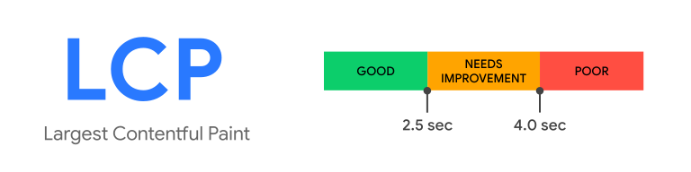
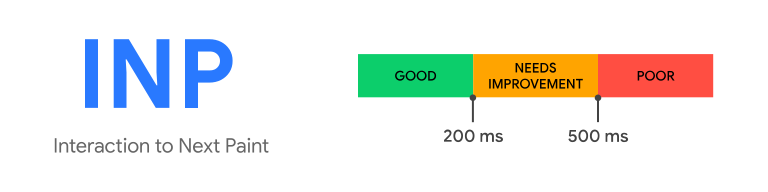
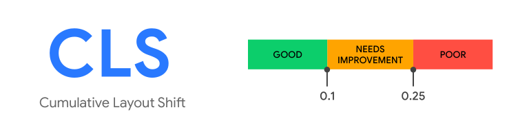

---
{
title: "Core Web Vitals — Now Built-n to Chrome",
published: "2024-10-18T05:32:02Z",
edited: "2024-10-22T06:11:51Z",
tags: ["webdev", "frontend", "javascript", "programming"],
description: "Have you wondered what these numbers in the DevTools are?    Earlier this year, Google introduced an...",
originalLink: "https://dev.to/this-is-learning/core-web-vitals-now-built-n-to-chrome-1bdh",
coverImg: "cover-image.png",
socialImg: "social-image.png"
}
---

Have you wondered what these numbers in the DevTools are?

Earlier this year, Google introduced an in-browser preview of Core Web Vitals in the DevTools. This article dives deep into what Core Web Vitals (CWV) are, why they matter and how can we improve them.

Core Web Vitals (CWV) are a new addition to the [performance](https://developer.chrome.com/docs/devtools/performance/overview) tab of Google Chrome. CWV are a set of metrics that Google uses to assess the overall user experience of a web page. They focus on three key aspects of performance:

## [Largest Contentful Paint (LCP)](https://web.dev/articles/lcp)

LCP is the measure of how quickly the web page loads. A fast LCP indicates that the user can quickly start interacting with the most important content on the page.

According to the [docs](https://web.dev/articles/optimize-lcp):

> To provide a good user experience, sites should strive to have an LCP of 2.5 seconds or less for at least 75% of page visits.

**Best Practices to optimize LCP:**

- Optimize images and reduce their file size.
- Minimize render-blocking resources.
- Leverage browser caching.
- Improve server response times.
- Use a CDN.
- Learn more [here](https://web.dev/articles/optimize-lcp).

## [Interactive Paint (INP)](https://web.dev/articles/inp)

INP is the measure of the responsiveness of the page during interactions like clicking buttons or typing in forms. A fast INP indicates that the page is responsive and doesn’t feel sluggish or unresponsive.

According to the [docs](https://web.dev/articles/optimize-inp):

> To provide a good user experience, websites should strive to have an Interaction to Next Paint of 200 milliseconds or less.

**Best Practices to Optimize INP:**

- Minimize JavaScript execution time.
- Avoid long tasks that block the main thread.
- Prioritize critical tasks and defer non-critical ones.
- Optimize event handling and input processing.
- Learn more [here](https://web.dev/articles/optimize-inp).

## [Cumulative Layout Shift (CLS)](https://web.dev/articles/cls)

CLS is the measure of the visual stability of the page, assessing how often elements shift unexpectedly after the page has loaded. An example of unexpected layouts can be found [here](https://web.dev/static/articles/cls/video/web-dev-assets/layout-instability-api/layout-instability2.webm).

A low CLS indicates that the page is visually stable and doesn’t suffer from unexpected layout shifts that can disrupt the user experience. According to the [docs](https://web.dev/articles/cls):

> To provide a good user experience, sites should strive to have a CLS score of 0.1 or less.

**Best Practices to optimize CLS:**

- Reserve space for dynamic content.
- Avoid images without specified dimensions.
- Use font-display: swap for fonts.
- Minimize JavaScript-triggered layout shifts.
- Learn more [here](https://web.dev/articles/optimize-cls).

## Why are Core Web Vitals important?

**User Experience:** A good user experience is crucial for website success. Core Web Vitals directly impact how users perceive a website’s performance and usability.

**Search Engine Ranking:** Google has indicated that Core Web Vitals are a ranking factor. Websites with poor Core Web Vital scores may rank lower in search results.

**Conversion Rates:** A fast and stable website is more likely to convert visitors into customers.

## Conclusion:

By focusing on improving Core Web Vitals, you can create a better user experience, improve your website’s search engine ranking, and increase your website’s conversion rates.
