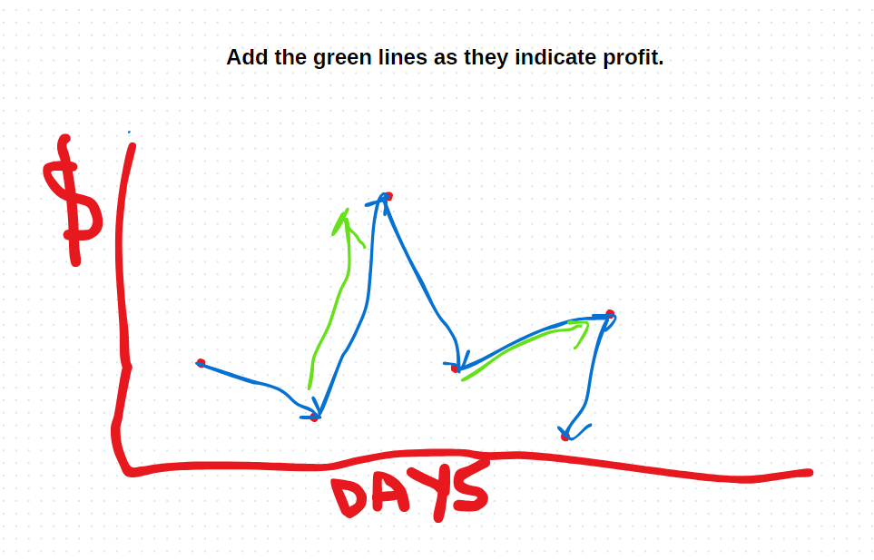

---
{
title: "Cracking the LeetCode 122. Best Time to Buy and Sell Stock II",
published: "2024-08-04T09:48:30Z",
edited: "2024-08-04T09:50:47Z",
tags: ["python", "javascript", "dsa", "datastructures"],
description: "In my ongoing quest to sharpen my LeetCode skills, I tackled the \"Best Time to Buy and Sell Stock II\"...",
originalLink: "https://https://dev.to/playfulprogramming/cracking-the-leetcode-122-best-time-to-buy-and-sell-stock-ii-17k5",
coverImg: "cover-image.png",
socialImg: "social-image.png"
}
---

In my ongoing quest to sharpen my LeetCode skills, I tackled the "Best Time to Buy and Sell Stock II" problem. This challenge is a follow-up to the classic "Best Time to Buy and Sell Stock II" problem ([LeetCode 121](https://leetcode.com/problems/best-time-to-buy-and-sell-stock-ii/description/)) but with a crucial difference: \*\*you can execute multiple transactions to maximize profit.
\*\*

## A Visual Approach

Before diving into code, I found it incredibly helpful to visualize the problem on a whiteboard. This allowed me to break down the problem into smaller, more manageable steps.



## The Greedy Approach

Given the flexibility to make unlimited transactions, a greedy approach seemed promising. The core idea is simple: whenever the price of a stock increases compared to the previous day, we consider it a potential profit opportunity. By adding up all these price differences, we effectively calculate the maximum profit.

## Python Implementation

Here's the Python code that implements this greedy strategy:

```
class Solution:
    def maxProfit(self, prices: List[int]) -> int:
        profit = 0

        for i in range(1, len(prices)):
            if prices[i] > prices[i-1]:
                profit+=prices[i] - prices[i-1]

        return profit

```

## JavaScript Implementation

```
/**
 * @param {number[]} prices
 * @return {number}
 */
var maxProfit = function(prices) {
    var profit = 0;
    for (var i = 1; i < prices.length; i++)
    {
    if(prices[i] > prices[i-1])
    {
        profit += Number(prices[i] - prices[i-1])
    }
    }

    return profit
};
```

## Time and Space Complexity

- The time complexity of this approach is O(N) where N = length of array.
- The space complexity is N(1) as we are comparing in place.
