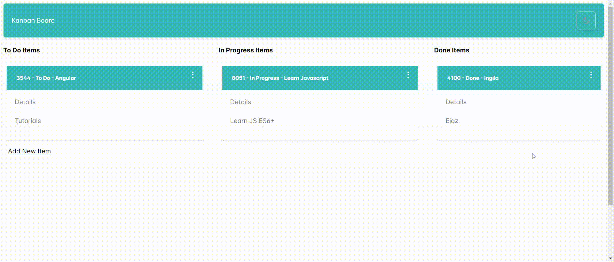
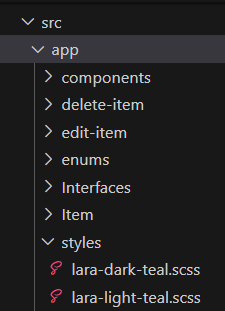

---
{
title: "Effortless Theme Toggling in Angular 17 Standalone Apps with PrimeNG",
published: "2024-07-16T10:47:32Z",
edited: "2024-07-24T13:10:59Z",
tags: ["angular", "javascript", "typescript", "webdev"],
description: "As I delved into PrimeNG and PrimeFlex for my recent Angular 17 standalone app with SSR, one aspect...",
originalLink: "https://dev.to/this-is-angular/effortless-theme-toggling-in-angular-17-standalone-apps-with-primeng-2h20",
socialImage: "social-image.png"
}
---



As I delved into PrimeNG and PrimeFlex for my recent Angular 17 standalone app with SSR, one aspect truly stood out: built-in themes. Unlike Material UI, PrimeNG offers a delightful selection of pre-built themes that you can easily configure within your application.

But the real cherry on top? Setting up a theme switcher to empower users to personalize their experience is a breeze with just a few lines of code. Let’s dive in!

Priming Your App for Themes:

Installation: Get started by installing PrimeNG using npm or yarn.

`npm install primeng --save`

## Include Styles in angular.json:

Ensure your angular.json file includes the necessary styles. Below is my folder structure and its inclusion in `angular.json`.



In each stylesheet, I imported built-in PrimeNG Themes from resources.

```
 //angular.json 
 "styles": [
              "src/styles.css",
              {
                "input": "src/app/styles/lara-dark-teal.scss",
                "bundleName": "lara-dark-teal",
                "inject": false
              },
              {
                "input": "src/app/styles/lara-light-teal.scss",
                "bundleName": "lara-light-teal",
                "inject": false
              }
            ],
```

This configuration guarantees the stylesheets are bundled into your final dist folder during build time.

2. Setting the Default Theme (index.html):

Include Stylesheet: In your index.html file, incorporate the stylesheet for your chosen default theme and assign it an ID for service access:

```
<!doctype html>
<html lang="en">

<head>
  <meta charset="utf-8">
  <title>Theme Switcher</title>
  <base href="/">
  <meta name="viewport" content="width=device-width, initial-scale=1">
  <link rel="icon" type="image/x-icon" href="favicon.ico">
  <link id="app-theme" rel="stylesheet" type="text/css" href="lara-light-teal.css">

  <link rel="stylesheet" href="https://unpkg.com/primeflex@latest/primeflex.css">
</head>

<body class="">
  <app-root></app-root>
</body>
</html>
```

3. Dynamic Theme Switching with a Service:

Create a Theme Service: Construct a service to manage theme changes. Inject it into your root component for application-wide accessibility:

```
//themes.service.ts
import { Inject, Injectable } from '@angular/core';
import { DOCUMENT } from '@angular/common';

@Injectable({
    providedIn: 'root',
})
export class ThemeService {

    constructor(@Inject(DOCUMENT) private document: Document) {}

    switchTheme(theme: string) {
        
        let themeLink = this.document.getElementById('app-theme') as HTMLLinkElement;

        if (themeLink) {
            themeLink.href = theme + '.css';
        }
    }
}
```

4. Using the service inside Component:

Inject Service and Document: Within your component, inject the ThemeService and the Document object:

```
  constructor(private themeService: ThemeService) {

  }
  checked: boolean = false;

  changeTheme() {
    let theme = (this.checked) ? "lara-dark-teal" : "lara-light-teal"
    this.themeService.switchTheme(theme);

  }

}

```

Template with p-toggle: Utilize the p-toggle component from PrimeNG to render the toggle button. Bind its state to a boolean variable (checked) and trigger the changeTheme() method on click. Employ pi-icons (PrimeNG icons) for visual appeal.

```
<p-toolbar styleClass="bg-primary shadow-2  opacity-80">

    <div class="flex-grow">
        My Theme Switcher
    </div>
    <p-toggleButton styleClass="bg-primary shadow-2 text-white" [(ngModel)]="checked" onIcon="pi pi-sun"
        offIcon="pi pi-moon" (click)="changeTheme()" />

</p-toolbar>
```

**Separation of Concerns:** The service concentrates on theme management, keeping your component clean and focused.

**Enhanced Readability:** The code is well-structured and easy to comprehend for developers of all levels.

**Developer Delight:** PrimeNG streamlines the process, empowering you to craft a seamless theme-switching experience in your Angular 17 application.
