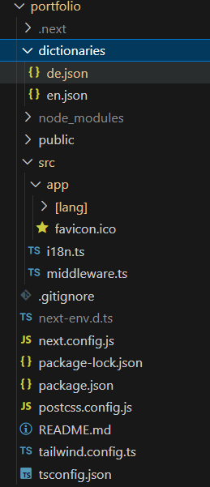

---
{
title: "Implementing i18n Internationalization in Next.js 14 with Next-Intl",
published: "2024-07-15T04:05:34Z",
edited: "2024-07-24T13:10:20Z",
tags: ["nextjs", "vercel", "react", "javascript"],
description: "As a full-stack developer, I strive to create applications that cater to a global audience. This...",
originalLink: "https://dev.to/this-is-learning/implementing-i18n-internationalization-in-nextjs-14-with-next-intl-2a53",
socialImage: "social-image.png"
}
---

As a full-stack developer, I strive to create applications that cater to a global audience. This extends to my personal portfolio, which should be accessible and informative for anyone visiting, regardless of their language. In this article, I’ll detail how I implemented internationalization (i18n) using Next.js 14 and the next-intl to make my portfolio adaptable to different languages.

## The Power of Next-Intl

Next.js 14 offers built-in support for i18n, and the next-intl library simplifies the process of integrating dictionaries and on-the-fly translations. By leveraging app router with i18n routing, I was able to achieve a flexible and maintainable solution.

**Installation:** Next-intl can easily be installed by:

```
npm install next-intl
```

## Project Structure and File Breakdown:

My project structure looks like this as I am using app router with Next.js 14. Notice the dictionaries and \[lang] in addition to other related files.



**Dictionaries (en.json, de.json):** These JSON files store translations for the English and German languages, respectively. Each file maps keys to their corresponding translated strings, forming the foundation of our i18n setup.

```
   //de.json 
  "jumbotron": {
  "heading": "Hallo, ich bin Ingila.",
  "subHeading": "Ich bin nur ein weiterer Full-Stack-Entwickler, der es liebt, zu programmieren, jeden Technologie-Stack zu erlernen und einen Beitrag zur Open-Source-Community zu leisten. Hier finden Sie mich:"
},
//en.json
"jumbotron": {
  "heading": "Hi there, I am Ingila.",
  "subHeading": "I am just another full stack developer who loves to code, learn every technology stack and cotribute to the open source community. Here's where you can find me:"
},
```

**Next.config.js:** This configuration file acts as a bridge between Next-Intl and Server Components. It houses the i18n configuration defined in i18n.ts.

```
const createNextIntlPlugin = require('next-intl/plugin');
const withNextIntl = createNextIntlPlugin();
/** @type {import('next').NextConfig} */
const nextConfig = {}
//module.exports = nextConfig
module.exports = withNextIntl(nextConfig)
```

**i18n.ts:** This core file contains the i18n configuration details, including supported languages (e.g., English and German) and the default locale (English in this case).

```
import {notFound} from 'next/navigation';
import {getRequestConfig} from 'next-intl/server';
// Can be imported from a shared config
const locales = ['en', 'de'];
export default getRequestConfig(async ({locale}) => {
  // Validate that the incoming `locale` parameter is valid
  if (!locales.includes(locale as any)) notFound();
return {
    messages: (await 
import(`../dictionaries/${locale}.json`)).default
  };
});
```

**middleware.ts:** This middleware plays a crucial role in matching the user’s preferred language with the available options. It handles redirects and rewrites based on the request’s locale, ensuring a seamless user experience.

```
import createMiddleware from 'next-intl/middleware';
export default createMiddleware({
  // A list of all locales that are supported
  locales: ['en', 'de'],
  // Used when no locale matches
  defaultLocale: 'en'
  });

export const config = {
  // Match only internationalized pathnames
  matcher: ['/', 
  '/(en|de)/:path*',
  '/((?!_next|_vercel|.*\\..*).*)']
};
```

**app/\[lang]/layout.tsx:** This layout component utilizes the locale parameter dynamically provided by the middleware. This parameter allows us to configure the document language and pass relevant configurations from i18n.ts to client components using NextIntlClientProvider.

```
import { NextIntlClientProvider } from 'next-intl';
export default function RootLayout({children, params: {lang}}: 
{children: React.ReactNode, 
   params: {lang: string}}) {  
  return (
    <html lang={lang} className = "dark">
    <body>
    <main className=' min-h-screen min-w-screen ' >
    <NextIntlClientProvider locale="en">
      {children}
    </NextIntlClientProvider>           
    </main>
    </body>
  </html>
  )
}
```

**Component Integration:** Within individual components, I used next-intl's methods to access translations and dynamically render content based on the user's selected language. This approach guarantees that all components adapt to the chosen language.

```
import {useTranslations} from 'next-intl';
export default function IntroCardJumbotron() {
    const t = useTranslations('jumbotron');
return (
       <section className="bg-transparent  bg-blend-multiply">
        <div className="px-4 mx-auto max-w-screen-xl text-center py- 
24 lg:py-56">
            <h1 className="mb-4 text-4xl font-extrabold  leading-none   
md:text-5xl lg:text-6xl">
                {t('heading')}<span className="animate-wave inline- 
block">👋 </span>               
            </h1>
          <p className="mb-8 text-lg font-normal  lg:text-xl sm:px-16 
lg:px-48">
            {t('subHeading')}  </p>                  
        </div>
    </section>
}
```

## Looking Forward

I’m constantly seeking opportunities to enhance my development skills. This i18n implementation has been a valuable learning experience, and I’m eager to delve deeper into advanced internationalization techniques and explore other libraries to further refine my craft.

You can find the whole code [here](https://github.com/Ingila185/NextJsPortfolio)
My developer portfolio can be found [here](https://next-js-portfolio-two-ebon.vercel.app/en/)
