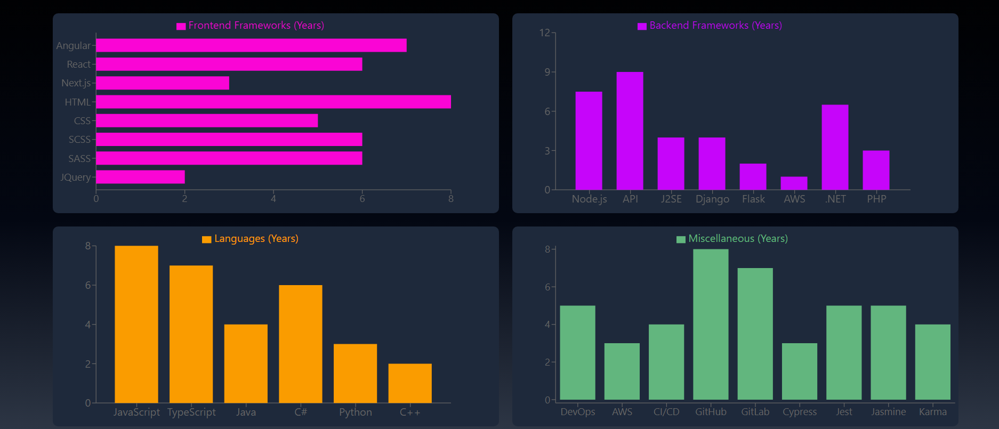

---
{
title: "Integrating Creative Data Visualization in My Developer Portfolio Using Next.js 14 and Recharts",
published: "2024-07-14T15:30:52Z",
edited: "2024-07-24T13:10:41Z",
tags: ["nextjs", "react", "javascript", "tailwindcss"],
description: "As a full-stack developer, my portfolio is my digital handshake to potential employers. It showcases...",
originalLink: "https://https://dev.to/playfulprogramming/integrating-creative-data-visualization-in-my-developer-portfolio-using-nextjs-14-and-recharts-5570"
}
---

As a full-stack developer, my portfolio is my digital handshake to potential employers. It showcases my skills and experience, and ultimately, convinces them that I'm the right fit for the job. But recently, I wasn't happy with how my portfolio was presenting my skillset. The skills section, in particular, felt bland and failed to capture the creativity I bring to my projects.

Determined to make a change, I embarked on a mini-revamp using two powerful tools: Recharts and Next.js 14. Recharts is a JavaScript library specifically designed for creating interactive charts. Next.js 14, a popular React framework, provided the foundation for building a dynamic and engaging user experience.

## From Static List to Interactive Charts


Previously, my skills section was a simple list of icons representing my skillset. It was informative, but it lacked personality and didn't effectively communicate the depth of my knowledge.

## Enter Recharts in Next.js 14

My skills section looks like this now.



Here's a glimpse into the transformation process:

Installation: I started by installing Recharts using npm:

`npm install recharts
`

Next, I created a JSON containing my skills categorized by 4 main areas of my expertise i.e. Frontend, Backend, DevOps, and Languages.

```
`export const techSkills = {
"frontend" : 
[
    {
    name: "Angular",
    years: "7"
    },
//Rest of the Frontend skills
],

"backend":
 [
    {
        name: "Node.js",
        years: "7.5"
    },
    {
        name: "Django",
        years: "4"
        },
  //Rest of the Backend Skills
 ],
"languages":
[
   {
    name: "JavaScript",
    years: 8
  }
//Rest of the Languages
],
"misc":
 [
 {
    name: "DevOps",
    years: 5
 },
 {
    name: "AWS",
    years: 3
 },
//Rest of the skills  
 ]
 }`
```

Once the library is integrated and configured, I just have to hook it into my component.

\`\`    'use client';
import { Bar, BarChart, CartesianGrid, Legend, ResponsiveContainer,
Tooltip, XAxis, YAxis } from "recharts";
import { techSkills } from '../api/skills';
export default function Backendskills() {
const data = techSkills.backend;
return ( <ResponsiveContainer width="90%" height={300}> <BarChart data={data}>
\<XAxis type="category" dataKey="name" padding={{ left:
20, right: 20 }} /> <YAxis dataKey="years" type="number" />
\<Tooltip labelStyle={{ color: '#110F50' }} /> <Legend verticalAlign="top" /> <Bar dataKey="years" fill="#C605FA" barSize={40} 
 activeBar={false} name="Backend Frameworks (Years)" /> </BarChart> </ResponsiveContainer>`
`
**Integration**: With Recharts in my toolkit, I seamlessly integrated it into my Next.js 14 project.

**Client-Side Rendering**: Since the charts would be built using user data, I ensured client-side rendering for optimal performance using 'use client';

**Data-Driven Charts**: The beauty of Recharts lies in its flexibility. I could choose the most suitable chart type based on the data I wanted to represent. For instance, I opted for bar charts to visualize my proficiency in various programming languages.

**Responsive Design**: To ensure a seamless user experience across devices, I implemented a responsive container for the charts. This guaranteed that the charts would adapt and display flawlessly on any screen size.

## The Impact

The transformation was remarkable. My skills section went from a static list to a dynamic and interactive experience. Visitors can now explore their areas of interest and gain a deeper understanding of my skillset through engaging data visualizations. This revamp not only injects creativity into my portfolio but also demonstrates my ability to leverage modern libraries and frameworks to create impactful user interfaces.

**Beyond the Code**

This project served as a valuable reminder that even small tweaks can significantly enhance a portfolio's impact. By embracing new technologies and thinking outside the box, we can craft presentations that not only showcase our technical skills but also reveal our creativity and passion for the craft.

I hope this article inspires you to breathe new life into your own portfolio and explore the exciting possibilities of data visualization! You can find my developer portfolio and its git repo here.

Portfolio: https://next-js-portfolio-two-ebon.vercel.app/en/
Git Repo: https://github.com/Ingila185/NextJsPortfolio
