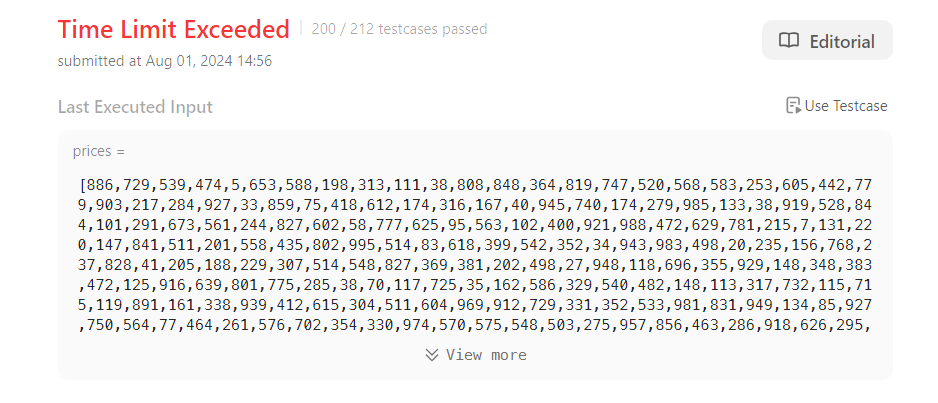
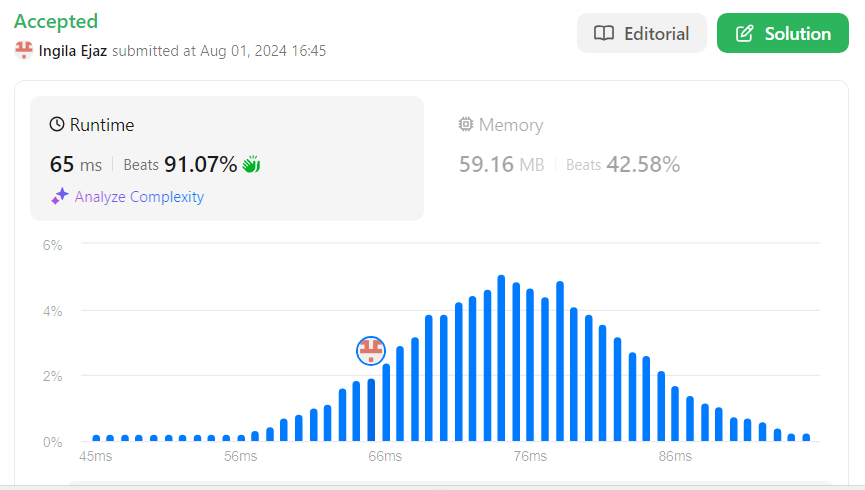
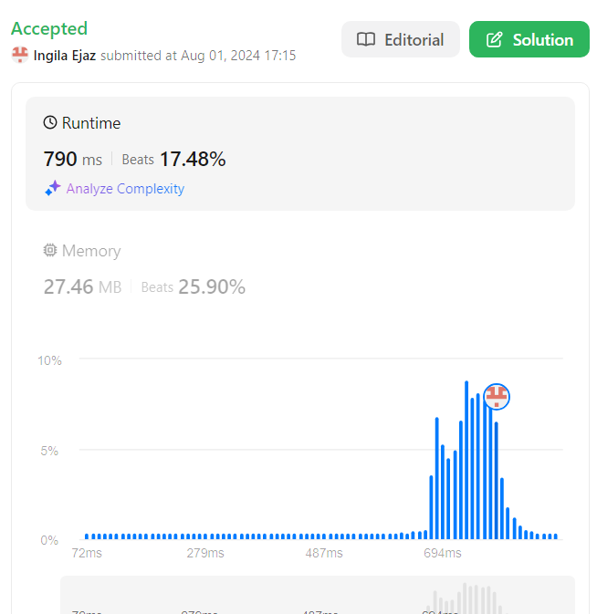

---
{
title: "LeetCode Problem 121: Best Time to Buy and Sell Stock",
published: "2024-08-01T12:45:20Z",
edited: "2024-08-01T18:32:11Z",
tags: ["javascript", "python", "algorithms", "programming"],
description: "I recently tackled a classic LeetCode problem: \"Best Time to Buy and Sell Stock.\" This problem asks...",
originalLink: "https://https://dev.to/playfulprogramming/leetcode-problem-121-best-time-to-buy-and-sell-stock-5d2b",
coverImg: "cover-image.png",
socialImg: "social-image.png"
}
---

I recently tackled a classic LeetCode problem: "Best Time to Buy and Sell Stock." This problem asks you to find the maximum profit you can make by buying and selling a stock once. Let's dive into the different approaches I explored, along with their complexities. Here's the URL of the problem:

[LeetCode 121](https://leetcode.com/problems/best-time-to-buy-and-sell-stock/description/)

## Brute Force Approach (Time Complexity: O(n^2))

The most straightforward solution might be to compare every element in the array with all the remaining elements. For each price, we calculate the profit it would generate if sold on a later day. We then keep track of the maximum profit encountered. This approach, however, suffers from high time complexity and resulted in Time Limit Exceeded.

```
/**
 * @param {number[]} prices
 * @return {number}
 */
var maxProfit = function (prices) {

    let max = 0;
    for (var i = 0; i < prices.length; i++) {
        for (var j = i + 1; j < prices.length; j++) {
            if (prices[i] < prices[j]) {
                max = Math.max(max, calculateProfit(prices[i], prices[j]))
            }
        }
    }
    return max
};

function calculateProfit(a, b) {
    if (b > a) return b - a;
    else return 0;
}
```



**Here's why:** We compare each element with n-1 other elements, resulting in n\*(n-1)/2 comparisons. This translates roughly to O(n^2) time complexity, which becomes inefficient for large datasets. Unfortunately, this approach often leads to a "Time Limit Exceeded" error on LeetCode.

## Two Pointer Approach (Time Complexity: O(n))

To improve efficiency, we can leverage the fact that we're buying before selling. We can introduce two pointers:

- buy: Points to the current potential buying price.
- sell: Points to the selling price candidate.

The idea is to iterate through the prices array, starting from the third element (since the first two elements are used for buying and selling). We continuously check if the difference between the sell price (current element) and the buy price is greater than the current maximum profit. If true, we update the maximum profit. Otherwise, we update the buy pointer to the current element (potentially a lower buying price) and move the sell pointer one step forward.

This approach offers a significant improvement in time complexity, reaching O(n) as we only iterate through the array once.

```
/**
 * @param {number[]} prices
 * @return {number}
 */
var maxProfit = function (prices) {
    let maxProfit = 0;
    let buy = 0;
    let sell = 1;
    while (sell < prices.length) {
        if (prices[buy] < prices[sell]) {
            let profit = prices[sell] - prices[buy]
            maxProfit = Math.max(maxProfit, profit)
        }
        else {
            buy = sell;
        }
        sell++;
    }
    return maxProfit
};


```



## Greedy Approach (Time Complexity: O(n)) with Python Example

We can achieve a similar time complexity with a greedy approach. The key here is to understand that the maximum profit can only be achieved if we buy low and sell high.  Therefore, we can iterate through the price array and keep track of the minimum price encountered so far. This represents the potential buying price.

Here's a Python implementation of the greedy approach:

```
class Solution:
    def maxProfit(self, prices: List[int]) -> int:
        max_profit = 0;
        min_buy = float('inf')
        for price in prices:
            min_buy = min(min_buy , price )
            max_profit =  max(max_profit, price-min_buy)
        return max_profit
        
```



You can always learn more about where else to find me on [my portfolio here](https://next-js-portfolio-two-ebon.vercel.app/en)
