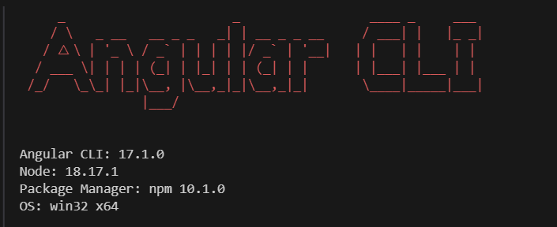
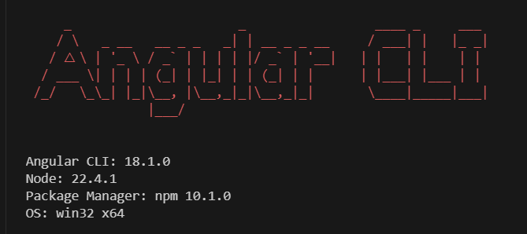

---
{
title: "Safely Experiment with Angular 18: A Guide for Developers with Existing 16 & 17 Projects",
published: "2024-07-16T09:37:34Z",
edited: "2024-07-24T13:11:24Z",
tags: ["angular", "typescript", "javascript", "angularcli"],
description: "Exploring Angular 18 Without Disrupting Existing Projects   I was recently working on an...",
originalLink: "https://dev.to/playfulprogramming-angular/safely-experiment-with-angular-18-a-guide-for-developers-with-existing-16-17-projects-3c3"
}
---

## Exploring Angular 18 Without Disrupting Existing Projects

I was recently working on an Angular 17 project and felt the itch to explore the exciting new features of Angular 18. However, I wanted to do this in a way that wouldn't affect my existing projects that were already in production or QA phases. This presented a bit of a challenge:

- **Global Angular 17:** I had Angular CLI version 17 installed globally.
- **Angular 18 Requirement:** Node.js version 18.19 or above was a prerequisite for Angular 18.
- **Preserving Existing Projects:** I needed to keep my existing Angular 17 projects untouched.

**Leveraging Node Version Manager (NVM):**

To tackle this, I decided to leverage a Node Version Manager (NVM). NVM allows you to manage multiple Node.js versions on your system, making it easy to switch between them for different projects. Here's how I set it up:

1. **Install NVM:** You can follow the instructions on the official NVM website to download and install it [here](https://github.com/nvm-sh/nvm/blob/master/README.md).

2. **Install Node.js 18+:** Once NVM is installed, I used the command

```
nvm install latest 

```

This installed the most recent Node.js version (which at the time was 22.4.1).

**Creating a Separate Development Environment:**

Next, I created a separate directory for my Angular 18 practice projects. This helps in isolating the environment from my existing projects.

**Installing Angular 18 Locally:**

To install Angular 18 for this specific project, I used the following command:

```bash
npm install @angular/cli@latest 
```

Notice the absence of -g. This installs the latest Angular CLI version (which was 18.1.0 at the time) locally within the project directory, without affecting the global installation.

**Surprise! Not Quite There Yet:**



When I attempted to create a new project using `ng new practice-project`, it defaulted to using the globally installed Angular CLI version (17). This is where the magic of `npx` comes in.

**Introducing Node Package Executor (npx):**

`npx` allows you to execute packages from npm without installing them globally. This proved to be the key to using the specific Angular CLI version (18) for my new project. Here's the winning command:

```bash
npx @angular/cli@18 new my-angular-18-project
```

I verify the project by executing `ng version`



**Success! Exploring Angular 18:**

After waiting for the necessary dependencies to install, I had a brand new Angular 18 project (`my-angular-18-project`) ready to go! This allowed me to explore all the new features of Angular 18, including the exciting `@let` syntax, without interfering with my existing Angular 17 projects.
